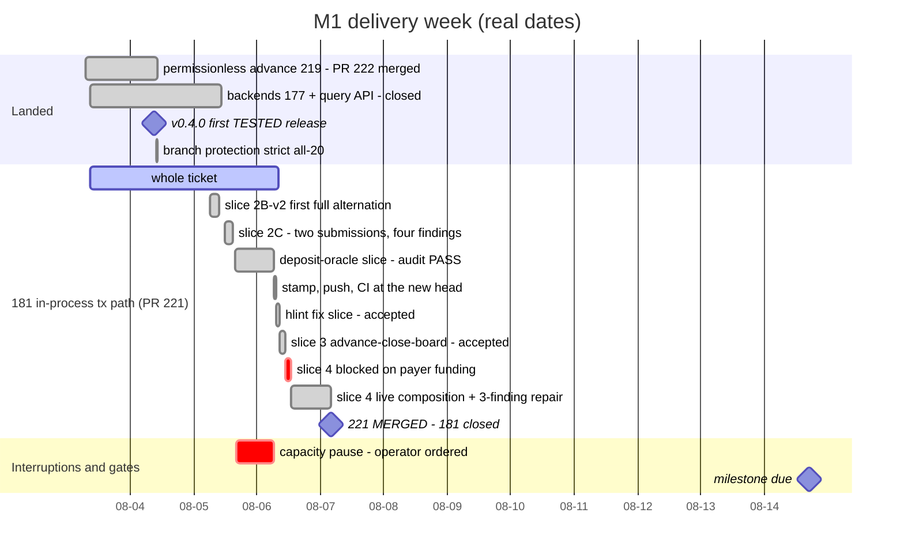
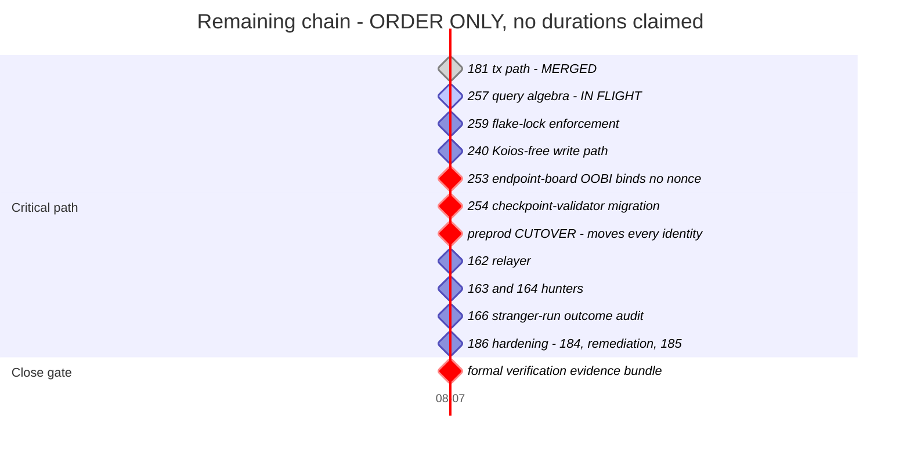

# Milestone 1 — Identity core, witnessed checkpoints on Cardano

Updated: 2026-08-08
Legend: ✅ done · 🟡 active/next · ⏳ queued · ⛔ blocked · ❓ unknown

> **▶ RELEASED 2026-08-08T04:36Z** — the keri session only (machine owner, on
> the operator's order; everything else stays parked). Parked 15:28Z–04:36Z;
> nothing was lost or spent (claude flat at 15% overnight, measured not
> assumed). e156 resumes #257 at the submission-2 FINDINGS report first;
> #257's three commits remain LOCAL-ONLY until then (PR #258 shows none of
> the work). e156-t220 stays parked by desk ruling. e171 idle-correct.

The living state of [milestone 1](https://github.com/lambdasistemi/cardano-keri/milestone/1). The milestone description holds the *definition* — outcome, test, artifact, boundaries — and changes almost never; this page holds the *currency* and is refreshed daily, on every material transition, and before any pause.

## Delivery week — dated, not estimated

Every bar below has a real start and end taken from the record.

The one bar above that is **not** measured is `slice 4 live composition` — it carries a nominal width so the chart stays readable, and it is the only thing here you should not plan against.

## Remaining chain — order only

Sequence is known; durations are not. Every node is zero-duration on purpose: inventing bar widths would manufacture confidence this milestone does not have.

✅ #181 → 🟡 #257 → ⏳ #259 → ⏳ #240 → ⛔ #253 → ⛔ #254 → ⏳ CUTOVER → ⏳ #162 → ⏳ #163/#164 → ⏳ #166 → ⏳ #186

## The two blockers filed 2026-08-05

| | |
|---|---|
| ⛔ **#253** | Endpoint-board OOBI registration binds no nonce. The signed preimage covers the endpoint record only — not the owner key hash, and no sequence or TxOutRef. Consequences: **custody squatting** (anyone replaying a valid signature can post an entry under their own owner key and seize lifecycle custody) and **stale-endpoint resurrection** (a superseded endpoint's signature stays valid forever, with no on-chain revocation). Bounded: the endpoint URL itself cannot be forged. |
| ⛔ **#254** | No checkpoint-validator version migration. The preprod cutover is the **first migration event**, so existing checkpoints and the live board must be carried across the new validator hashes rather than orphaned. The follower pins a single checkpoint address at startup with no version awareness, so a migration blinds it on one side whichever way it is pinned — and the failure is silent, because an empty interest match is indistinguishable from a quiet chain. |

Both are consumer-side stories of epic #171. The validator halves now have a **ruled home** (operator, 2026-08-06): one new **onchain epic** bundling #253, #254 and the checkpoint-consumer example — all three touch the validator family and ride the cutover. It dispatches when the machine grants scope for the lane.

## State by unit

| unit | state |
|---|---|
| validators #24, follower #175, runnable #188, query API #176, backends #177 | ✅ done |
| permissionless advance #219 (PR #222) | ✅ merged 2026-08-04 |
| in-process tx path #181 (PR #221) | ✅ MERGED 2026-08-07 at head `dd6b220f` — full preprod write journey with NO cardano-cli, proven at package-closure level. Bonus outcome: its kernel dissolved #241 entirely (historical-read design risk CLOSED AS OVERTAKEN, verified by #257 slice 0) |
| chain-query layer #257 (PR #258) | 🟡 ACTIVE — free query algebra, providers as interpreters, MPFS-pattern atomic snapshots. Submission 2 under findings processing (no repair ceiling; depth outranks speed). NOTE: three commits are LOCAL-ONLY — the draft PR shows none of the work yet |
| flake-lock enforcement #259 | ⏳ queued after #257 — the commissioned check that makes every clean-worktree claim self-supporting again |
| Koios hot-path #240 | ⏳ queued after #259 — with #241 closed, #240 ALONE makes every write verb third-party-free; consumes #257's layer |
| board hardening #253, validator migration #254 | ⛔ blocked — consumer halves in e171; validator halves placement ruled into the new onchain epic (awaiting scope) |
| preprod cutover | ⏳ queued — desk-gated, executes through #254 |
| relayer #162, hunters #163/#164, stranger audit #166, hardening #186 | ⏳ queued in that order |
| formal-verification evidence bundle | ⛔ gates milestone close |
| micro-slice #228 | ❓ unknown — state unmeasured since the desk succession |
| M1 blog post (one, consolidated) | 🟡 next — operator deliverable for the 2026-08-14 deadline; four source drafts exist, see below |
| **checkpoint CONSUMER example** | ⛔ **NEW M1-CLOSE REQUIREMENT (operator, 2026-08-06)** — placement ruled the same day: it seats in the new onchain epic with #253/#254; a dispatch-ready ask exists; no lane yet. Measured 2026-08-06: NOTHING on chain consumes a checkpoint. The only `reference_inputs` use in the non-test tree is `cage.ak` reading its own state UTxO under a plain `requestOwner` key hash; the cage has zero references to `checkpoint`, `cesr_aid` or `CheckpointDatumV1`. `docs/architecture/overview.md` states the five revalidation rules a consumer must apply and no code applies them. |

## The M1 blog post

One post ships with the milestone. Four drafts exist today and none of them is it:

| source | size | what it is |
|---|---|---|
| gist `4e071dca` `cf-blog-post-cardano-keri-v3.md` | ~4,650 words | the CHOICES piece — Blake3-vs-Blake2 reversal, the fork problem, accepted limits. Written 2026-07-17, before most of M1 shipped |
| gist `aebc9b1a` `keri-key-events-on-cardano-preprod.md` | ~3,810 words | the EVIDENCE piece — one complete checkpoint lifecycle settled on preprod 2026-08-03, four transactions, verify-it-yourself commands |
| repo `docs/blog/self-certifying-identities-on-cardano.md` | ~1,540 words | the MECHANICS piece — why registration is two transactions, why advance needs witnesses, freeze as a response window |
| repo `docs/blog/series-notes-vlei.md` | ~230 words | reserved material for post #2 (M2), explicitly not for post #1 |

The consolidation target is the choices spine carrying the settled-on-chain
evidence, ending on what a stranger can obtain and run — the milestone's own
outcome test. Its closing section cannot be truthful until the #181 -> #240 ->
#253/#254 -> cutover chain lands, so the post is deadline-coupled to the
milestone rather than independently schedulable.

## The close requirement, and the smallest thing that satisfies it

**Operator ruling 2026-08-06: time is not the constraint, demonstrable value is.**
M1 releases when the work can be consumed, however long that takes. The 08-14
date stays on the chart as a marker, not as a gate that could trade the
requirement away.

**The smallest sufficient example, specified and then designed by the operator:
"mint a CID signed by a KEL".** An identity subscribes to IPFS content by minting
a quantity-one token whose asset NAME is its AID, carrying the CID as datum, at a
home script the token can leave only by being burned — mint = subscribe, burn =
unsubscribe, both gated by CURRENT key state, discovery by asset name with no
index. The home is load-bearing, not decoration: a minting policy validates only
its own transaction, so name-plus-datum alone would be true at birth and
rewritable for the rest of the token's life by whoever holds the UTxO.
The underlying rule remains: A Cardano transaction in which an identity attests
a content address — the validator resolves that identity's checkpoint as a
reference input, revalidates it (policy, quantity-one asset, accepted script
version, AID, well-formed datum, role address), verifies Ed25519 signatures over
the CID bytes against the checkpoint's CURRENT keys, and accepts only if they
meet the current weighted threshold. Nothing larger is required to close the
milestone; anything larger is a different ticket.

**It is buildable today, and needs no wallet bridge.** The signed payload is the
CID, not the Cardano transaction body — so the signature can travel in the
redeemer exactly as M1 already carries event signatures, and no KERI wallet has
to learn to sign a Cardano tx. That is why this demo is reachable now while leg
2 is not.

**And it must say what it proves.** Signing a CID demonstrates ATTESTATION —
this identity endorses this content — not AUTHORIZATION of a specific spend,
because a signature over a CID alone does not bind the transaction carrying it
and can be re-posted by anyone. Both are real capabilities; only the first is
reachable without the signing bridge or a seal design. The demo and the post
must name which one they are showing.

## Why it is a close requirement, not a nice-to-have

The offer M1 makes is: **you carry the cost of publishing the inception and
rotation subsequence of your KEL onto Cardano, and in exchange you can spend
that identity here** — signing with your own KERI keys whatever a downstream
protocol requires. Without a transaction that consumes a checkpoint, the
milestone proves only that an identity can be MAINTAINED on Cardano, never that
it can be USED. That is the vacuous pass in its exact form: every ticket merged,
every board green, and the capability the milestone exists for never exercised.
It belongs in the M1 demo.

## Artifact

`ckeri` **v0.4.0** is live and is the first *tested* release (honest input-addressed end-to-end gate; three assets verified). It graduates into the product `ckeri` release line at close. An erratum is published on v0.1.0–v0.3.0.
