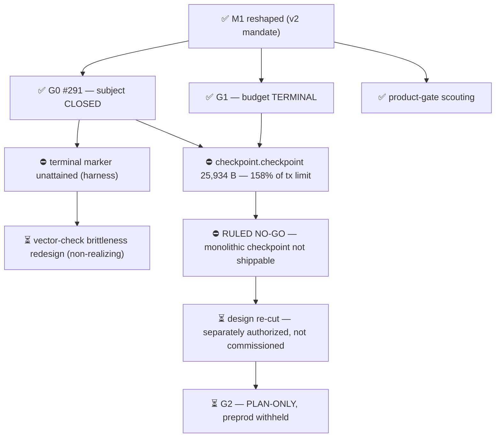

# M1 — State

Updated: 2026-08-18

**M1 IS TERMINAL AND THE STEERING DECISION IS MADE: the current monolithic
checkpoint design is **NO-GO** (project ruling, 2026-08-18). Both commissioned
artifacts exist. Both lanes parked. No successor clearance. Any continuation
requires a separately authorized design re-cut that decomposes, splits or
materially reduces `checkpoint.checkpoint` before G2 or preprod is reconsidered.

Outcome under test: **one stable, witnessed checkpoint per identity.**
Standing review verdict: *"promising architectural experiment, NOT YET a
committed product milestone."* This programme gathered falsifiable evidence; it
did not deliver product.

Legend: ✅ done · 🟡 active/next · ⏳ queued · ⛔ blocked · ❓ unknown

## The three results

**G0 / #291 — the INV-BIND defect was real and the repair is proven.** The same
gate `7037228`, frozen before any build and **never re-versioned across four
sessions**, returned RED 16/16 against the unfixed decoder and GREEN 16/16
against the repaired one. Mutation 496/496 rejected by both decoders; ABI 4/4
with `caller_locator_fields=0` (the offset interface removed, not validated);
parity reconciled, `cross_decoder_divergence=FALSE`; registration-vector
enumeration complete at exactly two, neither touching the money path.

**G1 — the budget question is answered.** Registration **breaches memory at 24
keys** (20 last accepted, 6.60 % headroom); **memory binds before CPU**. The
real key ceiling is **~7**, enforced one transaction earlier than claimed — an
8-key inception is 1,049 bytes against a 1024-byte SAID bound, refused at the
*premint* validator. **Proof depth is not the cost driver**: depth 5 at vLEI
scale costs 4.6 % of memory, and the structural maximum of 64 levels reaches
only ~27 %. Coupling 15,155,350 mem across two transactions — an upper bound,
not a headroom claim.

**Scouting — candidates exist, conditional on the above**, with one structural
finding: nearly every plausible Cardano-side operator sits inside PRAGMA, so
"independently operated" is weaker than the product gate's wording implies. Only
cross-ecosystem pairings survive that question.

## ⛔ The blocker a steering decision turns on

**`checkpoint.checkpoint` compiles to 25,934 bytes — 158.3 % of the 16,384
transaction limit and 160.8 % of the 16,133 reference-program ceiling.** Three
more sit at 80–92 % *before* parameter application, which only adds bytes.

**G0's defect was fixable and is fixed. G1's budget fits with a locatable
ceiling. The size limit is neither — the central validator does not fit, and
that is a design constraint, not a bug.**

*Caveat carried in both directions: script byte lengths under 16,384 do not
prove any transaction fits the per-transaction limit.*

## What is NOT established

| | Not established | Why it matters |
|---|---|---|
| ⛔ | G0 terminal **marker** unattained | Harness, not subject — formatter-version drift over 84 blank lines. Valve fired at four distinct harness failures in four slots. |
| ⛔ | Witness frontier never reached | 24 accepts with 38.85 % memory unspent — a maximum *measured*, not a bound. |
| ⛔ | Historical-recovery terminal blocked | Path fits (<half budget at heaviest churn) but its terminal control never ran. |
| ⛔ | Respelling axis 1 of 4 | Cause traced to fixture provenance, **not** a validator defect. |
| ⏳ | Depth beyond 5 | The depth-64 figure extrapolates a measured slope; nothing past depth 5 was generated. |

## Mutations

**None, throughout.** No GitHub, push, merge, preprod, live-system or production
mutation occurred at any point in this programme.
