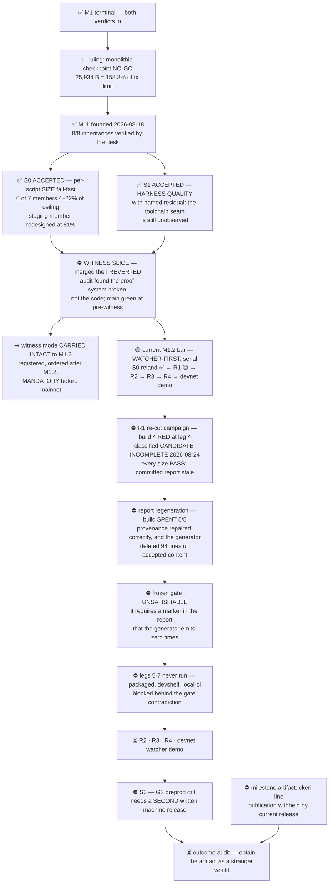

# M11 — M1.2, the decomposed record+cursor family

Outcome: the decomposed record+cursor family, delivered as usable packaged executables
on the provisional `ckeri` line.

Updated: 2026-08-24

Status: **architectural experiment** until its gates pass. The experiment claims policy is
in force for every external word. Founded 2026-08-18 on M1's terminal evidence.

**Position in one sentence:** the two entry gates are accepted and archived; the first
behaviour slice was merged, audited, and **reverted by design**; witness mode has been
deferred out of this milestone to M1.3; the S0 reland is **merged**; and R1 — the first
watcher-first requirement slice — is in a re-cut campaign whose fourth build stopped RED on a
stale committed size report. The granted fifth build repaired that provenance correctly and, in
doing so, exposed a contradiction that makes the frozen gate unsatisfiable for **any**
candidate; the lane is parked on a ruling, not on capacity.

**As of 2026-08-22T11:43Z: the S0 reland is MERGED.** `main` is at
`84e3b7159115e9169b57a85cbf9053b94aa889ba`, and the merge was confirmed by **two
independent read-backs** — the lane's and the desk's — each verifying all 31 paths on the
remote by blob *and* mode, plus the classification hunk. The first step of the
watcher-first bar is complete.

**As of 2026-08-23T11:14Z: R1's ticket has been re-cut and a fresh campaign is running.**
Cardano-KERI is at operator priority.

R1 found what the apparatus exists to find: `s0_append` took its proof policy from the
**caller**, so an attacker could choose the verifier that authenticates their own proof —
the chain originating identity state rather than projecting it. That is fixed, and the fix
is proven byte-identical at the compiled level. A second, protocol-level defect surfaced
below it: the SAID recomputation blanked the controller prefix unconditionally, which is
correct only for self-addressing inception and **rejects every ordinary rotation**. Also
fixed, and the full gate then went green end to end.

**The ticket was re-cut anyway**, because two consecutive auditors died on their own
instruments before judging the code, and this desk's own rule said a second such failure is
a pattern rather than an accident. Before dying, the second raised an unjudged hypothesis
that the key test may pass without its second event ever crossing the validator — so **the
desk has withdrawn its earlier claim that this control was verified.**

The work survived; the ticket did not. The new campaign continues forward from the proven
code with its audit scope widened to the whole change, so nothing rides on anything a
reviewer has not seen.

**As of 2026-08-23T11:54Z the re-cut was vindicated on its merits, not on procedure.** A
causal instrument — positive control, four seeded kills, its own lifecycle falsified — was
run against the inherited candidate and returned `stages=1 validator_appends=1
independent_retrievals=0 d_only=true`. All four hypothesised properties held: **the old green
suite passed while the second event never crossed the validator.** Withdrawing the earlier
"verified" claim was correct.

**As of 2026-08-23T15:17Z the machine was paused (`OMNIA PAUSA`) and M1.2 parked with it.**
The desk's first parking receipt was **false** — a six-hour-old waiter on a retired journal
was still live when it was written, and the project owner caught it. That is recorded rather
than edited away, together with why the census missed it: the filter meant to find the waiter
excluded the exact string its command line begins with. The waiter is dead and stays dead.

**As of 2026-08-24T09:17Z `keri-m12` is released and the desk is running again.** The release
covers this session only; `keri-ms8-blaster` remains parked.

**Build 4's leg-4 RED is classified: `CANDIDATE-INCOMPLETE`, with the gate behaving exactly as
designed.** Not an instrument failure — the receipt published intact — and **not a size
regression**: all seven members measured `PASS`, the worst at 58.87% of the reference ceiling
with 6,635 bytes of headroom. What failed is a provenance check: the committed size report no
longer records the source tree it describes.

A zero-build diagnosis, returned in under three minutes and re-derived independently at the
desk, found the drift is **exactly one file** — `onchain/validators/s0_skeleton_tests.ak`, a
test module, `+61/−21` — and that the compiled blueprint is **byte-identical** to the one the
report records. The report itself was regenerated honestly by the tool at commit `8aa1de3`;
the two commits after it, the RED bundle and its GREEN proof, staled it. **A test-only commit
invalidated a size report whose sizes did not move.** Nobody was careless and nothing was faked.

**One build was granted for the repair on 2026-08-24 — charged, not a reset.** Lifetime 5, no
retry, report-only delta, regenerated by the tool, then a fresh independent audit. The gate is
not being touched: once the report records the source tree it describes, the failing check
passes on its own terms.

A recurrence is already recorded rather than waited for. The provenance hash covers a test
module that cannot move the sizes it blesses, so every future test-only commit to this family
will stale the report and demand another build. That is an instrument defect, filed as a
milestone contract entry for a ticket **after** R1 lands — narrowing the hash now would
re-author the acceptance criterion around the candidate currently failing it. One honest
limit travels with it: a byte-identical blueprint proves this file did not affect compiled
output *for this diff*, not that a `validators/` file never can.

**As of 2026-08-24T10:16Z the milestone is parked on a gate contradiction, and the desk has
withdrawn a second claim of its own.** The granted build ran once and exited 0. It repaired the
provenance exactly as intended — and the same run showed the generator truncating
`SIZE-REPORT.md` from 174 lines to 80, deleting 94 lines of accepted, hand-authored content it
has never been able to emit. That content includes the only control disclosing that the
measured `append` and `cursor` rows depend on unmerged `#291`, and it was deliberately
relanded on 2026-08-22 after an earlier revert. The fresh commit owner withheld its commit
rather than land that loss. That was correct.

A consumer sweep, ordered as a precondition and run with a positive control, then refuted the
desk's own ruling. The frozen gate's `check_size_report` builds a marker bound to the current
append blob and requires it **inside** `SIZE-REPORT.md`; the generator emits it zero times. So
regenerating the report kills that check, not regenerating kills the earlier leg on the stale
hash, and moving the marker to a sibling file kills it identically — the check greps only that
one path. **No candidate can pass the frozen gate.** The desk had asserted the opposite when it
set the do-not-touch-the-gate fence, and has withdrawn that assertion on the record.

It stayed invisible because the fourth build died at the earlier leg before this check ever
ran. It is a pre-fix frozen gate that cannot accept the fix — the same class this milestone has
been naming all along, found this time in its own acceptance instrument rather than in a
candidate. The recommended repair is zero-build and versions the gate while **retaining the
frozen one as a defect witness**; it awaits a project-owner ruling.

Legend: ✅ done · 🟡 active/next · ⏳ queued · ⛔ blocked · ❓ unknown

## Where the milestone is

Both entry gates are **accepted and archived**. The behaviour phase has been re-scoped
once, by operator ruling, after its first slice was reverted. Order only — no dates are
estimated, so nothing here is drawn with a width.

The watcher demo is the milestone's new centre of gravity: events appended through the
existing end-to-end path, the record visibly growing, and the cursor reporting a permanent
`ever_duplicitous` marker alongside its current resolution — including valid coexistence
after recovery. Real devnet, no mock, no slot tie-break.

## S0 verdict — the gate fired on its first use

Corrected set (submission 2, `02c486e`), with the real INV-BIND/SAID cost included. S0
superseded its own earlier, cheaper numbers once its audit found that cost omitted.

| member | bytes | % of 16,133 B ceiling | row |
|---|---:|---:|---|
| append | 3,567 | 22.10% | ✅ PASS |
| cursor | 3,475 | 21.53% | ✅ PASS |
| lineage | 2,078 | 12.88% | ✅ PASS |
| maintenance escrow | 831 | 5.15% | ✅ PASS |
| **staging / proof-token** | **13,144** | **81.47%** | ⛔ **REDESIGN** |
| consumer predicates | 699 | 4.33% | ✅ PASS |
| reference cursor consumer | 1,389 | 8.60% | ✅ PASS |

Including the omitted cost moved staging/proof-token from 9.97% to **81.47%**, across the
threshold, with `action=stop-before-deep-build`. That is the fail-fast gate doing exactly what
it was built for — catching an over-budget member at skeleton stage, before deep work, which
is the one thing M1 could not do.

For scale: the monolith ruled NO-GO measured 25,934 B — **160.8%** of this ceiling. Six of the
seven decomposed members now sit between 4% and 22%. The family is viable and it is **not
uniformly cheap**; the expensive member is the one whose policy is itself a parser script.

Redesign of that member is ruled **in scope for S0** and is under way, bounded to reshaping the
skeleton and re-measuring — S2 deep behaviour stays withheld. S0 adopted the sibling shape
rather than inventing one: two-transaction **premint + burn**, on the precedent that already
solved this class one milestone earlier, and it inherited that path`s measured 1024-byte
premint SAID bound deliberately. Still open from the audit: 2
blocking, 9 tier-2, and anti-stub reachability.

⛔ **Co-residency, carried not closed.** TxB structurally needs append + cursor + staging together = **25,617 B** (one pair-token burn authenticates both append and cursor). M1's fatal monolith was 25,934 B — but that was ONE script against a per-script limit, and this is a SUM of three each under it. S0 superseded its own CO-RESIDENCY-FAIL on desk challenge: the skeletons have no witness construction, so no governing limit is established. Read-only evidence shows the repository's established pattern is REFERENCE scripts, not inline, so the likely branch is **cost** (`maxRefScriptSizePerTx` + fee tiers), not a body-limit death. Scheduled as S2's first question.

⛔ Caveat on every row, in both directions: *size-only; transaction-fit unproven.* Script bytes
under 16,384 never prove a transaction fits, and these are skeletons.

## The two entry gates — both closed

| gate | state | what it must produce |
|---|---|---|
| **S0** size fail-fast | ✅ ACCEPTED and archived | per-script compiled bytes, % and headroom for every family member — append, cursor, lineage, maintenance escrow, staging/proof-token, consumer predicate library, reference cursor consumer — measured SEPARATELY. Any member above 80% at skeleton stage is redesigned before deep work. Bare verdict reported the moment it exists. |
| **S1** harness quality | ✅ ACCEPTED with named residual A3-F1, archived | pinned formatter/tool versions, SEMANTIC comparison of generated vectors instead of byte-exact formatting, and a demonstrated can-fail control for every gate. Fixes the regenerate-and-diff class, does not blind-patch the known 84 blank lines. |

## What is live now — the watcher-first bar

Granted by operator ruling on 2026-08-21. The bar is **strictly serial**. Its first step is
merged and its second is executing.

| step | what it must produce | state |
|---|---|---|
| **S0 reland** | the accepted size work restored to `main` with exact-equivalence evidence | ✅ **MERGED** `84e3b715` — 31/31 exact by blob and mode, plus an adopted classification of S0's own validators; audit PASS 2/2, fresh CI green, two independent post-merge read-backs |
| **R1** | event-derived MPF key, on a base read back from `main` after the reland | ⛔ **parked on a gate contradiction.** Candidate `4bc8dad9`. Build 4 stopped RED at leg 4 on a stale committed size report; the granted fifth build regenerated it correctly **and** revealed that the generator deletes 94 lines of accepted content it can never re-emit — one of which the frozen gate requires. Ledger `5/5`. Awaiting a ruling on `Q-MS12-004` |
| **R2 · R3 · R4** | the remaining three requirement slices, each inheriting the six-control gate hardening | ⛔ staged |
| **devnet watcher demo** | events appended through the existing e2e path; record grows; cursor returns permanent `ever_duplicitous` plus current resolution, including valid coexistence after recovery; txids, SAIDs, roots and cursor outputs preserved as the receipt | ⛔ staged, acceptance spec written |

The R1 lane holds a ticket owner and, for the report slice, a fresh commit owner; the earlier
owner and auditor seats were closed with their evidence preserved. **The build ledger is spent
at 5/5** and the lane is parked on a decision, not on capacity. Its worktree is intentionally
dirty with one preserved artifact — the regenerated report the exhausted build produced — and
its index is empty. Nothing is committed, audited, built, pushed or merged.
with fresh pane identities on 2026-08-24. One charged build is authorized and executing; the
desk holds no timer and no poll, and capacity and releases arrive as announcements.

## Open decisions — each one waiting on someone other than the desk

- **The outcome sentence cannot currently be satisfied.** M1.2 promises "usable packaged
  executables on the `ckeri` line", and the release in force withholds publication. This
  must be resolved by a later release before the outcome audit can pass. The desk's
  recommendation is to schedule that question now rather than meet it at close.
- **The 15-row backlog payload is written and unapplied** (`Surface C`). Thirteen of fifteen
  issue bodies rewritten to the M1.2 contract, two independent reads, zero drift, waiting on
  the project owner's exact-payload acceptance since 2026-08-18. It is the only product
  movement on this milestone that needs no build.
- **The unfalsified-control class is at seven instances and still uncommissioned** (`Q-003`).
  A consolidation was asked for and never ruled; the standing rule says a third occurrence
  earns a commissioned fix rather than a bespoke one, and this is the seventh.
- **Whether the sibling-preservation guard belongs in the shared sweep script** (`Q-005`).
- **Host capacity policy, escalated to the operator by the machine owner.** Product lanes are
  barred from building while the CI runner fleet on the same host builds freely. This is the
  gate on everything above, and no desk work moves it.

## Standing qualifications that travel with the milestone

⛔ All S0 figures are **size-only; transaction-fit unproven.** ⛔ TxB co-residency is 25,617 B, or
26,448 B with the escrow premium — **evidence, not a NO-GO**, with the governing limit undetermined.
⛔ **`EVIDENCE-CORRECTION-001`**: two of M1's three headline G0 decoder claims are qualified for the
malformed protected-array class; activation stands because S0/S1 rested on independent evidence and
Surface B landed nothing. ⛔ A3-F1 leaves the harness blind to the toolchain seam. ⛔ No offchain
TxB builder, manifest or transaction test exists yet.

## Residuals that no acceptance has discharged

Both entry gates were accepted **with residuals**, and the residuals are inherited by
whatever comes next rather than retired by the acceptance. Every item below is still open
today.

⛔ **Nothing so far has discharged any of these.** All S0 figures remain size-only; the 25,617 B and
26,448 B co-residency sums are **evidence, not a NO-GO**; the pair-token coupling is a **skeleton
artifact, not a released invariant**; #291 is unmerged with prose as its only control; A3-F1 leaves
the harness blind to the toolchain seam; mutation coverage is not general; and **no offchain TxB
builder, manifest or transaction test exists yet** — building one is why the S2 slice exists.

⛔ **Activation authorizes no build.** A host-wide interlock binds every realization: acquire the
programme token, then the host token; release host, then programme. Another programme builds on
this machine.

⛔ **The proof system itself is the thing that failed here, and its repair is unproven.** The
reverted slice was sound in substance; what broke was the machinery that was supposed to
certify it. Three hardening invariants were added to the registry in response — gate receipts
must print the candidate's head and tree, no contract may go green on a dirty worktree, and
flake inputs may not be relative-path literals — and all three are recorded as
**enforced=NONE**. They are mandatory in every future gate and have never yet run.

## M1 backlog triage — complete, nothing applied

Operator priority: the M1 product line resumes under M1.2. All **15 of 15** open milestone-1
issues were triaged against the record+cursor family the same day the directive arrived.

| disposition | count | issues |
|---|---:|---|
| ✅ ADOPT | 7 | #162 #166 #171 #226 #227 #275 #291 |
| 🟡 REWRITE | 8 | #156 #163 #183 #184 #185 #186 #274 #279 |
| ⏳ CLOSE | 0 | — |

Two mandate clauses decided most rulings: **no on-chain flow whose profitability depends on
another party's misbehavior**, and **grading is never gating and never economic**. Together they
retire M1's hunter economy — bond, ARMED, claim, FROZEN, thaw — while the duplicity **detection**
obligation survives into the cursor's `duplicity-detected` state and the mandated
AUTHORIZING-before / REFUSED-after consumer demonstration. #274's projection law — *Cardano
projects the KEL; the chain never originates identity state* — is preserved word for word as
M1.2's foundation.

⛔ **Nothing is applied.** No issue has been edited, re-homed, commented on, or closed. Two
barriers stand: the machine's manifest-bound bookkeeping extension, and the project owner's
acceptance of the exact 15-row manifest.

✅ **The one escalated question was ruled:** #279's preprod cutover retargets to the
record+cursor family under M1.2. The ruling started no preprod read and no preprod write.

## How the two gates were accepted

S0 and S1 were each **accepted at milestone level** after the desk independently verified their
exact final trees rather than relaying the lanes' own reports — the same discipline that later
let a fresh auditor overturn a merge the desk had already been told was clean.

Acceptance meant *accepted with residuals*. Those residuals are listed once, above, and none of
them has been discharged since.

## The milestone's dominant defect class — now at seven instances

The same failure keeps recurring in different clothes, and no lane can see it from inside its own
fence. Named by S1: **nominal controls existed but did not falsify the critical branch, boundary
or observation surface they claimed to protect.**

It has now been found **seven times**. The two below are the founding pair. The most expensive
came later and is the reason the witness merge was reverted: a frozen gate that reported green
while certifying a tree that was never the candidate's. The seventh was inherited as settled and
forwarded by this desk inside an accepted package — found only because a fresh auditor was
required to attempt falsification, which the inherited corpus never was.

| lane | the control | what it could not see |
|---|---|---|
| S0 | 17-case skeleton suite | replacing `blake3.verify` with a constant keeps it GREEN while the program loses **87.2%** of its bytes |
| S1 | shipped seam control | it runs only `--census`, which **returns before either seam is read**, so the production path is never observed |

Both remedies share one shape — *make the control consume the surface it certifies, then prove it
goes RED when that surface breaks*. Both are now required, with the failing mutation named rather
than left to judgement. A third occurrence would be met with a commissioned consolidation rather
than a third bespoke fix.

⛔ A green board here would be the manufactured confidence this milestone exists to refuse. The
class is why a commissioned consolidation has been asked for and why the standing rule — a third
occurrence earns a general fix, not a bespoke one — is now four instances overdue.

## Blockers, each with what would unblock it

| # | blocker | what unblocks it |
|---|---|---|
| 1 | ⛔ **The frozen R1 gate is unsatisfiable — no candidate can pass it.** `check_size_report` requires an `R1-APPEND-REMEASURE` marker bound to the current append blob to be present *inside* `SIZE-REPORT.md`, and the generator emits it zero times. Regenerate the report and that check dies; don't and leg 4 dies on the stale source hash. Moving the marker to a sibling dies identically — the check greps only that path. | a project-owner ruling on `Q-MS12-004`: a zero-build re-cut that versions the gate so the check reads the new owning file, with can-fail evidence in both directions, retaining frozen v4 as a defect witness |
| 1b | ⛔ Legs 5–7 (packaged, devshell, local-ci) have still never run — build 4 stopped at leg 4 before reaching them. | blocker 1 first; then a separate realization with its own accounting |
| 2 | ⛔ **The GitHub Actions fleet is unavailable to this lane.** Infrastructure issue `#150` is blocked on signing credentials and the runners are stopped. An uncontrolled local full-gate build may **not** be substituted for it. | `#150` unblocked, or an explicit ruling if CI becomes the next gate |
| 2b | ✅ RESOLVED — host build capacity, the live blocker on everything through 2026-08-22. | 16.04 GiB reclaimed on 2026-08-22; `/nix/store` measured at `583,281,033,216` bytes free at the 2026-08-24 release and independently re-measured by the project owner. Each realizing command still re-measures in exact bytes immediately before it runs — a figure a minute old is not evidence |
| 3 | ⛔ The outcome names "usable packaged executables", but the current release withholds release and every authenticated product mutation — so the milestone cannot yet satisfy its own outcome sentence. | a later machine release restoring publication for the `ckeri` line |
| 4 | ⛔ S3 / G2 preprod is withheld. | a SECOND written machine release naming every write the drill performs |
| 5 | ✅ RESOLVED — witness mode had no disposition after its revert. | operator re-scope of 2026-08-21: watcher-first here, witness carried intact to M1.3 and mandatory before mainnet |
| 6 | ✅ RESOLVED — the description now carries the bare M11-State URL, so the public face has a route to this page. | the machine owner granted exactly one append and recorded the scoping gap as its own; the publisher gate that RED'd now passes |

## Why S1 comes before subject work

M1 spent **four cold slots on four distinct harness failures and got no verdict about its
subject from any of them.** Two of those four shared one root cause: the gate regenerates
vectors and diffs them byte-for-byte against committed files, so any drift between the
generating environment and the committed bytes fails on cosmetics. S1 is that lesson spent
rather than merely recorded, and its governing rule is that **no scaffolding defect may
consume a second slot for the same cause.**

## Supervision — and an instrument this page used to overstate

The desk's lane-terminal beat was armed on day one and demonstrated able to fire before it
was trusted: three legs (terminal event, wedge, failed dispatch), with a silent control
proving it discriminates a wedged lane from a finished one rather than alarming on age alone.

⛔ **It had stopped, and this page claimed otherwise until 2026-08-22.** Recording an armed
instrument that is not armed is the milestone's own dominant defect class turned on its own
state page, which is why it is named here rather than quietly deleted.

**Re-arming it found two more defects of the same family**, and neither was visible from the
page's own claim:

- **The certified bytes were not the bytes on disk.** The ledger recorded a hash for the beat
  script that no longer matched it, so the can-fire demonstration on record had been performed
  against a different program. The ledger also described three legs where the script has four —
  it grew a leg that distinguishes *blocked on the desk* from a genuine wedge, and nobody wrote
  that down.
- **The "dispatch did not take" leg was inert for the exact failure it names.** It fired only on
  an *empty* status file, but a dispatch that never takes writes no file at all. The current
  lane's status file was created by the worker, not seeded at dispatch — so had that dispatch
  failed, the leg built to catch it would have stayed silent.

Both are fixed, and the instrument was **re-demonstrated able to fire on its actual bytes**:
all four legs, including the newly-closed absent-file case, with the silent control holding —
a lane carrying `COMPLETE` at an identical two-hour-old mtime raised no wedge alarm. It is
armed against the live lane only; watching the whole runtime root would have replayed 291
journal lines from thirteen closed campaigns into the desk on its first cycle.

⛔ **Order deviation, recorded rather than smoothed:** this page said the beat must be re-armed
*before* the first watcher-first lane was dispatched. Capacity arrived mid-turn and the lane was
dispatched first, with the beat armed about ten minutes later. That was a deliberate call on a
store window that oscillates, not compliance with the stated bar.

**Re-armed again on 2026-08-24 after the restore, and deliberately not re-armed as recorded.**
The invocation in the pause receipt pointed at the previous host's lane journals, which are
now frozen recovery evidence. Replayed verbatim it would have watched files that can never
advance and stayed silent forever — indistinguishable from a healthy quiet lane, which is
precisely the defect that leaked a live waiter through the last pause. It was pointed at the
live lane instead, its pattern preflighted against a real journal for a non-zero match before
arming, and it fired on its first cycle. It watches the desk's own immediate child only.

The restore also voided every pane identity in the recovery record: the tmux server was
replaced, so the pane IDs quoted in the pause receipt and the lane's resume file refer to
nothing. The seats were re-established under new IDs and re-verified from their own journals.
File artifacts were unaffected and remained the control record throughout.

The desk itself holds **no timer and no polling loop** by machine order of 2026-08-22: capacity
arrives as an announcement, not as something the desk checks for.

## Inherited, not re-derived

✅ the proven decoder repair (16/16 adversarial RED→GREEN in both languages, against a gate
frozen before any build and never re-versioned) · ✅ the G1 budget map with every caveat
intact (memory binds before CPU; proof depth is not the cost driver; the witness frontier
was never reached) · ✅ the frozen-gate methodology · ✅ the scaffolding lesson S1 exists to
prevent recurring.

M1 is custodial-terminal and is not reopened. Its evidence corpus is at wiki
M1-Reshape-2026-08-17 and M1-Terminal-Evidence-2026-08-18.

- 2026-08-18T18:52Z **owner succession executed** (operator ruling): desk now pane `%6656` (Claude Fable, operator-resident); lanes untouched; Surface B resumed under A-007 (fence extension applied, submission-2 audit 2/2 in flight)

- 2026-08-18T20:30Z Surface B: candidate REJECTED on terminal audit findings (proof file unparseable; gate RED-control inert — caught before main). A-010 re-cut granted: 2 submissions / 5 clusters / parse-gate-first; fresh seat pending. S2 still parked on B. ⛔ blocker: none external — re-cut is the path.

- 2026-08-18T21:52Z Surface B: A-010 re-cut ended pre-realization on a replacement-gate defect (environment-dependent manifest — caught before any cluster). A-011 two-phase successor live: Phase G gate qualification running (%6729); Phase P product campaign gated behind desk GATE-STANDARD-PASS. Zero realizations spent across three seat terminations. S2 unchanged (parked on B).

- 2026-08-18T23:02Z Surface B: Phase G PASSED (three-environment gate verification, desk-reproduced negative); Phase P open — repair re-derivation running under the frozen hermetic gate. Counters 0/2 submissions, 0/5 clusters.

- 2026-08-19T00:12Z Surface B: successor-2 live (gate v4 authoring under Phase G-prime; the paid qualify-path dry-run closes the verdict-vs-realizing seam). Candidate e8c06afd admitted, checked out only post-freeze. Lineage spend so far: 2 clusters across all campaigns, 0 submissions, main untouched.

- 2026-08-19T01:40Z Surface B: gate v4 FROZEN after full three-environment qualification incl. the paid realizing dry-run (the v3 seam closed); Phase P live at admitted candidate e8c06afd. Counters 0/2 submissions, 1/6 clusters.

- 2026-08-19T03:55Z Surface B: successor-2 TERMINAL — candidate parses (fence worked) but the F1 proof test crashes on a valid-icp case; classification (test defect vs TRUE production finding) escalated as Q-014. ⛔ blocker: project ruling. S2 unchanged. Main untouched; 0 submissions; 4/6 clusters spent.

- 2026-08-19T05:35Z Surface B: F1 crash CLASSIFIED — real but narrow production defect (error-constructor parity masking; fail-closed intact). Successor-3 endgame live: one-file repair under v6 gate, clusters 5-8 mapped (dry-run → qualify → fresh Opus audit → post-audit receipt). Main untouched; 0 submissions ever.

- 2026-08-19T06:35Z Surface B: the decoder repair is DEMONSTRABLY GREEN (F1 fixed, census accepted=0); successor-3 terminal on one ASCII-vs-hex gate assertion. Q-015 (narrow successor-4) with project. Distance to audited completion: fix one grep, requalify, audit, receipt.

- 2026-08-19T06:10Z Surface B: the ONE authorized v8 full-ladder rehearsal (cluster 8/11) is TERMINAL-FAIL — 18/26 legs green, 8 FAIL (six on a v8 hermetic-env defect, live-rejection on a reference-program budget breach, release decision). Under A-017 Option 3 is automatic: successor-5 terminal, S2-without-B disposition requested from the project owner. The decoder repair stays proven-but-unlanded; candidate exact and preserved. Counters 0/2 submissions, 8/11 clusters.
- 2026-08-19 Design: DESIGN-NOTE-001 (record/cursor model, projection fidelity, keripy parity+abstention oracle) accepted as evidence; three registry contracts added enforced=NONE (leaf sufficiency already violated by the S0 skeleton).

- 2026-08-19T08:53Z A-018: Surface B ARCHIVED-RED (evidence chain preserved); S2 recut WITHOUT B ruled — fresh gate s2w-no-b-v1 on main 77e392dd + S0 head 137edef0, fresh Opus→Codex→Opus topology, old lane terminalizing. Operator goal "complete S2" is programme priority. Issue #300 (projection-fidelity design record) created + verified; docs lane authorized for the single-file landing. Four design requirements enter ordered S2 scope after the witness slice.

- 2026-08-19T12:41Z Witness slice: audit PASS + accepted; determination measured (REFERENCE; all envelopes FIT; INLINE exceeds). Landing paused: PR-302 CI red on a narrow packaging defect (relative-path file reads in the nix sandbox); Codex repair running now, repair audit parked to the Aug 21 reset (Claude pause line), merge after. Docs record landed (#301). Four requirement slices staged pending Q-018 rulings.

- 2026-08-19T14:05Z Witness slice: repair GREEN on PR-302 (all CI green incl. Build Gate + e2e); slice complete-but-unmerged, audit-2 parked to Aug 21 09:00Z reset, merge after. Nothing else blocks the slice.

- 2026-08-19T14:14Z A-019: all four requirement slices retained + semantics fixed; witness slice = CI-GREEN/PROVISIONAL-PENDING-AUDIT-2; everything now waits on the Aug 21 09:00Z capacity reset (audit-2 → merge → R1..R4 sequentially). Four mandates staged. No cold builds until store clears the raised 62 GiB bar.

- 2026-08-19T15:26Z OMNIA PAUSA (operator-ordered machine-wide pause): all M1.2 lanes parked; supersedes the Aug-21 reset timer — audit-2/merge/R1..R4 resume only after the machine RELEASE + desk resume notes. No tokens held. Everything staged and durable (mandates/, PR-302 green-provisional).

- 2026-08-20T09:09Z Grok pilot trial: 4/4 plants clean AND found a real mandate/gate-version inconsistency → honest NO-MERGE; docs correction landed (PR-302 green at corrected head, unmerged); two-audit sequence at tomorrow's reset gates merge, then R1..R4.

- 2026-08-20T10:38Z **Witness slice MERGED** (d68030fa) under the second operator-risk grok gate (trial 4/4-clean; instrument-residual scoped by project). R1 (event-derived MPF key) executing gate-first. Retroactive Opus audit-2 tomorrow still governs (revert path armed). S2 bar: witness DONE-pending-audit + R1 in flight + R2/R3/R4 staged.

- 2026-08-20T13:13Z R1: candidate built and statically green; its realizing gate aborted mid-run (store raced below the safety bar + a competing build) under the machine's veto — correctly, with honest receipts. Parked pending a future build grant. Overnight audit queue unchanged.

- 2026-08-21T10:00Z **The retroactive audit found the proof system broken and the counterpower executed by design**: the witness merge is REVERTED (main green at the pre-witness state), the campaign is terminal (both submissions spent), R1 frozen pending disposition. The repair's substance was sound; the gate certified the wrong tree. Three new registry invariants harden every future gate. S2 needs a project disposition to restate the path.

- 2026-08-21T10:25Z A-026: the path forward is ruled — one fresh witness-recut campaign under a six-control hardened gate, then R1 recreated on its result, then R2–R4 serial. The warm package (brief, composition, falsification plan) is authored and durable; execution waits only on host build capacity (store below the safety bar while an external build erodes it). Nothing is lost: all substance rides in as seeds.

- 2026-08-21T15:1xZ OPERATOR PAUSE: desk and all M1.2 activity paused by operator order. State at pause: READY-BUT-HOST-BLOCKED (recut package staged, no seats placed, no realizations, no tokens); witness campaign terminal-closed; R1 preserved as seed; main green at ad0c99bb. Resume = operator word at the desk; then the recut path runs as staged.

- 2026-08-21T15:5xZ OPERATOR RE-SCOPE granted (A-027): M1.2 is now WATCHER-FIRST — S0 reland, the four watcher requirements, and a working devnet demo (duplicity + recovery scenario included). Witness-mode carriage moves intact to M1.3 (#12), mandatory before mainnet. Everything staged warm; builds still wait on host capacity (~10GB short).

- 2026-08-22T07:22Z **The desk's hourly wake loop was killed by machine order and not replaced.** It had been waking an ~850k-token context to run three shell commands, at millions of tokens a tick, for no output. Capacity is edge-triggered now: the machine owner announces a release unprompted and the desk holds no timer, no loop and no poll. The governing doctrine was rewritten the same morning.

- 2026-08-22T07:55Z Session swept on operator direction: five windows and eight idle seats retired (superseded desk, terminal Surface B lane, terminal witness lane and its two workers, closed codex-succession pair). All were verified idle before removal; no file, worktree, branch or product state was touched, and every retired seat's receipts remain on disk. Two live re-wake hazards went with them — an 874k-token idle context and three monitors still polling a terminal campaign.

- 2026-08-22T08:0xZ **This page corrected.** Its journal was current but everything above it had been fossil since 2026-08-18: it showed both entry gates as still ACTIVE, described lanes as dispatched that no longer exist, carried a completed succession as if in progress, listed answered questions as open, understated the dominant defect class at four instances instead of seven, and claimed a supervision beat was armed when it was not running. Retired text was deleted rather than annotated, per the precedent set when submission 1 of the backlog payload was rejected for appending corrections around retired norms. No product state changed; this was a truth-surface repair.

- 2026-08-22T08:04Z **HOST-BUILD-HOLD LIFTED and the size-reland lane is DISPATCHED — the first M1.2 lane to run since the revert.** The machine owner reclaimed 16.04 GiB by collecting 5,253 store paths rooted in 40 provably-dead worktrees, putting the store 5.34 GiB clear of the one-lane bar, and released capacity unprompted exactly as committed. The release is host capacity only: it grants no acceptance, no merge, no push and no R1 restart. **A gap was closed at dispatch:** the staged brief carried the realization law but not the two-token acquisition contract, which this desk's own standing obligation requires every realizing brief to carry verbatim — it had been written under a hold, when nothing could build. The dispatch addendum carries the contract verbatim, plus the machine's four conditions, of which one is a deliverable rather than bookkeeping: **the per-build store cost on this host has only ever been estimated, and this run is the chance to measure it.**

- 2026-08-23T11:12Z **R1 ticket RE-CUT under the desk's own rule, against the desk's preferred outcome.** A replacement auditor died on its own instrument in teardown, and the one-replacement fence was already spent. Reading an exception into a rule written four hours earlier, because of where it landed, is the move this desk has refused from others all week. The product work was kept — the campaign continues forward from the proven code — but its audit scope is the whole change, so nothing rides on work no reviewer has seen.

- 2026-08-23T11:54Z **The re-cut was vindicated on merits.** A causal instrument with a positive control, four seeded kills and its own lifecycle falsified returned `stages=1 validator_appends=1 independent_retrievals=0 d_only=true` against the inherited candidate: the old green suite passed while the second event never crossed the validator. The desk's withdrawal of its own earlier "verified" claim was correct. Build ceiling raised 2 → 3 as a cost ceiling; the one-replacement integrity rule was not flexed.

- 2026-08-23T13:01Z **A shared-tool defect found with a blast radius beyond this milestone:** the run-receipt helper destroys its own failure evidence when publication fails, and it is referenced by four shared skills, so every gate run in every project inherits it. Its shared test suite has no failure-path coverage at all, which is why it survived since 2026-08-05. Held for one complete decision rather than two partial ones; a milestone-local hash-pinned copy was adopted for this lane's gate.

- 2026-08-23T15:04Z **Build 4 — the last authorized one — ran and stopped RED at leg 4** (`append-remeasure`, exit 41), seven minutes before the machine-wide pause order arrived. Legs 5–7 never ran.

- 2026-08-23T15:17Z **`OMNIA PAUSA`.** M1.2 parked. The desk's first parking receipt was false: a six-hour-old waiter on a retired journal was still live when it was written, and the project owner caught it. Root cause recorded rather than smoothed — the process census filtered out lines containing the wrapper string that the waiter's command line *begins* with, so the filter deleted the signal along with the noise. Two monitors stopped, both verified absent by PID.

- 2026-08-24T09:17Z **`keri-m12` released**, this session only; `keri-ms8-blaster` stays parked. The first product action was a ruling, not a build.

- 2026-08-24T09:30Z **Build 4's leg-4 RED classified `CANDIDATE-INCOMPLETE` — the gate was right.** Every size passed with headroom and the receipt published intact; what failed was a provenance check on the committed size report. A zero-build diagnosis, dispatched with a falsification leg that could have refuted the classification in one command, returned in three minutes: the drift is one test module and the compiled blueprint is byte-identical. A test-only commit staled a size report whose sizes did not move. **One build granted for the repair — charged, not a reset** — report-only, regenerated by the tool, then a fresh independent audit. The gate is not touched: once the report records the source tree it describes, the failing check passes on its own terms.

- 2026-08-24T09:36Z **An instrument defect recorded rather than waited for:** the report's provenance hash covers a test module that cannot move the sizes it blesses, so every future test-only commit to this family will stale it and cost another build. Filed as a contract entry for a ticket **after** R1 lands — narrowing the hash now would re-author an acceptance criterion around the candidate currently failing it. Its honest limit travels with it: byte-identical output proves this file did not affect the build *for this diff*, not that a validator file never can.

- 2026-08-24T10:02Z **The granted build ran, exited 0, and spent the ledger to 5/5.** Tokens acquired and released in order; store `574706749440` → `571764736000`. The provenance repair worked: the regenerated report carries the candidate's own source hash and commit, and its blueprint and toolchain hashes came back **byte-identical** to the base report, so the rebuild was deterministic and nothing diverged.

- 2026-08-24T10:07Z **Two hashes in the lane's report were confabulated, and the desk caught them by arithmetic.** Each invented value carried the true one's first eight hex characters and then diverged — a one-in-four-billion coincidence, twice. The artifacts said otherwise and the truth was *better* than what was reported. The probable proximate cause was the desk's own habit of abbreviating hashes with an ellipsis, leaving a child that needed sixty-four characters with a truncated source. The lane re-journalled both from the tool-written evidence, citing the files. Nothing had been decided on the false values, and the desk stopped abbreviating hashes a child may need to reproduce.

- 2026-08-24T10:11Z **The consumer sweep refuted the desk's own fence.** It ran a positive control first — proving the search could find the strings at all — then partitioned its findings rather than reporting one blocker: five machine rows with zero consumers outside their source, an append marker consumed by the frozen gate, and a report path pinned by the measured-source manifest. That partition is what makes the next authorization decidable.

- 2026-08-24T10:16Z **`Q-MS12-004` filed, superseding the earlier one-file ask.** The recommended path is a zero-build re-cut: preserve the generated bytes exactly, move the accepted content to an authorized sibling, regenerate the manifest from its canonical recipe rather than by hand, correct one planning reference, and version the gate so its append-remeasurement check reads the new owning file — with can-fail evidence in both directions and frozen v4 retained as a defect witness. The one item the desk cannot grant itself is the gate version, which is the authority it has refused itself and the lane all day; what changed is that refusing it no longer preserves a slower correct route, because under v4 there is no route.
