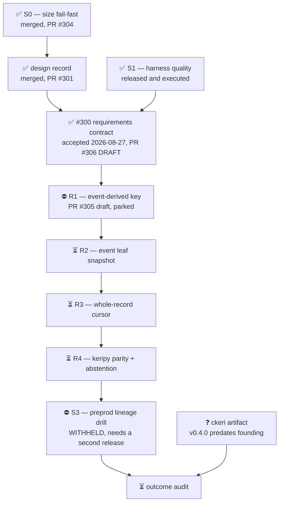

# M11 — M1.2, the decomposed record+cursor family

Outcome: the decomposed record+cursor family, delivered as usable packaged executables
on the provisional `ckeri` line.

Updated: 2026-08-28

Status: **RELEASED** for this session by `RELEASE-2026-08-28T1104Z-keri-m12`; the omnia pausa
remains in force for reactivegas, treasury-ms1, 0-projects and session 0, and the first pause
(2026-08-24T14:20Z) still governs R1 and the withheld set. Architectural experiment until its
gates pass; the experiment claims policy is in force for every external word.

**Position in one sentence:** the two entry gates are accepted, the S0 reland is merged,
and today the projection-fidelity requirements contract was written, independently
audited and accepted — but the four requirements it states are, with one exception,
unstarted; R1 is parked mid-campaign on an unsatisfiable frozen gate; and nothing has
shipped on the `ckeri` line since before this milestone was founded.

Legend: ✅ done · 🟡 active/next · ⏳ queued · ⛔ blocked · ❓ unknown

## Where the work stands

Order only — no task here carries a date estimate, so no bar carries a width.

## Per unit

| unit | state | detail |
|---|---|---|
| S0 — size fail-fast | ✅ | merged; `main` at `84e3b7159115e9169b57a85cbf9053b94aa889ba` |
| S1 — harness quality | ✅ | released and executed |
| design record | ✅ | merged 2026-08-19 via PR #301, blob `918e4289eb71a5f12199d2eda02305c6746e0448`, 4 `[OPEN]` and 7 `[settled]` intact |
| #300 requirements | ✅ accepted, ⏳ unmerged | commit `0cfc9c282247f2910f3c45295b8b81ba6d334275`, submission 1, zero repairs, fresh independent audit PASS (8/8 blocking rows killed). PR #306 is **draft**; #300 stays **open** |
| R1 — event-derived key | ⛔ | PR #305 draft. Build ledger 5/5 with a granted, unspent sixth; frozen gate v4 unsatisfiable by any candidate; v8 draft unfrozen with an open composition question |
| R2 / R3 / R4 | ⏳ | mandates staged on the `milestones` branch under A-019; **no lanes, no issues** |
| S3 — preprod drill | ⛔ | WITHHELD; needs a second written release naming every write it performs |
| DESIGN NOTE 002 | 🟡 | received 2026-08-28, sha256 `d52923f6ab3f343c7413c12768dd127d60fa2dc1bfe5d2357fc4a36c793d676a`; addressed to the desk to accept, amend or discard; unlanded because `RELEASE-015` holds issue mutations |
| `ckeri` artifact | ❓ | v0.4.0 released 2026-08-04, **before** this milestone was founded on 2026-08-18. Nothing has shipped since |

## Blockers, and what would clear each

| blocker | what clears it |
|---|---|
| `OMNIA PAUSA 2026-08-27T17:42Z` | an explicit written RELEASE naming this order |
| R1's frozen gate is unsatisfiable | the ruling requested as `Q-MS12-004`, then a versioned gate proven able to fail in both directions |
| R2–R4 have no lanes | R1 accepted and merged first — each mandate names its predecessor |
| S3 withheld | a second written machine release stating what the drill writes |
| `ckeri` carries nothing from this milestone | a release cut after the first requirement slice merges |
| #300 requirements not merged | merge authority, deliberately withheld: closing #300 would make the burn-down read "milestone complete", which is false |

## The honest reading of the burn-down

The GitHub milestone shows **one open issue**. That number is not the outcome. The
milestone's observable test is that every family member sits behind an immutable
can-fail gate and **a stranger can obtain and run the packaged `ckeri` artifact**.
Counting closed children is the vacuous pass and is not accepted. Closing #300 would
satisfy the counter and none of the test.

## Contracts needing enforcement

- **mandate-pin — `enforced: NONE`.** The accepted requirements cite the four A-019
  mandates by *branch commit* `3653813e1c3f7631c7e8ffb971fd2b194ac1eaf1`, but the
  `milestones` branch is force-pushed as a fresh root on every write and the four
  content hashes appear in no committed file. A routine ledger sweep would orphan the
  citation. Captured by content sha256; the sweep is deferred until the commit is
  tagged.
- **first-seen, gist vs repository.** Two same-morning documents take opposite
  positions on whether settlement order may stand in for first-seen. Read as layers
  they are consistent — the cursor abstains, an off-chain witness may adopt any
  receipting policy KERI allows — but the reconciliation is unwritten.
- **no current witnessing document.** Every repository design document about
  witnessing predates the 2026-08-18 terminal ruling. Receipt grading — the M1.2
  concept — is explained in none of them.
