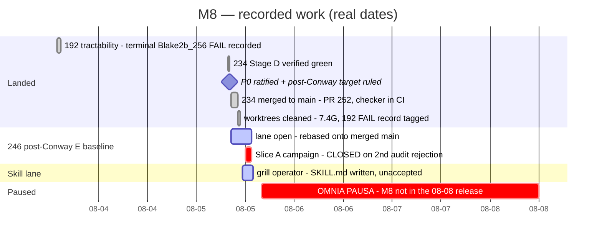
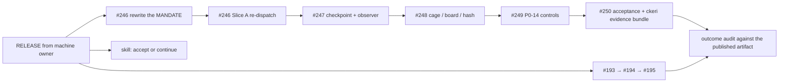

# Milestone 8 — Blaster compiled UPLC verification

Updated: 2026-08-08
Legend: ✅ done · 🟡 active/next · ⏳ queued · ⛔ blocked · ❓ unknown

> **⏸ PARKED 2026-08-05T15:57Z** — machine owner, under OMNIA PAUSA, on the
> operator's order; re-declared 2026-08-07T15:28Z. The **2026-08-08T04:36Z
> release covered the `keri` session only**; M8 (`keri-ms8-blaster`) was not
> included and stays parked. Nothing killed, no worktree retired, no commit
> dropped. **Release is the machine owner's alone; silence is not permission.**
> At the stop: `#246` sat at a clean replanning boundary with no live seats, and
> the skill lane held a written-but-unaccepted page. Nothing was in flight.

The living state of [milestone 8](https://github.com/lambdasistemi/cardano-keri/milestone/8). The milestone description holds the *definition* — outcome, test, artifact, boundaries — and changes almost never; this page holds the *currency*.

## Delivery — dated, not estimated

Only bars with real recorded start and end have widths.

## Remaining chain — order only

No estimates exist for this work, so it is drawn as sequence, not schedule.

## Blockers — each with what would unblock it

| | Blocker | Unblocked by |
|---|---|---|
| ⛔ | **Everything** — M8 parked, not in the 08-08 release | RELEASE from the machine owner, on the operator's word. Order: crew first, then milestones |
| ⛔ | **`#246` Slice A** — commit-owner campaign closed on a second audit rejection | Rewriting the **mandate**, not re-dispatching it. The lane's own replan names the mandate as root cause: it required a resolver that approximates Lean name resolution *textually*. Re-issuing it reproduces the rejection |
| ⛔ | **Lean-blaster PR #110** shows "changes requested" for a fix the rebase already landed | One operator word — it is a public action in an external repo. https://github.com/input-output-hk/Lean-blaster/pull/110 |
| ❓ | **Skill page** written and auto-discovered, but **nothing in it has been executed**, and it is untracked in `llm-settings` | Operator acceptance, and either running its commands or marking them unverified |
| ❓ | **Codex capacity reads `?`** — the machine probe is gone and the notifier reports `MEASUREMENT FAILED` | Probe repair. **A hole is not a low value**; no Codex-seated slice may be planned against it as headroom |

## State by unit

| | Unit | State |
|---|---|---|
| ✅ | `#192` tractability | Terminal Blake2b_256 FAIL retained as a valid measurement of the obsolete pin; preserved as tag `m8/192-terminal-fail-record`, pushed |
| ✅ | `#234` dual-head bump + identity checker | **Merged** (PR #252, `9d4eb957`). The checker is on `main`, wired into `just ci-offchain` and `ci.yml` — runs on every change, no opt-in. Authenticates **lock-backed rows only** |
| ✅ | P0 scope | 14 claims + 4 written exclusions ratified. Operator: *"this is not final, it's a start"* — a first set, not a ceiling |
| ✅ | Proof target | **PlutusV3 post-Conway (`variantE`)**. All earlier variant-C evidence relabelled *pre-Conway*, not deleted; 12 of 23 rows re-baseline |
| ✅ | Artifact decision | Ships on the `ckeri` release line as an attached, independently-runnable evidence bundle, hash-bound to commit + toolchain + variant. **M1's close gates on it** |
| ⛔ | `#246` post-Conway E baseline | Rebased onto merged `main`; tree clean; **9 unpushed commits, single-copy on this host**. Slice A closed on second audit rejection; replan filed |
| ⏳ | `#247` `#248` `#249` `#250` | Filed, undispatched. One ticket at a time; 2/3 overlap suspended |
| ⏳ | `#193` `#194` `#195` | Unparked — their `#219` precondition merged 2026-08-04. Need the combined post-#219 **and** post-Conway rerun |
| ⛔ | Blaster/Aiken skill | `SKILL.md` written and live; unaccepted and untracked |

## Artifact

The verification ships as an additive asset on the **`ckeri`** release line — one thing a stranger can obtain and rerun — hash-bound to the exact commit, Aiken toolchain and semantics variant it verifies. M1's close gates on its existence, not on every 0.x release. Decided with the M1 desk; M8 keeps an internal line for iteration only.

## Discipline in force

One ticket at a time · Claude T.O. → Codex commit owner → fresh Claude auditor · `agy`/`qwen` draft-only, secrets a hard bar · no claim accepted until its own falsifier is shown **RED before** its GREEN · untracked means uncovered · **could not evaluate must be RED** · every aggregate publishes its denominator.
