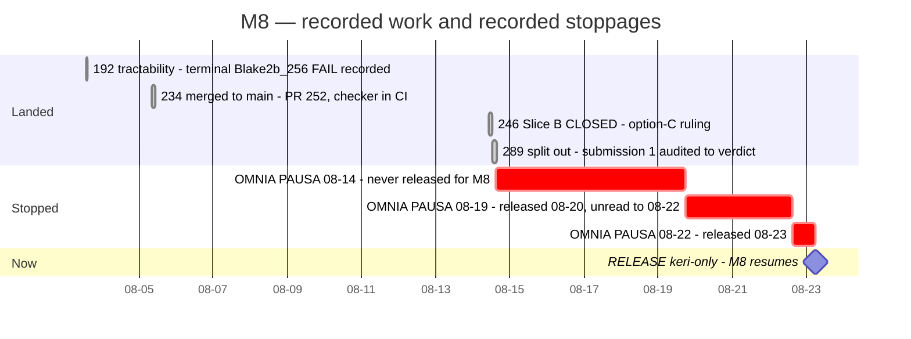
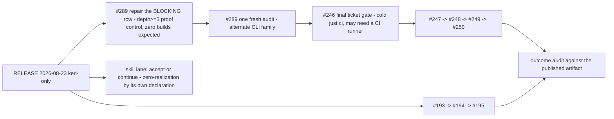

# Milestone 8 — Blaster compiled UPLC verification

Updated: 2026-08-23
Legend: ✅ done · 🟡 active/next · ⏳ queued · ⛔ blocked · ❓ unknown

> **▶ RESUMED — 2026-08-23T05:48Z**, machine owner `%7059`, on the operator's
> instruction *"release the keri work"*. Cardano-KERI only; the rest of the host
> stays parked. All five M8 seats are named in the release by pane ID.
>
> **The nine-day gap in this page has an end as well as a beginning, and the
> reason it lasted nine days is recorded rather than smoothed over** — see
> *The pause record* below. `#289` is now the critical path and the only thing
> `#246` waits on.

The living state of [milestone 8](https://github.com/lambdasistemi/cardano-keri/milestone/8). The milestone description holds the *definition* — outcome, test, artifact, boundaries — and changes almost never; this page holds the *currency*.

## Delivery — dated, not estimated

Only bars with real recorded start and end have widths. The pause bars are drawn
because they have genuine recorded boundaries; nothing ahead of the release has a
width, because nothing ahead of it has an estimate.

## Remaining chain — order only

No estimates exist for this work, so it is drawn as sequence, not schedule.

## Blockers — each with what would unblock it

| | Blocker | Unblocked by |
|---|---|---|
| 🟡 | **`#289` — one OPEN `BLOCKING` row, repair NOT STARTED.** Submission 1 was audited to a terminal verdict (`rows=6 killed=5 open=1`). The implementation is correct — faithful Kahn topological sort, whole-graph validation before any Lean invocation — but **every ordering fixture is transitive depth ≤ 2**, so a mutant ordering by declared-import count produced byte-identical harness output. The proof cannot fail | Shipping the property for the **class**, not the reported instance: a depth≥3 case the import-count mutant gets wrong, shown **RED before** it ships green. A `BLOCKING` row terminates only `KILLED` or `BLOCKED` — never `RESIDUAL`, at any budget. Expected cost: **zero builds** |
| ⛔ | **`#246` — parked at `590f492b`, gated entirely on `#289`.** Nine days without a line of movement, and none of it technical | `#289` reaching terminal state, then the final ticket gate |
| ⛔ | **Cold full-gate realization is NOT authorized.** Store 60.99 GB against a 66.57 GB one-lane bar — **5.20 GiB short** | Store recovery, or the per-leg-class route: declare expected delta, 256 MiB ceiling, proceed while available minus ceiling clears the 53.69 GB STOP floor. That predicate **passes today with 6.55 GiB clear** |
| ⛔ | **All ten GitHub Actions runners are deliberately stopped** — the host's largest unattended store consumer, and what ate 16 GiB on 08-22. `#246`'s final gate is a cold `just ci`, and the PR #252 identity checker runs **in CI** | An ask to the machine owner for *the smallest number of runners that unblocks the gate* — to be filed with an exact number when `#289` terminates, not assumed now |
| ⛔ | **Lean-blaster PR #110** shows "changes requested" for a fix the rebase already landed | One operator word — it is a public action in an external repo. https://github.com/input-output-hk/Lean-blaster/pull/110 |
| ❓ | **Skill page** written, published, and auto-discovered, but **nothing in it has been executed** | Operator acceptance, plus either running its commands or shipping the *"verified against source, not live-executed"* caveat. The lane has declared it will not realize while `#289` repairs |
| ⛔ | **`INV-246-IDENTITY-FIELD-EXPECTATION-DISJOINT` — `BLOCKING`, terminated `BLOCKED` by operator ruling.** The manifest's top-level object is neither enumerated nor key-set-pinned, and **the `variant` field sits at top level** — so nothing in the checked surface pins the semantics variant of the frozen baseline | A filed follow-up (`T246-F7`) for container closure. Placed out of scope by operator decision 2026-08-12; settling it needs a scope change above the ticket. The boundary must travel wherever `outcome=ESTABLISHED` appears, and into the `ckeri` bundle |

## The pause record — why this page stood still for nine days

Three stop orders, only two of which were ever lifted for M8:

| Order | Scope | Released |
|---|---|---|
| `OMNIA PAUSA 2026-08-14T14:59Z` | machine-wide | **never released for M8** — partially lifted 08-17 for one read-only research campaign |
| `OMNIA PAUSA 2026-08-19T15` | machine-wide | 2026-08-20T07:00Z |
| `OMNIA PAUSA 2026-08-22` | machine-wide | 2026-08-23T05:48Z, Cardano-KERI only |

The `#246` scoped release was drafted on 08-14 with every desk condition
pre-accepted, and **held** — explicitly *not* for capacity — pending an operator
word, on the ruling *"a pause supersedes a standing goal."* That word arrived on
08-23 as *"release the keri work"*.

**One protocol defect is recorded here because it is structural, not careless.**
The 08-20 release reached this desk **two days late**. The 08-19 order required
every lane to quiesce every wake source before answering `PARKED`; the 08-20
release then said *"I am not broadcasting to panes again."* The release was
therefore addressed to a desk the previous order had required to make
unreachable — **a correctly parked desk is, by construction, a desk that reads
nothing.** It cost no work, because M8's own 08-14 pause was never lifted. It
cost two days of a desk believing it was parked when it was merely unreachable,
which is the more dangerous state because it is indistinguishable from the
inside. The desk's proposed remedy — re-arm one wake source — has been
**withdrawn**, overruled by the 08-23 release's no-polling rule (*"I push; you do
not poll"*, after an hourly loop cost 1.4 billion tokens). The gap now closes on
the push side.

## State by unit

| | Unit | State |
|---|---|---|
| ✅ | `#192` tractability | Terminal Blake2b_256 FAIL retained as a valid measurement of the obsolete pin; preserved as tag `m8/192-terminal-fail-record`, pushed |
| ✅ | `#234` dual-head bump + identity checker | **Merged** (PR #252, `9d4eb957`). On `main`, wired into `just ci-offchain` and `ci.yml` — runs on every change, no opt-in. Authenticates **lock-backed rows only** |
| ✅ | P0 scope | 14 claims + 4 written exclusions ratified. Operator: *"this is not final, it's a start"* |
| ✅ | Proof target | **PlutusV3 post-Conway (`variantE`)**. Earlier variant-C evidence relabelled *pre-Conway*, not deleted |
| ✅ | Artifact decision | Ships on the `ckeri` release line as an attached, independently-runnable evidence bundle, hash-bound to commit + toolchain + variant. **M1's close gates on it** |
| ✅ | `#246` Slice B | **CLOSED** on the operator's option-C ruling. `rows=18 killed=14 residual=2 blocked=2 open=0`, follow-up `T246-F7` filed and pushed |
| 🟡 | `#289` elaboration order | Candidate `c78df440`, **local only, never pushed**. Gate `S1-v2` authoritative; strengthened `S1-v3` complete and falsified at **zero builds across 44 legs** but **prepared, not installed** — must not be extended, repaired against, squashed, or amended. Repair grant `A-t289-005` remains **VOID** (issued after the 08-14 pause began) |
| ⛔ | `#246` post-Conway E baseline | Parked at `590f492b`. Slice C open: 16 rows (15 `BLOCKING`, 1 advisory), severities fixed at spec time; gate `C-v4` frozen with 11 individually-falsified assertions. Two builds standing and unexpiring |
| ⏳ | `#247` `#248` `#249` `#250` | Filed, undispatched. One ticket at a time |
| ⏳ | `#193` `#194` `#195` | Unparked — their `#219` precondition merged 2026-08-04. Need the combined post-`#219` **and** post-Conway rerun |
| ❓ | Blaster/Aiken skill | `SKILL.md` written, published, committed `b46a1c3`; unaccepted, and nothing in it executed |

## Artifact

The verification ships as an additive asset on the **`ckeri`** release line — one thing a stranger can obtain and rerun — hash-bound to the exact commit, Aiken toolchain and semantics variant it verifies. M1's close gates on its existence, not on every 0.x release. Decided with the M1 desk; M8 keeps an internal line for iteration only.

## Discipline in force

One ticket at a time · Claude T.O. → Codex commit owner → fresh Claude auditor · `agy` revoked, `qwen` draft-only, secrets a hard bar · Grok `4.6` per-seat only · no claim accepted until its own falsifier is shown **RED before** its GREEN · untracked means uncovered · **could not evaluate must be RED** · every aggregate publishes its denominator · every check names its subject · `df -B1 --output=avail /nix/store`, never from a worktree · a store-path or foreign-recipe failure is a **machine event**: stop and report, never retry · resolve the effective hooks path mechanically before every commit; `--no-verify` is never available · a grant is not a release.
