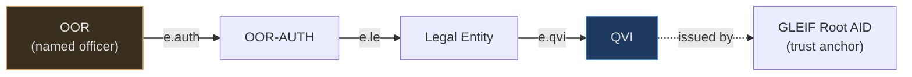

# What is ACDC, and how does Cardano verify it?

This follows the [KERI primer](keri-primer.md). KERI gives you a
self-certifying *identifier* (an AID) and a rotation-safe key history (the
KEL). ACDC is the layer on top: the **credentials** those identifiers issue to
each other — "GLEIF says this QVI is accredited", "this QVI says this legal
entity holds LEI X", "this entity says Alice is its CFO". It covers what an
ACDC is, how credentials chain, how revocation works, and what Cardano adds.

---

## The problem ACDC solves

A credential is a claim one party makes about another: a diploma, a business
licence, an officer appointment. Today verifying one means calling the issuer's
server — is this diploma real, is this licence still valid? That server is a
trusted intermediary with all the problems the [KERI primer](keri-primer.md)
opened with: it can be down, hacked, coerced, or simply refuse.

[ACDC](https://github.com/WebOfTrust/ietf-acdc) (Authentic Chained Data
Container) removes that call. A credential becomes a **self-contained,
cryptographically verifiable object** that a verifier checks offline against KERI
key state — no issuer API at verification time. And because credentials
reference each other, a verifier can walk an entire **chain of authority** back
to a root it trusts.

---

## The ACDC: a content-addressed credential

An ACDC is a structured document. Its core fields:

```
v  — version string
d  — SAID: the self-addressing identifier (digest of this credential)
i  — issuer AID          (who is making the claim)
ri — registry identifier (the credential's status registry — its TEL; the current ACDC spec labels this rd)
s  — schema SAID         (the shape the claim must conform to)
a  — attributes          (the claim itself; targeted credentials carry the issuee AID in a.i)
e  — edges               (links to other ACDCs this one depends on)
r  — rules               (legal/operational terms)
```

(A credential also carries `u`, a salty nonce for disclosure control; the list
above is the part that matters here.)

Two things make it verifiable without an issuer:

**The SAID (`d`) is a digest of the credential's own content.** Change one byte
of the attributes and the SAID no longer matches — the credential is
content-addressed and tamper-evident by construction. SAID stands for
Self-Addressing IDentifier.

**The issuer (`i`) is a KERI AID.** Verifying an ACDC against that AID rests on
**two separate requirements** from the [ACDC
specification](https://trustoverip.github.io/kswg-acdc-specification/):

- **Issuer commitment.** The issuer provides a **signature or seal on the SAID** —
  MUST on the SAID of the *most compact form*, and SHOULD on the SAIDs/SADs of the
  other variants. This is the issuer's commitment to the credential's content; it
  is *not* the same as anchoring it to key state.
- **Binding to key state.** The issuer **also anchors an issuance-proof digest
  seal in its KEL** — directly, or indirectly through the TEL — binding the
  issuance to the issuer's **historical key state** (the key state in force at
  that point in its key history). It is the *seal* that is anchored in the KEL,
  not the signature itself.

A verifier confirms that **issuance seal** against the issuer's KEL. Because the
seal is anchored to a fixed historical key state, the credential **remains
verifiable through later key rotation**: rotating the issuer's keys afterward
does not invalidate credentials already sealed. ACDC inherits every KERI
guarantee: pre-rotation, duplicity detection, portable history.

!!! note "Digest agility, again"
    Like AIDs, SAIDs carry a prefix naming their digest algorithm. KERI's
    default is Blake3 (`E` prefix) — and **cardano-keri is E-native**:
    standard Blake3 SAIDs are consumed as-is. Where a SAID must be recomputed
    on-chain, the hash-proof mint runs in-script blake3 (single chunk,
    ≤1024 B). The earlier F-prefix requirement is retired — see
    [Blake2b-256 AID Requirement](design/blake2b256-requirement.md) for the
    archived rationale.

---

## Chaining: edges make a graph of authority

The "Chained" in ACDC is the `e` field. An edge references another ACDC **by
its SAID**, pointing from a credential to the one it depends on — so the chain
is built leaf-first, each credential naming its parent:

```
OOR credential    e.auth → OOR-AUTH credential   "issued on this authorization"
OOR-AUTH cred     e.le   → LE credential          "the entity authorized this role"
LE credential     e.qvi  → QVI credential         "an accredited QVI issued me"
QVI credential    (no edge)                        root — trusted because GLEIF's AID issued it
```

Because every edge is a SAID and every SAID is a digest, the chain is
tamper-evident end to end: you cannot swap in a different parent credential
without breaking the edge. A verifier walks the edges from a leaf credential up
to a link it already trusts — for vLEI, the QVI credential issued directly by
**GLEIF's AID**, the root of trust.

---

## The vLEI chain, concretely

[vLEI](design/vlei.md) is the ACDC chain this project targets. GLEIF defines a
strict hierarchy, and the role chain is **four ACDCs**, not three — the detail
that sets the verifier's hop bound. The arrows below are the ACDC edges: each
credential points *up* to its parent, the direction a verifier walks.



The subtlety: an Official Organizational Role (OOR) credential is **issued by
the QVI**, not by the Legal Entity — but only after the LE issues an **OOR-AUTH**
credential (to the QVI) authorizing that specific role. So a full role chain
from GLEIF to a named officer traverses four credentials — QVI → LE → OOR-AUTH →
OOR — which is why the on-chain verifier is scoped to **hop bound 4,
parameterized** rather than assuming the naive three-level tree. (An Engagement
Context Role, ECR, can be issued directly by the LE — a shorter path — or by the
QVI via an ECR-AUTH credential.)

Most gates care about the *role* credential at the leaf (a trader ECR, an
officer OOR) — proof that a specific person holds a specific authority under a
specific entity — not merely that the entity exists.

---

## Schemas: the shape of a claim

Every ACDC names a **schema** by SAID (`s`). The schema fixes the credential's
type and the fields its attributes must carry — a QVI credential, an OOR
credential, and an ECR credential are different schemas. Because the schema is
referenced by SAID, "which kind of credential is this" is itself
tamper-evident, and a verifier can require an exact schema at each hop of the
chain rather than accepting any credential in the right position.

Schemas are published artifacts (the [vLEI
schemas](https://github.com/WebOfTrust/vLEI/tree/main/schema/acdc) are public).
Anchoring schema SAIDs on-chain is one of the pieces a full ACDC trust layer
needs — see [what is missing for
ACDC](architecture/amaru-integration.md#what-is-actually-missing-for-acdc).

---

## The TEL: is the credential still valid?

A signature proves a credential was *issued*. It says nothing about whether it
was later **revoked** — an officer leaves, an accreditation is pulled. That
live status lives in a **TEL (Transaction Event Log)**: a per-issuer,
hash-chained log of credential issuance and revocation events, anchored back
into the issuer's KEL so it inherits the same ordering and duplicity
guarantees.

```
registry inception  →  issue(SAID_a)  →  issue(SAID_b)  →  revoke(SAID_a)
```

To trust a credential *right now*, a verifier checks the issuer's TEL for a
revocation of that credential's SAID. And revocation **cascades**: if the QVI's
own credential is revoked, every LE and OOR beneath it is invalid too. So the
verifier must prove non-revocation at **every level of the chain** — the
all-TELs cascade check.

!!! warning "The TEL is the hard, valuable part"
    A KEL (key state) is a solved shape; a credential-status registry with
    real revocation is the genuinely new on-chain engineering. See
    [what is missing for
    ACDC](architecture/amaru-integration.md#what-is-actually-missing-for-acdc).

---

## Verifying an ACDC chain

Putting it together, verifying a leaf credential is four independent checks,
repeated at every hop back to the trust root:

1. **Integrity** — recompute the SAID from the content; it must match `d`, and
   each edge SAID must match the parent it points to.
2. **Schema** — the credential conforms to the expected schema SAID for its
   position in the chain.
3. **Issuer authority** — the issuer commits with a **signature or seal on the
   SAID**, and **separately** anchors a **KEL-anchored issuance-proof seal** at
   the key state in force when it was issued (its *historical* key state),
   confirmed via the issuer's KEL (KERI key state); the seal stays valid through
   later rotations.
4. **Non-revocation** — no revocation event for this credential's SAID in the
   issuer's TEL, and the same holds for every credential above it (cascade).

If all four hold at every hop up to a root you trust, the leaf credential is
authentic. None of it requires calling the issuer.

---

## Where Cardano fits

Steps 3 and 4 are the catch: they walk **live, off-chain data structures** (KELs
and TELs). Today "verify a vLEI" is something a *server* does — and any smart
contract that gates on that server is back to trusting an intermediary. That is
the hole cardano-keri fills.

| ACDC verification step | Off-chain world | With cardano-keri |
|---|---|---|
| SAID / content integrity | CESR tooling | Aiken verifier: `blake2b_256` recompute of the content-addressed SAID — content integrity only, **not** issuer commitment |
| Issuer commitment | issuer signature/seal on the SAID | issuer **signature or seal on the SAID** (MUST on the most-compact form; SHOULD on the other variants' SAIDs/SADs). A **direct signature** is verified with the **SAID as the signed message** (`verify_ed25519_signature` at the issuer's key state); a **seal** is a digest/reference — **followed to the KEL event** (or via **TEL state** to its **KEL anchoring seal**), with the **KEL event signatures verified at the historical key state** — not an Ed25519 signature over the seal (TEL events need not be signed) |
| Historical state/key binding (*issued then*) | KEL replay via witnesses | a **KEL-anchored issuance-proof digest seal** — anchored directly, or indirectly via the TEL — binding the issuance to the issuer's **historical** key state, via historical KEL / R-ACDC / admission evidence; **not** the signature itself and **not** the current Layer-1 checkpoint |
| Current non-revocation (*unrevoked now*) | Query issuer's TEL | Layer-2 TEL registry proof (all-TELs cascade) |
| Current dApp actor authorization (*authorizes now*) | KEL current key state | Layer-1 sovereign per-AID checkpoint (CIP-31 ref input) — current weighted keys/threshold; proves current control, **not** historical issuance |
| Assemble the evidence | verifier server | Layer-4 proof builder (CESR decode → redeemer) |

These are three *distinct* questions, and cardano-keri keeps them apart:

- **Was it issued then?** — the issuer's **signature or seal on the SAID**
  (commitment) *plus* the separate **KEL-anchored issuance-proof seal** binding it
  to that historical key state; it stays valid through later rotations.
- **Is it still unrevoked now?** — current **TEL** status (the non-revocation
  cascade above).
- **Does the actor authorize this action now?** — current authority, resolved
  via the sovereign per-AID checkpoint, not by re-reading the historical
  issuance seal.

The chain runs the gate itself: the whole four-hop verification is atomic with
the transaction that relies on it. Because the verification is expensive, an
[**admission cage**](design/defi-gate.md) can verify the full chain once and
cache the result — `trie_key → {credential_saids, role_level, admitted_at,
not_after}` — so later actions gate on a cheap lookup with a freshness bound
(TEL-root-cadence-grade, never sanctions-screening-grade).

---

## Where this lives in the milestones

ACDC is the whole of **M2 — Verification + authorization core**, on top of the
M1 identity registry, per the [Roadmap](roadmap.md):

- **On-chain TEL revocation registry** — per-issuer credential status
  (M1, [#30](https://github.com/lambdasistemi/cardano-keri/issues/30)); the
  revocation state machine the cascade check reads.
- **ACDC chain verifier** — hop bound 4, parameterized, with all-TELs cascade
  non-revocation and a stated freshness floor
  (M2, [#31](https://github.com/lambdasistemi/cardano-keri/issues/31)).
- **ACDC proof builder** — CESR decode + redeemer generation, the off-chain
  half that assembles the evidence the verifier consumes
  (M2, [#32](https://github.com/lambdasistemi/cardano-keri/issues/32)).
- **Admission cage** — verify once, gate on a cheap lookup thereafter
  (M2, [#38](https://github.com/lambdasistemi/cardano-keri/issues/38)).

M2's vertical demo (see the [Roadmap](roadmap.md)) is the acceptance test: a
synthetic 4-hop vLEI chain verified on-chain on a devnet, one action through
full verification and one through the admission cache, and a mid-chain
revocation blocking both.

The former external dependency — the **F-prefix (Blake2b-256) SAID gate** —
is dissolved by the E-native contract (2026-07-16): the Blake3 (`E`-prefix)
SAIDs GLEIF and QVIs issue today are consumed natively, off-chain by the
verifier and on-chain through the hash-proof mint where needed. See
[Blake2b-256 AID Requirement](design/blake2b256-requirement.md) for the
archived rationale.

---

*Next: [vLEI Bridge](design/vlei.md) | [The Regulated DeFi Gate](design/defi-gate.md) | [Business cases](design/business-cases/index.md)*
