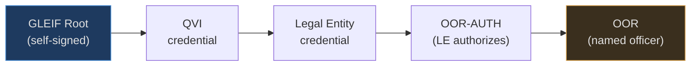

# What is ACDC, and how does Cardano verify it?

This follows the [KERI primer](keri-primer.md). KERI gives you a
self-certifying *identifier* (an AID) and a rotation-safe key history (the
KEL). ACDC is the layer on top: the **credentials** those identifiers issue to
each other — "GLEIF says this QVI is accredited", "this QVI says this legal
entity holds LEI X", "this entity says Alice is its CFO". It covers what an
ACDC is, how credentials chain, how revocation works, and what Cardano adds.

---

## The problem ACDC solves

A credential is a claim one party makes about another: a diploma, a business
licence, an officer appointment. Today verifying one means calling the issuer's
server — is this diploma real, is this licence still valid? That server is a
trusted intermediary with all the problems the [KERI primer](keri-primer.md)
opened with: it can be down, hacked, coerced, or simply refuse.

[ACDC](https://github.com/WebOfTrust/ietf-acdc) (Authentic Chained Data
Container) removes that call. A credential becomes a **self-contained,
cryptographically signed object** that a verifier checks offline against KERI
key state — no issuer API at verification time. And because credentials
reference each other, a verifier can walk an entire **chain of authority** back
to a root it trusts.

---

## The ACDC: a content-addressed credential

An ACDC is a structured document. Its core fields:

```
v  — version string
d  — SAID: the self-addressing identifier (digest of this credential)
i  — issuer AID          (who is making the claim)
s  — schema SAID         (the shape the claim must conform to)
a  — attributes          (the claim itself; carries the issuee AID)
e  — edges               (links to other ACDCs this one depends on)
r  — rules               (legal/operational terms)
```

Two things make it verifiable without an issuer:

**The SAID (`d`) is a digest of the credential's own content.** Change one byte
of the attributes and the SAID no longer matches — the credential is
content-addressed and tamper-evident by construction. SAID stands for
Self-Addressing IDentifier.

**The issuer (`i`) is a KERI AID.** The credential is signed by the issuer's
current key. A verifier confirms the signature *and* — via the issuer's KEL —
that the signing key was the issuer's current key at issuance and has not since
been rotated away under compromise. ACDC inherits every KERI guarantee:
pre-rotation, duplicity detection, portable history.

!!! note "Digest agility, again"
    Like AIDs, SAIDs carry a prefix naming their digest algorithm. KERI's
    default is Blake3 (`E` prefix). **cardano-keri requires Blake2b-256
    (`F` prefix)** so a Plutus script can recompute the SAID natively. See
    [Blake2b-256 AID Requirement](design/blake2b256-requirement.md).

---

## Chaining: edges make a graph of authority

The "Chained" in ACDC is the `e` field. An edge references another ACDC **by
its SAID**, so a credential can point to the credential that authorized it:

```
QVI credential          e: → GLEIF root       "GLEIF accredited me"
LE credential           e: → QVI credential    "an accredited QVI issued me"
OOR credential          e: → LE authorization  "the entity authorized this role"
```

Because every edge is a SAID and every SAID is a digest, the chain is
tamper-evident end to end: you cannot swap in a different parent credential
without breaking the edge. A verifier follows the edges from a leaf credential
back to a **root of trust it already accepts** — for vLEI, GLEIF's AID.

---

## The vLEI chain, concretely

[vLEI](design/vlei.md) is the ACDC chain this project targets. GLEIF defines a
strict hierarchy, and the role chain is **four ACDCs**, not three — the detail
that sets the verifier's hop bound:



The subtlety: an Official Organizational Role (OOR) credential is **issued by
the QVI**, not by the Legal Entity — but only after the LE signs an **OOR-AUTH**
credential authorizing that specific role. So a full role chain from GLEIF to a
named officer traverses four credentials: QVI → LE → OOR-AUTH → OOR. This is
why the on-chain verifier is scoped to **hop bound 4, parameterized** rather
than assuming the naive three-level tree. (An Engagement Context Role, ECR, is
a shorter path issued directly by the LE.)

Most gates care about the *role* credential at the leaf (a trader ECR, an
officer OOR) — proof that a specific person holds a specific authority under a
specific entity — not merely that the entity exists.

---

## Schemas: the shape of a claim

Every ACDC names a **schema** by SAID (`s`). The schema fixes the credential's
type and the fields its attributes must carry — a QVI credential, an OOR
credential, and an ECR credential are different schemas. Because the schema is
referenced by SAID, "which kind of credential is this" is itself
tamper-evident, and a verifier can require an exact schema at each hop of the
chain rather than accepting any credential in the right position.

Schemas are published artifacts (the [vLEI
schemas](https://github.com/WebOfTrust/vLEI/tree/main/schema/acdc) are public).
Anchoring schema SAIDs on-chain is one of the pieces a full ACDC trust layer
needs — see [what is missing for
ACDC](architecture/amaru-integration.md#what-is-actually-missing-for-acdc).

---

## The TEL: is the credential still valid?

A signature proves a credential was *issued*. It says nothing about whether it
was later **revoked** — an officer leaves, an accreditation is pulled. That
live status lives in a **TEL (Transaction Event Log)**: a per-issuer,
hash-chained log of credential issuance and revocation events, anchored back
into the issuer's KEL so it inherits the same ordering and duplicity
guarantees.

```
registry inception  →  issue(SAID_a)  →  issue(SAID_b)  →  revoke(SAID_a)
```

To trust a credential *right now*, a verifier checks the issuer's TEL for a
revocation of that credential's SAID. And revocation **cascades**: if the QVI's
own credential is revoked, every LE and OOR beneath it is invalid too. So the
verifier must prove non-revocation at **every level of the chain** — the
all-TELs cascade check.

!!! warning "The TEL is the hard, valuable part"
    A KEL (key state) is a solved shape; a credential-status registry with
    real revocation is the genuinely new on-chain engineering. See
    [what is missing for
    ACDC](architecture/amaru-integration.md#what-is-actually-missing-for-acdc).

---

## Verifying an ACDC chain

Putting it together, verifying a leaf credential is four independent checks,
repeated at every hop back to the trust root:

1. **Integrity** — recompute the SAID from the content; it must match `d`, and
   each edge SAID must match the parent it points to.
2. **Schema** — the credential conforms to the expected schema SAID for its
   position in the chain.
3. **Issuer authority** — the issuer's signature verifies against the issuer's
   *current* key, confirmed via the issuer's KEL (KERI key state).
4. **Non-revocation** — no revocation event for this credential's SAID in the
   issuer's TEL, and the same holds for every credential above it (cascade).

If all four hold at every hop up to a root you trust, the leaf credential is
authentic. None of it requires calling the issuer.

---

## Where Cardano fits

Steps 3 and 4 are the catch: they walk **live, off-chain data structures** (KELs
and TELs). Today "verify a vLEI" is something a *server* does — and any smart
contract that gates on that server is back to trusting an intermediary. That is
the hole cardano-keri fills.

| ACDC verification step | Off-chain world | With cardano-keri |
|---|---|---|
| SAID / signature integrity | CESR tooling | Aiken verifier: `blake2b_256` + `verify_ed25519_signature` |
| Issuer key is current | KEL replay via witnesses | Layer-1 AID registry proof (CIP-31 ref input) |
| Credential not revoked | Query issuer's TEL | Layer-2 TEL registry proof (all-TELs cascade) |
| Assemble the evidence | verifier server | Layer-4 proof builder (CESR decode → redeemer) |

The chain runs the gate itself: the whole four-hop verification is atomic with
the transaction that relies on it. Because the verification is expensive, an
[**admission cage**](design/defi-gate.md) can verify the full chain once and
cache the result — `trie_key → {credential_saids, role_level, admitted_at,
not_after}` — so later actions gate on a cheap lookup with a freshness bound
(TEL-root-cadence-grade, never sanctions-screening-grade).

---

## Where this lives in the milestones

ACDC is the whole of **M2 — Verification + authorization core**, on top of the
M1 identity registry, per the [Roadmap](roadmap.md):

- **On-chain TEL revocation registry** — per-issuer credential status
  (M1, [#30](https://github.com/lambdasistemi/cardano-keri/issues/30)); the
  revocation state machine the cascade check reads.
- **ACDC chain verifier** — hop bound 4, parameterized, with all-TELs cascade
  non-revocation and a stated freshness floor
  (M2, [#31](https://github.com/lambdasistemi/cardano-keri/issues/31)).
- **ACDC proof builder** — CESR decode + redeemer generation, the off-chain
  half that assembles the evidence the verifier consumes
  (M2, [#32](https://github.com/lambdasistemi/cardano-keri/issues/32)).
- **Admission cage** — verify once, gate on a cheap lookup thereafter
  (M2, [#38](https://github.com/lambdasistemi/cardano-keri/issues/38)).

M2's vertical demo (see the [Roadmap](roadmap.md)) is the acceptance test: a
synthetic 4-hop vLEI chain verified on-chain on a devnet, one action through
full verification and one through the admission cache, and a mid-chain
revocation blocking both.

The one external dependency is the **F-prefix (Blake2b-256) SAID gate**: GLEIF
and QVIs issue Blake3 (`E`-prefix) SAIDs today, which Plutus cannot verify.
cardano-keri requires Blake2b-256 SAIDs so the on-chain verifier and off-chain
tooling share one hash. See [Blake2b-256 AID
Requirement](design/blake2b256-requirement.md).

---

*Next: [vLEI Bridge](design/vlei.md) | [The Regulated DeFi Gate](design/defi-gate.md) | [Business cases](design/business-cases/index.md)*
