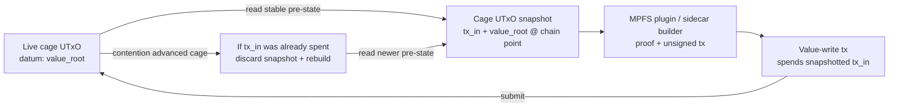

# Amaru Integration Analysis

!!! warning "Written against the earlier oracle-mediated identity model"
    This analysis predates the permissionless identity plane now specified in
    [Architecture Overview](overview.md) and
    [Identity Operations](identity-ops.md). Where it says the identity
    registry has a "single trusted oracle writer" or "oracle controls entry",
    it describes the superseded draft — identity operations are now
    permissionless and deposit-bonded; only the *value-cage* plane keeps an
    oracle (necessary-not-sufficient). The comparative conclusions about
    node-level attribution are unaffected, but read the registry-shape
    comparisons with that correction in mind. **Further (2026-07-09):** the
    "two independent state machines" framing is also superseded — identity is
    a single state machine (the witnessed KEL) with an on-chain checkpoint
    advanced by witness-receipted seals; see
    `specs/68-keystate-shape/identity-model.md` (PR #87).

This document analyses the proposed **Veridian × Amaru** node-level attribution
integration and positions cardano-keri within it. It is an architecture
analysis, not a commitment: its purpose is to establish where cardano-keri
addresses the integration's open questions, what is genuinely missing, and —
critically — whether any part of the design actually needs to live inside the
[Amaru](https://github.com/pragma-org/amaru) node.

The source is Veridian's *Node-Level KERI/ACDC Attribution — Discovery &
Planning* working document (July 2026). Its stated goal: attach KERI/ACDC
verifiable attribution *alongside* the Amaru node, without touching consensus
or block production, and find the right seam to do it.

## The dream, stated plainly

The discovery framing ("identity at the base layer", "a new operator revenue
model") is reaching for one specific outcome:

> **Every Amaru operator is also a KERI backer.** KERI gains a decentralized,
> always-on backer *fleet* — many stake pool operators anchoring KELs, schemas
> and credential registries — instead of a handful of foundation-run backer
> instances. "Node-level attribution" becomes literal: the backer function
> lives in the node layer, and operators sell anchoring/witnessing as a paid
> trust service on top of block production.

This is coherent as a *distribution* goal. It is not, on its own, a technical
requirement — KERI and ACDC are ledger-independent and verify off-chain
without Cardano at all. The rest of this document separates the parts that are
real from the parts that are narrative.

## The KERI role landscape

Three KERI roles are routinely conflated in the discovery document. Keeping
them apart dissolves most of its "biggest fork" questions.

| Role | Function | Selected by | Commitment | cardano-keri analogue |
|---|---|---|---|---|
| **Witness** | Receipts a controller's key events with a signature | Designated by each controller in their KEL | Heavy — availability SLA, part of others' identity trust | — |
| **Watcher** | Observes KELs to detect duplicity / rotations | Anyone (permissionless) | Light — read-only observer | KERI watcher **inside the oracle**; the [super watcher](../design/super-watcher.md) as a permissionless cross-plane relayer / evidence submitter |
| **Ledger (registrar) backer** | Expresses support by anchoring a key event (or its SAID) on a ledger | Designated by the controller in their backer list | Medium — must submit and confirm on-chain | The on-chain identity registry (for key-state only) |

The Cardano Foundation already ships a ledger backer:
[`cardano-foundation/cardano-backer`](https://github.com/cardano-foundation/cardano-backer)
— *"a tertiary root of trust KERI witness/backer that anchors KELs and schemas
on Cardano, reliably."* Today it is a Python service that submits anchoring
transactions to a Cardano node via Ogmios + the submit API, queuing events to
wait for confirmations. That existing artifact is the clearest statement of
what "integrate identity with the node" actually means: **make the ledger
backer a native, widely-deployed node capability** rather than an external
service.

### What a ledger gives KERI that witnesses cannot

A witness quorum provides *first-seen* ordering that is local and subjective. A
ledger provides **global total order** and public availability. This is the one
genuinely valuable thing Cardano contributes to the KERI trust model: it makes
duplicity resolution objective (which of two conflicting events came first is
no longer a matter of whom you asked). The [super watcher](../design/super-watcher.md)
is a **permissionless cross-plane relayer and evidence submitter** whose duplicity /
correspondence fraud proofs rely directly on this property — it relays witnessed
transitions and submits objective evidence, it does not enforce convergence by burning
forks.

## Where cardano-keri fits

Nothing in cardano-keri is shipped runtime infrastructure today. The concrete
shipped substrate to build on is **MPFS plugin support**: MPFS can host
domain-specific authorization logic at the cage/plugin layer without changing
the Cardano node.

cardano-keri is the research/design layer for what such a plugin could enforce:

- an MPFS-backed identity/key-state registry;
- Aiken-side checks for key-state derivation, Ed25519 possession, and
  pre-rotation;
- node-adjacent off-chain agents such as a KERI watcher or super watcher.

That maps onto the discovery document's "co-located sidecar / external service"
integration pattern, and it satisfies the document's hardest constraint —
*never touch consensus or block production* — by construction, because the only
shipped integration point is outside the node process.

### Two different models are on the table

The discovery conversation silently conflates two architectures. They are not
the same system.

| | cardano-keri plugin design | CF `cardano-backer` model |
|---|---|---|
| Shape | Proposed MPFS plugin / per-company identity registry, single trusted **oracle** writer | General KERI **backer** for any AID prefix |
| Scope | Proposed key-state + pre-rotation + value-cage authorization | Anchors arbitrary KELs and schemas |
| Trust | Oracle controls entry; user controls exit | Controller lists the backer in their KEL |
| Best at | Compliance-gated contracts, stable `trie_key` handles | Broad, KERI-native anchoring across many identities |

cardano-keri is the proposed answer to the **controller key-state** problem. It
is *not* a general backer, and it is not shipped infrastructure. If the
integration's goal is the general backer fleet, then cardano-keri is a design for
one MPFS plugin component (key-state anchoring + the super watcher's cross-plane
relay / evidence-submission role), not the whole answer.

### Anchor versus verify: the decisive difference

The two models differ on the one property that matters for smart contracts:
**does the chain verify the KERI cryptography, and can a downstream contract
consume the current key?**

A ledger backer **anchors**. It writes the SAID (digest) of a key event into a
transaction and submits it. The chain records the digest — data availability,
immutability, global ordering — and verifies the *backer's own* Cardano
signature (its endorsement). The chain does **not** replay the controller's
Ed25519 signatures or the pre-rotation chain; the KEL event is opaque bytes.
The cryptographic verification stays off-chain, in the backer before it submits
and in watchers afterward. And because the anchor is metadata, it is **not
script-consumable** — a Plutus validator cannot read `cur_key` out of it. The
anchor is a timestamped receipt you *trust the backer to have earned honestly*
("tertiary root of trust").

The proposed cardano-keri MPFS plugin **would verify**. Its Aiken validators
would check the derivation (`trie_key == blake2b_256(cbor{cur_pubkey,
next_digest})`), the Ed25519 self-auth / possession signatures, and the
pre-rotation binding
(now `blake3_256(qb64(reveal_key)) ∈ next_keys` under the E-native contract,
with in-script blake3 on the rare rotation path — the historical
[Blake2b-256 / F-prefix requirement](../design/blake2b256-requirement.md)
is retired).
`cur_pubkey` would live in on-chain `KeyState`, and a downstream MPFS
cage/plugin would consume it via a CIP-31 reference input + inclusion proof,
requiring the spend to be signed by `blake2b_224(cur_pubkey)`. That is the
target shape for a contract **consuming the live `cur_key` in on-chain
verification**, trust-minimized.

| | `cardano-backer` (anchor) | cardano-keri MPFS plugin design (verify + compose) |
|---|---|---|
| KERI event crypto checked on-chain? | ❌ off-chain; chain only orders + times + carries the backer's endorsement | Proposed: Ed25519 + pre-rotation + derivation in Aiken |
| What the chain stores | opaque SAID / receipt | Proposed: script-readable `KeyState { cur_pubkey, next_digest, seq }` |
| Can a Plutus contract consume `cur_key`? | ❌ no — it's metadata | Proposed: yes — CIP-31 reference input + inclusion proof |
| Trust model | trust the backer did the off-chain check | Proposed: chain enforces the key-state binding |
| Gives KERI | ledger anchoring (order + availability) | Proposed: **composability** — on-chain authorization |

The two are complementary, not competing: the backer gives KERI a *ledger
receipt*; the proposed cardano-keri plugin would give Cardano contracts a
verified, usable key-state. This is why cardano-keri is not "`cardano-backer` on
Amaru" — it is a design for making anchored identity **actionable in smart
contracts**, which the backer structurally cannot do.

## What is actually missing for ACDC

Key-state anchoring — `cur_key` plus pre-rotation for the controller's AID — is
the proposed cardano-keri plugin scope. A full ACDC / vLEI trust chain needs
three further things anchored, and cardano-keri models none of them as
first-class:

| Piece | What it is | cardano-keri today | Needed for ACDC |
|---|---|---|---|
| Controller KEL / key-state | `cur_key` + pre-rotation | Proposed plugin scope | yes |
| **Schemas** | ACDC schema SAIDs (the credential's shape) | ❌ not modeled | yes — `cardano-backer` anchors these |
| **TEL — credential registry** | ACDC **issuance + revocation** event log | ⚠️ only a credential *hash* notarized in a value cage; no issuance/**revocation** state machine | yes — the hard, valuable part |
| **Backer receipts (any prefix)** | Anchoring for arbitrary AIDs, not one company's registry | ❌ oracle is per-company, single-writer | yes |

**The crux is the TEL — revocation.** A credential's "is it still valid *right
now*?" lives in a Transaction Event Log: a monotonic issuance/revocation
registry. That is exactly the state that benefits from ledger anchoring (public
availability + global order), and it is the single most valuable thing a
credential system provides. The cardano-keri design can place a credential *hash*
in an MPFS value cage ([vLEI use case 4](../design/vlei.md#four-concrete-use-cases)),
but it has no revocation registry. **Designing the on-chain TEL is the real new
work**, and nobody has done it yet.

## What would Amaru actually index?

"What should Amaru index?" is the crux of the seam question. There are two
scopes.

**Scope A — Amaru indexes nothing special.** All attribution indexing lives in
an off-chain sidecar. Amaru only serves generic chain access: blocks, the UTxO
set, reference-input resolution (so MPFS cages/plugins can read whatever
registry exists), and tx submission. Any future `AID → key-state + proof`
resolver would be built by the sidecar by replaying the registry UTxO's trie.
This is the minimal, isolation-safe reading.

**Cage UTxO snapshotting is the Scope A contention workaround.** MPFS value
writes contend on the cage UTxO they spend and recreate. The sidecar/plugin
builder should snapshot the cage UTxO datum/value root at a concrete chain
point, construct the proof and transaction against that stable pre-state, and
rebuild from a newer snapshot if another write advances the cage before
submission. That handles contention in the MPFS transaction-building layer; it
does not require Amaru to serialize attribution work or maintain a
cardano-keri-specific index inside the node.

**Scope B — Amaru hosts the attribution resolver index.** The node maintains
and serves a resolver over the identity registry —
`identity handle → KeyState + inclusion/absence proof + freeze status` at the
chain tip — emits attribution metrics through the existing OpenTelemetry
pipeline, and packages via the node's distribution. This is what would make the
word "node-level" literal, and it is where the resource-budget and
consensus-isolation questions actually bite.

The cardano-keri plugin design assumes **A**. Veridian's language ("identity at
the base layer", "operator trust service") reaches for **B**. Forcing that
choice into the open is the single most clarifying outcome the discovery session
can produce.

## Does anything need to live in the node?

Each candidate for "must be in Amaru" resolves, on inspection, to a sidecar, an
on-chain validator, a public read, or an offline signature. The pattern is
consistent enough to state as a finding.

### Hosting a backer is not, by itself, a business

`cardano-backer` is already permissionless and nearly free to run — a
container, a funded address, an Ogmios connection. Almost no operator runs one,
because running it earns nothing:

1. **Selection, not supply.** In KERI a controller *designates* backers in
   their KEL; verifiers trust only the designated ones. A backer nobody has
   listed earns nothing. There is no discovery or reputation layer that makes
   an arbitrary operator selectable over the foundation's official backer.
2. **Backers pay, they do not collect.** `cardano-backer` *spends* ADA on
   anchoring fees. No protocol rail exists where the backed party pays the
   backer. Running one is a cost centre.
3. **No differentiation.** The container runs on any VPS. Being a stake pool
   operator confers no advantage — the node's stake, VRF and block-production
   record are irrelevant to a service that submits anchor transactions.
4. **No demand.** The KERI/ACDC users touching Cardano today are pilots;
   GLEIF/QVIs run their own witness infrastructure.

Bundling the backer into Amaru addresses only **supply**, which was never the
hard part. **Selection, payment, differentiation and demand** — the primitives
that make a market — are untouched by bundling.

### Stake-weighted selection does not need a node plugin

The one genuinely node-flavoured idea is **stake-weighted backer selection**:
bind backer trustworthiness to the operator's on-chain stake, giving KERI an
objective, Sybil-resistant selection metric that pure witnesses lack. It is
tempting to assume this needs a node plugin because "the node has the SPO's
key". The key hierarchy says the opposite.

| Key | Location | Proves | On the node? |
|---|---|---|---|
| **Cold key** (its hash is the pool ID) | Air-gapped, offline | "I am pool P" — authoritative pool identity | **No — never** |
| Operational / KES (hot) key | Block producer | "I'm the current block signer" | Yes |
| VRF key | Block producer | Leader-election eligibility | Yes |

To assert "backer prefix `B` is operated by pool `P`" you need a signature from
the **cold key** — which is offline *by design*. The keys that *are* on the node
prove block-signing, not pool ownership, and reusing them for identity
attestations is the key-reuse / blast-radius anti-pattern the discovery document
itself warns against. So the node holding a key does not help: the authoritative
key is deliberately absent, and the present keys must not be repurposed.

What stake-weighted selection actually requires:

1. **Bind backer → pool: one offline cold-key signature.** Produced air-gapped,
   once, the same way pool registration is. No node, no plugin, no online key.
2. **Read the stake weight: a public ledger lookup.** "Pool P controls stake S"
   is public chain data any verifier, watcher or the super watcher reads
   without keys.
3. **(Optional) liveness: op-cert / block-production checks** — also fully
   public on-chain.

Every input is an offline signature or a public read. Better still, the
"pool → backer" attestation *is* an ACDC / a cardano-keri registry entry: the
pool identity is just another AID, the binding is anchored on-chain, and
stake-weighted trust becomes "read the binding, read the stake". The entire
mechanism is buildable with **cardano-keri + public stake reads + zero Amaru
changes**.

### Finding

No operation in the design demonstrably requires being inside Amaru. Every
candidate — anchoring, backing, watching, stake-weighted selection, key custody
— is public-read, off-chain-signed, or an on-chain validator. The one thing an
in-process plugin could uniquely offer is proximity to the node's keys, which is
precisely the thing to avoid. "Node-level attribution" is best read as *anchored
on the chain the node serves, with node-adjacent agents* — not as code inside
the consensus process.

## Proposed discussion order for the session

The discovery document's draft agenda (§5) runs: goal → **Amaru architecture
walkthrough & extension points** → KERI/ACDC integration points → security &
isolation → performance → contribution model → phase-1. That ordering
front-loads *how to extend the node* before anyone has established *whether the
node needs extending at all* — so three of its blocks (architecture
walkthrough, isolation, performance/resources) presuppose Scope B and become
largely moot if the answer is Scope A.

Reorder around the gating decisions. Each item below, if resolved, shrinks or
deletes the ones after it.

| # | Decision to settle | Why it goes first | Consumes docx items |
|---|---|---|---|
| 1 | **What does "node-level" mean** — code in the node process, or anchored on-chain with node-adjacent agents? | Gates everything. If on-chain + sidecar (cardano-keri's assumption), the architecture / isolation / resource blocks mostly evaporate. | §1, §4.2 |
| 2 | **Which model** — per-company oracle registry plugin, or general KERI backer fleet? | These are different systems. cardano-keri describes the first; the "operator" narrative implies the second. | §4.2, §4.3 |
| 3 | **Phase-1 deliverable** — MPFS plugin support plus a key-state plugin design, or ACDC credential anchoring (schema + **TEL/revocation**)? | Names the actual new work. MPFS plugin support is the shipped substrate; revocation/TEL is the larger unsolved engineering problem beyond the proposed key-state plugin. | §4.1, §4.3 |
| 4 | **The business reality** — a backer is not *selected*, *paid*, or *differentiated* by being an SPO. What does the integration add beyond supply? | The revenue model is the project's *why*. If it is only "bundle the backer," there is no market. | §1.1, §4.7 |
| 5 | **Cage contention** — is snapshotting the cage UTxO the Scope A workaround? | Makes the MPFS-side contention story explicit before anyone reaches for an in-node scheduler or attribution index. | §4.2, §4.5 |
| 6 | **The node boundary** — what operation, concretely, must run *inside* Amaru? | Forces the finding into the open: every candidate is a public read, offline signature, or on-chain validator. | §4.2, §4.4 |
| 7 | *Only if 1–6 leave in-node work:* architecture, extension points, isolation, resources | These are downstream of the framing, not inputs to it. | §3, §4.2, §4.4, §4.5 |
| 8 | Contribution model, standards, hard dependencies (F-prefix, Blake3), phasing | Process once scope is real. | §4.6, §4.10 |

The single most valuable outcome is settling **1** and **2**. Everything the
document treats as parallel open questions is in fact a dependency chain hanging
off those two.

## Open questions for the discovery session

Posed from the node-developer side, seeded by the analysis above. Grouped to
match the discussion order above.

**Scope and framing**

1. Does "at the node layer" mean *in the node process*, or *on the chain the
   node serves, via node-adjacent agents*? cardano-keri assumes the latter.
2. Is phase-1 attribution **MPFS plugin support plus an identity/key-state
   plugin design**, the **ACDC credential anchoring** (schema + TEL/revocation),
   or both?
3. Is the ask that Amaru **become a KERI backer** (anchor arbitrary KELs,
   schemas and TEL revocation registries for any prefix), rather than serve
   chain data to MPFS plugins and a per-company oracle? If so, is "node-level
   attribution" simply = fold `cardano-backer` into the Amaru operator fleet?

**Indexing seam**

4. Scope A (node indexes nothing attribution-specific; sidecar does) or Scope B
   (node hosts an `AID → key-state + proof` resolver)? Everything else cascades
   from this.
5. In Scope A, is cage UTxO snapshotting the agreed contention workaround for
   MPFS value-write builders, with stale snapshots rebuilt off-chain?
6. Is a relay-capable node sufficient for phase 1, or is block production ever
   on the path? (The design never needs the producer.)

**KERI roles**

7. Our oracle already includes a KERI **watcher** (KEL → Cardano mirroring +
   duplicity detection). Is being a KERI **witness** in scope for phase 1, or
   explicitly out?
8. Does the watcher run as a sidecar beside Amaru, or does Veridian expect it
   inside the node?

**Business model**

9. Hosting `cardano-backer` is already permissionless and nearly free, and it
   is not a business, because a backer is not *selected*, not *paid*, and gains
   nothing from being an SPO. What does the integration add — stake-weighted
   selection, a payment rail, a discovery/reputation layer? None of these
   require touching consensus, and none are `cardano-backer` as it exists today.

**The node boundary**

10. What operation, concretely, must live *inside* Amaru as opposed to in a
   sidecar, in cardano-keri, or on-chain? If the answer involves the SPO's
   signing key, that is a reason to keep it *out* of the node, not in a plugin.

**Dependencies**

11. ~~Blake2b-256 / F-prefix digest agility in Veridian~~ — dissolved by the
    E-native contract (2026-07-16): the seq-0 binding holds for unmodified
    Blake3 Veridian identities — see
    [Veridian Bridge](veridian-bridge.md#digest-agility-requirement).
12. Without on-chain Blake3 + CESR parsing builtins, trustless burn/duplicity
    checks are weakened. Is that a protocol ask, or do we accept the challenge-
    period mitigation?

## References

- Veridian × Amaru — *Node-Level KERI/ACDC Attribution, Discovery & Planning*
  (working document, July 2026)
- [`cardano-foundation/cardano-backer`](https://github.com/cardano-foundation/cardano-backer)
  — KERI witness/backer anchoring KELs + schemas on Cardano
- [`cardano-foundation/veridian-wallet`](https://github.com/cardano-foundation/veridian-wallet)
  — CF's KERI/ACDC wallet with an optional Cardano trust layer
- [KERI specification — witnesses & ledger registrar backers](https://trustoverip.github.io/kswg-keri-specification/)
- [Veridian Bridge](veridian-bridge.md) · [Super Watcher](../design/super-watcher.md) · [vLEI Bridge](../design/vlei.md)
