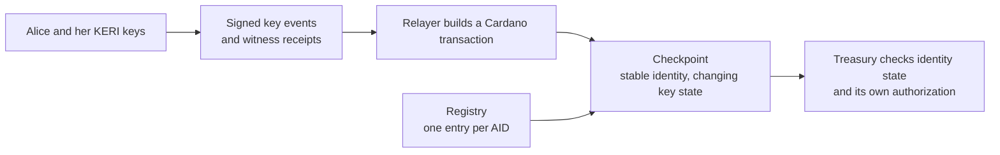

# Follow one identity

Alice wants a treasury to recognize her identity after she replaces her keys.
Her KERI **AID** (Autonomic Identifier) stays the same; her signed **key event
log** records which keys may act for it. Cardano holds a **checkpoint** of that
key state. The treasury reads the checkpoint when deciding whether to accept
Alice's authorization.

This chapter follows that one identity through four runnable examples. Each
introduces a problem, shows what changes, then explains the boundary responsible
for the result.

!!! info "What you are playing"
    These are simulations of the **accepted M1 design**, not commands against
    the deployed V1 contracts. The checkpoint model represents evidence as facts;
    it does not check real signatures, CESR encodings or witness receipts. The
    registry model abstracts requests, folds and uniqueness; it does not execute
    an MPFS proof or a Cardano transaction. See the
    [architecture overview](overview.md) for the explicit V1/M1 distinction and
    the [deployment guide](../user/m1-preprod-deployment.md) for deployed behavior.

## The parts Alice depends on



KERI supplies the evidence; a relayer carries it to Cardano. The checkpoint
validator and reference observers enforce the transaction rules. An off-chain
follower helps locate the current output. The treasury's validator checks that
output and its own authorization rule; finding an output through an indexer does
not make it authoritative.

The two simulators give separate views of this architecture. The checkpoint
simulator focuses on one identity's lifecycle and money. The registry simulator
focuses on the shared registration boundary. Loading one does not transfer state
to the other.

## How to play an example

1. Copy the **whole code block** using its copy button, or open its `.dsl` link.
2. Open the simulator linked immediately above that block.
3. Paste into the text area next to **Load DSL**, then select **Load DSL**.
4. Use **›** to step forward, or **▶** to play. Playback pauses at the main
   result; press it again for the remaining steps. Select a **⋔** branch chip
   to try an alternative; compare the results with
   **What to observe** below the block.

Every block includes its own setup. Loading it starts a fresh story: no previous
example, manual evidence or edited parameter is needed. The download and displayed
block come from the same file. `expect` fields describe results checked by the
documentation build; they do not grant permission to an action.

The checkpoint examples use model units: `D = 1000` is the registration bond,
`B = 5` the conviction bond, `P = 2` the relayer premium and `W = 10` the
juvenility window in slots. Addresses `1` and `2` stand for Alice and Hal. These
small integers are simulator values, not real addresses or deployment settings.

## 1. Alice registers: existence comes before trust

The treasury cannot use an absent identity. Registration creates its checkpoint
with both bonds and a pool for relayer payments. A new checkpoint then waits out
the juvenility window before a consumer can accept it.

[Open the checkpoint simulator](../simulator/index.html) ·
[Open register.dsl](scenarios/register.dsl)

```text
--8<-- "docs/architecture/scenarios/register.dsl"
```

**What to observe:** before registration the verdict is `not-present`.
Registration at slot 0 locks the two bonds and pool 10, with Alice at refund
address 1. The verdict remains `juvenile` at slot 9 and becomes `consumable` at
slot 10. The alternative **Registering the same AID again** refuses the action
with `already-present` and preserves the existing checkpoint.

Existence and consumability answer different questions. A juvenile checkpoint
exists and can participate in lifecycle operations; the waiting window gates
consumer use. For the transaction structure behind registration, continue to
[Identity Operations](identity-ops.md).

## 2. Alice rotates: evidence must reach Cardano

Alice replaces her keys without changing her AID. Witnessed rotation evidence
alone does not advance the Cardano checkpoint: Hal must submit the corresponding
transaction. His payment comes from the separate pool.

[Open the checkpoint simulator](../simulator/index.html) ·
[Open rotate.dsl](scenarios/rotate.dsl)

```text
--8<-- "docs/architecture/scenarios/rotate.dsl"
```

**What to observe:** the evidence step at slot 12 leaves the checkpoint at
sequence 0. Hal's `rotate` advances sequence and epoch to 1, keeps Alice's refund
address, reduces the pool from 10 to 8 and pays 2 to Hal at address 2. The
checkpoint remains `consumable`: this rotation does not restart juvenility.
The alternative **Hal tries to land the same rotation again** refuses with
`no-witnessed-rotation`. The old evidence names epoch 0 and sequence 0; it cannot
be reused against epoch 1.

`rotationTo: [0, 0, 1]` is an assumed verified fact in this model. In the
implementation, parsing, signatures, next-key commitments and witness thresholds
need their real checks. This is the boundary explained by
[reference observers](observer-architecture.md). The simulation demonstrates the
state transition and payment, not cryptographic verification.

## 3. The treasury reads: current keys can become unusable

The treasury must check the checkpoint at each use. A key that was acceptable
yesterday may belong to a poisoned epoch today. Alice can use the current key
quorum to declare that epoch untrustworthy; once that declaration lands, waiting
does not repair it.

[Open the checkpoint simulator](../simulator/index.html) ·
[Open consume.dsl](scenarios/consume.dsl)

```text
--8<-- "docs/architecture/scenarios/consume.dsl"
```

**What to observe:** this example registers and rotates Alice from scratch. At
slot 13 the treasury sees `consumable`. At slot 14 a current-epoch quorum fact
allows poison to land; the verdict becomes `poisoned`. At slot 24 it is still
`poisoned`, even though the original waiting window has long elapsed. The pool
stays at 8. Neither time nor the consumer's previous decision clears poison.

`consumable` means eligible under the model's checkpoint rules. It does **not**
mean the treasury has verified a spending signature or authorized a payment.
The application must also validate the checkpoint's identity, token, script and
datum, then apply its own authorization rule. The
[consumer checklist](../user/consumer-checklist.md) explains those responsibilities;
[Value Authorization](value-auth.md) expands the model's refusal conditions.

## 4. The registry refuses a duplicate: follow the money

Now look at Alice through the registry simulator. Here AID `11` is Alice's
abstract identifier. A contributed request is pending work; only a successful
fold updates the registry. Mallory can pay to submit a duplicate request, but
cannot turn it into a second registered identity.

[Open the registry simulator](../simulator/registry/index.html) ·
[Open duplicate.dsl](scenarios/duplicate.dsl)

```text
--8<-- "docs/architecture/scenarios/duplicate.dsl"
```

**What to observe:** Alice contributes 1002: bond 1000 plus tip 2. Hal processes
her request, locking 1000 and receiving the tip. Mallory then contributes the
same amount for AID 11. Processing her request refuses with `already-registered`.
At slot 25 Sam rejects that pending request: 1000 returns to Mallory at address
4, and tip 2 goes to Sam at address 6. The final state has one leaf, one
checkpoint and no pending requests.

Try **Sam rejects Mallory's request in phase 1**. At slot 6 it refuses with
`not-rejectable`; the pending request remains. Refusing a duplicate registration
does not make early rejection legal. This example supplies its own registry
parameters and actor map: Hal is address 3 here, and the registry's `W = 5`
serves its own model rather than importing the checkpoint example's settings.

The uniqueness boundary belongs to the registry. The checkpoint can then evolve
without storing all identities in its datum. See
[The Registry as an MPFS Instance](../design/registry-as-mpfs.md) for the
request/fold architecture and proof boundary.

## From the model to a running system

The examples establish modeled lifecycle outcomes. They do not test transaction
submission, rollback recovery, witness availability or deployment configuration.
Use these references when crossing those boundaries:

| Question | Next page |
|---|---|
| Which behavior is deployed V1, and which belongs to M1? | [Architecture overview](overview.md) |
| Which validator or observer owns each transaction check? | [Identity Operations](identity-ops.md) and [Observer Architecture](observer-architecture.md) |
| How does a service find and follow checkpoint outputs? | [The follower](../user/follower.md) |
| What must the consuming application verify? | [Consumer checklist](../user/consumer-checklist.md) |
| How do requests become unique registry entries? | [The Registry as an MPFS Instance](../design/registry-as-mpfs.md) |

To check the examples locally, run `node scripts/check-architecture-scenarios.mjs
--selftest`, build the docs, then run `node scripts/check-architecture-scenarios.mjs
--site site`. CI replays every source and checks the actual rendered code blocks
and published downloads against it.
