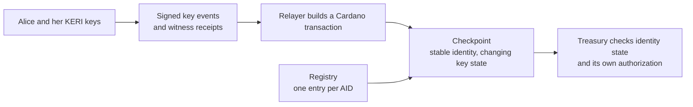

# Follow one identity

Alice wants a treasury to recognize her identity after she replaces her keys.
Her KERI **AID** (Autonomic Identifier) stays the same; her signed **key event
log** records which keys may act for it. Cardano holds a **checkpoint** of that
key state. The treasury reads the checkpoint when deciding whether to accept
Alice's authorization.

This chapter follows that one identity through four runnable examples. Each
starts with a guarantee, states its conditions, then shows the successful and
refused outcomes. The implementation responsibilities and evidence limits sit
beside the claim they qualify.

!!! info "What you are playing"
    These are simulations of the **accepted M1 design**, not commands against
    the deployed V1 contracts. The checkpoint model represents evidence as facts;
    it does not check real signatures, CESR encodings or witness receipts. The
    registry model abstracts requests, folds and uniqueness; it does not execute
    an MPFS proof or a Cardano transaction. See the
    [architecture overview](overview.md) for the explicit V1/M1 distinction and
    the [deployment guide](../user/m1-preprod-deployment.md) for deployed behavior.

## The parts Alice depends on



KERI supplies the evidence; a relayer carries it to Cardano. The checkpoint
validator and reference observers enforce the transaction rules. An off-chain
follower helps locate the current output. The treasury's validator checks that
output and its own authorization rule; finding an output through an indexer does
not make it authoritative.

The two simulators give separate views of this architecture. The checkpoint
simulator focuses on one identity's lifecycle and money. The registry simulator
focuses on the shared registration boundary. Loading one does not transfer state
to the other.

## What registration guarantees

**In the registry model, a successful first registration creates one registry
entry and its matching checkpoint together. A second registration of the same
AID is refused.** This guarantee depends on valid inception evidence, an absent
registry key and a successful fold. Merely submitting a request establishes none
of those outcomes.

| Moment | What is established | What is still absent |
|---|---|---|
| Alice fixes her KERI inception | The inception determines the AID. Witness receipts concern this event. | A registry entry and checkpoint NFT need not exist. |
| Someone contributes a registration request | The inbox holds a pending request and its funding. | Submission alone creates no checkpoint NFT or active leaf. |
| A fold successfully processes that request | The model admits the inception, requires no existing leaf, inserts `AID → active token`, creates the matching checkpoint and locks the bond. | There is no separately successful insertion if the coupled registration fails. |

The [duplicate-registration example](#4-the-registry-refuses-a-duplicate-follow-the-money)
exposes both sides: Alice's fold creates the checkpoint; Mallory can submit a
request but cannot process a second registration. The checkpoint example below
abstracts that entire registration boundary into one `register` step.

### What must enforce the guarantee on Cardano?

The intended implementation must couple the **MPFS Add/Insert and checkpoint
NFT mint in the same fold transaction**. Validators check that transaction;
the plugin does not mint an NFT through a later side effect.

| Responsibility | Required check |
|---|---|
| MPFS insertion | The AID key is absent and the insertion produces the correct registry root. Generic MPFS does not interpret KERI inception evidence. |
| KERI admission and checkpoint validation | The inception evidence authorizes the projected key state, and the inserted leaf identifies the matching checkpoint output and its required value. |
| Mint authorization | The quantity-one checkpoint mint is bound to that same admitted registration and inserted leaf; minting cannot bypass that registration boundary. |

These are **required implementation obligations**. The registry's
`processBody` models their combined result; its `Env.inception` predicate
assumes the cryptographic answer. It does not specify the exact division of
checks between the KERI plugin, checkpoint minting policy and registration
observers. The concrete script interfaces and asset-name encoding must be
verified separately before this becomes an implementation guarantee.

The existing V1 registration path has an earlier **BLAKE3 proof token** that
certifies an inception-to-AID hash relationship. That token is distinct from the
checkpoint NFT and grants no identity authority. KERI witnesses receipt the
inception event, not the Cardano NFT. See
[Identity Operations](identity-ops.md#register) for the V1 transaction path.

### Proposed: attest inception before requesting registration

**The attestation says: “This hash identifies a valid KERI inception.” It
does not say: “This AID has never been registered.”** Multiple attestations
of the same inception are allowed. The registry supplies uniqueness when it
admits registration and creates the checkpoint.

This is the proposed evidence boundary for M1; it is not yet implemented or
represented as a separate action in the simulators.

| Stage | Guarantee | What it does not establish |
|---|---|---|
| Earlier attestation transaction | Under the designated attestation policy, this AID hashes a valid inception with authenticated initial key state. Issuing another attestation for the same inception is allowed. | Registry absence, a checkpoint, or current authority after subsequent rotations. |
| Registration request | Carries the AID, compact authenticated evidence and funding needed for later processing. | Successful admission or a reservation of the AID. |
| Successful registration fold | Verifies the attestation and its binding to the initial checkpoint state, proves registry absence, and atomically inserts the leaf and mints the checkpoint. | Permission to register again using another copy of the attestation. |

To remove the full inception from the request and fold, the earlier validation
must establish the required inception admission checks, including signatures
and witness receipts. The attestation must authenticate both the **AID and the
initial key-state projection**, under a pinned validation policy. Otherwise a
request could pair a valid inception hash with unrelated checkpoint keys.
An unauthenticated datum placed beside an attestation token is not enough.
Registration-time fields such as the refund address, birth slot and bonds are
still checked at the fold.

The existing V1 BLAKE3 proof token supplies only the hash relationship; it does
not by itself certify inception admission. Extending that boundary requires a
concrete attestation format and validation rules. Whether a fold references or
consumes the attestation is still to be specified; **single-use attestation is
not the source of checkpoint uniqueness**. Even with two valid attestations and
two pending requests, only the first successful registration can satisfy the
registry absence check.

The [duplicate scenario](#4-the-registry-refuses-a-duplicate-follow-the-money)
already demonstrates that registration boundary using an assumed inception
fact. It does not execute the proposed attestation validation. Moving this work
earlier can keep the raw inception out of the shared fold, but transaction size
and execution-budget feasibility still need measurement.

### What does `active token` promise?

The registry stores an AID's lifecycle and indirection:

| Registry-model leaf | Meaning |
|---|---|
| `active token` | Identifies the checkpoint incarnation. Consumers resolve and validate the checkpoint output; the leaf does not certify consumability. |
| `dormant k` | Preserves the key state from which a witnessed revival must rotate. The checkpoint model represents its parked state with a hash. |
| `convicted` | Permanent terminal marker. The identity cannot register or revive. |

A never-registered AID has no leaf. Live, poisoned and frozen are checkpoint
conditions, not additional registry leaf variants. In the registry model's
reap/fold handoff, an active leaf can temporarily have a pending go-request
instead of a checkpoint; the leaf alone never authorizes consumer use.

The registry simulator's `token` and `k` are abstract integers. It allocates
`nextToken` during registration, and a fresh one during permitted revival;
those integers do not define serialized Cardano asset names. A concrete asset
is identified by **policy ID plus asset name**. Knowing an AID-derived name
before Cardano registration does not establish that its mint is unique.

The bounded guarantee is **no second first-registration and at most one
checkpoint per AID in the registry model**, with revival as a separate guarded
operation. It is not a proof that concrete token bytes are minted only once
across every future revival. See the
[registry model reference](../design/registry-as-mpfs.md#the-machine-registrylean).

## How to play an example

1. Expand **Show … .dsl — copy and play**, then copy the **whole code block**
   using its copy button. You can also open its `.dsl` link.
2. Open the simulator linked immediately above that block.
3. Paste into the text area next to **Load DSL**, then select **Load DSL**.
4. Use **›** to step forward, or **▶** to play. Playback pauses at the main
   result; press it again for the remaining steps. Select a **⋔** branch chip
   to try an alternative; compare the results with
   **What to observe** below the block.

Every block includes its own setup. Loading it starts a fresh story: no previous
example, manual evidence or edited parameter is needed. The download and displayed
block come from the same file. `expect` fields describe results checked by the
documentation build; they do not grant permission to an action.

The checkpoint examples use model units: `D = 1000` is the conviction bond
(stake against duplicity), `B = 5` the freeze bond, `P = 2` the relayer premium
and `W = 10` the juvenility window in slots. Addresses `1` and `2` stand for Alice and Hal. These
small integers are simulator values, not real addresses or deployment settings.

## 1. Alice registers: existence comes before trust

The treasury cannot use an absent identity. Registration creates its checkpoint
with both bonds and a pool for relayer payments. A new checkpoint then waits out
the juvenility window before a consumer can accept it.

**Guarantee and conditions:** in this model, the consumer refuses a fresh
registration until its age reaches `W`, even when both bonds are full and the
checkpoint is neither frozen nor poisoned. Registration itself remains allowed.

[Open the checkpoint simulator](../simulator/index.html) ·
[Open register.dsl](scenarios/register.dsl)

??? example "Show register.dsl — copy and play"

    ```text
    --8<-- "docs/architecture/scenarios/register.dsl"
    ```

**What to observe:** before registration the verdict is `not-present`.
Registration at slot 0 locks the two bonds and pool 10, with Alice at refund
address 1. The verdict remains `juvenile` at slot 9 and becomes `consumable` at
slot 10. The alternative **Registering the same AID again** refuses the action
with `already-present` and preserves the existing checkpoint.

Existence and consumability answer different questions. A juvenile checkpoint
exists and can participate in lifecycle operations; the waiting window gates
consumer use. For the transaction structure behind registration, continue to
[Identity Operations](identity-ops.md).

## 2. Alice rotates: evidence must reach Cardano

Alice replaces her keys without changing her AID. Witnessed rotation evidence
alone does not advance the Cardano checkpoint: Hal must submit the corresponding
transaction. His payment comes from the separate pool.

**Guarantee and conditions:** with matching witnessed rotation evidence and
enough pool to pay `P`, an accepted `keep` rotation advances the checkpoint and
pays the named relayer. Replaying the old evidence against the new epoch is
refused. Real witness and signature verification is assumed by this simulation.

[Open the checkpoint simulator](../simulator/index.html) ·
[Open rotate.dsl](scenarios/rotate.dsl)

??? example "Show rotate.dsl — copy and play"

    ```text
    --8<-- "docs/architecture/scenarios/rotate.dsl"
    ```

**What to observe:** the evidence step at slot 12 leaves the checkpoint at
sequence 0. Hal's `rotate` advances sequence and epoch to 1, keeps Alice's refund
address, reduces the pool from 10 to 8 and pays 2 to Hal at address 2. The
checkpoint remains `consumable`: this rotation does not restart juvenility.
The alternative **Hal tries to land the same rotation again** refuses with
`no-witnessed-rotation`. The old evidence names epoch 0 and sequence 0; it cannot
be reused against epoch 1.

`rotationTo: [0, 0, 1]` is an assumed verified fact in this model. In the
implementation, parsing, signatures, next-key commitments and witness thresholds
need their real checks. This is the boundary explained by
[reference observers](observer-architecture.md). The simulation demonstrates the
state transition and payment, not cryptographic verification.

## 3. The treasury reads: current keys can become unusable

The treasury must check the checkpoint at each use. A key that was acceptable
yesterday may belong to a poisoned epoch today. Alice can use the current key
quorum to declare that epoch untrustworthy; once that declaration lands, waiting
does not repair it.

**Guarantee and conditions:** once a current-quorum poison declaration lands,
the model's consumer predicate refuses that epoch. Advancing time does not clear
poison. This guarantee covers checkpoint eligibility, not the treasury's own
signature verification or payment authorization.

[Open the checkpoint simulator](../simulator/index.html) ·
[Open consume.dsl](scenarios/consume.dsl)

??? example "Show consume.dsl — copy and play"

    ```text
    --8<-- "docs/architecture/scenarios/consume.dsl"
    ```

**What to observe:** this example registers and rotates Alice from scratch. At
slot 13 the treasury sees `consumable`. At slot 14 a current-epoch quorum fact
allows poison to land; the verdict becomes `poisoned`. At slot 24 it is still
`poisoned`, even though the original waiting window has long elapsed. The pool
stays at 8. Neither time nor the consumer's previous decision clears poison.

`consumable` means eligible under the model's checkpoint rules. It does **not**
mean the treasury has verified a spending signature or authorized a payment.
The application must also validate the checkpoint's identity, token, script and
datum, then apply its own authorization rule. The
[consumer checklist](../user/consumer-checklist.md) explains those responsibilities;
[Value Authorization](value-auth.md) expands the model's refusal conditions.

## 4. The registry refuses a duplicate: follow the money

Now look at Alice through the registry simulator. Here AID `11` is Alice's
abstract identifier. A contributed request is pending work; only a successful
fold updates the registry. Mallory can pay to submit a duplicate request, but
cannot turn it into a second registered identity.

**Guarantee and conditions:** processing a registration requires an absent AID
leaf. With Alice already registered, a duplicate request cannot create another
checkpoint. Refunding that pending request is a separate operation with its own
rejection-window condition.

[Open the registry simulator](../simulator/registry/index.html) ·
[Open duplicate.dsl](scenarios/duplicate.dsl)

??? example "Show duplicate.dsl — copy and play"

    ```text
    --8<-- "docs/architecture/scenarios/duplicate.dsl"
    ```

**What to observe:** Alice contributes 1002: bond 1000 plus tip 2. Hal processes
her request, locking 1000 and receiving the tip. Mallory then contributes the
same amount for AID 11. Processing her request refuses with `already-registered`.
At slot 25 Sam rejects that pending request: 1000 returns to Mallory at address
4, and tip 2 goes to Sam at address 6. The final state has one leaf, one
checkpoint and no pending requests.

Try **Sam rejects Mallory's request in phase 1**. At slot 6 it refuses with
`not-rejectable`; the pending request remains. Refusing a duplicate registration
does not make early rejection legal. This example supplies its own registry
parameters and actor map: Hal is address 3 here, and the registry's `W = 5`
serves its own model rather than importing the checkpoint example's settings.

The uniqueness boundary belongs to the registry. The checkpoint can then evolve
without storing all identities in its datum. See
[The Registry as an MPFS Instance](../design/registry-as-mpfs.md) for the
request/fold architecture and proof boundary.

## From the model to a running system

The examples establish modeled lifecycle outcomes. They do not test transaction
submission, rollback recovery, witness availability or deployment configuration.
Use these references when crossing those boundaries:

| Question | Next page |
|---|---|
| Which behavior is deployed V1, and which belongs to M1? | [Architecture overview](overview.md) |
| Which validator or observer owns each transaction check? | [Identity Operations](identity-ops.md) and [Observer Architecture](observer-architecture.md) |
| How does a service find and follow checkpoint outputs? | [The follower](../user/follower.md) |
| What must the consuming application verify? | [Consumer checklist](../user/consumer-checklist.md) |
| How do requests become unique registry entries? | [The Registry as an MPFS Instance](../design/registry-as-mpfs.md) |

To check the examples locally, run `node scripts/check-architecture-scenarios.mjs
--selftest`, build the docs, then run `node scripts/check-architecture-scenarios.mjs
--site site`. CI replays every source and checks the actual rendered code blocks
and published downloads against it.
