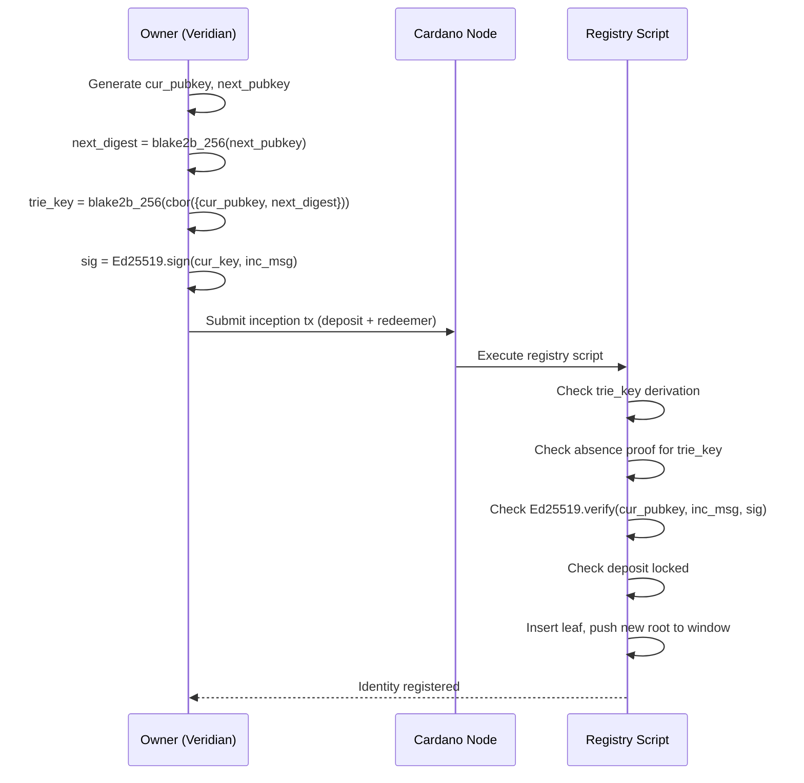
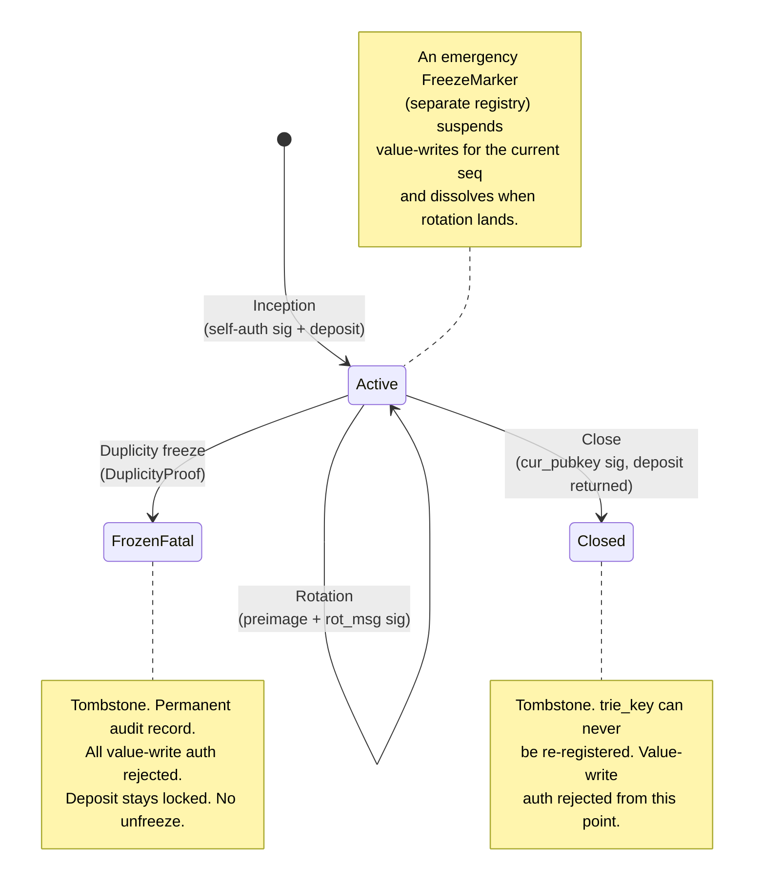

# Identity Operations

!!! warning "Written against the Cardano-native key-state model (superseded 2026-07-09)"
    The operations below use the self-certifying `trie_key` inception and a
    Cardano-native rotation redeemer — the original #24 shape. Per
    `specs/68-keystate-shape/identity-model.md` (PR #87): the leaf is now keyed by
    `cesr_aid`; **rotation is driven by a witnessed anchoring seal** from the
    controller's KEL (the reveal / `next_digest` / threshold-sig / `seq+1` mechanics
    below survive as the induction step, plus Ed25519 witness-receipt verification and
    the §6a two-seal handoff for witness changes); and **inception (genesis) is
    registration-attested, not yet self-certifying** (§7a — the lane-packed spike #88
    core now fits the whole single-chunk domain, 54.3% cpu / 71.7% mem at the full
    1024-byte chunk, but the full single-transaction registration path has not been
    measured).
    The operation taxonomy and the freeze paths remain current.

There are five operations on the identity plane: inception, rotation, close,
duplicity freeze, and emergency freeze. All except inception are authorized by
cryptographic material alone (signatures, preimages, receipts, proofs), never
by an operator key; inception's AID binding is registration-attested (see the
banner above). Value-write authorization is covered in
[Value Authorization](value-auth.md).

All signed messages are canonical CBOR with domain separation — see
[AID Model](../design/aid-model.md#cbor-determinism).

## Inception

Registers a new identity. Anyone can incept by posting the ADA deposit and
proving possession of the current key.

The registrant derives:

```
trie_key = blake2b_256(cbor({cur_pubkey, next_digest}))
```

**Inception message — signed by the registrant, verified on-chain:**

```
inc_msg = cbor({
  domain               : "cardano-keri/inception/v1",
  network_id           : NetworkId,
  registry_policy_id   : PolicyId,
  registry_thread_token: AssetName,
  trie_key             : ByteArray[32],
  cur_pubkey           : ByteArray[32],
  next_digest          : ByteArray[32],
  cesr_aid             : ByteArray[32],   -- signed to prevent front-run metadata poisoning
  identity_root        : ByteArray[32]
})
```

Binding the registry identity (`registry_policy_id` + thread token) scopes the
authorization to this specific registry; binding `cesr_aid` inside the signed
message prevents an adversary from copying in-flight inception material and
substituting their own CESR AID (see
[AID Model — inception security](../design/aid-model.md#inception-security-two-attacks-different-fixes)).

**On-chain checks:**

1. `trie_key == blake2b_256(cbor({cur_pubkey, next_digest}))`
2. Absence proof: `trie_key` not in trie (any leaf — including `Closed` and
   `FrozenFatal` tombstones — blocks re-registration)
3. `Ed25519.verify(cur_pubkey, inc_msg, sig)`
4. ADA value locked `>= deposit_amount`, recorded in `KeyState.deposit`
5. New root pushed onto the sliding window (oldest dropped if over depth)

**Resulting leaf:**

```
trie_key → IdentityLeaf {
  key_state: KeyState {
    cur_pubkey  = cur_pubkey
    next_digest = next_digest
    seq         = 0
    cesr_aid    = cesr_aid    -- metadata only, never verified on-chain
    deposit     = deposit
  }
  status: Active
}
```



## Rotation

Advances the key-state by revealing the pre-committed next key and committing
to a new one. The `trie_key` never changes.

**Rotation message — this is the normative definition:**

```
rot_msg = cbor({
  domain               : "cardano-keri/rotation/v1",
  network_id           : NetworkId,
  registry_policy_id   : PolicyId,
  registry_thread_token: AssetName,
  trie_key             : ByteArray[32],
  reveal_key           : ByteArray[32],   -- the previously committed next key, now revealed
  new_next             : ByteArray[32],   -- blake2b_256(new next key)
  seq_to               : Int              -- must equal cur_state.seq + 1
})
```

**On-chain checks:**

1. Inclusion proof: `trie_key → leaf` where `leaf.status == Active`
2. `blake2b_256(reveal_key) == leaf.key_state.next_digest` — reveal binds to commitment
3. `seq_to == leaf.key_state.seq + 1` — monotonic
4. `Ed25519.verify(reveal_key, rot_msg, sig)` — possession of the next key,
   binding the **new** commitment

**Resulting leaf:**

```
trie_key → IdentityLeaf {
  key_state: KeyState {
    cur_pubkey  = reveal_key
    next_digest = new_next
    seq         = seq_to
    cesr_aid    = cur_state.cesr_aid   -- unchanged
    deposit     = cur_state.deposit    -- unchanged
  }
  status: Active
}
```

!!! danger "Why the preimage check alone is not authorization"
    `reveal_key` stops being secret the moment the owner rotates in KERI — it
    is published in the KEL. If the on-chain check were only
    `blake2b_256(reveal_key) == next_digest`, anyone reading the witness
    network could submit a Cardano rotation carrying the real `reveal_key`
    and an **attacker-chosen** `new_next`, capturing the identity at the next
    step. Check 4 closes this: the signature over `rot_msg` proves possession
    of the next *private* key and binds the new commitment the owner actually
    chose.

## Close

Retires the identity and returns the deposit. This is the owner's exit; no
operator exists who could offboard an identity or block the owner from
leaving.

**Close message:**

```
close_msg = cbor({
  domain               : "cardano-keri/close/v1",
  network_id           : NetworkId,
  registry_policy_id   : PolicyId,
  registry_thread_token: AssetName,
  trie_key             : ByteArray[32],
  refund_address       : Address        -- where the deposit goes
})
```

Binding `refund_address` prevents whoever assembles the transaction from
redirecting the deposit.

**On-chain checks:**

1. Inclusion proof: `trie_key → leaf` where `leaf.status == Active`
2. `Ed25519.verify(leaf.key_state.cur_pubkey, close_msg, sig)`
3. Deposit paid to `refund_address`
4. Leaf status updated to `Closed`, new root pushed to window

**Tombstone semantics.** The leaf is **not removed** — it remains in the trie
with status `Closed` forever. Consequences:

- The `trie_key` can never be re-registered (the inception absence proof
  fails against a tombstone), so "a `trie_key` is registered at most once"
  holds over the registry's whole lifetime.
- A `close_msg` is inherently single-use: it verifies only against an
  `Active` leaf, so no nonce or counter is needed.
- Value cages reject `Closed` leaves (status check), so closing revokes
  value-write authority at the same instant.

## Duplicity freeze

Records a permanent duplicity proof in the trie leaf: the identity holder
published two conflicting KERI events at the same `seq` — a protocol
violation that cannot be retracted.

**DuplicityProof:**

```
DuplicityProof {
  event_1 : ByteArray    -- first conflicting rotation event bytes
  sig_1   : ByteArray    -- Ed25519 signature over event_1
  event_2 : ByteArray    -- second conflicting rotation event bytes
  sig_2   : ByteArray    -- Ed25519 signature over event_2
  seq     : Int          -- sequence number at which the fork occurred
}
```

**On-chain checks:**

1. Inclusion proof: `trie_key → leaf` where `leaf.status == Active`
2. `proof.seq == leaf.key_state.seq`
3. `Ed25519.verify(leaf.key_state.cur_pubkey, proof.event_1, proof.sig_1)`
4. `Ed25519.verify(leaf.key_state.cur_pubkey, proof.event_2, proof.sig_2)`
5. `proof.event_1 != proof.event_2`
6. Leaf updated to `FrozenFatal(proof)`, new root pushed to window

There is no unfreeze path for `FrozenFatal`. The duplicity proof is
permanently embedded in the trie and publicly inspectable. Value cages that
encounter a `FrozenFatal` leaf reject the authorization. The deposit stays
locked — a duplicitous identity does not get its bond back.

!!! note "Decision: submission is permissionless"
    The proof is self-authenticating (two verifying signatures by the
    identity's own current key over conflicting events), so nothing is
    gained by gating it, and no invalid freeze can pass. An earlier
    oracle-mediated draft required an operator key as DDoS protection; in
    the permissionless model, proof validity is the spam defense. Ratified
    2026-07-07; revisit only if fee-level griefing proves real in practice.

## Emergency freeze

The fast compromise-response channel, and the canonical definition of the
`FreezeMarker`. It lives in the **separate freeze registry** so a response to
key theft never queues behind inception/rotation traffic on the main
registry (see
[Veridian Bridge — synchronization lag](veridian-bridge.md#synchronization-lag)).

Scenario: `cur_key` is stolen. The thief can authorize value-writes until the
owner's rotation lands. The owner holds the *next* key — the thief does not
(pre-rotation) — so possession of the next key is what authorizes the freeze.

**FreezeMarker — stored in the freeze registry trie:**

```
FreezeMarker {
  trie_key        : ByteArray[32]
  seq             : Int             -- the key-state sequence being frozen
  cur_pubkey_hash : ByteArray[28]   -- blake2b_224 of the compromised current key
  next_digest     : ByteArray[32]   -- the commitment the freeze signature proved
}
```

**Freeze message:**

```
freeze_msg = cbor({
  domain             : "cardano-keri/freeze/v1",
  network_id         : NetworkId,
  freeze_policy_id   : PolicyId,
  freeze_thread_token: AssetName,
  trie_key           : ByteArray[32],
  seq                : Int
})
```

**On-chain checks (freeze registry script):**

1. Identity registry as CIP-31 reference input: inclusion proof
   `trie_key → leaf`, `leaf.status == Active`
2. `blake2b_256(reveal_key) == leaf.key_state.next_digest` — the signer holds
   the pre-committed next key
3. `Ed25519.verify(reveal_key, freeze_msg, sig)`
4. `marker.seq == leaf.key_state.seq`
5. Marker inserted at `trie_key`, new freeze root published

**Expiry is automatic.** The marker freezes one sequence number. Value cages
treat a marker as active only while `marker.seq == key_state.seq`; once the
owner's on-chain rotation lands (`seq` advances), the marker is spent
evidence, not a live freeze. No unfreeze transaction exists or is needed.

Value cages MUST check the freeze registry (absence of an active marker)
alongside the identity registry — see
[Value Authorization](value-auth.md) and the redeemer shape in
[Veridian Bridge](veridian-bridge.md#value-write-transaction).

## AID lifecycle


