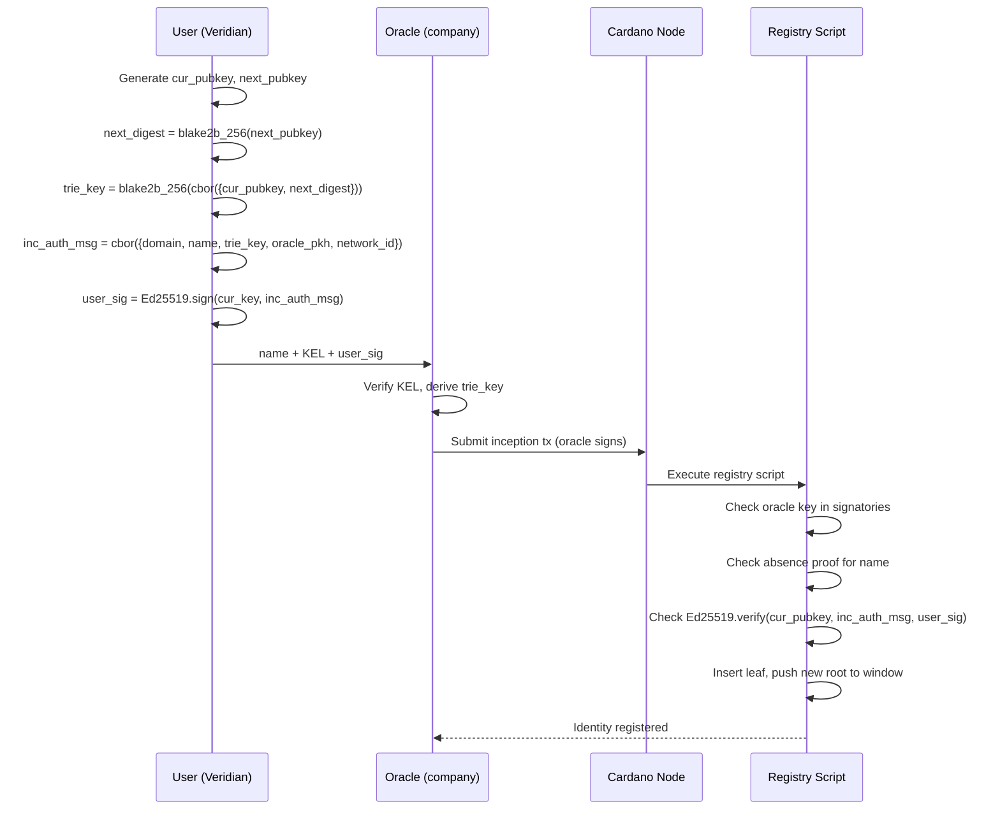
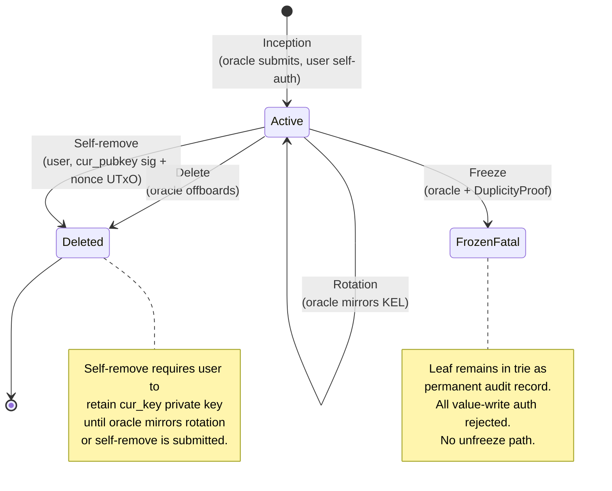

# Identity Operations

There are four operations on the identity registry: inception, rotation, delete, and freeze. All are submitted by the oracle (company). Value-write authorization is covered in [Value Authorization](value-auth.md).

## Inception

Registers a new identity. Requires off-chain coordination between the user and oracle; not permissionless.

**Off-chain handover:**

1. User provides the oracle with: desired `name`, KERI KEL, and a self-auth signature
2. Oracle verifies the KEL is valid, derives `trie_key` from the inception event:
   ```
   trie_key = blake2b_256(cbor({cur_pubkey, next_digest}))
   ```
3. Oracle submits the inception transaction

**Self-auth message — signed by user off-chain, verified on-chain:**

```
inc_auth_msg = cbor({
  domain     : "cardano-aid/inception/v1",
  name       : ByteArray,
  trie_key   : ByteArray[32],
  oracle_pkh : ByteArray[28],
  network_id : NetworkId
})
```

Binding `name` in the signed message prevents the oracle from registering the user under a different name. Binding `oracle_pkh` scopes the authorization to this specific registry.

**On-chain checks:**
1. Oracle key in `tx.signatories`
2. Absence proof: `name` not yet in trie
3. `Ed25519.verify(cur_pubkey, inc_auth_msg, user_sig)` — user consented to this registration
4. New root pushed onto sliding window (oldest dropped if over depth)

**Resulting leaf:**
```
name → IdentityLeaf {
  key_state: KeyState {
    cur_pubkey  = cur_pubkey
    next_digest = next_digest
    seq         = 0
    cesr_aid    = cesr_aid    -- metadata only, not verified
  }
  status: Active
}
```



## Rotation

The oracle mirrors a KERI rotation event on-chain. Only the oracle can submit rotations; the user has no direct Cardano write access after inception.

**Trigger:** oracle's KERI watcher observes a rotation event in the user's KEL. The event reveals `next_key` (now public) and commits to a new `new_next_key`.

**On-chain checks:**
1. Oracle key in `tx.signatories`
2. Inclusion proof: `name → leaf` where `leaf.status == Active`
3. `blake2b_256(reveal_key) == leaf.key_state.next_digest` — reveal binds to commitment
4. `seq_to == leaf.key_state.seq + 1` — monotonic

**Resulting leaf:**
```
name → IdentityLeaf {
  key_state: KeyState {
    cur_pubkey  = reveal_key
    next_digest = new_next_digest
    seq         = cur_state.seq + 1
    cesr_aid    = cur_state.cesr_aid   -- unchanged
  }
  status: Active
}
```

The oracle cannot fabricate a rotation: without knowing the preimage of `next_digest`, the check `blake2b_256(reveal_key) == next_digest` cannot be satisfied.

## Delete

Removes the identity from the registry. Used for normal offboarding (employee leaves the company). No fraud proof required.

**On-chain checks:**
1. Oracle key in `tx.signatories`
2. Inclusion proof: `name → leaf`
3. `name` removed from trie, new root pushed to window

## Freeze

Records a permanent duplicity proof in the trie leaf. The oracle submits this when it observes the user publishing two conflicting KERI rotation events at the same `seq` — a protocol violation that cannot be retracted.

**DuplicityProof:**
```
DuplicityProof {
  event_1 : ByteArray    -- first conflicting rotation event bytes
  sig_1   : ByteArray    -- Ed25519 signature over event_1
  event_2 : ByteArray    -- second conflicting rotation event bytes
  sig_2   : ByteArray    -- Ed25519 signature over event_2
  seq     : Int          -- sequence number at which the fork occurred
}
```

**On-chain checks:**
1. Oracle key in `tx.signatories`
2. Inclusion proof: `name → leaf` where `leaf.status == Active`
3. `proof.seq == leaf.key_state.seq`
4. `Ed25519.verify(leaf.key_state.cur_pubkey, proof.event_1, proof.sig_1)`
5. `Ed25519.verify(leaf.key_state.cur_pubkey, proof.event_2, proof.sig_2)`
6. `proof.event_1 != proof.event_2`
7. Leaf updated to `FrozenFatal(proof)`, new root pushed to window

**Resulting leaf:**
```
name → IdentityLeaf {
  key_state: <unchanged>
  status: FrozenFatal { event_1, sig_1, event_2, sig_2, seq }
}
```

There is no unfreeze path for `FrozenFatal`. The duplicity proof is permanently embedded in the trie and publicly inspectable. Value cages that encounter a `FrozenFatal` leaf reject the authorization.

The oracle must hold the key (DDoS protection) but cannot freeze without a machine-verifiable proof. An oracle that refuses to freeze a provably malicious identity has verifiably misbehaved — the proof is public.

## Self-remove

The user can remove themselves from the registry without oracle cooperation. This is the escape hatch when the oracle refuses to mirror a KERI rotation — leaving a stale `cur_pubkey` active while the user's real key has moved on.

Self-removal is signed by the **on-chain `cur_pubkey`** — the key already in the trie leaf. The user must retain the private key for this until either the oracle mirrors their rotation or they have self-removed.

**Self-remove message:**

```
self_remove_msg = cbor({
  domain     : "cardano-aid/self-remove/v1",
  name       : ByteArray,
  oracle_pkh : ByteArray,
  network_id : NetworkId,
  nonce_utxo : TxOutRef    -- a UTxO consumed in this transaction
})
```

The `nonce_utxo` is a UTxO the user spends in the same transaction. Since a UTxO can only be spent once, the signed message is inherently single-use — no counter or validity window needed.

**On-chain checks — no oracle key required:**
1. Inclusion proof: `name → leaf`
2. `nonce_utxo ∈ tx.inputs`
3. `Ed25519.verify(leaf.key_state.cur_pubkey, self_remove_msg, sig)`
4. `name` removed from trie, new root pushed to window

**Trust balance:**
- Oracle controls entry — inclusion, name binding, rotation mirroring
- User controls exit — self-removal via on-chain `cur_pubkey`, oracle cannot block

Using `cur_pubkey` (not `next_key`) is deliberate: after a KERI rotation the old `next_key` is public in the KEL, making a `next_key`-based self-removal griefable by anyone who reads the witness network.

## AID lifecycle


