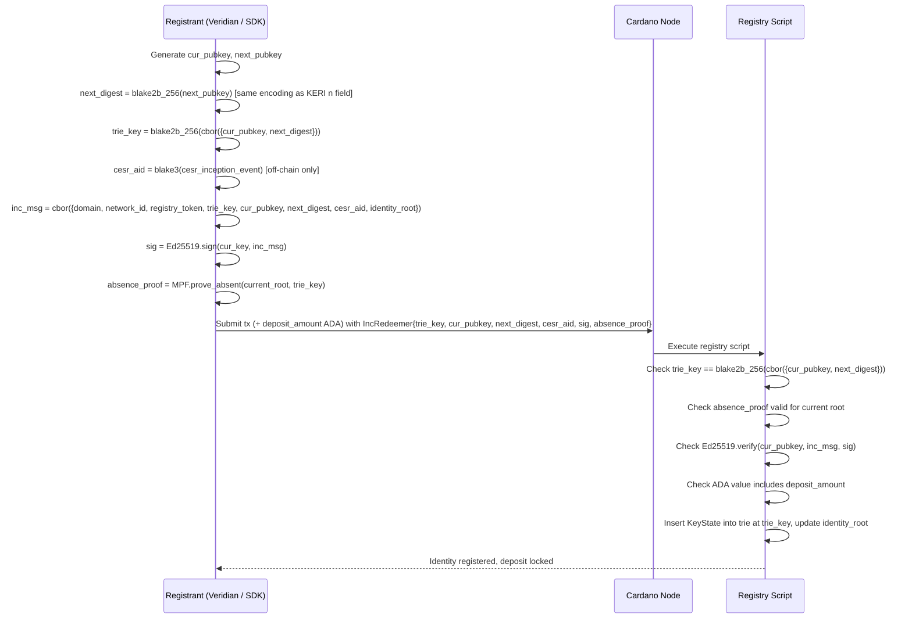
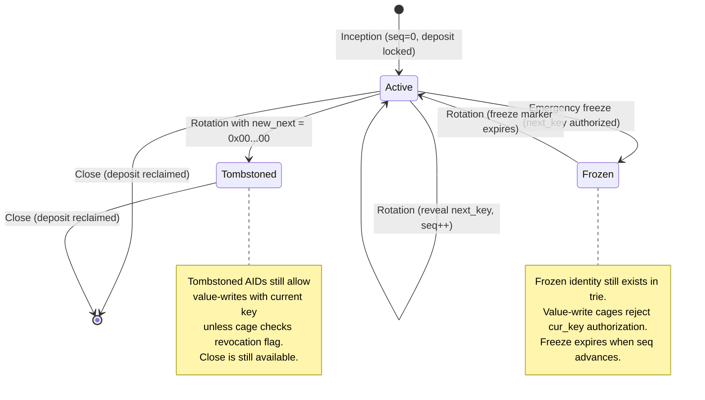

# Identity Operations

There are five operations on the identity registry: inception, rotation, close (deposit reclaim), emergency freeze, and (indirectly) value-write authorization. This page covers the first four. Value-write is covered in [Value Authorization](value-auth.md).

## Inception

Registers a new identity. Permissionless — the inception material itself proves the right to register. Requires an ADA deposit (see [Operational Constraints — ADA inception deposit](../design/operational.md#ada-inception-deposit)).

The first step is to compute the `trie_key` — the on-chain MPF key, derived from inception material using a Cardano-verifiable hash:

```
trie_key = blake2b_256(cbor({cur_pubkey, next_digest}))
```

This is NOT the CESR AID. The CESR AID (`blake3(cesr_inception_event)`) cannot be verified on-chain (Cardano has no [Blake3](https://github.com/BLAKE3-team/BLAKE3) builtin) and its use as the trie key enables a front-run attack. See [AID Model](../design/aid-model.md) for a full analysis.

**Inception message — must cover all inception claims:**

```
inc_msg = cbor({
  domain               : "cardano-aid/inception/v1",
  network_id           : NetworkId,
  registry_policy_id   : PolicyId,
  registry_thread_token: AssetName,
  trie_key             : ByteArray[32],
  cur_pubkey           : ByteArray[32],
  next_digest          : ByteArray[32],
  cesr_aid             : ByteArray[32],    -- must be inside the signed message
  identity_root        : ByteArray[32]     -- absence proof anchor
})
```

**Why `cesr_aid` must be in `inc_msg`:** an adversary can copy the victim's in-flight inception material (`cur_pubkey`, `next_digest`, `trie_key`) and submit first with an attacker-chosen `cesr_aid`. If `cesr_aid` is not signed, the attacker's inception passes all on-chain checks. Including `cesr_aid` in the signed message means the attacker cannot produce a valid signature for the victim's `trie_key` with a different CESR prefix — they would need the victim's private key.

**Inputs:**
- `cur_pubkey` — [Ed25519](https://www.rfc-editor.org/rfc/rfc8032) public key (raw 32 bytes)
- `next_digest = blake2b_256(next_pubkey)` — pre-rotation commitment (Veridian MUST use blake2b_256 digest agility to make binding verifiable at seq 0; see [Seq-0 binding gap](../design/aid-model.md#seq-0-binding-gap))
- `cesr_aid` — decoded CESR AID (32 bytes), stored as metadata only
- `deposit_amount` — minimum ADA deposit (protocol-defined)
- MPF absence proof (`trie_key` not yet in trie)
- Signature over `inc_msg` with `cur_pubkey`

**On-chain checks:**
1. `trie_key == blake2b_256(cbor({cur_pubkey, next_digest}))` — Cardano-verifiable derivation
2. MPF absence proof validates against current identity root
3. `Ed25519.verify(cur_pubkey, inc_msg, sig)` — possession of cur_pubkey
4. ADA value includes `deposit_amount` (enforced by script)

**Redeemer:**
```
Inception {
  trie_key      : ByteArray[32]
  cur_pubkey    : ByteArray[32]
  next_digest   : ByteArray[32]
  cesr_aid      : ByteArray[32]  -- stored as metadata; also inside inc_msg
  sig           : ByteArray[64]  -- Ed25519(cur_pubkey, inc_msg)
  absence_proof                  -- MPF proof trie_key not in trie
}
```

**Resulting KeyState:**
```
{ cur_pubkey  = cur_pubkey
, next_digest = next_digest
, seq         = 0
, cesr_aid    = cesr_aid
, deposit     = deposit_amount
}
```



## Rotation

Reveals the pre-committed next key and simultaneously commits to a new next key. The `trie_key` is unchanged by rotation — it is derived from inception material only and is stable for the lifetime of the identity.

**Inputs:**
- `reveal_key` — the actual next key (whose hash is stored in `cur_state.next_digest`)
- `new_next` — `blake2b_256(new_key)` for the key to use after the *next* rotation
- `rot_msg` — fully-bound rotation message
- MPF inclusion proof (`trie_key` currently in trie with expected KeyState)

**On-chain checks:**
1. `blake2b_256(reveal_key) == cur_state.next_digest` — reveal binds to commitment
2. `Ed25519.verify(reveal_key, rot_msg, sig)` — possession of reveal_key
3. MPF inclusion proof validates against current identity root
4. `seq_to == cur_state.seq + 1` — monotonic

**Rotation message binding:**
```
rot_msg = cbor({
  domain               : "cardano-aid/rotation/v1",
  network_id           : NetworkId,
  registry_policy_id   : PolicyId,
  registry_thread_token: AssetName,
  trie_key             : ByteArray[32],
  seq_to               : Int,
  cur_digest           : blake2b_256(reveal_key),
  old_next_digest      : cur_state.next_digest,
  new_next             : new_next_digest,
  input_identity_root  : ByteArray[32]
})
```

**Resulting KeyState:**
```
{ cur_pubkey  = reveal_key
, next_digest = new_next
, seq         = cur_state.seq + 1
, cesr_aid    = cur_state.cesr_aid   -- unchanged
, deposit     = cur_state.deposit    -- unchanged, set at inception and immutable
}
```

## Close (deposit reclaim)

Removes the identity from the registry trie and returns the ADA deposit to the owner. The identity ceases to exist on-chain after this operation.

**Authorization:** current `cur_pubkey` signature. Unlike the freeze operation, close is authorized by `cur_key` — it is an administrative operation by the current key holder, not an emergency.

**Inputs:**
- `trie_key` — identity to close
- `close_msg` — domain-separated, bound to registry and trie_key
- MPF inclusion proof (`trie_key` currently in trie)

**On-chain checks:**
1. MPF inclusion proof validates against current identity root
2. `Ed25519.verify(cur_pubkey, close_msg, sig)` — possession of cur_key
3. `trie_key` removed from trie, identity_root updated
4. `deposit_amount` ADA paid to `beneficiary_pkh`

Note: including `beneficiary_pkh` in `close_msg` prevents a mempool observer from copying the redeemer and redirecting the deposit to an attacker-controlled address.

**Close message:**
```
close_msg = cbor({
  domain               : "cardano-aid/close/v1",
  network_id           : NetworkId,
  registry_policy_id   : PolicyId,
  registry_thread_token: AssetName,
  trie_key             : ByteArray[32],
  seq                  : Int,              -- current seq (prevents stale close)
  beneficiary_pkh      : PubKeyHash,       -- deposit destination; bound in signature
  input_identity_root  : ByteArray[32]
})
```

## Emergency freeze

Revokes the current `cur_key`'s authorization for value-writes without consuming the main identity UTxO. Authorized by the pre-committed `next_key` — the key the thief cannot derive from `cur_key`.

The freeze operation is written to a **separate freeze registry UTxO** (distinct from the identity registry). See [Operational Constraints — Freeze registry](../design/operational.md#freeze-registry-emergency-revocation) for the full design and cage integration.

**Inputs:**
- `trie_key` — identity to freeze
- `reveal_key` — public key whose `blake2b_256` equals `KeyState.next_digest`
- `sig` — Ed25519(reveal_key, freeze_msg)
- Identity inclusion proof (from the main registry, via CIP-31 reference input)
- Freeze trie proof (absence or update, against freeze root)

**On-chain checks:**
1. Identity reference input yields `KeyState{cur_pubkey, next_digest, seq, cesr_aid}`.
2. `blake2b_256(reveal_key) == next_digest` — binds to the pre-committed key.
3. `Ed25519.verify(reveal_key, freeze_msg, sig)`.
4. Freeze root updated to record a `FreezeMarker`:

```
FreezeMarker {
  trie_key       : ByteArray[32]
  seq            : Int
  cur_pubkey_hash: ByteArray[32]  -- blake2b_256(cur_pubkey)
  next_digest    : ByteArray[32]  -- next_digest from KeyState at seq
}
```

Once the main registry rotation lands (`seq + 1`), the freeze marker no longer matches the current `KeyState.seq` and expires automatically. No unfreeze operation is required.

## AID lifecycle



A tombstone rotation sets `new_next` to the zero bytes, making the `blake2b_256(reveal_key) == next_digest` check impossible to satisfy for any future rotation (no key hashes to zero). However, the current `cur_pubkey` remains live for value-write authorization. A complete permanent-revocation mechanism requires an explicit revocation flag in KeyState — see [Operational Constraints — Revocation](../design/operational.md#revocation).
