# Lifecycle and the two bonds

One KERI identity is represented on Cardano by a **checkpoint UTxO** (unspent
transaction output). The UTxO carries one token derived from the KERI AID
(Autonomic Identifier), an inline datum with the current key state, and an ADA
escrow.

The lifecycle has four named states:

- **ACTIVE** — the checkpoint is usable as current Cardano authority.
- **ARMED** — a hunter has proved that the checkpoint is behind a witnessed
  KERI event. Consumers reject it while the owner has a response window.
- **FROZEN** — the response window expired and the hunter claimed the delay
  bond. Consumers continue to reject it, but a later genuine KERI event can
  still thaw it.
- **Convicted** — a fully witnessed irreconcilable conflict burned the
  checkpoint token. There is no surviving checkpoint state; the transaction is
  the terminal record.

Only ACTIVE is accepted by a consumer. The other addresses are a structural
fail-closed boundary: a consumer does not need to interpret a status flag in
the datum.

!!! info "Delivered subset"
    ACTIVE, ordinary ACTIVE-to-ACTIVE Advance, Freeze and response, FROZEN,
    thaw, and conviction are implemented for the small identity. ClaimFreeze
    and thaw settled in
    [PR #154](https://github.com/lambdasistemi/cardano-keri/pull/154);
    conviction is the burn-only terminal edge in
    [#151](https://github.com/lambdasistemi/cardano-keri/issues/151).

## State machine

```mermaid
stateDiagram-v2
    [*] --> ACTIVE : Register<br/>post D_reg + B
    ACTIVE --> ACTIVE : Advance<br/>genuine next KERI event
    ACTIVE --> ARMED : Freeze<br/>hunter supplies later-event evidence
    ARMED --> ACTIVE : response Advance<br/>before deadline, keep B
    ARMED --> FROZEN : ClaimFreeze<br/>at/after deadline, B to hunter (#138)
    FROZEN --> ACTIVE : thaw Advance<br/>genuine next event + re-post B (#138)
    ACTIVE --> [*] : Convict<br/>burn token; witnessed conflict (#151)
    ARMED --> [*] : Convict<br/>burn token; preserve hunter payout (#151)
    FROZEN --> [*] : Convict<br/>burn token (#151)
    ACTIVE --> [*] : Close<br/>burn token + refund escrow
```



“Anyone” in this machine does not mean “anyone may choose the next state.”
It means anyone may pay the fee to relay public evidence whose result is
already determined:

| Move | Who may submit it | What determines the result |
|---|---|---|
| Register | Anyone | The inception event, its controller signatures and witness receipts, and the BLAKE3 proof |
| Advance | Anyone | The exact next KERI rotation, its dual controller thresholds, and its witness receipts |
| Freeze | A hunter — any party holding the evidence | A witnessed conflicting rotation strictly ahead of the ACTIVE tip |
| Response | Anyone | An ordinary valid Advance before the ARMED deadline |
| ClaimFreeze | Anyone may trigger it | Time has reached the deadline; payment goes to the hunter recorded in ARMED |
| Thaw | Anyone may relay and fund it | An ordinary valid Advance plus a fresh delay bond |
| Convict | Anyone holding the proof | A fully witnessed irreconcilable conflict; the transaction cannot invent guilt |
| Close | The current controller threshold | A signed Close message binds the spent checkpoint and refund address |

## Two bonds, two failures

The values are separate because liveness failure and truth failure are not the
same offence.

| Reserve | Reference deployment value | What it polices | When it moves |
|---|---:|---|---|
| Delay bond `B` | about 5 ADA | **Liveness:** did a lagging checkpoint answer during its response window? | Freeze keeps it in escrow; a timely response keeps it; an unanswered ClaimFreeze pays it to the recorded hunter; thaw re-posts it |
| Divergence bond `D_reg` | about 1000 ADA | **Truth:** did the identity publish a fully witnessed irreconcilable fork? | Ordinary lag never takes it; a valid Convict funds the conviction payouts and leaves the terminal record |

ADA is Cardano's native currency. One ADA is one million lovelace, the smallest
unit. The figures above describe the reference deployment used by this project;
both values are validator parameters, so a real deployment must state its own
values.

The ACTIVE and ARMED escrow is:

```text
checkpoint minimum ADA + D_reg + B
```

The first term is the Cardano minimum needed to keep the UTxO on the ledger.
It is not a security reward. After a successful timeout claim, FROZEN retains:

```text
checkpoint minimum ADA + D_reg
```

This arithmetic prevents a timing dispute from confiscating the much larger
truth deposit. A checkpoint may be slow without being dishonest.

## Freeze is a challenge, not a conviction

A hunter freezes only with genuine evidence that is ahead of the recorded
checkpoint. Freeze:

1. moves the token from ACTIVE to the ARMED role address;
2. records the hunter's payment key hash and a hard deadline;
3. preserves the complete input value, including both bonds; and
4. makes consumers reject the checkpoint immediately.

Before the deadline, a genuine next KERI event is an ordinary Advance. It
consumes ARMED, returns the token to ACTIVE, and preserves the whole escrow.
The hunter receives nothing because the checkpoint answered.

After the deadline, `ClaimFreeze` gives the recorded hunter the earned `B`.
[PR #154](https://github.com/lambdasistemi/cardano-keri/pull/154) proves that
exact payout and the later Advance from FROZEN while adding a new `B`.

[Freeze lifecycle walkthrough](../user/freeze-lifecycle.md)

## Conviction polices truth

Conviction is deliberately narrower than Freeze. A conflicting controller
signature alone is not enough. The conflicting event must also carry the
applicable KERI witness threshold's receipts, proving that the fork was
published rather than remaining a private draft.

Convict accepts a witnessed conflict from any live state:

- from ACTIVE, the divergence reserve is available to the conviction payout;
- from ARMED, the transaction must also respect the recorded hunter's protected
  delay-bond interest;
- from FROZEN, `B` has already been paid and `D_reg` remains; and
- every successful path burns the AID token and creates no checkpoint-role
  successor.

The exact payouts and burn-only terminal record are described in
[Convicting a witnessed fork](../user/conviction.md).

## Advance-totality

The load-bearing liveness rule is **advance-totality**: an honest identity that
has a genuine next KERI event can always make progress back toward ACTIVE.

- ACTIVE advances directly.
- ARMED advances directly before its deadline.
- Once an ARMED deadline has passed, the hunter's earned claim is protected:
  ClaimFreeze runs first, then the same ordinary Advance thaws FROZEN.
- FROZEN never requires a special owner or operator key; it requires only the
  real next event and a replacement `B`.

The rule is “at most two transitions,” not “every state accepts the same
transaction at every time.” This keeps the hunter's earned timeout payment
without creating an absorbing state that could trap the honest identity.

## Fresh evidence for every round

Freeze evidence is relative to the exact checkpoint tip. After a response
Advance changes that tip, the previous evidence is stale. PR
[#150](https://github.com/lambdasistemi/cardano-keri/pull/150) drilled this
boundary:

1. Freeze with first-round evidence.
2. Respond by advancing.
3. Replay the exact first-round evidence and observe rejection.
4. Produce a fresh witnessed conflict at the new sequence.
5. Freeze and respond successfully again.

An attacker cannot keep re-arming a progressing identity with one old proof.
Every round requires fresh evidence that is still ahead of the current ACTIVE
state.
