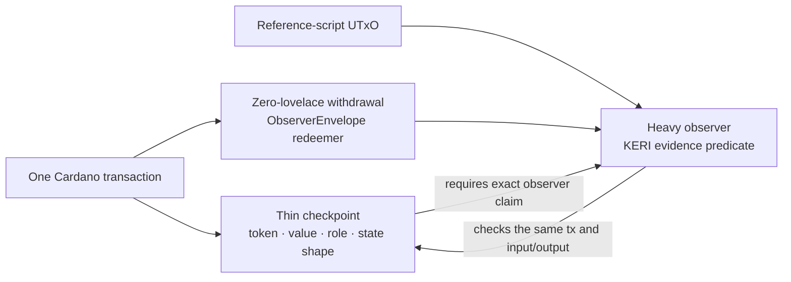
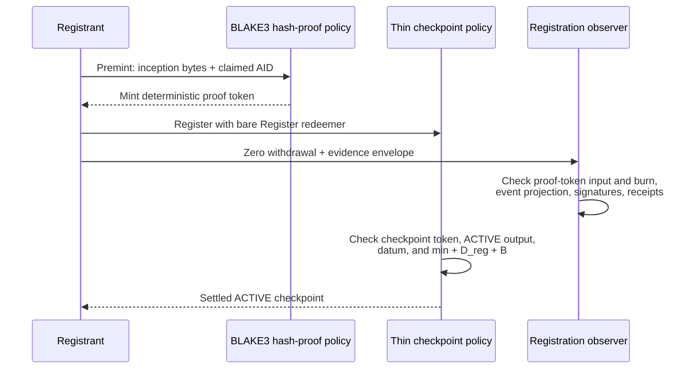

# Observer architecture

The production transaction shape separates small state-machine checks from
large KERI evidence checks. The checkpoint script stays **thin**; a separate
reference script, called an **observer**, performs the expensive validation in
the same transaction.

This split is required by Cardano's size limits, not by a trust boundary. On
the protocol-11 development network used by the settled stories:

- the full transaction-size limit is 16,384 bytes; and
- an applied reference script has a 16,133-byte budget after its transaction
  wrapper.

Putting every operation and every KERI parser into one checkpoint program did
not fit. The observer split keeps each deployed program under the limit while
making both halves agree on the same transaction.

## Thin checkpoint, heavy observers

The thin checkpoint owns the rules that protect the state UTxO:

- resolve the exact input being spent;
- require the expected ACTIVE or ARMED role;
- preserve or burn the quantity-one AID token as the operation requires;
- enforce the escrow and successor-output shape;
- require the correct observer to run; and
- bind the observer claim to this checkpoint policy and, for a spend, this
  exact input reference.

The observers own the heavy evidence predicates:

- `observer_lifecycle` validates registration evidence;
- `observer_advance` validates ordinary rotations and ARMED responses; and
- `observer_enforcement` validates Freeze evidence.

They are Plutus stake scripts delivered through **reference-script UTxOs**.
A reference script is stored once on the ledger and referred to by later
transactions, so its bytes do not have to be copied inline every time.



Neither half is optional. A correct observer envelope cannot bypass a bad
checkpoint state transition, and a well-shaped checkpoint transition cannot
bypass the KERI proof.

## Why a zero-lovelace withdrawal runs code

Cardano executes a stake validator when a transaction withdraws rewards for
that script credential. The transaction uses a withdrawal amount of zero, so
no reward value moves, but the ledger still evaluates the validator.

The withdrawal redeemer is an `ObserverEnvelope`:

```text
ObserverEnvelope {
  claim: {
    action: Register | Advance | Freeze | ResponseAdvance
    checkpoint_policy: PolicyId
    own_ref: None | Some(OutputReference)
  }
  payload: operation-specific KERI evidence
}
```

Registration has no checkpoint input yet, so `own_ref` is `None`. Advance,
Freeze, and response Advance bind `own_ref` to the exact checkpoint UTxO they
consume. Stable action tags keep the wire unambiguous.

The checkpoint verifies that:

1. the configured observer credential appears in the withdrawals;
2. its withdrawal amount is exactly zero;
3. its redeemer decodes as the expected envelope;
4. the action tag matches the checkpoint operation; and
5. the policy and input reference match this transition.

The observer then reads that same transaction and validates the heavy payload
against the named old state and unique successor.

## Registration's premint fact token

KERI AIDs use BLAKE3, while Plutus does not provide a native BLAKE3 builtin.
The project has an Aiken implementation, but running it together with all of
Register made the transaction needlessly expensive and difficult to fit.

Registration is therefore two transactions:



The premint token is a **fact token**: its deterministic asset name binds the
inception bytes to the claimed AID. It carries no controller authority and
does not choose the checkpoint keys. Register consumes an input containing the
token and burns exactly that token while the lifecycle observer checks the
same event bytes.

The checkpoint mint redeemer is deliberately the bare constructor:

```text
Register
```

The large `RegistrationEvidence` no longer rides inside that mint redeemer.
It rides once in the observer envelope. This is the current wire shape from
PR [#146](https://github.com/lambdasistemi/cardano-keri/pull/146).

## Reference delivery

The live builder first publishes the required scripts in separate
reference-script outputs, then spends those references from the operation
transaction. Registration needs the checkpoint, lifecycle observer, and
BLAKE3 proof policy; later stories also publish the Advance and enforcement
observers.

This matters because three inline validators already exceed the 16,384-byte
transaction cap. Reference delivery keeps the operation transaction small
while still executing the exact deployed programs. The builder also uses a
two-pass budget calculation: evaluate once, derive declared execution units
from observed use, rebuild, and submit with the aggregate limit checked.

## Measured sizes and costs

These are applied-program sizes and observed execution units from the merged
story pull requests, not estimates.

| Program or operation | Measurement | Source |
|---|---:|---|
| Thin checkpoint after Freeze wiring | 9,155 bytes (about 9.2 KB) | [PR #150](https://github.com/lambdasistemi/cardano-keri/pull/150) |
| Enforcement observer | 13,548 bytes | [PR #150](https://github.com/lambdasistemi/cardano-keri/pull/150) |
| Advance observer | 16,130 of 16,133 bytes | [PR #150](https://github.com/lambdasistemi/cardano-keri/pull/150) |
| Register | about 1.9 million memory units, about 11% of the 16.5 million limit | [PR #146](https://github.com/lambdasistemi/cardano-keri/pull/146) |
| Two-key Advance, thin checkpoint | 351,567 memory / 120,489,432 CPU | [PR #148](https://github.com/lambdasistemi/cardano-keri/pull/148) |
| Two-key Advance, observer | 4,110,025 memory / 2,008,935,582 CPU | [PR #148](https://github.com/lambdasistemi/cardano-keri/pull/148) |
| Freeze, thin checkpoint | 428,033 memory / 150,487,344 CPU | [PR #150](https://github.com/lambdasistemi/cardano-keri/pull/150) |
| Freeze, enforcement observer | 3,287,294 memory / 1,689,999,750 CPU | [PR #150](https://github.com/lambdasistemi/cardano-keri/pull/150) |
| ARMED response, thin checkpoint | 419,014 memory / 144,731,099 CPU | [PR #150](https://github.com/lambdasistemi/cardano-keri/pull/150) |
| ARMED response, Advance observer | 3,707,244 memory / 1,845,793,955 CPU | [PR #150](https://github.com/lambdasistemi/cardano-keri/pull/150) |

The Advance observer has only **3 bytes** of measured applied-script headroom.
Issue [#149](https://github.com/lambdasistemi/cardano-keri/issues/149) is a
required size-reduction chore before the real seven-key rotation story. A
passing current transaction does not make that margin maintainable.

## Security properties of the split

The split preserves four important properties:

1. **Same-transaction coupling.** The observer validates the exact input and
   successor protected by the thin checkpoint.
2. **No evidence duplication.** Large KERI evidence appears in one envelope,
   not in both mint and withdrawal redeemers.
3. **No trusted observer.** “Observer” names a validator role, not an off-chain
   person or oracle. Its code is a reference script and its result is enforced
   by the ledger.
4. **Fail-closed extension.** A new lifecycle verb is unavailable until the
   thin checkpoint admits its action tag and the matching observer path is
   deployed. Unknown constructors, roles, tags, or datum shapes reject.
