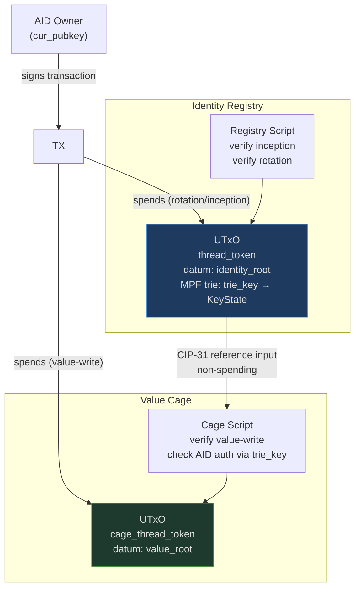

# Architecture Overview

cardano-aid has two on-chain components. They are logically independent but designed to compose.

## Identity Registry

A singleton, ownerless UTxO holding an [MPF](https://github.com/aiken-lang/merkle-patricia-forestry) trie with the mapping `trie_key → KeyState`.

```
KeyState {
  cur_pubkey  : ByteArray[32]   -- current Ed25519 public key (raw bytes)
  next_digest : ByteArray[32]   -- blake2b_256(next pubkey), committed not yet revealed
  seq         : Int             -- monotonic rotation counter, starts at 0
  cesr_aid    : ByteArray[32]   -- decoded CESR AID, for off-chain KERI correlation
}
```

The MPF trie key is `trie_key = blake2b_256(cbor({cur_pubkey, next_digest}))` — a Cardano-verifiable derivation from the inception material. It is NOT the CESR AID. See [AID Model](../design/aid-model.md) for the rationale.

The registry UTxO carries a thread token (minted at bootstrap, never burned) that uniquely identifies the live registry. The datum holds the current MPF root.

**Permissionless inception**: anyone can register an identity by providing valid inception material and an MPF absence proof. No gatekeeper.

**Owner-only rotation**: only the holder of `next_key` (whose hash is stored in `next_digest`) can advance the key-state.

## Value Cages

Existing MPFS cage UTxOs that store domain-specific leaf data. Each cage holds its own MPF trie. Leaf operations (insert, update, delete) can optionally require AID-based authorization.

When a cage requires AID auth, the cage script reads the identity registry via a CIP-31 reference input and checks the key-state for the relevant `trie_key` at the snapshot captured in that block. The cage resolves the signer by `trie_key` (derived from their `cur_pubkey`) — it does not need the CESR AID at all.

## Veridian Bridge

The primary integration target is Veridian — a [Signify](https://github.com/WebOfTrust/signify-ts)-based [KERI](https://datatracker.ietf.org/doc/draft-ssmith-keri/) wallet (TypeScript). The bridge uses the same [Ed25519](https://www.rfc-editor.org/rfc/rfc8032) keys for both KERI and Cardano, with no re-keying.

```
Veridian wallet (Signify/TypeScript)
  ↓ same Ed25519 keys
cardano-aid-sdk (TypeScript)
  ↓ pure proof/redeemer building
cardano-aid-wasm (Haskell WASM)
  ↓ on-chain registry
cardano-aid identity UTxO
  ↓ CIP-31 reference input
MPFS value cages
```

See [Veridian Bridge](veridian-bridge.md) for the full specification.

## On-chain interaction



The identity UTxO is not consumed by value-writes. The cage script sees the identity root from the reference input and validates the key-state against it using `trie_key`.

## What lives off-chain

- Full Key Event Log (KEL) history
- CESR AID ↔ trie_key correlation (via KeyState metadata scan)
- Witness receipts and duplicity detection
- KERI-style watcher/backer network
- Settlement depth tracking

These are future concerns. The on-chain layer is a minimal root of trust: AID uniqueness, pre-rotation binding, and key possession proofs.
