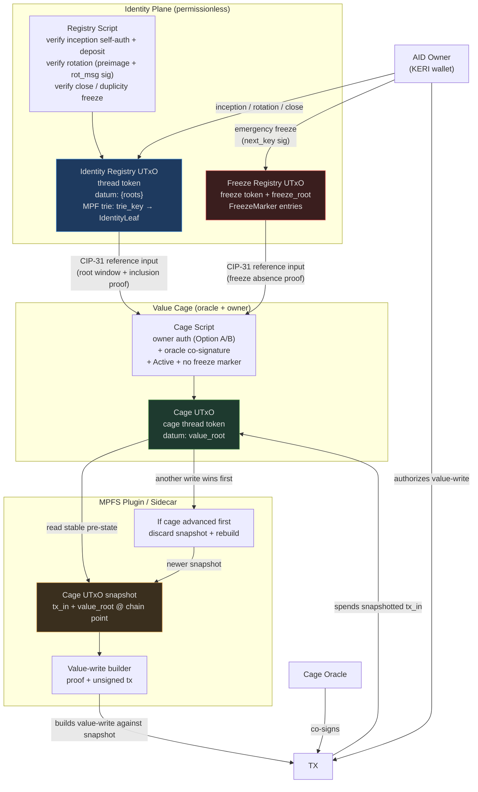

# Architecture Overview

cardano-keri is structured as four layers. This page covers Layer 1 — the
identity plane — and the MPFS value-cage plane it authorizes. The credential
layers (2–4) are analyzed in [vLEI Bridge](../design/vlei.md) and the
[business cases](../design/business-cases/index.md).

```
Layer 1 — AID Key-State Registry    (on-chain MPF: trie_key → IdentityLeaf)
Layer 2 — TEL Revocation Registry   (on-chain MPF per issuer: SAID → issued | revoked)
Layer 3 — ACDC Chain Verifier       (Aiken: SAID + signature + MPF proofs, bounded hops)
Layer 4 — Off-chain Proof Builder   (Haskell/WASM: CESR decode + proof generation)
```

Two planes with different trust models:

- The **identity plane** (Layer 1 + the freeze registry) is **permissionless**:
  anyone can incept an identity by posting a deposit and proving key
  possession. No oracle mediates identity operations.
- The **value plane** (MPFS cages) keeps its oracle, but the oracle is
  **necessary-not-sufficient**: every leaf mutation requires *both* the leaf
  owner's Ed25519 authorization and the oracle signature. The oracle provides
  liveness; it cannot forge.

## Identity Registry (Layer 1)

A single-UTxO [MPFS](https://github.com/aiken-lang/merkle-patricia-forestry)
trie mapping:

```
trie_key → IdentityLeaf { key_state, status }
```

```
KeyState {
  cur_pubkey  : ByteArray[32]   -- current Ed25519 public key (raw bytes)
  next_digest : ByteArray[32]   -- blake2b_256(next pubkey), committed not yet revealed
  seq         : Int             -- monotonic rotation counter, starts at 0
  cesr_aid    : ByteArray[32]   -- decoded CESR AID, metadata only (never verified on-chain)
  deposit     : Lovelace        -- locked at inception, returned at close
}

IdentityStatus {
  Active
  FrozenFatal { event_1, sig_1, event_2, sig_2, seq }  -- duplicity proof, irrecoverable
  Closed                                               -- tombstone; deposit returned
}
```

`trie_key = blake2b_256(cbor({cur_pubkey, next_digest}))` — derived from
inception material, stable across rotations, front-run-proof (see
[AID Model](../design/aid-model.md)).

The registry UTxO datum holds a **sliding window of recent roots**:

```
RegistryDatum {
  roots : List<ByteArray>  -- [root_t, root_t-1, ..., root_t-k], newest first
}
```

The sliding window decouples consumers from registry write cadence — a
value-write built against an older root remains valid as long as that root is
still in the window.

!!! note "Scope change: list-shaped KeyState"
    The business-case analyses concluded that `KeyState` must be list-shaped
    and threshold-capable from v1 (organizational AIDs are k-of-n multisig; a
    single key is the 1-of-1 degenerate case). The shape above is the
    singleton illustration. See the
    [factored core](../design/business-cases/index.md#the-factored-core-required-by-every-case).

## Identity operations and their authorization

All identity operations are **permissionless** — authorized by cryptographic
material, not by any operator key:

| Operation | Authorization |
|---|---|
| Inception | `cur_pubkey` signature over `inc_msg` + ADA deposit + absence proof |
| Rotation | `blake2b_256(reveal_key) == next_digest` **and** `reveal_key` signature over `rot_msg` |
| Close (tombstone) | `cur_pubkey` signature over `close_msg`; deposit returned |
| Duplicity freeze | machine-verifiable `DuplicityProof` (two conflicting signed KERI events) |
| Emergency freeze | `next_key` signature — marker in the separate freeze registry |

Exact message formats and on-chain checks are specified in
[Identity Operations](identity-ops.md).

!!! danger "The preimage alone never authorizes a rotation"
    Rotation requires **both** the preimage check and an Ed25519 signature by
    `reveal_key` over `rot_msg` (which binds the *new* next-key commitment).
    The preimage becomes public in the KERI KEL the moment the owner rotates
    there — without the signature requirement, any observer could replay it
    on-chain with an attacker-chosen `new_next` and capture the identity. See
    [Identity Operations — Rotation](identity-ops.md#rotation).

A closed or frozen leaf **remains in the trie forever** (tombstone). A
`trie_key` can never be re-registered: the inception absence proof fails
against any leaf, whatever its status. This is what makes "trie_key uniqueness"
hold across the whole registry lifetime, not just while an identity is active.

## Freeze registry

A **separate single-UTxO registry** for emergency revocation, so a compromise
response never queues behind inception/rotation traffic on the main registry.
It stores sequence-scoped markers:

```
FreezeMarker { trie_key, seq, cur_pubkey_hash, next_digest }
```

A marker is authorized by the *next* key (the thief holds the current one) and
dissolves automatically once the on-chain rotation lands (`seq` advances).
Value cages must check **both** registries: identity leaf `Active` and no
active `FreezeMarker`. See
[Identity Operations — Emergency freeze](identity-ops.md#emergency-freeze) for
the canonical definition and
[Veridian Bridge — Synchronization lag](veridian-bridge.md#synchronization-lag)
for the compromise-window workflow.

## Value Cages (MPFS plane)

Existing MPFS cage UTxOs storing domain-specific leaf data, where leaves are
owned by AIDs. Every leaf mutation requires **two signatures**:

1. **Leaf owner** — Ed25519 authorization against the identity registry
   key-state, in one of two modes (native signer or detached signature); see
   [Value Authorization](value-auth.md).
2. **Cage oracle** — the MPFS operator co-signs. The oracle is
   necessary-not-sufficient: it cannot mutate a leaf without the owner's
   authorization.

When a cage checks AID authorization it takes the identity registry (and the
freeze registry) as **CIP-31 reference inputs** and:

1. Checks the registry datum's root window for a root matching the supplied inclusion proof
2. Verifies `trie_key → leaf` where `leaf.status == Active`
3. Verifies no active `FreezeMarker` for `trie_key` (absence proof against the freeze root)
4. Reads `cur_pubkey` from `leaf.key_state`
5. Verifies the owner's authorization in the mode the flow requires (see the
   [mode matrix](value-auth.md#choosing-the-mode))

The cage is configured at deploy time with the specific registries it trusts.

## Residual oracle trust (value plane only)

The cage oracle controls **liveness**: it can reject or delay writes, garbage-
collect, squat unowned value keys, and end the cage. It **cannot forge data**
— no leaf mutation passes without the owner's signature. "Cannot forge" is not
"cannot censor"; protocols that need censorship-resistance on the value plane
must design for oracle exit (see [Trust Model](../design/trust-model.md)).

## On-chain interaction



The registry UTxOs are not consumed by value-writes. Value-writes use them as
non-spending CIP-31 reference inputs.

The cage UTxO is consumed, so the MPFS plugin/sidecar builds each value-write
against a cage snapshot (`tx_in` + `value_root`) and rebuilds from a newer
snapshot if another write spends that UTxO first.

## What lives off-chain

- Full KERI KEL history
- CESR AID ↔ trie_key binding verification (KEL replay — see
  [Binding verification protocol](veridian-bridge.md#binding-verification-protocol))
- KERI watchers (monitor KELs for rotations and duplicity)
- Witness receipts and duplicity detection
- Settlement depth tracking

The on-chain layer is a minimal root of trust: trie_key-keyed identity,
pre-rotation binding, and key possession proofs — permissionless on the
identity plane, owner-plus-oracle on the value plane.
