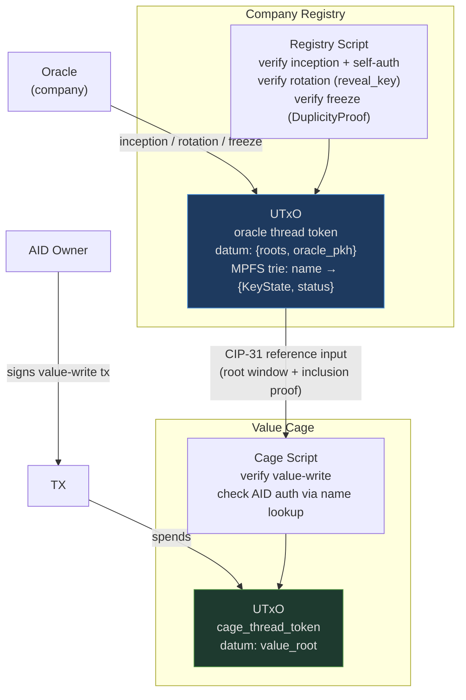

# Architecture Overview

cardano-aid has two on-chain components. They are logically independent but designed to compose.

## Identity Registry

A per-company [MPFS](https://github.com/aiken-lang/merkle-patricia-forestry) trie maintained exclusively by an oracle (the company). The trie maps:

```
name → IdentityLeaf { KeyState, status }
```

```
KeyState {
  cur_pubkey  : ByteArray[32]   -- current Ed25519 public key (raw bytes)
  next_digest : ByteArray[32]   -- blake2b_256(next pubkey), committed not yet revealed
  seq         : Int             -- monotonic rotation counter, starts at 0
  cesr_aid    : ByteArray[32]   -- decoded CESR AID, for off-chain KERI correlation
}

IdentityStatus {
  Active
  FrozenFatal { event_1, sig_1, event_2, sig_2, seq }  -- duplicity proof, irrecoverable
}
```

The registry UTxO datum holds a **sliding window of recent roots**:

```
RegistryDatum {
  roots      : List<ByteArray>  -- [root_t, root_t-1, ..., root_t-k], newest first
  oracle_pkh : ByteArray        -- blake2b_224 of oracle pubkey
}
```

The sliding window decouples consumers from the oracle's write cadence — a value-write built against an older root remains valid as long as that root is still in the window.

Each company deploys its own registry; there is no shared global instance.

## Oracle trust model

The oracle (company) is the **sole writer** to the registry. Its permitted operations are:

| Operation | Authorization |
|---|---|
| Insert `name → leaf` (inception) | Oracle key + user self-auth signature |
| Rotate `KeyState` | Oracle key + reveal_key preimage |
| Delete `name` (offboard) | Oracle key |
| Freeze `Active → FrozenFatal` | Oracle key + DuplicityProof |
| Self-remove | User `cur_pubkey` signature + nonce UTxO — no oracle key |

Name reassignment (`name → trie_key` change) is **forbidden** — the validator rejects any redeemer that changes the `trie_key` for an existing name.

The oracle controls entry but not exit. The user can always self-remove by signing with their on-chain `cur_pubkey` and consuming a nonce UTxO in the same transaction (single-use replay protection). The oracle cannot block this.

The oracle cannot forge key material — inception requires a user-provided self-auth signature that the validator checks on-chain. The oracle can silence or remove an identity, but cannot impersonate one.

## Inception: off-chain handover

Identity registration is a two-party off-chain coordination:

1. **User → Oracle**: desired name + KERI KEL + self-auth signature
2. **Oracle**: verifies KEL, derives `trie_key`, submits inception on-chain

The self-auth signature binds `{name, trie_key, oracle_pkh, network_id}` under the user's `cur_key`. The validator checks it on-chain, ensuring the user consented to the registration under that exact name.

After inception the user has no direct Cardano write access. All subsequent on-chain operations (rotations, freeze) are driven by the oracle.

## Rotation: oracle-driven KEL mirroring

The oracle watches the user's KERI KEL. When a rotation event is observed, the oracle submits the corresponding on-chain rotation — revealing `next_key` (whose hash is stored as `next_digest`) and committing to the new `next_key`.

The oracle cannot fabricate rotations: the validator checks `blake2b_256(reveal_key) == cur_state.next_digest`. Without knowing the preimage the user committed to at inception, no rotation is possible.

This makes "Cardano ahead, KERI behind" structurally impossible — Cardano rotations can only follow observed KERI events.

## Value Cages

Existing MPFS cage UTxOs storing domain-specific leaf data. Leaf operations can require AID-based authorization.

When a cage requires AID auth, the cage script takes the identity registry as a **CIP-31 reference input** and:

1. Checks the registry datum's root window for a root matching the supplied inclusion proof
2. Verifies `name → leaf` where `leaf.status == Active`
3. Reads `cur_pubkey` from `leaf.key_state`
4. Verifies the transaction is signed by `blake2b_224(cur_pubkey)` (Option B, preferred) or carries a detached signature (Option A)

The cage is configured at deploy time with the specific company registry it trusts.

## On-chain interaction



The registry UTxO is not consumed by value-writes. Value-writes use it as a non-spending CIP-31 reference input.

## What lives off-chain

- Full KERI KEL history
- CESR AID ↔ name correlation
- Oracle's KERI watcher (monitors KEL for rotations and duplicity)
- Witness receipts and duplicity detection
- Settlement depth tracking

The on-chain layer is a minimal root of trust: name-keyed identity, pre-rotation binding, and key possession proofs with oracle-controlled membership.
