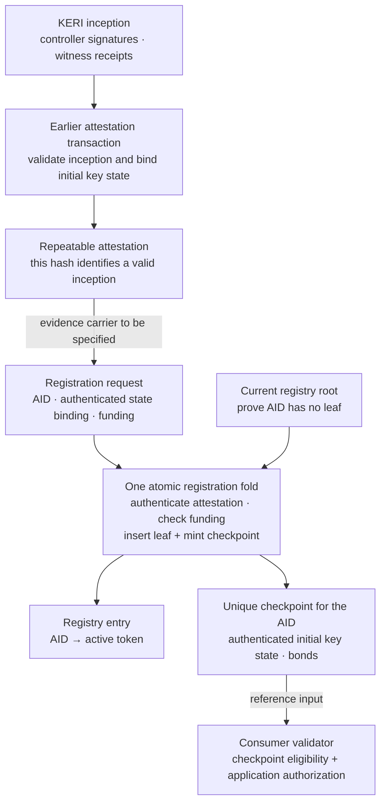
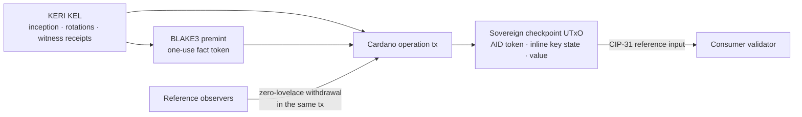
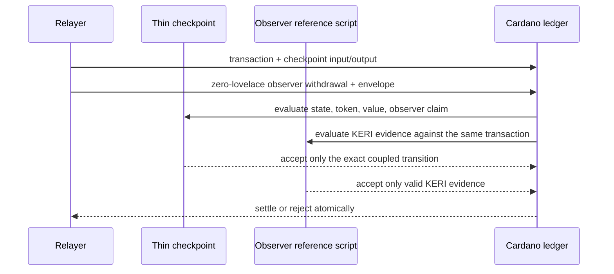

# Architecture overview

cardano-keri gives one KERI identity a stable Cardano checkpoint while its keys
rotate. KERI is Key Event Receipt Infrastructure; its **AID** (Autonomic
Identifier) names an identity, and its **KEL** (Key Event Log) is the signed
history of that identity's key events.

Start with [Follow one identity](follow-one-identity.md) to play registration,
rotation, consumer refusal and registry uniqueness before reading the mechanisms
below.

!!! abstract "Where this page stands"
    The transaction architecture — thin checkpoint, reference observers,
    zero-lovelace withdrawal, BLAKE3 premint — is **shipped on `main` today**.
    The proposed M1 registration flow below moves full inception admission
    into an earlier, repeatable attestation. That evidence boundary is not
    implemented; the existing BLAKE3 token proves a narrower fact.
    How lifecycle state is *represented* also changes: today it is role addresses, in the
    [accepted design](../index.md#the-accepted-design-the-m1-return) it is one
    bit plus the checkpoint's own value. Both are described below, marked.

## The identity plane

Every registered AID owns a sovereign **checkpoint UTxO** (unspent transaction
output) carrying one AID-derived token and an inline datum with its current key
state. Registration must establish both valid initial state and uniqueness;
these are separate guarantees.

### Proposed M1 registration flow


```mermaid
flowchart TD
    ICP["KERI inception<br/>controller signatures · witness receipts"]
    AT["Earlier attestation transaction<br/>validate inception and bind initial key state"]
    FACT["Repeatable attestation<br/>this hash identifies a valid inception"]
    REQ["Registration request<br/>AID · authenticated state binding · funding"]
    ROOT["Current registry root<br/>prove AID has no leaf"]
    FOLD["One atomic registration fold<br/>authenticate attestation · check funding<br/>insert leaf + mint checkpoint"]
    LEAF["Registry entry<br/>AID → active token"]
    CK["Unique checkpoint for the AID<br/>authenticated initial key state · bonds"]
    APP["Consumer validator<br/>checkpoint eligibility + application authorization"]

    ICP --> AT --> FACT
    FACT -->|"evidence carrier to be specified"| REQ
    REQ --> FOLD
    ROOT --> FOLD
    FOLD --> LEAF
    FOLD --> CK
    CK -->|"reference input"| APP
```

| Boundary | Guarantee | Enforcement responsibility |
|---|---|---|
| Inception attestation | This hash identifies a valid inception and authenticates its initial key state. Multiple attestations of the same inception are allowed. | The designated attestation policy establishes the inception checks, including signatures and witness receipts. |
| First registration | If the AID has never been registered, create its registry entry and checkpoint together. Another attestation cannot authorize a second registration. | MPFS verifies absence and insertion; KERI admission and mint validation bind that insertion to the authenticated checkpoint and required funding in the same transaction. |
| Consumer use | Only an eligible checkpoint may supply keys to the application. | The consumer validates the checkpoint and applies its own authorization rules. Attestation possession and an active registry leaf alone do not authorize use. |

The request need not carry the raw inception if the attestation authenticates
the initial key-state projection as well as the AID. The concrete evidence
carrier, reference or consumption rules, and transaction budgets remain to be
specified and measured. **Attestation is repeatable; checkpoint uniqueness is
enforced by registry admission.** Revival remains a separate guarded operation.
The [registration guarantees](follow-one-identity.md#what-registration-guarantees)
explain the model boundaries and link the playable duplicate-registration case.

### Shipped V1 evidence flow

The existing implementation splits out the hash check only. Registration still
receives the full inception evidence and performs the remaining admission
checks; it has no registry absence check.


```mermaid
flowchart LR
    KEL["KERI KEL<br/>inception · rotations · witness receipts"]
    PRE["BLAKE3 premint<br/>one-use fact token"]
    TX["Cardano operation tx"]
    CK["Sovereign checkpoint UTxO<br/>AID token · inline key state · value"]
    OBS["Reference observers"]
    APP["Consumer validator"]

    KEL --> PRE
    KEL --> TX
    PRE --> TX
    TX --> CK
    OBS -->|"zero-lovelace withdrawal<br/>in the same tx"| TX
    CK -->|"CIP-31 reference input"| APP
```

In this shipped flow, the parts have deliberately narrow jobs:

- **KERI** produces the identity events, controller signatures, and witness
  receipts.
- **The BLAKE3 premint policy** proves that inception bytes bind to the AID and
  mints a short-lived fact token.
- **The thin checkpoint validator** protects the token, value, exact input, and
  unique successor.
- **Reference observers** validate large KERI evidence through a zero-lovelace
  withdrawal in the same transaction.
- **The checkpoint UTxO** is the current Cardano projection. A rotation spends
  it and creates its next version; no shared root or inclusion proof is needed
  for the key state.

## Stable identity, changing authority

The checkpoint token's asset name is derived from the qualified KERI AID. That
policy ID and asset name form the stable Cardano handle. The datum changes as
KERI rotates. Shipped today it is nine fields of pure key state:

```text
CheckpointDatumV1 {
  cesr_aid
  current controller keys and weighted threshold
  next-key commitments and committed next threshold
  witnesses and toad
  Cardano sequence
  native KERI sequence
}
```

**CESR** is KERI's compact encoding format. `toad` is the threshold of
accountable duplicity: the number of witness receipts required by the event.

An indexer may locate a candidate UTxO by policy and asset name, but it does
not establish authority. A consuming Cardano transaction must revalidate the
exact policy and quantity-one asset, an accepted checkpoint script and version,
the expected AID and a well-formed datum, and its own authorization rule. A
stale index result points to a spent input and fails; an indexer outage can
block discovery, but cannot create false authority.

## How lifecycle state is represented

### Shipped today: role addresses

State is carried by the script role address the token sits at, not by a
caller-controlled status field:

| Role | Meaning | Consumer result |
|---|---|---|
| ACTIVE | current checkpoint | may be considered, subject to all other checks |
| ARMED | a later-event challenge is open | reject |
| FROZEN | the delay bond was claimed | reject |

There is no conviction role: conviction burns the AID token and creates no
successor, so a consumer meets the no-candidate case. That follows from the
projection law — the chain never originates identity state, and no key event
says "this AID is dead" for a validator to project.

### After the M1 return: one bit and the value

The three roles go. What replaces them is smaller and reads directly off the
checkpoint a consumer already resolves:

| Condition | How it is represented | Consumer result |
|---|---|---|
| poisoned | one bit in the datum, set by the current quorum | reject |
| frozen | `B` absent — a hunter took it | reject |
| juvenile | `now − born_at < W` | reject |
| parked | no UTxO; the registry leaf holds the hash of the last checkpoint | no candidate |
| convicted | the mark, terminal | no candidate |

Nothing there is a flag a caller can set. The poison is signed at the current
threshold; the rest are facts about what the UTxO holds and when it was bonded.
The consumer's whole predicate is: present, both bonds full, not poisoned,
older than `W`, and the payment's own signature satisfies the current
threshold.

## Uniqueness: the one shared object

Today there is none. Registration uses no absence proof, so more than one
candidate checkpoint can exist for an AID and a consumer cannot prove
otherwise.

The M1 return adds exactly one shared structure, and confines it to the
narrowest possible job: a **registry** mapping each AID to a leaf — absent,
live, parked with the hash, or convicted. A registration must prove absence
before inserting, preventing a second first-registration of that AID. This is
distinct from the concrete token's mint/burn rules across revival; see
[the registration guarantee](follow-one-identity.md#what-registration-guarantees).
Register, reopen, close and convict change the leaf; rotate, poison, freeze and top-up
never touch it, and consumers never read it.

It is a registry of 32-byte keys, not a record of events — the record tree and
its cursor are retired. Its mechanics are upstream work: MPFS made
permissionless, so requests are independent UTxOs anyone submits and anyone
applies in batches (ruling D-037). A stalled registry delays registrations and
forges nothing.

## Transaction architecture

The checkpoint is intentionally small. In the shipped operation flow, heavy
KERI verification runs in operation-specific observer reference scripts:


```mermaid
sequenceDiagram
    participant R as Relayer
    participant C as Thin checkpoint
    participant O as Observer reference script
    participant L as Cardano ledger

    R->>L: transaction + checkpoint input/output
    R->>L: zero-lovelace observer withdrawal + envelope
    L->>C: evaluate state, token, value, observer claim
    L->>O: evaluate KERI evidence against the same transaction
    C-->>L: accept only the exact coupled transition
    O-->>L: accept only valid KERI evidence
    L-->>R: settle or reject atomically
```

The observer families shipped today are the lifecycle observer for Register,
the advance observer for rotations and ARMED responses, and the enforcement
observer for Freeze. The M1 return removes the third: `observer_advance`
verifies the evidence for both an advance and a freeze — they present the same
rotation and differ only in effect — and `checkpoint_register` dispatches that
effect.

The scripts are stored in reference-script outputs; copying them inline would
exceed the transaction-size limit. See
[Observer architecture](observer-architecture.md) for the wire shape, the
BLAKE3 fact token, sizes and costs — including the three bytes of headroom on
`observer_advance` that make every datum decision a measured one.

For the proposed registration flow, the heavy inception admission moves to the
earlier attestation transaction. The fold must still authenticate that result
and couple registry insertion, checkpoint mint and output validation. This
changes where registration evidence is checked; it does not remove those checks
or change rotation evidence into inception attestations.

## Permissionless does not mean unauthenticated

Register, advance, freeze, top-up, poison relay and conviction may be submitted
by anyone because their result is fixed by public evidence. The submitter
cannot choose new keys, skip a sequence, lower a threshold, or remove required
witnesses.

Where authority *is* needed, it is a signature over exactly the thing being
decided. Today, close binds the refund address in a message the current
controllers sign.

!!! note "The accepted design changes this"
    Under the design ruled on 2026-09-02/03 (D-036 to D-040; the model is
    `lean/CardanoKeri/Checkpoint.lean`, the play is the
    [checkpoint simulation](../simulator/index.html)) leaving is the
    reap: a witnessed rotation by the *next* keys whose signed message
    names the payee of the premium and the refund address. The current
    keys keep exactly one Cardano power, the poison. An identity is
    active (one UTxO), parked (no UTxO; the registry leaf holds the hash
    of the last checkpoint) or convicted; a parked identity is revived
    by a witnessed rotation from exactly that key state, with fresh
    bonds. What ships today is the close described above. Every bond
    option other than `keep`, and every new refund address, is signed
    by the keys of the epoch the rotation opens — so a relayer landing
    a public rotation can never park, age, or close the owner.

## Current boundary and future planes

The repository proves the identity-plane rungs on a protocol-11 development
network and on preprod. It does **not** provide the M1 return's machine on
chain at all, real three-of-seven GLEIF-scale settlement, a production
deployment or mainnet service, a vLEI credential-chain verifier, a credential
revocation mirror, or a wallet-to-Cardano authorization product.

The credential verifier, revocation state, value-cage authorization and wallet
integration remain later layers. They consume the checkpoint as a reference
input; they are not part of the identity story itself.

## Related pages

- [Story ladder](../story-ladder.md) — settled evidence, dated.
- [Roadmap](../roadmap.md) — the thirteen epics and what each measures.
- [Identity operations](identity-ops.md) — exact operation behavior, shipped
  and designed.
- [Observer architecture](observer-architecture.md) — reference-script
  composition and measured budgets.
- [Trust model](../design/trust-model.md) — guarantees, assumptions, and
  fail-closed boundaries.
