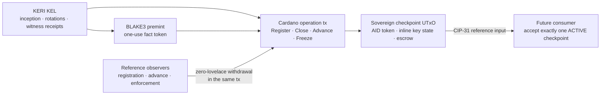
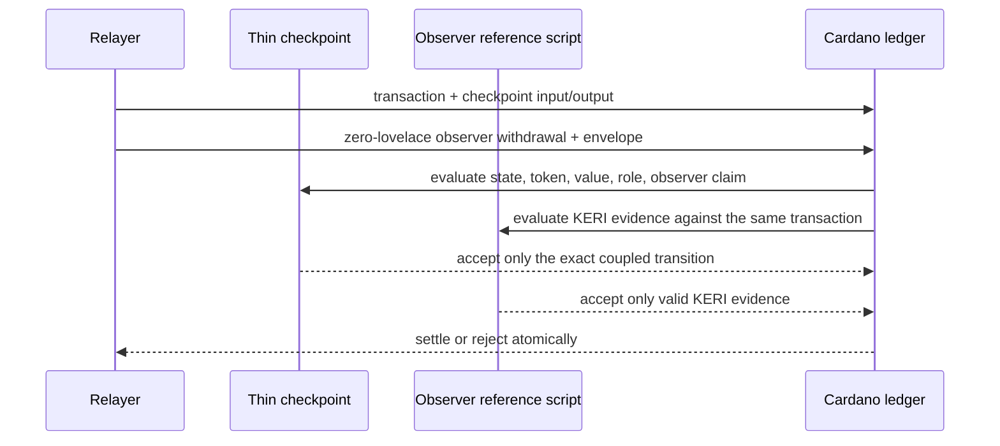

# Architecture overview

cardano-keri gives one KERI identity a stable Cardano checkpoint while its keys
rotate. KERI is Key Event Receipt Infrastructure; its **AID** (Autonomic
Identifier) names an identity, and its **KEL** (Key Event Log) is the signed
history of that identity's key events.

The current identity plane has no shared key-state registry. Every registered
AID owns a sovereign **checkpoint UTxO** (unspent transaction output) carrying
one AID-derived token and an inline datum with its current state.

## Current identity plane


```mermaid
flowchart LR
    KEL["KERI KEL<br/>inception · rotations · witness receipts"]
    PRE["BLAKE3 premint<br/>one-use fact token"]
    TX["Cardano operation tx<br/>Register · Close · Advance · Freeze"]
    CK["Sovereign checkpoint UTxO<br/>AID token · inline key state · escrow"]
    OBS["Reference observers<br/>registration · advance · enforcement"]
    APP["Future consumer<br/>accept exactly one ACTIVE checkpoint"]

    KEL --> PRE
    KEL --> TX
    PRE --> TX
    TX --> CK
    OBS -->|"zero-lovelace withdrawal<br/>in the same tx"| TX
    CK -->|"CIP-31 reference input"| APP
```

The parts have deliberately narrow jobs:

- **KERI** produces the identity events, controller signatures, and witness
  receipts.
- **The BLAKE3 premint policy** proves that inception bytes bind to the AID and
  mints a short-lived fact token.
- **The thin checkpoint validator** protects the token, value, role address,
  exact input, and unique successor.
- **Reference observers** validate large KERI evidence through a zero-lovelace
  withdrawal in the same transaction.
- **The checkpoint UTxO** is the current Cardano projection. Rotation spends
  it and creates its next version; no shared root or inclusion proof is needed.

## Stable identity, changing authority

The checkpoint token's asset name is derived from the qualified KERI AID. That
policy ID and asset name form the stable Cardano handle. The datum changes as
KERI rotates:

```text
CheckpointDatumV1 {
  cesr_aid
  current controller keys and weighted threshold
  next-key commitments and committed next threshold
  witnesses and toad
  Cardano sequence
  native KERI sequence and event digest
}
```

**CESR** is KERI's compact encoding format. `toad` is the threshold of
accountable duplicity: the number of witness receipts required by the event.

An indexer may locate a candidate UTxO by policy and asset name, but it does
not establish authority. A consuming Cardano transaction must revalidate:

- the exact policy and quantity-one asset;
- an accepted checkpoint script/version;
- the expected AID and a well-formed datum;
- the current role address; and
- the consumer's own authorization rule.

A stale index result points to a spent input and fails. An indexer outage can
block discovery, but it cannot create false authority.

## State is structural

Lifecycle state is represented by the checkpoint's script role address, not
by a caller-controlled status field:

| Role | Meaning | Consumer result |
|---|---|---|
| ACTIVE | Current checkpoint | May be considered, subject to all other checks |
| ARMED | Later-event challenge is open | Reject |
| FROZEN | Delay bond was claimed | Reject |

The small story has settled ACTIVE, ARMED, and the response back to ACTIVE.
FROZEN is a target role whose opening story remains
[#138](https://github.com/lambdasistemi/cardano-keri/issues/138).

There is no conviction role, and there will not be one. Conviction burns the AID
token and creates no successor, so the burn is the whole terminal edge — it
removes the checkpoint rather than replacing it with a role that pronounces the
identity dead. A consumer therefore meets no candidate at all, which the
resolution rules above already reject. This follows from Core Principle VI of
the project constitution: the chain projects the KEL and never originates
identity state, and no key event says "this AID is dead" for a validator to
project. The convict transaction in ledger history is the record. Conviction
itself remains unopened
([#151](https://github.com/lambdasistemi/cardano-keri/issues/151)). See
[Lifecycle and the two bonds](lifecycle-and-bonds.md).

There is no separate global Freeze registry in this production story. Freeze
moves the sovereign checkpoint itself from the ACTIVE address to ARMED, so a
consumer sees the fail-closed state through the exact asset it already
resolves.

## Transaction architecture

The checkpoint is intentionally small. Heavy KERI verification runs in
operation-specific observer reference scripts:


```mermaid
sequenceDiagram
    participant R as Relayer
    participant C as Thin checkpoint
    participant O as Observer reference script
    participant L as Cardano ledger

    R->>L: transaction + checkpoint input/output
    R->>L: zero-lovelace observer withdrawal + envelope
    L->>C: evaluate state, token, value, role, observer claim
    L->>O: evaluate KERI evidence against the same transaction
    C-->>L: accept only the exact coupled transition
    O-->>L: accept only valid KERI evidence
    L-->>R: settle or reject atomically
```

The current observer families are:

- lifecycle observer for Register;
- Advance observer for rotation and ARMED response; and
- enforcement observer for Freeze.

The scripts are stored in reference-script outputs. Copying all of them inline
would exceed the protocol transaction-size limit. See
[Observer architecture](observer-architecture.md) for the wire shape,
BLAKE3 fact token, sizes, and execution costs.

## Permissionless does not mean unauthenticated

Register, Advance, Freeze, and response may be submitted by anyone because
their result is fixed by public evidence. The submitter cannot choose new
keys, skip a sequence, lower a threshold, remove required witnesses, or
redirect escrow.

Close is different: it is a voluntary action authorized by the checkpoint's
current controller threshold, and its signed message binds the refund address.

The four settled small-identity stories and their transaction IDs are listed
on the [story ladder](../story-ladder.md).

## Current boundary and future planes

The present repository proves the first identity-plane rungs on a
protocol-11 development network. It does **not** yet provide:

- ClaimFreeze, thaw, or conviction as settled small-identity stories;
- real three-of-seven GLEIF-scale settlement;
- a production deployment or mainnet service;
- a full vLEI credential-chain verifier;
- a credential revocation mirror; or
- a wallet-to-Cardano authorization product.

The credential verifier, revocation state, value-cage authorization, and
wallet integration remain later roadmap layers. They will consume the
checkpoint as a reference input; they are not part of the settled identity
story itself.

## Related pages

- [Story ladder](../story-ladder.md) — settled evidence and planned scale-up.
- [Identity operations](identity-ops.md) — exact operation behavior.
- [Lifecycle and the two bonds](lifecycle-and-bonds.md) — states and
  incentives.
- [Observer architecture](observer-architecture.md) — reference-script
  composition and measured budgets.
- [Trust model](../design/trust-model.md) — guarantees, assumptions, and
  fail-closed boundaries.
