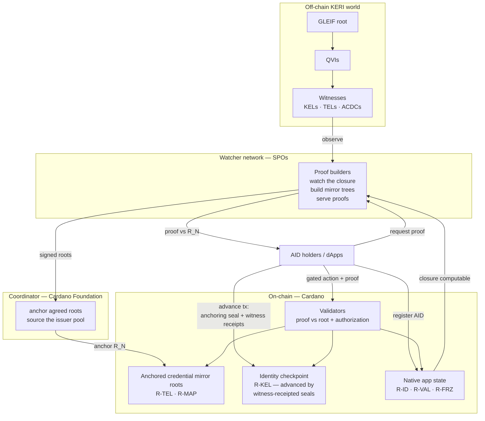
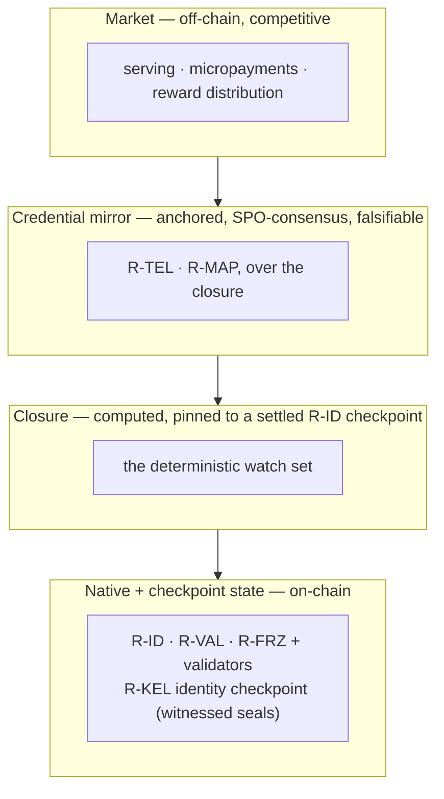
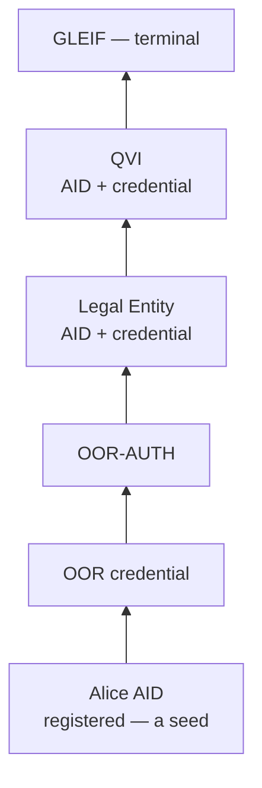
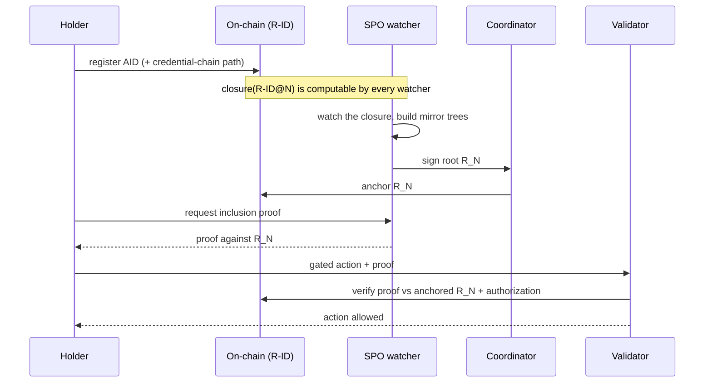
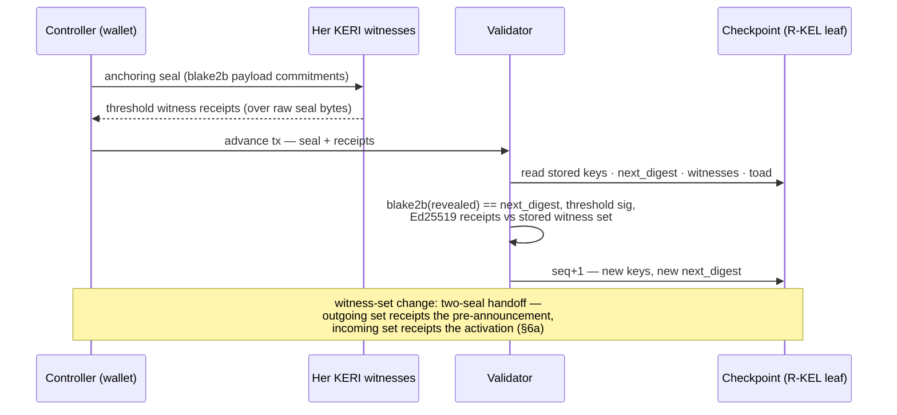
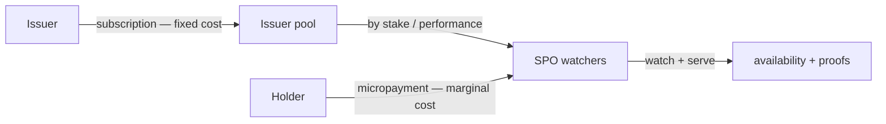
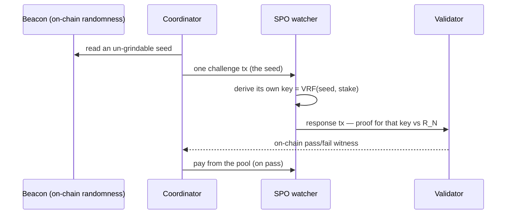

# System Architecture

How cardano-keri lets an on-chain Cardano validator gate an action on a **real-world
credential** (a vLEI ACDC) that lives off-chain in the KERI network — verified natively in
Blake2b, served by a network of watchers, and anchored by a coordinator.

!!! note "Emerging design"
    This page presents the current architecture. Several choices are still open; the
    working design record with the open decisions lives in
    `specs/68-keystate-shape/system-architecture.md`. **Identity update (2026-07-09):**
    per `specs/68-keystate-shape/identity-model.md` (PR #87), the identity key-state
    (R-KEL) is an **on-chain cryptographic checkpoint** advanced by witness-receipted
    anchoring seals from the controller's own KEL — *not* a watcher-attested mirror.
    The watcher-mirror framing on this page applies to the **credential plane**
    (R-TEL · R-MAP) only.

## The planes

Four things cooperate: the **off-chain KERI world** (where identities and credentials
actually live), a **watcher network** run by stake-pool operators (which mirrors the
**credential-plane** state we care about — R-TEL · R-MAP), the **coordinator** (Cardano
Foundation, which anchors the credential mirror on-chain), and the **on-chain** validators
and state. Identity key-state takes a different path: the controller's **witnessed
anchoring seal** drives an on-chain checkpoint directly — no watcher in that loop.

## The trust layering

The key idea is that **correctness is on-chain and watcher-agnostic**, while **service is an
off-chain market**. A proof is valid or not against the anchored root regardless of who
produced it — so the chain never needs to trust a watcher to establish correctness. The
watcher network exists to *serve* proofs and *maintain* the mirror; that's a market and a
bonded-consensus concern, not a validity concern.

| Layer | Roots | Trust |
|---|---|---|
| Native app state | R-ID · R-VAL · R-FRZ (· R-POOL · R-REG) | trustless on-chain |
| Identity checkpoint | R-KEL | **cryptographic from a registration-attested genesis** — advances only through witness-receipted anchoring seals (identity-model §5–7a) |
| Closure | *computed*, pinned to `R-ID@N` | deterministic — everyone recomputes the same |
| Credential mirror | R-TEL · R-MAP | falsifiable, SPO-consensus + slash-for-wrong-root |
| Market | — | off-chain, competitive |

## The closure — what gets watched

The watchers don't mirror all of KERI — only the **closure** of the registered identities:
the minimal set of AIDs and credentials needed to verify whoever opted in, following each
credential chain up to GLEIF. It's a *pure function of who registered*, so no one curates it.

When Alice registers, her whole chain is pulled into the watch set; another holder under a
different QVI pulls that QVI in; shared issuers dedup; GLEIF is always the root.

## Registration and the proof flow (credential plane)

This flow covers **registration and credential proofs** — the watcher-mirrored plane.
Identity key-state advances are a separate, watcher-free flow (next section).

The proof the holder presents is **watcher-agnostic** — a plain inclusion proof against the
anchored root. The validator neither knows nor cares which watcher computed it.

## Identity checkpoint advance (no watcher in the loop)

Identity key-state never rides the mirror. The controller emits a **witnessed anchoring
seal** into her own KEL — a plain native event whose payload carries blake2b commitments
to the new key-state — and the on-chain checkpoint advances only through it
(`specs/68-keystate-shape/identity-model.md` §§3–6a):

Genesis (the first leaf) remains registration-attested and publicly falsifiable pending a
full-context single-transaction measurement (identity-model §7a). Lane-packed spike #88
now fits the BLAKE3 core across the whole single-chunk domain — 17.1% cpu / 22.4% mem at
300 bytes, 54.3% cpu / 71.7% mem at the full 1024-byte chunk.

## Two Blake worlds, one system

Plutus has `blake2b_256` but no `blake3`, and the vLEI ecosystem is Blake3. This does **not**
fork the architecture — the watch→build→anchor layer exists regardless. It only changes
whether the **R-MAP** (Blake3↔Blake2b) mirror is present:

- **CF-as-QVI issuing Blake2b credentials** — no R-MAP; validators recompute SAIDs directly.
- **Real Blake3 vLEI credentials** — R-MAP carries the mapping the chain can't compute.

Either way, a future Plutus `blake3` builtin simply **deletes R-MAP** and lets validators
recompute it themselves — a pure upgrade, no redesign.

## Paid watchers are stake-pool operators

The one place possession-checking belongs on-chain is gating **who draws the reward pool** —
and the paid set is **SPOs**, because they are already bonded (stake), highly available,
identified on-chain (the pool registry), and VRF-native. Reward is an extra SPO revenue
stream, and root-consensus rides on the SPO set, so the mirror inherits Cardano's
decentralization.

Reward-eligibility is proven by a batched **VRF challenge**, decoupled from user actions:

Because the challenge key comes from each SPO's own VRF over a seed the coordinator **can't
grind**, neither the coordinator nor the SPO chooses it — the coordinator stays mechanical,
and collusion collapses to "did it use the honest beacon," which is publicly checkable.

## Cost structure in one line

Two costs, two payers: **watching is a fixed cost** (scales with the closure) → the
**issuer** pays, which also gates whether its credentials are usable on Cardano at all;
**serving proofs is a marginal cost** (scales with usage) → **holders** micropay, via
prepaid accounts or channels. Competition floors the proof price at marginal cost, which is
fine because the fixed cost is already issuer-covered.
