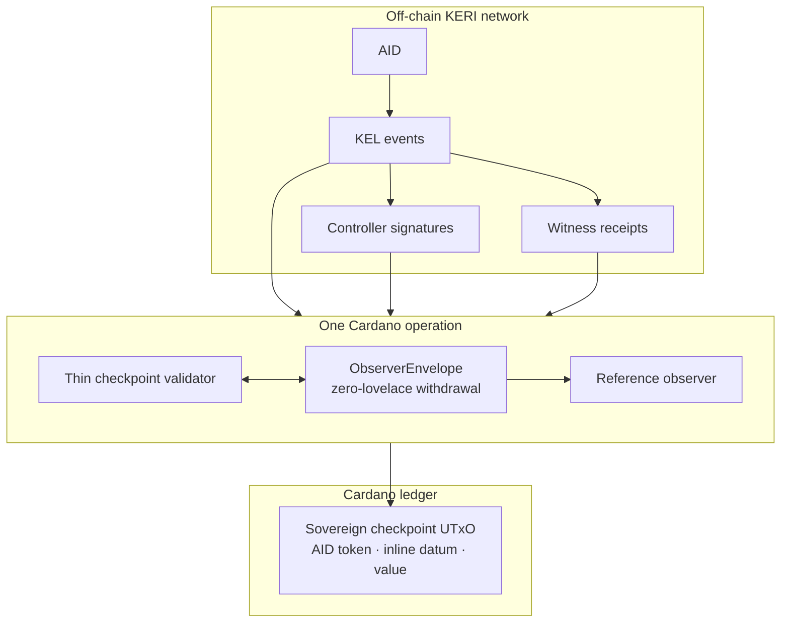
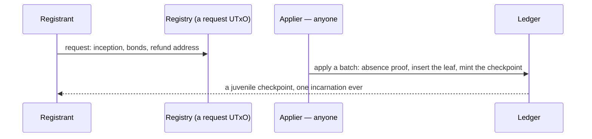
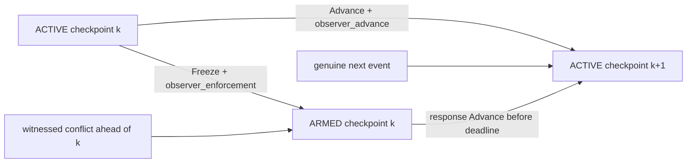
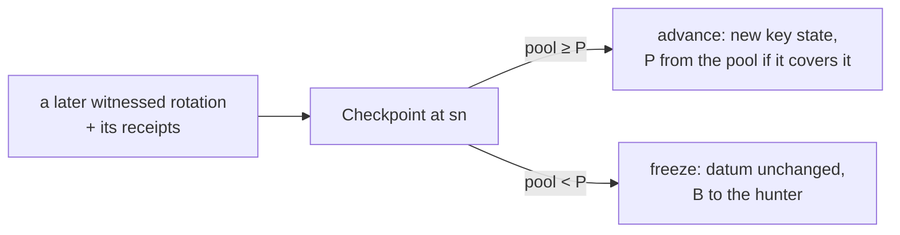
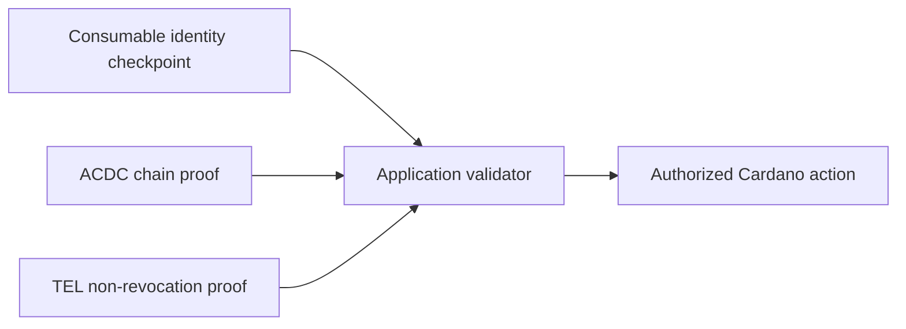

# System architecture

cardano-keri is being built in layers. The only layer with settled vertical
transactions today is the KERI identity checkpoint. Everything above it —
credential verification, value authorization, wallet integration — remains
later work.

!!! abstract "Where this page stands"
    The layer table below is the honest status of each layer. The flows marked
    **shipped** settle on a real ledger; the flows marked **designed** are the
    Lean machine of the M1 return, proved and playable, not built.

## Layer status

| Layer | Purpose | Status |
|---|---|---|
| Identity checkpoint | Project a KERI AID's current keys, thresholds, witnesses and sequence into a sovereign Cardano UTxO | Register, close and advance settled on preprod; the enforcement economy settled on a devnet only |
| The M1 return machine | Poison, three value components, the hunter's premium and freeze, terminal conviction, close by the next keys, reopen | Proved in Lean, playable in the simulator, no on-chain code — epics K4–K5 |
| Registry | One incarnation per AID, ever | Designed; upstream MPFS work — epics U1, U2, K6 |
| Credential verification | Verify ACDC credential chains and TEL revocation state | Designed and prototyped; no settled vertical story |
| Value authorization | Let an application gate a state change on a consumable checkpoint and credentials | Designed; not a shipped service |
| Wallet bridge | Let KERI/Veridian software authorize Cardano actions | Planned; nobody's deliverable yet |

An **ACDC** is an Authentic Chained Data Container, KERI's signed credential
format. A **TEL** is a Transaction Event Log, which records credential issuance
and revocation events.

## The identity checkpoint — shipped

```mermaid
flowchart TB
    subgraph KERI["Off-chain KERI network"]
        AID["AID"]
        KEL["KEL events"]
        SIG["Controller signatures"]
        WIT["Witness receipts"]
        AID --> KEL
        KEL --> SIG
        KEL --> WIT
    end

    subgraph TX["One Cardano operation"]
        CK["Thin checkpoint validator"]
        ENV["ObserverEnvelope<br/>zero-lovelace withdrawal"]
        OBS["Reference observer"]
        CK <--> ENV
        ENV --> OBS
    end

    subgraph CHAIN["Cardano ledger"]
        STATE["Sovereign checkpoint UTxO<br/>AID token · inline datum · value"]
    end

    KEL --> TX
    SIG --> TX
    WIT --> TX
    TX --> STATE
```

The KERI network provides public event evidence. A Cardano relayer builds a
transaction around that evidence. The ledger executes both a thin checkpoint
program that protects state, token and value, and a heavy observer reference
program that verifies the KERI evidence. The result is atomic: both validators
accept the same transaction or nothing changes.

## Registration flow — shipped

Registration adds one preliminary step because KERI uses BLAKE3 and Plutus has
no native BLAKE3 builtin:

```mermaid
sequenceDiagram
    participant K as KERI event
    participant H as Hash-proof policy
    participant R as Registrant
    participant C as Checkpoint + registration observer
    participant L as Ledger

    R->>H: premint inception/AID proof
    H->>L: one deterministic fact token
    R->>C: bare Register + ObserverEnvelope
    C->>L: burn fact token, mint AID checkpoint token
    L-->>R: a bonded checkpoint at sequence zero
```

The proof token only separates expensive hash work from state creation. It adds
no oracle and no privileged registrar. It also does not make registration
unique: nothing today prevents a second checkpoint for the same AID.

## Registration through the registry — designed

The M1 return puts registration behind the registry, and that is the only place
the checkpoint token can ever be minted:

```mermaid
sequenceDiagram
    participant R as Registrant
    participant Q as Registry (a request UTxO)
    participant A as Applier — anyone
    participant L as Ledger

    R->>Q: request: inception, bonds, refund address
    A->>L: apply a batch: absence proof, insert the leaf, mint the checkpoint
    L-->>R: a juvenile checkpoint, one incarnation ever
```

Appliers race on one shared object; the loser wastes work, never safety. A
request nobody applies within its window is retractable with a refund. Close,
reopen and conviction travel the same way as leaf updates. Rotations, poisons,
freezes and top-ups never touch the registry.

## Advance and enforcement — shipped

An ordinary advance consumes the current checkpoint and creates its exact
successor; the advance observer verifies the next KERI rotation, both
controller thresholds, and witness receipts.

Freeze consumes ACTIVE and creates ARMED when the enforcement observer accepts
a witnessed conflicting rotation still ahead of the checkpoint. A timely
response reuses ordinary advance and returns ACTIVE.

```mermaid
flowchart LR
    ACTIVE["ACTIVE checkpoint k"]
    NEXT["genuine next event"]
    CONFLICT["witnessed conflict ahead of k"]
    ARMED["ARMED checkpoint k"]
    ACTIVE2["ACTIVE checkpoint k+1"]

    ACTIVE -->|"Advance + observer_advance"| ACTIVE2
    NEXT --> ACTIVE2
    ACTIVE -->|"Freeze + observer_enforcement"| ARMED
    CONFLICT --> ARMED
    ARMED -->|"response Advance before deadline"| ACTIVE2
```

Evidence is bound to the exact KERI tip, so a later round needs fresh evidence.

## The same plane after the M1 return — designed

The enforcement observer goes. `observer_advance` verifies one thing — a later
witnessed rotation with its receipts — and the register validator dispatches
the effect, which is where advance and freeze part company:

```mermaid
flowchart LR
    P["Checkpoint at sn"]
    EV["a later witnessed rotation<br/>+ its receipts"]
    ADV["advance: new key state,<br/>P from the pool if it covers it"]
    FRZ["freeze: datum unchanged,<br/>B to the hunter"]

    EV --> P
    P -->|"pool ≥ P"| ADV
    P -->|"pool < P"| FRZ
```

Two edges move the identity — a rotation and a poison — and four boundary
transitions cross its edges: register, close, reopen and convict. Nothing has a
deadline; the freeze has no window to expire, because the owner returns by
rotating with a deposit whenever she likes.

## How applications consume identity

A protected application resolves the expected AID-derived asset and includes
the checkpoint as a **CIP-31 reference input**. CIP-31 lets a transaction read
a UTxO without spending it.

The application must:

1. resolve the candidate checkpoint for the AID;
2. validate the quantity-one token, script lineage, version, AID and datum;
3. apply the consumer predicate — today, the bare ACTIVE role address; after
   the M1 return, both bonds full, not poisoned, and past the juvenility
   window;
4. verify its operation-specific controller authorization; and
5. when credentials matter, verify the required ACDC/TEL evidence.

An indexer only helps locate the candidate. The ledger checks establish
authority. A missing or stale lookup fails; it never authorizes a substitute.

## Planned credential plane

The longer-term vLEI path adds credential verification around the identity
checkpoint:

```mermaid
flowchart LR
    ID["Consumable identity checkpoint"]
    ACDC["ACDC chain proof"]
    TEL["TEL non-revocation proof"]
    APP["Application validator"]
    ACTION["Authorized Cardano action"]

    ID --> APP
    ACDC --> APP
    TEL --> APP
    APP --> ACTION
```

The identity and credential questions stay separate:

- the checkpoint answers **which keys currently control this AID?**
- the credential chain answers **what real-world role or authority has an
  issuer granted to this AID?**

Registering an AID does not prove that it is GLEIF, a Qualified vLEI Issuer, or
a legal entity. Those are credential claims.

## Deployment boundary

The settled evidence runs on a private protocol-11 development network with
production transaction limits, and on preprod. The repository does not
currently operate a public checkpoint service, a production KERI watcher or
hunter service, a Cardano mainnet deployment, a full vLEI credential mirror, or
an application that treats these checkpoints as production authority.

See the [story ladder](../story-ladder.md) for exact settled transactions and
the [roadmap](../roadmap.md) for the ordered work beyond them.
