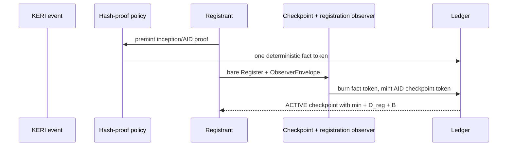
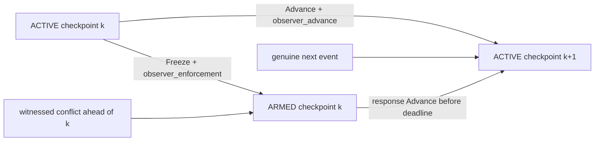
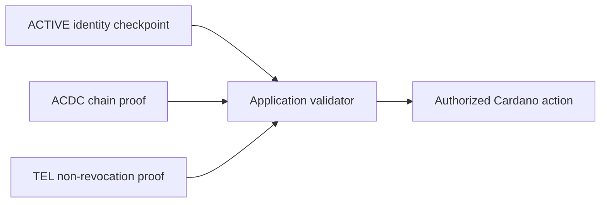

# System architecture

cardano-keri is being built in layers. The only layer with settled vertical
transactions today is the KERI identity checkpoint. Credential verification,
value authorization, and wallet integration remain roadmap work.

This page shows both the current system and the intended consumers without
presenting planned components as deployed.

## Layer status

| Layer | Purpose | Current status |
|---|---|---|
| Identity checkpoint | Project a KERI AID's current keys, thresholds, witnesses, and sequence into a sovereign Cardano UTxO | Small Register, Close, Advance, Freeze, and response settled |
| Delay and divergence enforcement | Reward detection of abandoned lag and punish a witnessed irreconcilable fork | Freeze/response settled; Claim/thaw in flight; Convict planned |
| Credential verification | Verify ACDC credential chains and TEL revocation state | Designed and prototyped; no settled vertical story |
| Value authorization | Let an application gate a state change on an ACTIVE checkpoint and credentials | Designed; not a shipped service |
| Wallet bridge | Let KERI/Veridian software authorize Cardano actions | Planned |

An **ACDC** is an Authentic Chained Data Container, KERI's signed credential
format. A **TEL** is a Transaction Event Log, which records credential issuance
and revocation events.

## Current system: the identity checkpoint

```mermaid
flowchart TB
    subgraph KERI["Off-chain KERI network"]
        AID["AID"]
        KEL["KEL events"]
        SIG["Controller signatures"]
        WIT["Witness receipts"]
        AID --> KEL
        KEL --> SIG
        KEL --> WIT
    end

    subgraph TX["One Cardano operation"]
        CK["Thin checkpoint validator"]
        ENV["ObserverEnvelope<br/>zero-lovelace withdrawal"]
        OBS["Reference observer"]
        CK <--> ENV
        ENV --> OBS
    end

    subgraph CHAIN["Cardano ledger"]
        STATE["Sovereign checkpoint UTxO<br/>AID token · inline datum · escrow"]
    end

    KEL --> TX
    SIG --> TX
    WIT --> TX
    TX --> STATE
```

The KERI network provides public event evidence. A Cardano relayer builds a
transaction around that evidence. The ledger executes both:

- a thin checkpoint program that protects state, token, role, and value; and
- a heavy observer reference program that verifies the KERI evidence.

The result is atomic: both validators accept the same transaction or nothing
changes.

## Registration flow

Registration adds one preliminary step because KERI uses BLAKE3 and Plutus has
no native BLAKE3 builtin:

```mermaid
sequenceDiagram
    participant K as KERI event
    participant H as Hash-proof policy
    participant R as Registrant
    participant C as Checkpoint + registration observer
    participant L as Ledger

    R->>H: premint inception/AID proof
    H->>L: one deterministic fact token
    R->>C: bare Register + ObserverEnvelope
    C->>L: burn fact token, mint AID checkpoint token
    L-->>R: ACTIVE checkpoint with min + D_reg + B
```

The proof token only separates expensive hash work from state creation. It
does not add an oracle or a privileged registrar.

## Advance and enforcement flow

An ordinary Advance consumes the current checkpoint and creates its exact
successor. The Advance observer verifies the next KERI rotation, both
controller thresholds, and witness receipts.

Freeze consumes ACTIVE and creates ARMED when the enforcement observer accepts
a witnessed conflicting rotation that is still ahead of the checkpoint. A
timely response reuses ordinary Advance and returns ACTIVE.

```mermaid
flowchart LR
    ACTIVE["ACTIVE checkpoint k"]
    NEXT["genuine next event"]
    CONFLICT["witnessed conflict ahead of k"]
    ARMED["ARMED checkpoint k"]
    ACTIVE2["ACTIVE checkpoint k+1"]

    ACTIVE -->|"Advance + observer_advance"| ACTIVE2
    NEXT --> ACTIVE2
    ACTIVE -->|"Freeze + observer_enforcement"| ARMED
    CONFLICT --> ARMED
    ARMED -->|"response Advance before deadline"| ACTIVE2
```

The old Freeze proof does not remain reusable after `k+1`. The observer binds
evidence to the exact KERI tip, so a later round needs fresh evidence.

## How future applications consume identity

A future protected application resolves the expected AID-derived asset and
includes the current checkpoint as a **CIP-31 reference input**. CIP-31 lets a
transaction read a UTxO without spending it.

The application must:

1. resolve exactly one candidate checkpoint for the AID;
2. validate the quantity-one token, script lineage, version, AID, and datum;
3. require the bare ACTIVE role address;
4. verify its operation-specific controller authorization; and
5. when credentials matter, verify the required ACDC/TEL evidence.

An indexer only helps locate the candidate. The ledger checks establish
authority. A missing or stale lookup fails; it never authorizes a substitute.

## Planned credential plane

The longer-term vLEI path adds credential verification around the identity
checkpoint:

```mermaid
flowchart LR
    ID["ACTIVE identity checkpoint"]
    ACDC["ACDC chain proof"]
    TEL["TEL non-revocation proof"]
    APP["Application validator"]
    ACTION["Authorized Cardano action"]

    ID --> APP
    ACDC --> APP
    TEL --> APP
    APP --> ACTION
```

The identity and credential questions stay separate:

- the checkpoint answers **which keys currently control this AID?**
- the credential chain answers **what real-world role or authority has an
  issuer granted to this AID?**

Registering an AID does not prove that it is GLEIF, a Qualified vLEI Issuer, or
a legal entity. Those are credential claims.

## Deployment boundary

The settled evidence runs on a private protocol-11 development network with
production transaction limits. The repository does not currently operate:

- a public checkpoint service;
- a production KERI watcher service;
- a Cardano mainnet deployment;
- a full vLEI credential mirror; or
- an application that treats these checkpoints as production authority.

See the [story ladder](../story-ladder.md) for exact settled transactions and
the [roadmap](../roadmap.md) for the ordered work beyond them.
