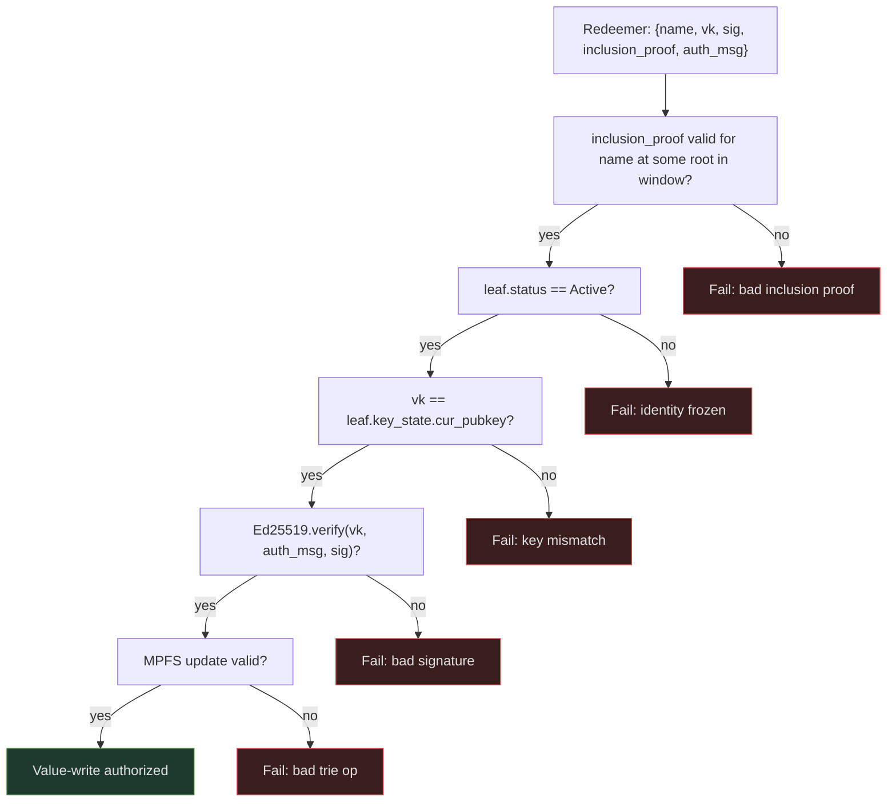
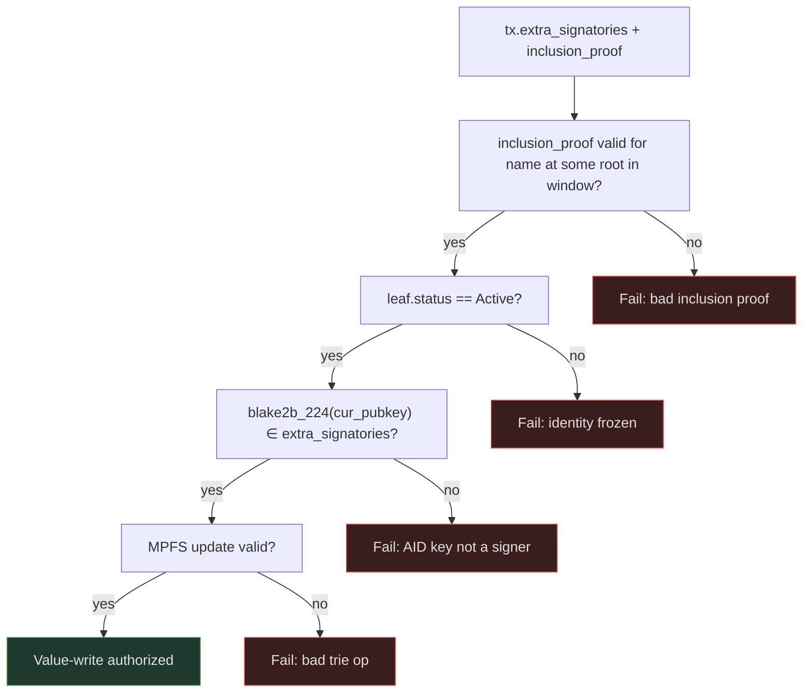

# Value Authorization

A value-write operation mutates a leaf in a value cage MPFS trie and must be authorized by the AID owner. The cage script resolves the authorizing identity by `name` — the human-readable key in the registry trie — which maps to a stable `trie_key` and `cur_pubkey`.

## Registry reference

The cage takes the company registry UTxO as a **CIP-31 reference input** (non-spending). The registry datum carries a sliding window of valid roots. The cage accepts an inclusion proof valid against any root in the window, tolerating oracle write latency.

## Signer resolution

The cage resolves `cur_pubkey` by:

1. Verifying an MPFS inclusion proof `name → leaf` against a root in the registry datum window
2. Checking `leaf.status == Active` — frozen identities are rejected
3. Reading `leaf.key_state.cur_pubkey`

The CESR AID plays no role in on-chain authorization.

## Option A — Detached signature

The transaction redeemer carries the raw public key and a detached [Ed25519](https://www.rfc-editor.org/rfc/rfc8032) signature over a fully-bound authorization message.

**On-chain checks:**
1. Inclusion proof proves `name → leaf` (status Active) against registry window root
2. `vk == leaf.key_state.cur_pubkey`
3. `Ed25519.verify(vk, auth_msg, sig)`

**Authorization message:**
```
auth_msg = cbor({
  domain                     : "cardano-aid/value-write/v1",
  network_id                 : NetworkId,
  registry_oracle_pkh        : ByteArray,
  value_cage_policy_id       : PolicyId,
  value_cage_thread_token    : AssetName,
  name                       : ByteArray,
  key_seq                    : Int,
  identity_root              : ByteArray,
  value_input_root           : ByteArray,
  value_output_root          : ByteArray,
  op_hash                    : ByteArray,
  counter                    : Int,
  valid_from                 : POSIXTime,
  valid_until                : POSIXTime
})
```

The message binds to the registry oracle, the specific cage, the `name`, the key sequence, both MPFS roots, the operation, and a counter with validity window for replay protection.



## Option B — Native signer (preferred)

The AID owner signs the value-write transaction as a native Cardano `extra_signatory`. The cage verifies `blake2b_224(cur_pubkey)` is a transaction signatory.

**On-chain checks:**
1. Inclusion proof proves `name → leaf` (status Active) against registry window root
2. `blake2b_224(leaf.key_state.cur_pubkey) ∈ tx.extra_signatories`
3. MPFS update valid

No app-level signature required. The ledger enforces that the named key signed the transaction.



**Replay protection:** Cardano's UTxO model guarantees uniqueness — each value-write spends and recreates the cage UTxO. No counter or validity interval needed.

## Recommendation

!!! tip "Option B is preferred"
    - No app-level signature to construct or verify
    - Replay protection comes free from UTxO uniqueness
    - Smaller redeemer, cheaper script
    - The AID key must be a standard Cardano Ed25519 payment key

    Use Option A if the AID key must remain isolated from any Cardano payment key (hardware isolation requirements). In that case `auth_msg` counter and validity bounds are required.

## Window root selection

The cage redeemer includes the specific root from the window used for the inclusion proof. The cage script verifies that root is present in `registry_datum.roots`. This makes the proof deterministic and auditable.

If the oracle advances the root (new inception or freeze) between proof construction and tx inclusion, the old root may drop out of the window. The proof must be recomputed against a root still in the window. Window depth 10 gives strong liveness at typical oracle write rates.
