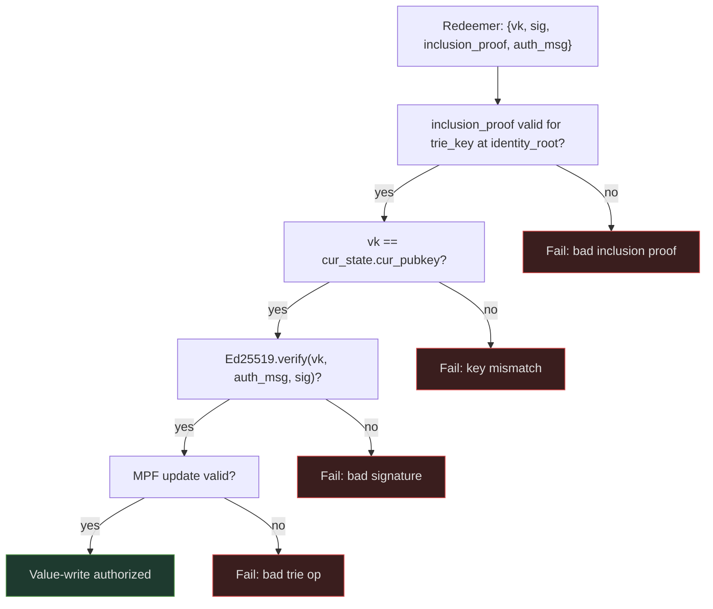
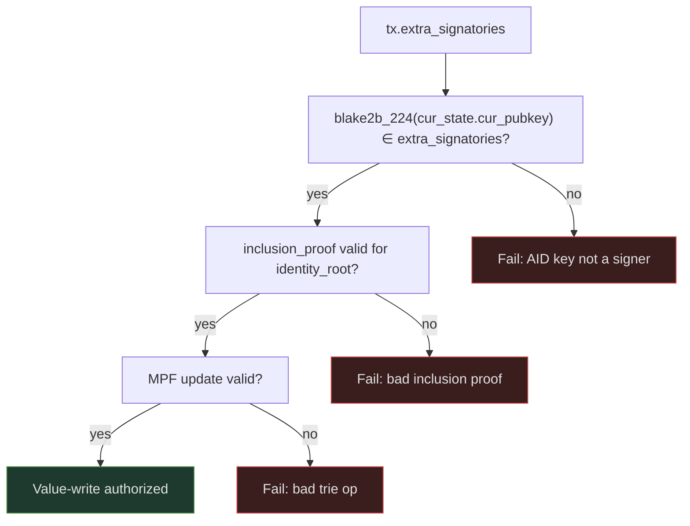

# Value Authorization

A value-write operation mutates a leaf in a value cage MPF trie and must be authorized by the AID owner. Two design options exist. The choice affects both the on-chain script and the key management requirements for AID holders.

!!! note "Open design decision"
    Option A and Option B are both fully specified below. Option B is preferred for the reasons described in the recommendation. Neither has been finalized in the on-chain implementation.

## Signer resolution

The cage script resolves the authorizing identity by `trie_key` — stable across rotations — not by the CESR AID. The CESR AID is stored as metadata in KeyState for off-chain KERI correlation but plays no role in on-chain authorization. This matters for the Veridian bridge: Signify holds the `cur_pubkey` and the cage resolves auth from it directly.

## Option A — Detached signature

The transaction redeemer carries the raw public key and a detached [Ed25519](https://www.rfc-editor.org/rfc/rfc8032) signature over a fully-bound authorization message.

**On-chain checks:**
1. MPF inclusion proof proves `trie_key → cur_state` against identity root from reference input — uses the supplied stable `trie_key` unchanged from inception
2. `vk == cur_state.cur_pubkey` — vk matches the registered current key for this trie_key
3. `Ed25519.verify(vk, auth_msg, sig)` — possession and intent

**Authorization message:**
```
auth_msg = cbor({
  domain                     : "cardano-aid/value-write/v1",
  network_id                 : NetworkId,
  identity_registry_policy_id: PolicyId,
  identity_thread_token      : AssetName,
  value_cage_policy_id       : PolicyId,
  value_cage_thread_token    : AssetName,
  trie_key                   : ByteArray[32],
  key_seq                    : Int,
  identity_root              : Bytes,
  value_input_root           : Bytes,
  value_output_root          : Bytes,
  op_hash                    : Bytes,
  counter                    : Int,
  valid_from                 : POSIXTime,
  valid_until                : POSIXTime
})
```

The message binds to both registry and cage thread tokens, the `trie_key`, the key sequence, and both the input and output MPF roots. The `counter` and validity interval provide replay protection.



**Known issue with Option A:** The original design used `vk_from_tx_signatories` to extract the key. Cardano transaction signatories are 28-byte `blake2b_224` key hashes — not public keys. There is no way to recover the full public key from signatories. The vk must come from the redeemer, and `cur_digest` must be 32-byte `blake2b_256`. See [Vetting](../vetting/index.md) for details.

## Option B — Native signer (preferred)

Redefine `cur_digest` as `blake2b_224(PubKey)` (the standard Cardano payment key hash). The AID key is added to the transaction as a native `extra_signatory`.

**On-chain checks:**
1. `blake2b_224(cur_state.cur_pubkey) ∈ tx.extra_signatories` — AID key hash is a transaction signatory
2. MPF inclusion proof validates identity root from reference input
3. MPF update valid

No app-level signature required. The ledger enforces that the named key signed the transaction. The cage does not need to see the CESR AID — it resolves the signer by `trie_key` and reads `cur_pubkey` from the KeyState value.



**Replay protection:** Cardano's UTxO model guarantees that any transaction spending the cage UTxO is unique (a given UTxO can be spent exactly once). Each value-write consumes and recreates the cage UTxO. No counter or validity interval needed in the auth check itself.

## Recommendation

!!! tip "Option B eliminates two critical issues simultaneously"
    - The hash-width mismatch (28 vs 32 bytes) disappears because `cur_digest` is redefined as `blake2b_224`.
    - Application-level replay protection is replaced by UTxO-model replay protection, which is simpler and already proven correct by the ledger.
    - The on-chain script is smaller and cheaper.
    - The cage does not need to know the CESR AID — it resolves auth via `trie_key` and `cur_pubkey` only.

    **Cost:** The AID key must be a standard Cardano payment key (`Ed25519`, compatible with wallet key derivation). Holders cannot use exotic key types that the Cardano ledger does not support as signatories.

    If the AID key must be kept separate from any Cardano wallet key (e.g., hardware isolation requirements), Option A with a redeemer-carried `vk` and 32-byte `cur_digest` is the correct path. In that case, the `auth_msg` counter and validity bounds are essential.
