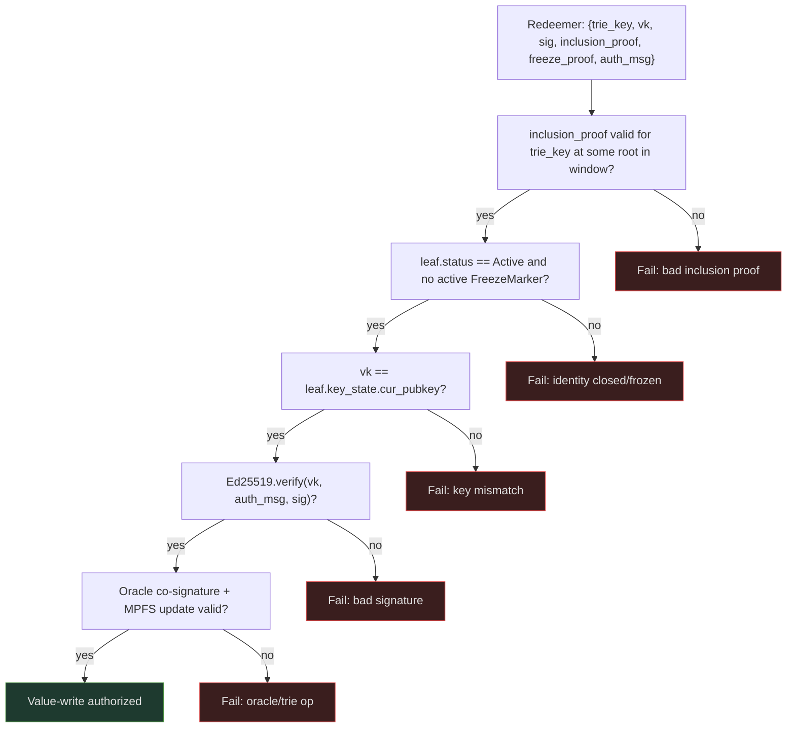
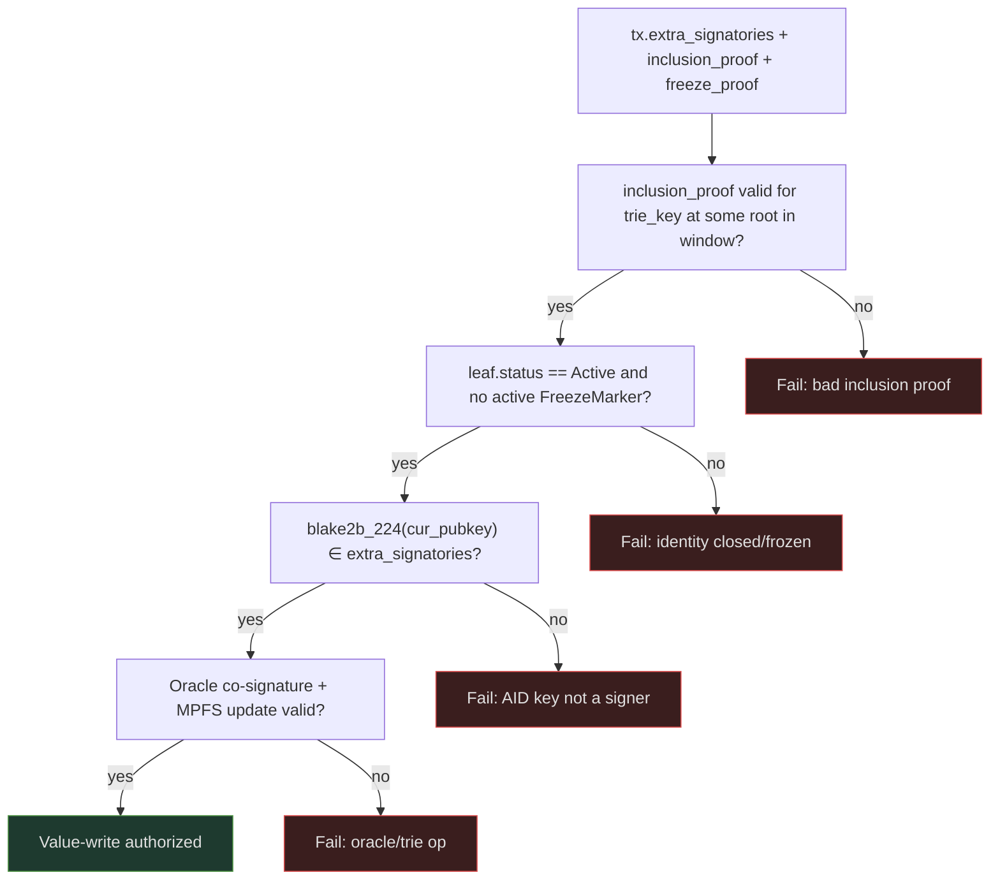

# Value Authorization

A value-write operation mutates a leaf in a value cage MPFS trie. Every leaf
mutation requires **two authorizations**: the leaf owner's Ed25519
authorization against the identity registry key-state, and the cage oracle's
co-signature (necessary-not-sufficient — the oracle provides liveness and
cannot forge; see [Architecture Overview](overview.md#residual-oracle-trust-value-plane-only)).

!!! warning "Current-authorization path reframed to the sovereign per-AID checkpoint (#92)"
    The `trie_key` / sliding-root-window resolution described on this page is the
    **rejected Candidate-B shared/global MPFS registry** shape. Per the #92 decision
    (`specs/92-checkpoint-contention/DECISION.md`), each AID's current authority now lives
    in its **own sovereign, per-AID, quantity-one uniquely-tokenized checkpoint UTxO** —
    asset id `(checkpoint_policy_id, aid_asset_name)`, current keys in the inline
    `CheckpointDatum`. A cage resolves current authority by reading that AID's checkpoint as
    a CIP-31 **reference input**; a `delta = 0` rotation (`seq + 1`) advances it and makes
    pending authorizations **stale** (universal re-authorization). Discovery is a **generic
    `(policy_id, asset_name)` multi-asset index lookup** (any indexer / node / sidecar), not
    a shared-registry inclusion proof against a windowed root. The mechanical redeemer/proof
    re-cut is downstream #24.

    **Indexer / discovery trust boundary.** The generic `(policy_id, asset_name)` index
    lookup supplies **only a candidate outref / location for liveness — never identity or
    current-authority truth**. The **consuming transaction validates** the returned UTxO
    against the ledger: the exact **quantity-one policy + asset**; an **accepted checkpoint
    script / version / lineage**; a **well-formed inline datum with the expected AID /
    sequence binding and the current weighted key state**; and the **applicable active /
    freeze rules** (validation rules, **not** datum fields). The returned TxOut is **locked
    at the designated script-hash address**; the **datum itself does not own an address**. A
    **stale or false outref fails ledger validation** (it no longer exists, or no longer
    matches) → refresh / retry; it can never yield forged authority. An **indexer outage
    only blocks transaction construction (liveness)** — it never grants false authority.

    The **freeze registry** below is preserved, but note honestly: it is a **shared,
    attacker-contendable** UTxO — **not** sovereign. The sovereign emergency path must not
    reintroduce a shared attacker-contendable UTxO; re-cutting R-FRZ sovereign is a
    downstream residual.

Under the superseded shared-registry shape the cage script resolved the authorizing
identity by `trie_key`; under the sovereign per-AID checkpoint (#92) it instead reads the
AID's own `(checkpoint_policy_id, aid_asset_name)` checkpoint UTxO (see
[AID Model](../design/aid-model.md)).

## Registry reference

The cage takes the identity registry UTxO (and the freeze registry UTxO) as
**CIP-31 reference inputs** (non-spending). The registry datum carries a
sliding window of valid roots. The cage accepts an inclusion proof valid
against any root in the window, tolerating registry write latency.

## Signer resolution

The cage resolves `cur_pubkey` by:

1. Verifying an MPFS inclusion proof `trie_key → leaf` against a root in the registry datum window
2. Checking `leaf.status == Active` — closed and frozen identities are rejected
3. Checking no active `FreezeMarker` for `trie_key` (absence proof against the freeze root; a marker is active while `marker.seq == key_state.seq` — see [Identity Operations — Emergency freeze](identity-ops.md#emergency-freeze))
4. Reading `leaf.key_state.cur_pubkey`

The CESR AID plays no role in on-chain authorization.

## Option A — Detached signature

The transaction redeemer carries the raw public key and a detached
[Ed25519](https://www.rfc-editor.org/rfc/rfc8032) signature over a
fully-bound authorization message. The AID owner need not sign the Cardano
transaction itself — the authorization travels as data.

**On-chain checks:**

1. Signer resolution above (Active + no freeze marker)
2. `vk == leaf.key_state.cur_pubkey`
3. `Ed25519.verify(vk, auth_msg, sig)`

**Authorization message:**

```
auth_msg = cbor({
  domain                     : "cardano-keri/value-write/v1",
  network_id                 : NetworkId,
  value_cage_policy_id       : PolicyId,
  value_cage_thread_token    : AssetName,
  trie_key                   : ByteArray[32],
  key_seq                    : Int,
  identity_root              : ByteArray,
  value_input_root           : ByteArray,
  value_output_root          : ByteArray,
  op_hash                    : ByteArray,
  counter                    : Int,
  valid_from                 : POSIXTime,
  valid_until                : POSIXTime
})
```

The message binds to the specific cage, the `trie_key`, the key sequence,
both MPFS roots, the operation, and a counter with validity window for replay
protection.



## Option B — Native signer

The AID owner signs the value-write transaction as a native Cardano
`extra_signatory`. The cage verifies `blake2b_224(cur_pubkey)` is a
transaction signatory.

**On-chain checks:**

1. Signer resolution above (Active + no freeze marker)
2. `blake2b_224(leaf.key_state.cur_pubkey) ∈ tx.extra_signatories`
3. Oracle co-signature + MPFS update valid

No app-level signature required. The ledger enforces that the named key
signed the transaction.



**Replay protection:** Cardano's UTxO model guarantees uniqueness — each
value-write spends and recreates the cage UTxO. No counter or validity
interval needed.

## Choosing the mode

The two options are not a preference ranking — each is **structurally
required** in different flows. The verifier library must expose both.

| Situation | Mode | Why |
|---|---|---|
| The AID owner signs the executing transaction (self-submitted cage writes, contract state transitions, delegation certificates) | **Option B** | Cheapest: no app-level signature, replay protection free from UTxO uniqueness |
| A third party signs the executing transaction (batcher-executed DEX orders, ceremony assemblers, any order/intent consumed later) | **Option A — the only option** | The owner's key is *not* among the transaction signatories; the authorization must travel inside the data, fully bound and validity-bounded |
| The AID key must stay isolated from any Cardano payment key (hardware custody constraints) | **Option A** | The key never signs a Cardano transaction |

!!! warning "Option B cannot cover the flagship use case"
    On batcher-model DEXes the trader never signs the executing transaction,
    so a required-signer check has nothing to find. Detached-signature
    authorization is part of the use-case-invariant core — see
    [Business Cases — factored core](../design/business-cases/index.md#the-factored-core-required-by-every-case)
    and the [Regulated DeFi case](../design/business-cases/regulated-defi.md).
    Where the actor does sign the transaction, Option B remains the cheaper
    path.

When Option A is used, the `auth_msg` counter and validity bounds are
required.

## Window root selection

The cage redeemer includes the specific root from the window used for the
inclusion proof. The cage script verifies that root is present in
`registry_datum.roots`. This makes the proof deterministic and auditable.

If the registry advances the root (new inception, rotation, close, or freeze)
between proof construction and tx inclusion, the old root may drop out of the
window. The proof must be recomputed against a root still in the window.
Window depth 10 gives strong liveness at typical registry write rates.
