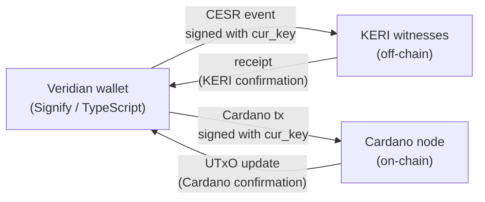

# Veridian Bridge

## What is Veridian

Veridian is a Signify-based KERI wallet written in TypeScript. It manages Ed25519 key pairs, produces CESR-encoded Key Event Logs (KELs), and interacts with KERI witnesses for receipt collection. Identities in Veridian are identified by their CESR AID — a self-certifying 32-byte value derived as `blake3(cesr_inception_event)`.

Signify holds keys in an encrypted key store. Keys are never exported in plaintext. The wallet exposes signing operations: sign a message with the current key, sign with the next key (at rotation time).

## The bridge approach: same keys, two registries

The core insight of the Veridian bridge is that the same Ed25519 keys serve two independently advancing pre-rotation state machines:

1. **KERI registry (off-chain):** The KEL, broadcast to witnesses, identifies the AID by its CESR AID. Witnesses collect and return receipts. Rotations advance the KEL.

2. **Cardano registry (on-chain):** The identity UTxO, updated via Cardano transactions, identifies the same identity by its `trie_key`. Rotations update the on-chain KeyState.

No re-keying is required. The same private key that signs KERI events also signs Cardano transactions. The on-chain binding is established at inception and must be re-verified off-chain at every rotation — see [Binding verification protocol](#binding-verification-protocol).



## Digest agility requirement

!!! danger "Required for seq-0 binding to be verifiable"
    The Veridian bridge SDK **MUST** generate KERI inception events that use `blake2b_256` digest agility for the next-key commitment, over the same canonical next-key byte encoding that Cardano hashes.

    Standard KERI inception events use Blake3 digest agility for the `n` (next key digest) field. Cardano uses `blake2b_256`. At seq 0, the `next_pubkey` is secret, so an off-chain verifier cannot derive `next_digest` from the public KEL unless both sides use the same hash.

    **Mandate:** Veridian bridge inception events must set `n = base64url(blake2b_256(canonical_next_pubkey_bytes))` instead of the default `n = base64url(blake3_256(canonical_next_pubkey_bytes))`. Then:

    ```
    KEL.inception.n decoded == Cardano.KeyState.next_digest  [byte-for-byte]
    ```

    Without this alignment, the bridge binding is unverifiable until first rotation — exactly the identity's most vulnerable period. See [Seq-0 binding gap](../design/aid-model.md#seq-0-binding-gap).

## Key stack

```
Veridian wallet (Signify/TypeScript)
  ↓ same Ed25519 keys, no re-keying; blake2b_256 digest agility
cardano-aid-sdk (TypeScript)
  ↓ pure proof/redeemer building (no IO, no network)
cardano-aid-wasm (Haskell WASM, pure)
  ↓ compiled to wasm32-wasi
cardano-aid identity UTxO (on-chain)
  ↓ CIP-31 reference input (non-spending)
MPFS value cages (on-chain)
  ↓ also consult freeze registry for revocation freshness
cardano-aid freeze registry UTxO (on-chain)
```

## WASM module

`cardano-aid-wasm` is a pure Haskell module compiled to WASM via GHC-WASM. It contains no IO, no networking, and no filesystem access. All functions are deterministic given their inputs.

```
cardano-aid-wasm (Haskell → GHC-WASM, pure)
  ├── computeTrieKey(cur_pubkey, next_digest) → ByteArray[32]
  ├── buildIncMsg(trie_key, cur_pubkey, next_digest, cesr_aid, identity_root) → ByteArray
  ├── buildInceptionRedeemer(trie_key, cur_pubkey, next_digest, cesr_aid, sig, absence_proof) → CBOR
  ├── buildRotationRedeemer(trie_key, reveal_key, new_next, sig, inclusion_proof) → CBOR
  ├── buildCloseRedeemer(trie_key, sig, inclusion_proof) → CBOR
  ├── buildFreezeRedeemer(trie_key, reveal_key, sig, id_inclusion_proof, freeze_proof) → CBOR
  ├── buildValueWriteRedeemer(trie_key, op, id_proof, cage_proof) → CBOR
  ├── computeAbsenceProof(trie_snapshot, trie_key) → proof
  └── computeInclusionProof(trie_snapshot, trie_key) → proof
```

The SDK exposes `buildIncMsg` as a separate function so the intent transcript (see WASM/TypeScript boundary below) can show the user what they are signing before the signature is produced.

`cardano-aid-sdk` wraps the WASM module with TypeScript and adds live-data operations (fetching snapshots, submitting transactions):

```
cardano-aid-sdk (TypeScript, wraps WASM)
  ├── fetchIdentitySnapshot(api) → trie snapshot
  ├── fetchFreezeSnapshot(api) → freeze trie snapshot
  ├── buildInceptionTx(wallet, curPubkey, nextDigest, cesrAid) → UnsignedTx + IntentTranscript
  ├── buildRotationTx(wallet, revealKey, newNext) → UnsignedTx + IntentTranscript
  ├── buildCloseTx(wallet, trieKey) → UnsignedTx + IntentTranscript
  ├── buildFreezeTx(wallet, trieKey, revealKey) → UnsignedTx + IntentTranscript
  └── buildValueWriteTx(wallet, cageUtxo, trieKey, op) → UnsignedTx + IntentTranscript
```

## WASM/TypeScript boundary and intent transcript

The pure WASM builder returns not just CBOR blobs but a typed **IntentTranscript** that the TypeScript layer displays to the user before requesting Signify to sign. This prevents a compromised or buggy SDK from asking Signify to sign a valid Cardano operation that is semantically not the operation the user intended.

```typescript
interface IntentTranscript {
  operation        : 'inception' | 'rotation' | 'close' | 'freeze' | 'value-write'
  registryToken    : string
  freezeToken      : string | null
  trieKey          : Uint8Array   // stable identity handle
  cesrPrefix       : string       // Veridian AID (metadata, for UX display)
  seq              : number
  curPubkey        : Uint8Array
  nextDigest       : Uint8Array
  identityRoot     : Uint8Array
  freezeRoot       : Uint8Array | null
  validityInterval : { from: Slot; to: Slot } | null
}
```

The SDK MUST display the IntentTranscript to the user (or consuming application) and obtain approval before calling `wallet.signAndSubmit(tx)`.

## Transaction specifications

### Inception transaction

Registers the identity in the Cardano registry for the first time. Requires the ADA deposit (protocol-defined minimum).

```
inc_msg = cbor({
  domain               : "cardano-aid/inception/v1",
  network_id           : NetworkId,
  registry_policy_id   : PolicyId,
  registry_thread_token: AssetName,
  trie_key             : ByteArray[32],
  cur_pubkey           : ByteArray[32],
  next_digest          : ByteArray[32],
  cesr_aid             : ByteArray[32],   -- must be signed; prevents front-run metadata poisoning
  identity_root        : ByteArray[32]
})

Redeemer — Inception {
  trie_key     : ByteArray[32]  -- blake2b_256(cbor({cur_pubkey, next_digest}))
  cur_pubkey   : ByteArray[32]  -- raw Ed25519 public key
  next_digest  : ByteArray[32]  -- blake2b_256(next_pubkey); KEL.n decoded == this
  cesr_aid     : ByteArray[32]  -- decoded CESR AID, metadata only, also inside inc_msg
  sig          : ByteArray[64]  -- Ed25519(cur_pubkey, inc_msg)
  absence_proof               -- MPF proof trie_key not in trie
}

On-chain checks:
  1. trie_key == blake2b_256(cbor({cur_pubkey, next_digest}))
  2. absence_proof valid against current identity_root
  3. Ed25519(cur_pubkey, inc_msg, sig) valid
  4. ADA value >= deposit_amount
  5. Insert trie_key → {cur_pubkey, next_digest, seq=0, cesr_aid}
```

### Rotation transaction

Advances the key-state. The `trie_key` is unchanged — it was fixed at inception.

```
Redeemer — Rotation {
  trie_key       : ByteArray[32]  -- unchanged from inception
  reveal_key     : ByteArray[32]  -- the next_key from the previous step, now revealed
  new_next       : ByteArray[32]  -- blake2b_256(new_next_key)
  sig            : ByteArray[64]  -- Ed25519(reveal_key, rot_msg)
  inclusion_proof               -- MPF proof trie_key → current KeyState
}

On-chain checks:
  1. blake2b_256(reveal_key) == cur_state.next_digest
  2. Ed25519(reveal_key, rot_msg, sig) valid
  3. inclusion_proof valid against current identity_root
  4. seq_to == cur_state.seq + 1
  5. Update trie_key → {reveal_key, new_next, seq+1, cur_state.cesr_aid}
```

### Value-write transaction

Authorizes a cage leaf operation using the AID identity. The cage resolves the signer via `trie_key`, not CESR AID.

```
Redeemer — ValueWrite {
  trie_key    : ByteArray[32]  -- stable across rotations
  op          : CageOp         -- insert / update / delete
  id_proof    : InclusionProof -- MPF proof of trie_key in identity registry
  freeze_proof: FreezeProof    -- absence proof in freeze registry (no active freeze)
  cage_proof  : CageProof      -- cage-specific authorization proof
}
```

Value cages check both the identity root and the freeze root before authorizing writes. If an active freeze marker exists for `(trie_key, seq, cur_pubkey_hash)`, the write is rejected regardless of the native signer.

## Binding verification protocol

**`cesr_aid → trie_key` is not a lookup function.** Multiple registrants can assert the same `cesr_aid`. The only authoritative resolution is the KEL-derived computation below. Run this protocol to verify that a given Cardano `KeyState` corresponds to a given Veridian AID.

**For freshly-incepted identities (seq 0):**
1. Replay the KERI KEL for the CESR AID. Verify CESR self-cert and witness receipts under KERI rules.
2. Extract `cur_pubkey` from the KEL's inception `k` field.
3. Decode the KEL's `n` field: `next_digest = decode_base64url(n)`. This MUST equal the Cardano `KeyState.next_digest` byte-for-byte (the digest agility mandate ensures this).
4. Recompute: `expected_trie_key = blake2b_256(cbor({cur_pubkey, next_digest}))`.
5. Verify `KeyState[expected_trie_key].cesr_aid == decoded_cesr_aid`. Discard any other row claiming the same `cesr_aid` — they are squatters.

**For rotated identities (seq > 0):** run the above for the inception event, then verify at each rotation that `KEL.rotation[seq].cur_pubkey == KeyState[seq].cur_pubkey` and `KEL.rotation[seq].n decoded == KeyState[seq].next_digest`. If any rotation diverges, the Cardano chain has forked from the KERI KEL; treat the identity as suspect and alert.

**Duplicate cesr_aid handling:** if multiple `KeyState` rows in the Cardano registry assert the same `cesr_aid`, only one can be the legitimate registrant — the one whose inception `cur_pubkey` and `next_digest` match the KEL's inception event. All others are squatters. Resolvers MUST perform the recomputation above, not simply trust whichever row appears first or latest.

## Signify integration

```typescript
import { CardanoAidWasm } from 'cardano-aid-wasm'
import { CardanoAidSdk } from 'cardano-aid-sdk'

const wasm = await CardanoAidWasm.load()
const sdk = new CardanoAidSdk(wasm, { apiUrl: 'https://mpfs.example.com' })

// At inception — first time linking KERI identity to Cardano
// curPubkey and nextDigest come from Veridian's Signify key store
// IMPORTANT: nextDigest MUST be blake2b_256(nextPubkey), not blake3(nextPubkeyStr)
const { tx, transcript } = await sdk.buildInceptionTx(wallet, {
  curPubkey,
  nextDigest,  // must equal KEL.inception.n decoded
  cesrAid: decodeBase64Url(aid.prefix),
})
await showUserTranscript(transcript)  // display intent before signing
await wallet.signAndSubmit(tx)

// At rotation — hooked into Signify rotate()
const { tx, transcript } = await sdk.buildRotationTx(wallet, { revealKey, newNext })
await showUserTranscript(transcript)
await wallet.signAndSubmit(tx)  // signed with revealKey

// Emergency freeze — if cur_key is stolen
// Call before or concurrently with KERI emergency rotation
const { tx, transcript } = await sdk.buildFreezeTx(wallet, trieKey, nextRevealKey)
await wallet.signAndSubmit(tx)  // fast path: separate freeze UTxO, low contention

// Value-write — authorized via trie_key, no CESR AID needed
const { tx, transcript } = await sdk.buildValueWriteTx(wallet, cageUtxo, trieKey, op)
await showUserTranscript(transcript)
await wallet.signAndSubmit(tx)
```

## Synchronization lag

Cardano block time is approximately 20 seconds. After a KERI rotation in Veridian:

- KERI witnesses receive the rotation event and issue receipts sub-second.
- The Cardano registry still shows the old key until the rotation transaction lands.

**During this window**, the stolen `cur_key` retains full value-write authorization on all cages that do not check the freeze registry. The freeze operation provides an emergency channel that does not compete with the inception-heavy main registry.

**Emergency rotation workflow:**
1. Detect key compromise.
2. Immediately submit KERI emergency rotation to witnesses.
3. **Immediately submit freeze tx** to the freeze registry (low-contention, fast).
4. Submit Cardano rotation tx (may be delayed by main registry contention).
5. After freeze lands: cages reject the stolen `cur_key`.
6. After rotation lands: freeze marker expires automatically (`seq` advances).

## Two independent state machines

The Cardano and KERI registries are two independently advancing pre-rotation state machines sharing inception material. Nothing on-chain forces Cardano rotations to track KERI rotations. The binding is established once at inception and must be re-proven off-chain at every rotation.

- Cardano cages authorize against the Cardano key-state, not KERI state.
- If Cardano rotations diverge from KERI rotations, cages may honor a key the Veridian identity does not govern.
- Off-chain verifiers must run the full binding verification at each rotation, not just at inception.

## Convergence enforcement

Keeping the two registries in sync is not just good practice — it is enforced by the protocol via the super watcher mechanism. A controller who diverges their Cardano key-state from their KERI KEL loses their registry deposit to the first watcher that presents the proof.

See [Super Watcher](../design/super-watcher.md) for the full design.
