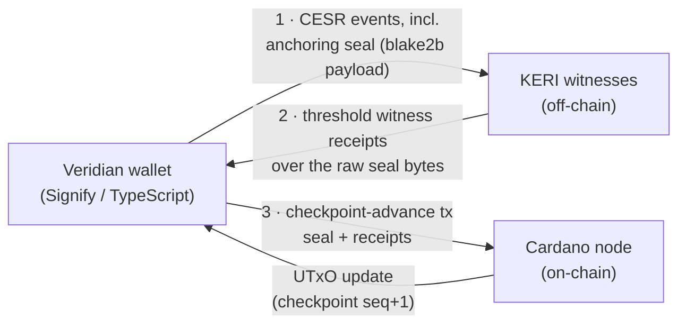

# Veridian Bridge

## What is Veridian

Veridian is a [Signify](https://github.com/WebOfTrust/signify-ts)-based [KERI](https://github.com/WebOfTrust/ietf-keri) wallet written in TypeScript. It manages [Ed25519](https://www.rfc-editor.org/rfc/rfc8032) key pairs, produces [CESR](https://github.com/WebOfTrust/ietf-cesr)-encoded Key Event Logs (KELs), and interacts with KERI witnesses for receipt collection. Identities in Veridian are identified by their CESR AID — a self-certifying 32-byte value. cardano-keri is E-native: `cesr_aid = blake3_256(cesr_inception_event)` — the standard Veridian derivation, unmodified.

Signify holds keys in an encrypted key store. Keys are never exported in plaintext. The wallet exposes signing operations: sign a message with the current key, sign with the next key (at rotation time).

!!! warning "Redeemer/proof shapes reframed to the sovereign per-AID checkpoint (#92)"
    The SDK redeemers and the `inclusion_proof` / `absence_proof` / `identity_root`-window
    flows on this page are the old #24 shared-registry shape. Per
    `specs/92-checkpoint-contention/DECISION.md`, current authority is the AID's **sovereign
    per-AID checkpoint UTxO** — asset id `(checkpoint_policy_id, aid_asset_name)`, current
    keys in the inline `CheckpointDatum`, `delta = 0` rotation — discovered by a **generic
    `(policy_id, asset_name)` multi-asset lookup** and read as a CIP-31 reference input, not
    an MPF inclusion proof against a windowed root. The mechanical redeemer/SDK re-cut is
    downstream #24. That generic lookup supplies **only a candidate outref for liveness,
    never identity/current-authority truth** — the consuming tx revalidates the quantity-one
    policy+asset, an accepted checkpoint script/version/lineage, a well-formed inline datum
    with the expected AID/sequence binding and current weighted key state, and the applicable
    active/freeze rules against the ledger, so a stale/false outref fails validation
    (refresh/retry) and an indexer outage blocks construction only, not authority (see
    [Architecture Overview](overview.md#architecture-overview) and
    `specs/92-checkpoint-contention/spec.md` §Indexer / discovery trust boundary). The
    **freeze registry** remains a **shared, attacker-contendable** UTxO
    (**not** sovereign) — a downstream residual to re-cut sovereign.

## The bridge approach: same keys, one state machine

!!! warning "Superseded framing (2026-07-09)"
    This page was written against the **two-independently-advancing-machines** model.
    Per `specs/68-keystate-shape/identity-model.md` (PR #87) there is **one** state
    machine — the witnessed KEL — and Cardano holds a **checkpoint** advanced only by
    witness-receipted **anchoring seals**. The wallet's bridge duty changes accordingly:
    emit the anchoring seal per rotation (and the §6a handoff pre-announcement on witness
    changes), collect witness receipts, and submit/relay the checkpoint-advance tx.
    "Same keys" survives; "two registries" does not.

The core insight of the Veridian bridge is that the same Ed25519 keys serve both worlds:

1. **KERI (off-chain):** The KEL, broadcast to witnesses, identifies the AID by its CESR
   AID. Witnesses collect and return receipts. Rotations advance the KEL — and each
   rotation is followed by an **anchoring seal** carrying blake2b commitments to the new
   key-state.

2. **Cardano (on-chain):** The identity **checkpoint**, keyed by `cesr_aid`, advances
   when the seal plus its threshold witness receipts are presented in an advance tx.

For a witnessed checkpoint, this is a hard V1 gate: controller signatures without the
configured threshold receipts are rejected, with no timeout fallback. If witnesses are
unavailable, Cardano does not advance. That is a liveness failure rather than permission to
create a private Cardano branch.

No re-keying is required. The same private key that signs KERI events signs the Cardano
advance; the chain verifies the seal's blake2b commitments and the Ed25519 receipts over
the raw seal bytes.



## Digest agility requirement

!!! warning "Requirement dissolved by the E-native contract (2026-07-16)"
    There is **no digest-agility requirement anymore.** The checkpoint datum
    stores the standard Blake3 KEL `n` entries byte-for-byte
    (`next_keys[i] = blake3_256(qb64(next_verkey_i))` — exactly what keripy
    emits by default), so unmodified Veridian identities satisfy the seq-0
    correspondence out of the box:

    ```
    KEL.inception.n decoded == checkpoint.next_keys  [byte-for-byte]
    ```

    The historical F-prefix mandate and its test vector are kept below for the
    archived Candidate-B lineage only.

### Canonical encoding

`canonical_next_pubkey_bytes` = the raw 32-byte Ed25519 public key, no CESR prefix, no encoding wrapper. Extract from the CESR key material by stripping the 1-byte derivation code and taking the following 32 bytes.

**Test vector** (input is the RFC 8032 Ed25519 Test 1 public key):

```
next_pubkey_raw_bytes (hex):
  d75a980182b10ab7d54bfed3c964073a0ee172f3daa62325af021a68f707511a

blake2b_256(next_pubkey_raw_bytes):
  next_digest (hex):
  7849ac3049680be1ef762efe0d36e01733c3464eb0c7c558138acf24bb263bd3

CESR F-prefix qb64 encoding of next_digest (44 chars):
  FHhJrDBJaAvh73Yu_g024Bczw0ZOsMfFWBOKzyS7JjvT

KEL n field:
  "n": "FHhJrDBJaAvh73Yu_g024Bczw0ZOsMfFWBOKzyS7JjvT"
```

Regenerate with:

```sh
printf 'd75a980182b10ab7d54bfed3c964073a0ee172f3daa62325af021a68f707511a' \
  | xxd -r -p | b2sum -l 256
```

```python
import hashlib, base64
raw = bytes.fromhex('d75a980182b10ab7d54bfed3c964073a0ee172f3daa62325af021a68f707511a')
digest = hashlib.blake2b(raw, digest_size=32).digest()
# CESR qb64 for a 1-char code over a 32-byte raw value:
# prepend one zero pad byte, base64url-encode, replace the leading pad char with the code
qb64 = 'F' + base64.urlsafe_b64encode(b'\x00' + digest).decode().rstrip('=')[1:]
```

Any SDK implementation MUST reproduce this vector exactly before shipping —
the digest with the same Blake2b-256 the Cardano/Aiken path uses, the qb64
with CESR pad semantics (the 43 chars after `F` are **not** a plain
`base64url(digest)`).

The `n` field in the KERI inception event carries this CESR-qualified value. Cardano stores only `next_digest` (the raw 32 bytes after decoding). The blake2b_256 hash is applied to `next_pubkey_raw_bytes` — never to the CESR-qualified string.

## Key stack

```
Veridian wallet (Signify/TypeScript)
  ↓ same Ed25519 keys, no re-keying; blake2b_256 digest agility
cardano-keri-sdk (TypeScript)
  ↓ pure proof/redeemer building (no IO, no network)
cardano-keri-wasm (Haskell WASM, pure)
  ↓ compiled to wasm32-wasi
cardano-keri identity UTxO (on-chain)
  ↓ CIP-31 reference input (non-spending)
MPFS value cages (on-chain)
  ↓ also consult freeze registry for revocation freshness
cardano-keri freeze registry UTxO (on-chain)
```

## WASM module

`cardano-keri-wasm` is a pure Haskell module compiled to WASM via GHC-WASM. It contains no IO, no networking, and no filesystem access. All functions are deterministic given their inputs.

```
cardano-keri-wasm (Haskell → GHC-WASM, pure)
  ├── computeTrieKey(cur_pubkey, next_digest) → ByteArray[32]
  ├── buildIncMsg(trie_key, cur_pubkey, next_digest, cesr_aid, identity_root) → ByteArray
  ├── buildInceptionRedeemer(trie_key, cur_pubkey, next_digest, cesr_aid, sig, absence_proof) → CBOR
  ├── buildRotationRedeemer(trie_key, reveal_key, new_next, sig, inclusion_proof) → CBOR
  ├── buildCloseRedeemer(trie_key, sig, inclusion_proof) → CBOR
  ├── buildFreezeRedeemer(trie_key, reveal_key, sig, id_inclusion_proof, freeze_proof) → CBOR
  ├── buildValueWriteRedeemer(trie_key, op, id_proof, cage_proof) → CBOR
  ├── computeAbsenceProof(trie_snapshot, trie_key) → proof
  └── computeInclusionProof(trie_snapshot, trie_key) → proof
```

The SDK exposes `buildIncMsg` as a separate function so the intent transcript (see WASM/TypeScript boundary below) can show the user what they are signing before the signature is produced.

`cardano-keri-sdk` wraps the WASM module with TypeScript and adds live-data operations (fetching snapshots, submitting transactions):

```
cardano-keri-sdk (TypeScript, wraps WASM)
  ├── fetchIdentitySnapshot(api) → trie snapshot
  ├── fetchFreezeSnapshot(api) → freeze trie snapshot
  ├── buildInceptionTx(wallet, curPubkey, nextDigest, cesrAid) → UnsignedTx + IntentTranscript
  ├── buildRotationTx(wallet, revealKey, newNext) → UnsignedTx + IntentTranscript
  ├── buildCloseTx(wallet, trieKey) → UnsignedTx + IntentTranscript
  ├── buildFreezeTx(wallet, trieKey, revealKey) → UnsignedTx + IntentTranscript
  └── buildValueWriteTx(wallet, cageUtxo, trieKey, op) → UnsignedTx + IntentTranscript
```

## WASM/TypeScript boundary and intent transcript

The pure WASM builder returns not just CBOR blobs but a typed **IntentTranscript** that the TypeScript layer displays to the user before requesting Signify to sign. This prevents a compromised or buggy SDK from asking Signify to sign a valid Cardano operation that is semantically not the operation the user intended.

```typescript
interface IntentTranscript {
  operation        : 'inception' | 'rotation' | 'close' | 'freeze' | 'value-write'
  registryToken    : string
  freezeToken      : string | null
  trieKey          : Uint8Array   // stable identity handle
  cesrPrefix       : string       // Veridian AID (metadata, for UX display)
  seq              : number
  curPubkey        : Uint8Array
  nextDigest       : Uint8Array
  identityRoot     : Uint8Array
  freezeRoot       : Uint8Array | null
  validityInterval : { from: Slot; to: Slot } | null
}
```

The SDK MUST display the IntentTranscript to the user (or consuming application) and obtain approval before calling `wallet.signAndSubmit(tx)`.

## Transaction specifications

### Inception transaction

Registers the identity in the Cardano registry for the first time. Requires the ADA deposit (protocol-defined minimum).

```
inc_msg = cbor({
  domain               : "cardano-keri/inception/v1",
  network_id           : NetworkId,
  registry_policy_id   : PolicyId,
  registry_thread_token: AssetName,
  trie_key             : ByteArray[32],
  cur_pubkey           : ByteArray[32],
  next_digest          : ByteArray[32],
  cesr_aid             : ByteArray[32],   -- must be signed; prevents front-run metadata poisoning
  identity_root        : ByteArray[32]
})

Redeemer — Inception {
  trie_key     : ByteArray[32]  -- blake2b_256(cbor({cur_pubkey, next_digest}))
  cur_pubkey   : ByteArray[32]  -- raw Ed25519 public key
  next_digest  : ByteArray[32]  -- blake2b_256(next_pubkey); KEL.n decoded == this
  cesr_aid     : ByteArray[32]  -- decoded CESR AID, metadata only, also inside inc_msg
  sig          : ByteArray[64]  -- Ed25519(cur_pubkey, inc_msg)
  absence_proof               -- MPF proof trie_key not in trie
}

On-chain checks:
  1. trie_key == blake2b_256(cbor({cur_pubkey, next_digest}))
  2. absence_proof valid against current identity_root
  3. Ed25519(cur_pubkey, inc_msg, sig) valid
  4. ADA value >= deposit_amount
  5. Insert trie_key → IdentityLeaf { KeyState {cur_pubkey, next_digest, seq=0, cesr_aid, deposit}, status: Active }
```

### Rotation transaction

Advances the key-state. The `trie_key` is unchanged — it was fixed at inception.

```
Redeemer — Rotation {
  trie_key       : ByteArray[32]  -- unchanged from inception
  reveal_key     : ByteArray[32]  -- the next_key from the previous step, now revealed
  new_next       : ByteArray[32]  -- blake2b_256(new_next_key)
  sig            : ByteArray[64]  -- Ed25519(reveal_key, rot_msg); rot_msg is defined
                                  -- normatively in Identity Operations — Rotation
  inclusion_proof               -- MPF proof trie_key → current KeyState
}

On-chain checks:
  1. blake2b_256(reveal_key) == cur_state.next_digest
  2. Ed25519(reveal_key, rot_msg, sig) valid
  3. inclusion_proof valid against current identity_root
  4. seq_to == cur_state.seq + 1
  5. Update trie_key → IdentityLeaf { KeyState {reveal_key, new_next, seq+1, cur_state.cesr_aid, cur_state.deposit}, status: Active }
```

### Value-write transaction

Authorizes a cage leaf operation using the AID identity. The cage resolves the signer via `trie_key`, not CESR AID.

```
Redeemer — ValueWrite {
  trie_key    : ByteArray[32]  -- stable across rotations
  op          : CageOp         -- insert / update / delete
  id_proof    : InclusionProof -- MPF proof of trie_key in identity registry
  freeze_proof: FreezeProof    -- absence proof in freeze registry (no active freeze)
  cage_proof  : CageProof      -- cage-specific authorization proof
}
```

Value cages check both the identity root and the freeze root before authorizing writes. If an active `FreezeMarker { trie_key, seq, cur_pubkey_hash, next_digest }` exists, the write is rejected regardless of the native signer. See [Identity Operations — Emergency freeze](identity-ops.md#emergency-freeze) for the canonical `FreezeMarker` type definition.

## Binding verification protocol

**`cesr_aid → trie_key` is not a lookup function.** Multiple registrants can assert the same `cesr_aid`. The only authoritative resolution is the KEL-derived computation below. Run this protocol to verify that a given Cardano `KeyState` corresponds to a given Veridian AID.

**For freshly-incepted identities (seq 0):**
1. Replay the KERI KEL for the CESR AID. Verify CESR self-cert and witness receipts under KERI rules.
2. Extract `cur_pubkey` from the KEL's inception `k` field.
3. Decode the KEL's `n` field: `next_digest = decode_base64url(n)`. This MUST equal the Cardano `KeyState.next_digest` byte-for-byte (the digest agility mandate ensures this).
4. Recompute: `expected_trie_key = blake2b_256(cbor({cur_pubkey, next_digest}))`.
5. Verify `KeyState[expected_trie_key].cesr_aid == decoded_cesr_aid`. Discard any other row claiming the same `cesr_aid` — they are squatters.

**For rotated identities (seq > 0):** run the above for the inception event, then verify at each rotation that `KEL.rotation[seq].cur_pubkey == KeyState[seq].cur_pubkey` and `KEL.rotation[seq].n decoded == KeyState[seq].next_digest`. If any rotation diverges, the Cardano chain has forked from the KERI KEL; treat the identity as suspect and alert.

**Duplicate cesr_aid handling:** if multiple `KeyState` rows in the Cardano registry assert the same `cesr_aid`, only one can be the legitimate registrant — the one whose inception `cur_pubkey` and `next_digest` match the KEL's inception event. All others are squatters. Resolvers MUST perform the recomputation above, not simply trust whichever row appears first or latest.

## Signify integration

```typescript
import { CardanoKeriWasm } from 'cardano-keri-wasm'
import { CardanoKeriSdk } from 'cardano-keri-sdk'

const wasm = await CardanoKeriWasm.load()
const sdk = new CardanoKeriSdk(wasm, { apiUrl: 'https://mpfs.example.com' })

// At inception — first time linking KERI identity to Cardano
// curPubkey and nextDigest come from Veridian's Signify key store
// IMPORTANT: nextDigest MUST be blake2b_256(nextPubkey), not blake3(nextPubkeyStr)
const { tx, transcript } = await sdk.buildInceptionTx(wallet, {
  curPubkey,
  nextDigest,  // must equal KEL.inception.n decoded
  cesrAid: decodeBase64Url(aid.prefix),
})
await showUserTranscript(transcript)  // display intent before signing
await wallet.signAndSubmit(tx)

// At rotation — hooked into Signify rotate()
const { tx, transcript } = await sdk.buildRotationTx(wallet, { revealKey, newNext })
await showUserTranscript(transcript)
await wallet.signAndSubmit(tx)  // signed with revealKey

// Emergency freeze — if cur_key is stolen
// Call before or concurrently with KERI emergency rotation
const { tx, transcript } = await sdk.buildFreezeTx(wallet, trieKey, nextRevealKey)
await wallet.signAndSubmit(tx)  // fast path: separate freeze UTxO, low contention

// Value-write — authorized via trie_key, no CESR AID needed
const { tx, transcript } = await sdk.buildValueWriteTx(wallet, cageUtxo, trieKey, op)
await showUserTranscript(transcript)
await wallet.signAndSubmit(tx)
```

## Synchronization lag

Cardano block time is approximately 20 seconds. After a KERI rotation in Veridian:

- KERI witnesses receive the rotation event and issue receipts sub-second.
- The Cardano registry still shows the old key until the rotation transaction lands.

**During this window**, the stolen `cur_key` retains full value-write authorization on all cages that do not check the freeze registry. The freeze operation provides an emergency channel that does not compete with the inception-heavy main registry.

**Emergency rotation workflow:**
1. Detect key compromise.
2. Immediately submit KERI emergency rotation to witnesses.
3. **Immediately submit freeze tx** to the freeze registry (low-contention, fast).
4. Submit Cardano rotation tx (may be delayed by main registry contention).
5. After freeze lands: cages reject the stolen `cur_key`.
6. After rotation lands: freeze marker expires automatically (`seq` advances).

## One state machine, one stated limit

*(This section previously described "two independent state machines" — superseded, see
the banner above.)* The witnessed KEL is the single source of truth. For a checkpoint with
`toad > 0`, Cardano rejects an advance without threshold-receipted anchoring evidence, so
the controller cannot privately activate a Cardano-first branch. The guarantee assumes an
honest witness threshold and does not apply to an explicitly witnessless AID. A residual
correspondence problem remains (identity-model §7a): witnesses receipt events, not truth, so
the seal's *claimed* key-state may still differ from the native Blake3 key-state —
self-equivocation, not third-party forgery.

- Cardano cages authorize against the checkpoint key-state, which advanced under witness
  receipts — not against an independently-rotating copy.
- A controller *can* designate Cardano-facing keys distinct from her native KERI keys;
  correspondence between the seal's claimed key-state and the native establishment
  key-state is a **required, defined duty** — **drilled and resolved via #90**
  (identity-model §7b), policed by permissionless on-chain fraud proofs, not an open
  spot-check option.

## Super-watcher live-duty contract

Under the KERI-sovereign checkpoint (identity-model §11, #92 / NOTE-022) the super watcher is
a **first-class, permissionless cross-plane relayer and evidence submitter** across
**KERI ↔ Cardano** and the credential-status (R-TEL) mirror — **not** a trusted oracle,
identity authority, key custodian, backup service, recovery authority, or authoritative
indexer. The old automatic "any mismatch burns the identity" design is retired. Its live
duties are: **relay a fully witnessed anchoring** transition when valid; **submit** duplicity
or seal↔native-**correspondence proofs** (a **defined duty** — permissionlessly falsifiable
and freeze-backed, identity-model §7b, #90); **request or trigger the applicable freeze**
path when safe advancement is impossible; submit a conviction proof only for a V1 conflict
that is provably irreconcilable under the supported independent-AID rules; and
**police** stale / false R-TEL credential mirrors. It **never chooses truth when
cryptographic evidence is absent**. See [Super Watcher](../design/super-watcher.md).
