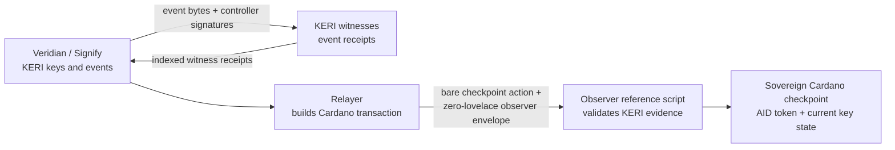

# Veridian bridge

## What Veridian is

Veridian is a TypeScript wallet built on
[Signify](https://github.com/WebOfTrust/signify-ts) for KERI, the Key Event
Receipt Infrastructure. It manages controller keys, creates KERI inception and
rotation events, and collects receipts from KERI witnesses.

The current cardano-keri vertical stories use genuine `keripy` artifacts
rather than a shipped Veridian SDK, but the integration boundary is the same:
the wallet or relayer supplies exact KERI event bytes, indexed controller
signatures, and indexed witness receipts. Cardano validates those artifacts
before changing the checkpoint.

!!! warning "Integration status"
    The Register, Close, Advance, Freeze, and response transactions are
    implemented and settled for the small fixture. A production
    `cardano-keri-sdk`, WASM package, and Veridian user flow are future work.
    Types below describe the current ledger wire or an explicitly labelled
    future interface; they are not claims that a published SDK exists.

## One identity, one checkpoint

Veridian names an identity with a KERI **AID** (Autonomic Identifier) and
maintains its **KEL** (Key Event Log). cardano-keri derives a Cardano asset name
from that AID. A quantity-one token and inline datum form the sovereign
checkpoint UTxO.

There is no shared identity root, `trie_key`, or global key-state registry in
the current transaction path.


```mermaid
flowchart LR
    V["Veridian / Signify<br/>KERI keys and events"]
    W["KERI witnesses<br/>event receipts"]
    R["Relayer<br/>builds Cardano transaction"]
    O["Observer reference script<br/>validates KERI evidence"]
    C["Sovereign Cardano checkpoint<br/>AID token + current key state"]

    V -->|"event bytes + controller signatures"| W
    W -->|"indexed witness receipts"| V
    V --> R
    R -->|"bare checkpoint action +<br/>zero-lovelace observer envelope"| O
    O --> C
```

The relayer does not need the controller's private keys for public projection
operations. It receives already signed KERI evidence and may pay to submit it.
The on-chain result is fixed by that evidence.

## Digest boundary

Standard KERI AIDs and next-key commitments use BLAKE3. Plutus currently has
no native BLAKE3 builtin, so cardano-keri uses its own Aiken implementation.

At registration:

- the premint policy proves the inception-byte/AID binding and mints a fact
  token;
- Register consumes and burns that token; and
- the registration observer checks that the checkpoint datum faithfully
  projects the event.

At rotation:

- the checkpoint stores KERI's next-key commitments byte-for-byte; and
- the Advance observer checks the revealed keys against those commitments.

No Cardano-specific AID flavor or Blake2 replacement is required.

## Current transaction specifications

### Register

Registration is permissionless and uses two transactions.

```text
Tx A — BLAKE3 premint
  input:  inception bytes and claimed KERI AID
  output: deterministic proof-token fact

Tx B — checkpoint registration
  checkpoint mint redeemer: Register
  observer withdrawal:      zero lovelace
  observer envelope:
    claim.action            = Register
    claim.checkpoint_policy = checkpoint policy
    claim.own_ref           = None
    payload                 = RegistrationEvidence
```

`RegistrationEvidence` contains:

- exact inception event bytes;
- offsets locating the KERI fields used by the on-chain projection;
- indexed controller signatures over those exact bytes; and
- indexed witness receipts over those exact bytes.

The lifecycle observer checks:

1. the matching fact token is present in an input and burned;
2. the event binds to the AID;
3. the datum matches the event's keys, thresholds, next commitments,
   witnesses, and `toad`;
4. controller signatures satisfy the weighted threshold; and
5. witness receipts satisfy `toad`.

The thin checkpoint policy separately checks:

1. exactly one derived AID token is minted;
2. exactly one ACTIVE output holds it;
3. the inline datum is well formed; and
4. the value is at least `checkpoint minimum + D_reg + B`.

The mint redeemer is deliberately the bare `Register` constructor. The large
evidence appears once, in the observer envelope. The checkpoint, lifecycle
observer, and BLAKE3 policy are delivered through reference-script UTxOs
because copying all three inline exceeds the transaction-size limit.

This is the settled wire from
[PR #146](https://github.com/lambdasistemi/cardano-keri/pull/146). See
[Observer architecture](observer-architecture.md) for the composition and
measurements.

### Advance

Advance spends the sovereign checkpoint and creates its exact
sequence-plus-one successor.

```text
checkpoint spend redeemer: Advance
observer withdrawal:       zero lovelace
observer envelope:
  claim.action             = Advance | ResponseAdvance
  claim.checkpoint_policy  = checkpoint policy
  claim.own_ref            = Some(exact checkpoint input)
  payload                  = AdvanceEvidence
```

The Advance observer binds the KERI rotation to the prior event and validates:

- revealed keys against stored next-key commitments;
- both required controller thresholds;
- signatures over the exact KERI event and reconstructed Cardano message;
- the incoming witness set and `toad`; and
- the unique new checkpoint datum.

The thin checkpoint requires the same token and complete value in the unique
ACTIVE successor. An ARMED input is accepted only as a response before its
deadline.

Ordinary Advance settled in
[PR #148](https://github.com/lambdasistemi/cardano-keri/pull/148); ARMED
response Advances settled in
[PR #150](https://github.com/lambdasistemi/cardano-keri/pull/150).

### Freeze

Freeze is a permissionless challenge submitted by a hunter holding witnessed
conflict evidence.

```text
checkpoint spend redeemer: Freeze { hunter_pkh }
observer withdrawal:       zero lovelace
observer envelope:
  claim.action             = Freeze
  claim.checkpoint_policy  = checkpoint policy
  claim.own_ref            = Some(exact ACTIVE input)
  payload                  = EnforcementEvidence
```

The enforcement observer checks that the contested rotation belongs to the
same AID, continues from the recorded KERI event, is still ahead of the tip,
reveals committed keys, and satisfies controller and witness thresholds.

The thin checkpoint preserves the complete value and token while creating an
ARMED datum with the hunter payment-key hash and deadline. ARMED is a
fail-closed role for consumers.

`ClaimFreeze` and thaw remain unavailable until
[#138](https://github.com/lambdasistemi/cardano-keri/issues/138).

### Close

Close is controller-authorized, not a public projection. Its signatures bind:

- network and checkpoint policy;
- exact checkpoint input;
- AID and sequence; and
- refund address.

The transaction consumes ACTIVE, burns the token, creates no successor, and
refunds the checkpoint's complete value to the signed address. It settled in
[PR #147](https://github.com/lambdasistemi/cardano-keri/pull/147).

## Future wallet interface

A Veridian integration needs to distinguish two responsibilities:

1. **KERI event production.** Signify creates inception and rotation events,
   manages threshold signing, and collects witness receipts.
2. **Cardano transaction construction.** A cardano-keri SDK packages those
   public artifacts into the current observer envelopes, resolves reference
   scripts and checkpoint UTxOs, calculates budgets, and submits or returns an
   unsigned transaction to a relayer.

The future SDK should return a human-readable intent transcript before any
wallet-specific Cardano authorization:

```text
IntentTranscript {
  operation
  cesr_aid
  checkpoint_policy
  checkpoint_input
  old_sequence
  new_sequence
  role_transition
  refund_address
  validity_interval
}
```

For public Register, Advance, and Freeze projections, this transcript is still
useful to the party paying fees even though no extra controller signature is
needed. For Close and future protected application actions, it is essential:
the user must see the exact input, action, and destination before signing.

## Synchronization lag

KERI and Cardano do not settle simultaneously. After a KERI rotation is
published, Cardano still shows the old ACTIVE checkpoint until an Advance or
valid Freeze transaction settles.

During that interval, a Cardano-only consumer can see stale authority. The
current mitigations are:

- anyone can relay the genuine next Advance;
- anyone with witnessed later-event evidence can Freeze the stale checkpoint;
- Freeze immediately moves it to ARMED, which consumers reject; and
- high-value applications must define how fresh their KERI monitoring and
  checkpoint resolution must be.

No validator can react to an off-chain event that no transaction reveals.
Freeze shortens the lag after evidence is available; it does not eliminate
network discovery and inclusion time.

## Checkpoint resolution

Given a KERI AID:

1. derive its expected asset name under the accepted checkpoint policy;
2. ask any indexer or node interface for candidate UTxOs;
3. require exactly one candidate at an accepted ACTIVE checkpoint script;
4. validate the quantity-one token, inline datum, AID, and sequence against
   the ledger; and
5. fail closed on absent, stale, malformed, non-ACTIVE, or ambiguous results.

The indexer supplies location, not truth. A stale result refers to a spent
output and rejects.

## Current limits

- The settled fixture has two controller keys, not GLEIF's real
  three-of-seven shape.
- The current single-proof registration path does not cover the
  1083-byte-class real inception; [#139](https://github.com/lambdasistemi/cardano-keri/issues/139)
  adds the multi-transaction proof.
- `observer_advance` has only 3 bytes of applied-script headroom;
  [#149](https://github.com/lambdasistemi/cardano-keri/issues/149) must shrink
  it before the real rotation.
- Claim/thaw and Convict remain unexposed in the small production-story
  checkpoint.
- A production Veridian SDK, public service, and mainnet deployment do not yet
  exist.
