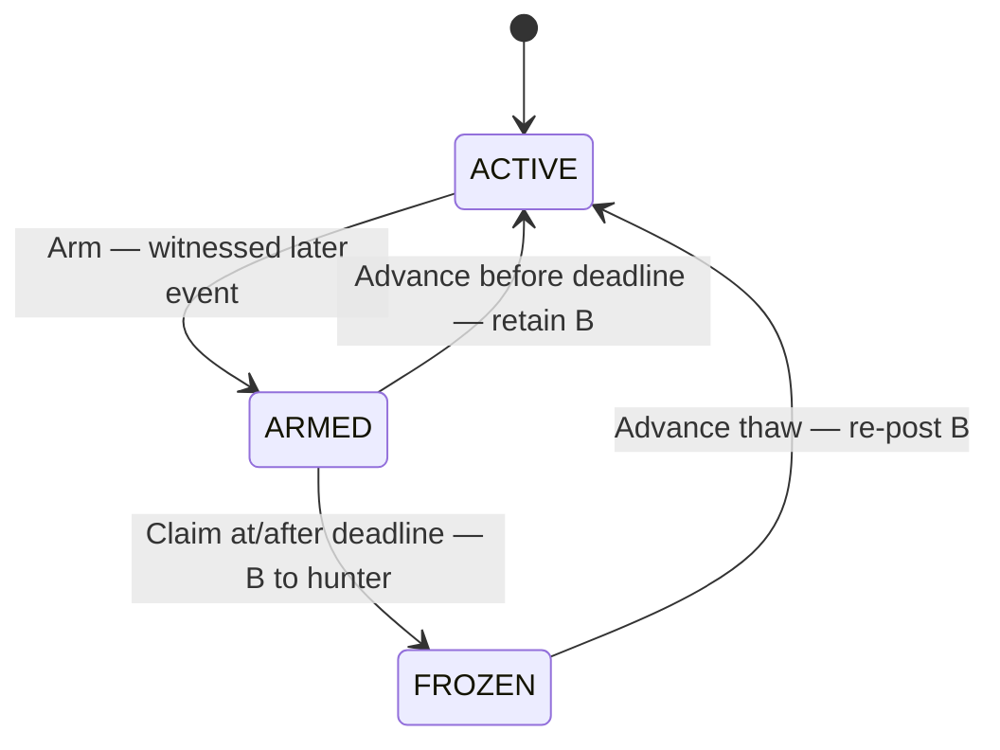

# Self-Certifying Identities on Cardano: the Choices Behind cardano-keri's First Milestone

*Category: Engineering & Research · ~20 min read*

**Dek:** Inside the design decisions of cardano-keri's identity core — the Blake3-versus-Blake2 reversal, the fork problem, the limits we accepted, and what ships at the end of Milestone 1. First in a series following the project milestone by milestone.

!!! tip "Prefer the visual story?"
    [View the Identity on Cardano presentation](../identity-on-cardano/index.html)
    for the concise user journey through registration, use, key rotation,
    compromise recovery, and public verification.

---

Imagine a mid-sized company that wants to interact with a Cardano protocol — sign a treasury disbursement, prove it is allowed to trade a regulated asset, or simply write into an on-chain registry it owns. On day one, this looks easy: generate a key, put its hash in the contract, done. Then reality arrives. The CFO who held the key leaves. The board decides that two of three directors should sign, not one. A laptop is stolen and the key must be replaced *now*. The company is still exactly the same company — but on-chain, its identity was the key, and the key is gone. Every contract that referenced it has to be updated, every counterparty notified, every integration re-tested.

This is the problem **cardano-keri** exists to solve, and it does not try to solve it alone. Outside the blockchain world, this class of problem already has a mature, production-grade answer: **KERI**, the Key Event Receipt Infrastructure — the identity protocol that underpins **GLEIF's verifiable Legal Entity Identifier (vLEI)**, the digital, cryptographically verifiable descendant of the LEI code that regulators already require financial entities to carry. KERI identities rotate their keys freely, distribute their authority across weighted groups of signers, and leave a verifiable audit trail of every change. cardano-keri's job is to give those identities a home on Cardano: a place where a contract can always find an organization's *current* keys, no matter how many times they have changed, and where misbehaving with your identity has real consequences.

This article is the **first in a series** that will follow the project's engineering adventure milestone by milestone — the design decisions, the reversals we had to make along the way, the measurements that forced them, and the demo that closes each stage. This opening installment is devoted to **Milestone 1, the identity core**. Rather than a feature tour, it is an honest account of the choices that shaped the milestone and of what each choice cost us. We will walk through:

1.  **the problem** — why key rotation breaks on-chain identity, and how KERI's pre-rotation solves it,
2.  **choice one: one identity, one token** — the sovereign checkpoint, and the design we rejected to get it,
3.  **choice two: Blake3 versus Blake2** — how a measurement campaign forced us to reverse our own ratified decision,
4.  **choice three: the fork problem** — what happens when an identity owner tells different stories to the two ledgers,
5.  **the limits we accepted** — stated plainly, because every design that hides its limits is lying about them,
6.  and **what will be available at the end of Milestone 1.**

## The problem: identities that outlive their keys

Let us start with the mechanism everything else rests on, because it is genuinely elegant.

A KERI identifier — an *AID* — is not assigned by any registry. It is the hash of its own birth certificate: the controller writes an *inception event* naming the initial signing keys, the threshold that makes their signatures binding, a set of witnesses who will receipt future events, and — this is the crucial part — the **digests of the next keys**. The identifier is simply the digest of that document. Anyone holding the document can verify that the identifier belongs to it by hashing; nobody needs to be asked, and nobody can be lied to.

That forward commitment to the next keys is called **pre-rotation**, and it is worth pausing on. Think of it as always having tomorrow's lock already installed on your door, with tomorrow's key sitting in a vault. A thief who steals today's key can open today's door — they can sign messages, and that is bad enough — but they cannot *change the locks*. Rotating the identity to a new key set requires producing the preimages of the committed digests, and those preimages have never left the vault. The thief holds today; the owner holds tomorrow. Key compromise becomes an incident to respond to, not the end of the identity.

None of this is theoretical. GLEIF's vLEI ecosystem runs on exactly this machinery today: weighted multi-signature KERI identifiers, rotated through real ceremonies, their event logs served publicly by geographically distributed witness pools. The question Milestone 1 had to answer was therefore not "how do we build an identity system?" — that system exists and works. The question was narrower and harder: **what is the smallest honest projection of that identity model onto Cardano's ledger?** Every word of that sentence did work in the design: *smallest*, because every additional moving part is an attack surface; *honest*, because a projection that pretends to know things it cannot know is worse than none; and *projection*, because KERI remains the sovereign home of the identity — Cardano mirrors it, and must never fork it.

## Choice one: one identity, one token

The answer we settled on is almost embarrassingly simple to state. Each registered identifier gets exactly one **checkpoint**: a quantity-one native asset whose name is derived deterministically from the identifier, locked at a validator, carrying a datum with the identity's current key state. When a contract wants to know who currently speaks for an organization, it resolves that one token — a single reference input — and reads the datum. When the organization rotates its keys, the datum changes but the asset name does not. The handle that integrations depend on is permanent; the keys behind it are free to move.

It is worth telling the story of what this design replaced, because the rejection taught us more than the adoption. Earlier design generations looked the way one might expect an "identity registry" to look: a global data structure — a Merkle trie of all identities under a shared root — updated through a pipeline. Adversarial review killed it, for two reasons that generalize well beyond this project. First, a shared root is a shared bottleneck: every identity's update contends with every other identity's update for the same piece of on-chain state, and contention on a global root is a denial-of-service surface you hand to your adversaries for free. Second, and more subtly, a shared root has a freshness problem: a verifier holding a root must ask "is this root still current?", and answering that question honestly kept pulling an oracle back into a design whose entire point was to not have one. The sovereign per-identity token dissolves both problems at once. There is nothing global to contend over, and currentness needs no oracle because **the current state is simply the unspent output** — each checkpoint token is quantity-one by construction, so an honest identity keeps exactly one live checkpoint, and a consumer that ever finds two for the same identity simply fails closed. A duplicate is therefore self-harm by whoever minted it, never a forged rival current state.

The datum on that token encodes three further choices, each deliberate:

```aiken
pub type CheckpointDatumV1 {
  cesr_aid: ByteArray,           // the AID digest — production format, as-is
  cur_keys: List<ByteArray>,     // current RAW verkeys
  cur_threshold: Threshold,      // a sum type — see the note below the datum
  next_keys: List<ByteArray>,    // pre-rotation commitment, byte-equal to the KEL
  next_threshold: Threshold,
  witnesses: List<ByteArray>,
  toad: Int,
  seq: Int,
  native_sn: Int,
}
```

One field there looks opaque and isn't. `Threshold` is a **two-constructor sum type** — an integer *m*-of-*n*, or a fractionally weighted, multi-clause threshold whose weights are exact rationals — and the validator branches on the Plutus-Data constructor tag, never on a guessed shape. An integer threshold is met by counting distinct valid signatures; a weighted one sums each clause's signing-key weights and requires *every* clause to reach one, using exact cross-multiplied rational arithmetic — no floats, no rounding. Zero weights are legal, because KERI's reserve and custodial-rotation patterns use them. The Haskell reference and the Aiken on-chain code encode it to byte-identical Plutus data, pinned by shared golden vectors, and a 13-rule well-formedness predicate rejects the malformed shapes (empty or mis-partitioned clauses, out-of-range integers, non-positive denominators).

### What is happening, step by step

1.  **The current keys are stored raw, not as hashes.** When a transaction claims to be authorized by this identity, the validator checks Ed25519 signatures directly against the bytes in the datum — no hashing of any kind on this path. This looks like a minor storage decision; it turned out to be the keystone that made our biggest reversal affordable, as the next section explains.
2.  **The pre-rotation commitment is an explicit list, not an aggregate hash.** The committed next-key digests and their threshold are stored exactly as KERI's event log states them, byte for byte. An earlier draft compressed the pair into a single hash — tidier, smaller, and wrong. We discovered *how* wrong when we fetched GLEIF's production Root identifier from its live witnesses and replayed its history: the Root rotates by revealing only **three of its seven** committed keys, restating the threshold, and carrying the four unexposed reserves forward into the next commitment. Real KERI practices *partial rotation* — reserve keys that may stay cold for years. An aggregate hash can only check an all-or-nothing reveal; an explicit list can follow the real protocol. We changed the design the same day we could reproduce GLEIF's rotation cryptographically.
3.  **Only independent identifiers are accepted.** KERI also supports *delegated* identifiers, whose validity depends on their parent identifier's event log — and recursively on the parent's parent. That recursion is precisely why V1 refuses to store a delegation claim as a passive field: a datum field the validator cannot honestly verify is not information, it is decoration that readers will mistake for information. Rather than decorate, V1 declines: delegated inceptions are rejected until a versioned delegation-proof protocol exists. The limits section returns to why this excludes far less of the real world than it might sound.

### Can someone register an identifier they do not own?

This is the question the registration design was shaped around, because the naive reading is genuinely alarming. KERI inception events are *public* — witnesses serve them to anyone who asks — so a check that merely verifies "these event bytes hash to this identifier" proves nothing about who is doing the registering. Anyone can download an inception event and present it.

Registration is therefore **permissionless**: anyone may present a valid inception event and fund the deployment-fixed `D_reg + B` reserve (where `D_reg` and `B` are validator parameters with 5 ADA mechanical floors, and `D_reg = 1,000,000,000` lovelace is a reference fixture; any surplus above continuing-output requirements is conservative change). The inception event (`icp`) authenticates itself with its own indexed controller signatures over exact `event_bytes`, and witness receipts cover those same bytes and satisfy `toad`. No Cardano-domain authorization signature or message is required. What a registrant cannot do is seize control of someone else's identity. Keys-must-match and semantic projection enforce that the created checkpoint carries the inception event's own declared public keys and thresholds. If a third party registers another controller's public inception event, they fund `D_reg + B` with no refund right (it acts as a donation to checkpoint custody), creating an independent checkpoint output. If multiple live candidate checkpoints exist for the same AID, consumers fail closed when supplied multiple ACTIVE references — an admitted fail-closed ambiguity residual. Under held #117, the legitimate datum-key holder can open the challengeable CLOSING `0x03` flow and recover the donated escrow, making duplicate grief bounded, deposit-deterred, and victim-profitable. Conviction burns the checkpoint token upon proof of an irreconcilable witnessed fork, releasing the deposit and allowing fresh registration.

Front-running earns an attacker nothing either. The inception event's own public keys and thresholds govern the resulting checkpoint, so an observer can alter no key material. Replaying an inception event simply registers the owner's identity with the submitter generously paying the fees and funding `D_reg + B`. Registering a *freshly created* identifier is of course open to everyone; that is permissionless registration working as intended. What a fresh identifier cannot do is claim to *be* anyone: "this identifier is such-and-such company" is a credential-layer statement, and an impostor's identifier holds no vLEI saying so. The identity layer deliberately answers only "who controls these keys" — never "who is this, legally." Keeping those two questions in separate layers is what makes each of them answerable at all.

## Choice two: Blake3 versus Blake2 — the reversal

This is the milestone's defining story, and we are telling it in some detail because we got it wrong first — and we got it wrong *by the book*.

Some background. Cardano's Plutus interpreter offers a fixed menu of built-in hash functions — Blake2b, SHA-2, SHA-3, Keccak — and Blake3 is not on it. Meanwhile, the entire deployed KERI world derives everything with Blake3: every identifier held by a vLEI participant, every identity in a Veridian wallet, and — this is the part that matters most — **every credential ever issued to those identities**. An ACDC, the credential format of the vLEI ecosystem, is itself a Blake3 artifact three times over: its identifier is a Blake3 self-addressing digest, the schema it conforms to is pinned by a Blake3 digest, and the holder it names is a Blake3 identifier.

The project's original decision — formally reviewed and ratified — was to define a Cardano-aligned identity flavor using Blake2b. The engineering argument was impeccable: every hash in the contract becomes a cheap native builtin, and the entire derivation chain, from inception event to on-chain identifier, is verifiable inside a script from day one, with no exotic machinery. Clean, cheap, self-contained.

And then there is what that decision means outside the engine room, stated without cushioning: **a double exclusion.** Every existing KERI identity is cut off — a Blake2 registry simply cannot represent a Blake3 identifier. And with each identity, the entire corpus of credentials already issued to it is cut off too. It does not help that a holder could re-register under a fresh Blake2 identity, because their vLEI names their *old* Blake3 identifier as its subject. The credential does not follow the holder; making the new identity credential-worthy means going back to the issuer — and for a vLEI, "the issuer" means a Qualified vLEI Issuer running a formal issuance ceremony. Multiply that ceremony by every legal entity, every role holder, and every already-operating deployment, and the honest description of the Blake2 path is: a technically pristine registry serving a market of exactly zero existing participants, with a standing dependency on wallet vendors someday shipping a special issuance mode that no one else in the KERI world uses.

What reversed the decision was not sentiment about compatibility. It was a measurement campaign. We built Blake3 *inside* Plutus — as a spike, using the bitwise builtins that arrived with Plutus V3 — and then spent four optimization rounds making it as fast as we could, ending with a lane-packed implementation that costs roughly **342 million CPU units per compressed block**. Numbers only mean something against a budget, and the project's stricter internal measurement ceiling is 10 billion CPU units and 14 million memory units (versus the live 2026-07-22 mainnet and preprod limit of 16.5 million memory units and 10 billion CPU units). So:

- hashing one 44-byte key — the operation a rotation needs, once per revealing key — costs **3.6% CPU and 4.5% memory**;
- verifying a typical single-signer inception event (~300 bytes) costs **17.1% CPU**;
- verifying a full 1024-byte chunk — the largest single-block input Blake3 allows — costs **54.3% CPU and 71.7% memory**.

Read those numbers twice and the design writes itself. In-script Blake3 would be ruinous if it ran on every authorization — and it is entirely affordable on operations that are rare *by construction*. So instead of mandating a hash, the contract enforces a **cost discipline**, and this is where the raw-keys decision from choice one pays off:

- **Ordinary authorizations hash nothing at all.** The datum holds raw keys; signature verification is native. This is the path that runs thousands of times a day, and its hashing bill is zero.
- **Rotations hash one small block per revealing key.** An organization rotates a handful of times a year, in a dedicated transaction with the budget to spare. A 3-of-5 board reveal costs about eleven percent of one transaction's CPU.
- **Genesis hashes once — ever — and not even in the registration transaction.** The binding between an identifier and its inception event is verified by a dedicated **hash-proof mint**: a minting policy whose only job is to check `blake3(inception_event) == identifier` in its own transaction, with the entire budget available, and to mint a proof token that the registration then consumes. The registration validator itself never computes Blake3; it checks for the token with one cheap native hash. That makes the AID-to-event byte binding oracle-free. The field-by-field projection of CESR data into the checkpoint remains a separate, explicit trust boundary: it is attested, challengeable, and subject to freeze. The identity-core milestone does not pretend to run a full CESR parser on-chain.

The reversal deleted three entries from our risk register in a single stroke: the parallel-identity bridge that existing holders would have needed, the "digest agility" mandate we would have had to ask of wallet software, and the project's one external dependency on a vendor's roadmap. It also armed a proposal we intend to bring to the community: a native `blake3` builtin CIP — argued not from hypotheticals, but from a shipped workaround with published cost tables and production identity workloads behind it. This is the same argument, in the same shape, that brought `keccak_256` into Plutus for the benefit of the Ethereum ecosystem's tooling.

## Choice three: prevent the fork before it can authorize anything

A checkpoint is a *projection* of an identity whose sovereign history lives in KERI — and projections can lie. Our first answer was economic: let Cardano accept a controller-signed advance, then destroy the identity if a watcher later finds a conflicting KERI rotation. That answer is insufficient.

The attack is simple. A controller advances Cardano to keys **C**, uses C to perform an irreversible Cardano action, and only afterward publishes a different KERI successor **K**. Convicting and burning the checkpoint later may stop the next action, but it cannot roll the first one back. Nor can a fixed registration deposit economically secure every action whose value may be larger than the deposit. The third attack therefore has to be stopped when the checkpoint advances, not punished after the damage.

### A witnessed identity cannot move Cardano first

KERI already gives us the missing evidence: witness receipts. They are Ed25519 signatures over the exact serialized event bytes. They do not mean that witnesses approve the controller's business decision; they mean that the event entered the publicly observed KERI history and that an honest witness threshold will not receipt a conflicting event at the same position.

The V1 advance rule is consequently strict. If the spent checkpoint stores witnesses and `toad > 0`, the transaction must carry at least `toad` valid receipts over the Cardano anchoring event in the AID's KERI event log. The validator checks those receipts against the witness keys already protected by the checkpoint. Valid controller signatures — even signatures satisfying the KERI dual-threshold rotation rule — are not enough by themselves. Waiting longer does not make them enough. **There is no signature-only timeout fallback in the first validator.**

A normal key rotation with the same witness set needs the post-rotation key-state seal and that set's threshold receipts. A witness-set change carries only KERI's backer delta — the witnesses cut, the witnesses added, and the new threshold — and the checkpoint validates it exactly as KERI does: against the **incoming** set, at the new threshold. There is no separate blessing from the outgoing set, because KERI itself asks for none — the same honest-witness-threshold assumption and first-seen rule that stop a fork on an ordinary rotation stop it here too. An explicit downgrade to `toad = 0` is validated against the (empty) incoming set and then visibly advertised in the checkpoint, so applications may refuse the weaker witnessless mode.

The consequence is concrete: for a witnessed identity, a controller cannot privately activate keys on Cardano and use them before KERI's own infrastructure has receipted the anchor. Under the stated honest-witness-threshold assumption, the later conflicting KERI branch in the attack cannot also become the accepted witnessed branch. The proposed Cardano-first checkpoint never exists, so there is no action under its proposed keys to undo.

This evidence has a precise limit. Witnesses receipt events, not semantic truth. A controller could put a seal in the KEL whose claimed Cardano key state differs from the native KERI establishment event. The correspondence checks and fraud-proof freeze path police that mismatch separately. Witnessless AIDs (`toad = 0`) and a colluding witness threshold also sit outside the witnessed no-fork guarantee; the datum makes the former visible, while the latter is KERI's own trust failure.

### KERI can still move before Cardano: the bonded lag machine

The remaining normal asymmetry is lag. The controller rotates in KERI, the witnesses receipt it, and the Cardano transaction has not landed yet. A Cardano-only contract could still honor keys that KERI has retired. Anyone holding the witnessed later event may therefore **Arm** the checkpoint. Arm pays nothing, but immediately moves the output away from the ACTIVE address, so consumers fail closed before any bounty can be earned.



ACTIVE is the bare checkpoint role. FROZEN is role address `0x00`, ARMED is `0x02`, and REAPING (the abandonment window, below) reuses the freed `0x01` or a reserved `0x04` — the spec picks. There is no tombstone role: conviction burns. ARMED wraps the checkpoint with the arming transaction's `hunter_pkh` and a hard `deadline`. The Arm transaction must have a finite validity upper bound `u`; the deadline is derived as `u + W_freeze`. A response is a plain permissionless Advance whose validity upper bound is strictly before the deadline. It retains the bond and needs no current, historical, or retired-key signature. Claim instead requires a validity lower bound at or after the deadline, pays exactly the bond to the hunter recorded in ARMED, and enters FROZEN. A thaw is another plain permissionless Advance: it applies the real next KEL event, re-posts the bond, and returns ACTIVE.

The arithmetic keeps two risks separate. `D_reg`, the conviction deposit, and `B`, the freeze bond, are independent deployment parameters. ACTIVE and ARMED carry `min-ADA + D_reg + B`; FROZEN carries `min-ADA + D_reg`. Arming immediately fail-closes consumers but pays nothing. A responsive or catching-up checkpoint pays nothing. Only abandonment — silence through the complete `W_freeze` — lets Claim pay exactly `B` to the recorded hunter. If a third party funds `D_reg+B` at registration or adds `B` for a thaw, that contribution is an on-chain donation with no refund right; a commercial bridge or thaw service is compensated off chain. Any conservative surplus remains ordinary transaction change.

### Permanent conviction is deliberately narrow

Some evidence is terminal, but “a mismatch exists” is too broad a test. KERI recovery can deliberately supersede some earlier events, and signatures prove that keys were used — not whether their human controller was malicious or under attack. Destroying every disputed identity would turn the recovery mechanism into a weapon against the victim.

V1 accepts independent, nondelegated AIDs only. Within that boundary, two incompatible **establishment rotations** from the same prior commitment at the same native sequence are irreconcilable: KERI's nondelegated rules do not let one rotation supersede another rotation. But controller signatures are still not enough to convict. The conflicting rotation must also carry the applicable threshold of KERI witness receipts. The Cardano branch already crossed the same gate when it advanced, so conviction proves two publicly accepted histories, not one accepted history plus a private signed draft. Only that controller-threshold-signed, threshold-witness-receipted V1 shape reaches `Convict`. The validator **burns** the existing quantity-one token — everything not spendable, even by reference, is burnt (the burn axiom) — and routes the whole escrow according to the input role as described below. The conviction is recorded the way everything is on a blockchain: in the convict transaction, in its evidence bytes and signatures, in history, forever — not in a tombstone UTxO that no validator ever reads. The burn is permanent for *that token*, but it is not Cardano declaring the KERI identity dead: if the identity legitimately continues in KERI it may register a fresh checkpoint, and any renewed fork is simply convicted again, forfeiting another deposit. Evidence that lacks either threshold, is recoverable or ambiguous, or belongs to future delegated/superseding rules fails closed under its owning recovery design rather than being treated as a #116 direct ACTIVE-to-FROZEN path. A witnessless AID cannot use permanent V1 conviction.

Neither witness receipts nor controller signatures can convict alone. The proof must establish both thresholds and the exact irreconcilable conflict. Even then, conviction is prospective containment, not rollback. Its deterrent and audit value are useful, but the advance-time witness gate is what closes the third attack.

One engineering fact makes these rules a first-milestone obligation. A Plutus validator's script hash is fixed at deployment: mandatory receipt checks, witness changes validated against the incoming set, freeze, and narrow conviction cannot be bolted on later without migrating every registered identity. They ship in V1, or V1 does not make the claimed safety guarantee.

## The limits we accepted

Every choice above purchases a limitation. Here they are, without cushioning:

- **No delegated identifiers — which, concretely, blocks issuer infrastructure and nothing that transacts.** In the vLEI ecosystem, KERI delegation is an *issuer-infrastructure* pattern: GLEIF's internal identifiers and the QVIs they authorize are delegated. The identities that actually act on-chain — legal entities, role holders, individual builders — are not required to be delegated, and in current practice are not: their business authority comes from the ACDC credential chain, which links credential to credential, not identifier to identifier. None of the seven vLEI credential schemas contains a delegation field at all. So the practical exclusion is exactly this: GLEIF-internal and QVI *issuer* AIDs cannot register, while every identity that transacts can — an operational cost of zero for the acting population today. V1 rejects delegated inceptions until a versioned delegation-proof protocol exists — a boundary we monitor, and would move earlier the day a real counterparty shows up delegated.
- **Genesis verification is capped at one Blake3 chunk — 1024 bytes — and this is operational headroom, not a wall.** We measured this cap against production event logs rather than guessing. A five-key, five-witness organizational inception weighs about 1017 bytes and fits; single-signer and two-key group inceptions fit with room to spare. The only real-world event we found above the line is GLEIF's own internal seven-key Root inception, at 1181 bytes — a trust root that, by the ecosystem's own design, never registers on anyone's chain. So the one shape that exceeds the cap is not an actor, and every shape that acts has room to spare. When a genuine over-1024-byte actor does appear, the path is already known and needs no new cryptography: hash the event across **several transactions**, committing the running Blake3 state into an intermediate UTxO and binding that digest, or drop the multi-transaction dance entirely once Plutus ships a native Blake3 builtin.
- **The lag window is real, and we do not pretend otherwise.** Between a KERI rotation and a successor Advance or Arm reaching Cardano, a Cardano-only consumer may honor the old keys. Arm shrinks that window by fail-closing immediately; `W_freeze` is the later response window that protects `B`, not a promise that Cardano learns about an unseen KEL event within a universal time. A consumer's own freshness policy governs discovery latency.
- **Witnessless identities have a weaker guarantee.** A checkpoint with `toad = 0` has no witness receipts to present, so applications that require public KERI acceptance must reject witnessless identities. A colluding witness threshold can also receipt conflicting events; no Cardano script can manufacture an honest KERI quorum after that assumption fails.
- **Conviction is not rollback.** A permanent burn stops future use, and the convict transaction preserves the evidence in history, but already-settled Cardano actions remain settled. This is why V1 rejects receipt-free advances instead of relying on later punishment.
- **Milestone 1 verifies identities, not credentials.** Verifying a full vLEI credential chain — GLEIF to QVI to legal entity — is Milestone 2's verifier. Wallet-native signing, where a Veridian wallet authorizes a Cardano action directly, is Milestone 3's bridge. Milestone 1 is deliberately *just* the identity layer: the part everything else stands on, and the part that had to be right the first time, because its wire contract and script hashes freeze at deployment.
- **Total key loss is total loss.** Exactly as in KERI itself: an owner who loses the current keys *and* every committed reserve has no recovery path in this scope. Pre-rotation protects against theft, not against amnesia.

## Why one sovereign UTxO stays live: the lifecycle theorem

A sovereign checkpoint removes global contention, but it concentrates one identity's history in a single UTxO. Every adversarial touch invalidates a transaction built against the previous output. Permissionless submission is therefore safe only if the machine proves that strangers cannot keep that UTxO busy or exclude an honest replayer. That is the central safety argument, not an operational footnote.

The lifecycle uses two primitives. **Projections of public truth** — Register, Advance, Arm, ARMED response, thaw, and the future void of a false close — are permissionless because their KEL evidence determines the result; no submitter may choose a different truth. **Self-assertions** — “this checkpoint is still wanted” when an arming is answered, and “I am current and retiring” at close — are optimistic and challengeable by later KEL evidence. The answer to an arming is still the same public, permissionless Advance. Only CloseIntent is datum-key-gated, and CloseIntent is held #117 work.

The complete lifecycle is modeled in **Lean 4**. Its three load-bearing invariants are:

1. **Advance-totality (`advance_totality`, `no_absorbing_busy_state`).** From every reachable live behind state, at any slot, progress to ACTIVE at sequence `k+1` is admissible within at most two transitions. ACTIVE, FROZEN, and future CLOSING use one ordinary permissionless Advance. ARMED uses one only strictly before its hard deadline; at or after the deadline, a bare ARMED Advance must reject to protect the hunter's earned Claim, and progress is Claim followed by thaw-Advance. REAPING uses one advance-void.
2. **Bounded adversarial interference (`bounded_churn`).** Every hostile touch either applies the real next KEL event, opens one bounded exclusive window, or needs later-event/fork evidence the attacker cannot fabricate. Arm is once per genuinely-behind state; repeated Arm and early Claim reject; a reap-intent is once per abandoned state. A genuinely current ACTIVE checkpoint has no permissionless spender. Exclusion is impossible without block-level censorship.
3. **Dead-end freedom (`dead_end_freedom`).** Nothing is ever left behind. From every reachable state on the ledger, at every slot, there is a move — advance back to ACTIVE, or be reclaimed and burnt to ABSENT. No state is an absorbing dead end, and the only permanent thing the system leaves on-chain is its live identities; everything else — every conviction, every retirement — lives where a blockchain's memory belongs, in history. This is the burn axiom made a theorem: everything not spendable, even by reference, is burnt.

The per-move argument makes those statements concrete:

| Move | Proof or guard | State effect | Why it cannot lock out replay |
|---|---|---|---|
| Register | Public inception event bytes, event-own controller signatures, witness receipts satisfying toad, hash-proof burn | ABSENT -> ACTIVE `0` with `D_reg + B` escrow | Anyone can project the public inception event; consumes no existing checkpoint and creates an independent state output. |
| Ordinary Advance | The real next KEL event with its own valid signatures/receipts | ACTIVE `k` -> ACTIVE `k+1` | An adversary can only do the replayer's work, at the adversary's fee expense. |
| Arm | Witnessed later-event proof; ACTIVE must genuinely be behind; finite upper bound `u` | ACTIVE -> ARMED with `hunter_pkh`, `deadline = u + W_freeze`, and `B` retained | The same behind-state can be armed once; ARMED opens a bounded, contention-free response window. |
| ARMED response | Ordinary Advance with upper bound `< deadline` | ARMED -> ACTIVE `k+1`; `B` retained; hunter paid nothing | It is the replayer's next catch-up step and asks for no current or retired key. |
| Claim | Lower bound `>= deadline`; exactly `B` paid to recorded hunter | ARMED -> FROZEN | Early racing rejects; after Claim, the next real event remains admissible through thaw. |
| FROZEN thaw | Ordinary Advance plus re-posted `B` | FROZEN -> ACTIVE `k+1` | No actor owns thaw authority; third-party funding cannot create a refund lock. |
| Reap-intent | Anyone, on abandoned FROZEN (or stale-and-behind CLOSING) | FROZEN -> REAPING with `reaper_pkh`, `deadline = now + W_reap` | The escrow is untouched and any single Advance voids it — the reap is challengeable the whole (months-scale) window. |
| Reap advance-void | Ordinary next-event proof | REAPING -> ACTIVE `k+1`, escrow topped back to `min + D_reg + B` | One public projection defeats the reap, generalizing the thaw. |
| Reap-execute | Lower bound at/after the `W_reap` deadline, untouched | REAPING -> token **burn**, whole escrow to the reaper | Only a full unanswered abandonment window pays the reaper; one Advance would have voided it. |
| Convict | Non-fabricable irreconcilable fork proof | Delivered #114: ACTIVE pays `D_reg + B` to convictor, ARMED pays `D_reg` to convictor and `B` to hunter, FROZEN pays `D_reg` to convictor, and token moves to terminal tombstone. Ratified target (lands by #115): token **burns** (ABSENT) and freed min-ADA joins convictor payout | Terminality requires a real fork, not transaction racing; conviction records live in transaction history forever. |
| CloseIntent (held #117) | Datum-key signature from ACTIVE; distinct `W_close` | ACTIVE -> CLOSING `0x03` | It is optimistic, not final: a real later event voids the assertion. |
| CLOSING Advance-void (held #117) | Ordinary next-event proof, with no close-window upper cutoff | CLOSING -> ACTIVE `k+1` in one transaction | One public projection defeats intent spam; it remains admissible after the deadline until finalize wins the race. |
| Finalize-close (held #117) | Lower bound at/after the `W_close` deadline | CLOSING -> token burn and refund | A true close has no later event; a false one is exposed for the whole window, and Advance-void keeps racing finalize after the deadline. |

Held #117's `W_close` is separate from `W_freeze`. CLOSING is role address `0x03`; ordinary permissionless Advance-void is mandatory, while finalize-close can win only if it lands first after the deadline. A cryptographic express-close or pre-rotation shortcut would prove key possession, not currentness, and is deliberately forbidden.

The bond theorem (`bond_transfer_only_via_elapsed_window`) completes the incentive argument: `B` leaves escrow only after a full unanswered `W_freeze`. Responsive lag and catch-up pay nothing; abandonment pays exactly once. Value conservation accounts separately for `D_reg`, `B`, min-ADA, refunds, payouts, and ordinary change.

!!! warning "Staged implementation boundary"
    The current #114 staging head is deliberately not deployable: it opens Register plus the existing Arm, Claim, and Convict paths. #115 opens ordinary Advance, including ARMED response and FROZEN thaw; #117 opens CLOSING 0x03 and Close. Ordinary Advance/response/thaw and Close remain fail closed in #114 staging, so this final lifecycle is a ratified design, not a claim that held transitions are live. Delivered Convict still writes the terminal tombstone output; the burn implementation remains PENDING and lands no later than #115.

An honesty note in two directions. First, the exercise earned its keep *before* any proof existed: merely forcing the claims into a type checker caught invariants that were false in the earlier prose. Second, these theorems certify the **design** — the transition system the validator implements — not deployed bytes. The bytes are held to the design by property tests generated from the same state-machine model and by the Haskell/Aiken parity suite. Proofs make the specification coherent; tests make the code obey it; neither substitutes for the other.

## What is available at the end of Milestone 1

A word on what is already true today, before the milestone's remaining work: the wire contract — the datum, the threshold semantics, the signed message formats, and the validation rules over them — is frozen, merged, and **implemented twice**. A Haskell reference implementation and the Aiken on-chain implementation are held to byte-identical serialization and identical accept-or-reject verdicts by a shared suite of golden vectors: 195 checks on one side, 157 on the other, regenerated and drift-checked in CI. The fixtures are not all home-grown, either — they include threshold shapes from the KERI reference implementation's own test suite and rotation patterns taken from GLEIF's production event logs, so the contract is tested against the ecosystem's reality, not against our own reading of it.

Milestone 1 builds the machine that animates that contract. At its close, the following will be available:

- **Permissionless bonded registration** of standard, production-format KERI identifiers, with their AID-to-event byte binding proven trustlessly by the hash-proof mint, self-authenticating event-own controller signatures and witness receipts, and protected `D_reg + B` deposit; the semantic projection remains explicitly attested and challengeable;
- **Permissionless, witness-gated rotation**, including partial reserve rotations: a witnessed AID needs its configured threshold receipts, and both a stolen-current-quorum attempt and a controller-signed receipt-free Cardano-first attempt are rejected;
- **Bonded freeze and narrow conviction enforcement** — Arm immediately fail-closes consumers but pays nothing; only Claim after a full unanswered `W_freeze` pays exactly `B` to the recorded hunter, while responsive lag and catch-up pay nothing. A proved irreconcilable V1 conviction **burns** the token and routes the whole escrow by the input role as shown above; abandonment cleanup is completed by reap, so no exit leaves a residue;
- **Identity-owned on-chain data**: registry entries writable only under the identity's current key state, surviving every rotation without any integration change;
- **A per-issuer revocation-status registry**, mirroring credential status on-chain with slot-level ordering;
- **Replay and audit tooling**: rebuild an identity's full history from public data and compare it, byte for byte, against the chain;
- **Lifecycle**: migration, retirement, and conviction records discoverable in transaction history, so "this identity ended, and here is why" is a queryable fact — recorded where a blockchain's memory belongs, not in an eternal UTxO;
- and the milestone's acceptance test — a recorded **end-to-end demo** on a local devnet: incept a witnessed two-of-three weighted identity, write identity-owned data, collect threshold receipts and rotate with no identity oracle, then watch both a complete stolen set of current keys and a validly controller-signed but receipt-free Cardano-first advance fail on-chain.

## Where the code stands today

Everything this article describes as *decided* is public and testable right now — the project is developed in the open at [github.com/lambdasistemi/cardano-keri](https://github.com/lambdasistemi/cardano-keri), and the claims above can be checked against the code rather than taken on faith:

- The **frozen wire contract** — the datum, thresholds, message formats, and validation rules — is the normative document at [`specs/68-keystate-shape/spec.md`](https://github.com/lambdasistemi/cardano-keri/blob/main/specs/68-keystate-shape/spec.md), and the pull request that landed it ([#105](https://github.com/lambdasistemi/cardano-keri/pull/105)) carries the full review trail of the reversals told in this article, measurements included.
- The **two implementations** live side by side: the on-chain Aiken code under [`onchain/lib/cardano_keri/checkpoint`](https://github.com/lambdasistemi/cardano-keri/tree/main/onchain/lib/cardano_keri/checkpoint) and the Haskell reference under [`offchain/lib/Cardano/KERI/AID/Checkpoint`](https://github.com/lambdasistemi/cardano-keri/tree/main/offchain/lib/Cardano/KERI/AID/Checkpoint), held together by a generated golden-vector suite and a CI drift check that fails the build if the two encoders ever disagree by a byte.
- The **in-script Blake3** is vendored at [`onchain/lib/cardano_keri/blake3.ak`](https://github.com/lambdasistemi/cardano-keri/blob/main/onchain/lib/cardano_keri/blake3.ak), and the full measurement history behind the numbers quoted above — six implementation generations, from 1144% of budget down to 54% — is preserved in the spike report at [`spikes/88-blake3-plutus/REPORT.md`](https://github.com/lambdasistemi/cardano-keri/blob/main/spikes/88-blake3-plutus/REPORT.md).
- The **design documentation** — architecture, trust model, the vLEI analysis, and the milestone plan — is rendered at [lambdasistemi.github.io/cardano-keri](https://lambdasistemi.github.io/cardano-keri/), with the roadmap at [/roadmap](https://lambdasistemi.github.io/cardano-keri/roadmap/) tracking exactly the arc this series will follow.

What remains *in flight* for the identity-core milestone is the validator itself — including witness-receipt verification, incoming-set validation of witness changes, and the evidence paths — tracked in the same repository's milestones. When the next installment of this series appears, its demo will be runnable from that repo.

And a caveat we owe the reader, because this article has been candid about reversals: **until the milestone is done, we may yet discover we got something wrong.** The wire contract is our best answer, backed by measurements and by replays of production data — but a frozen document is a hypothesis until the validator that animates it has been built, measured against the real transaction budget, attacked by its own negative tests, and demonstrated end to end. We have already reversed two of our own ratified decisions when the evidence demanded it — the Blake2 identity flavor and the aggregate rotation commitment — and we would rather reverse a third in public than defend a mistake in private. If that happens, this series is where you will read about it first.

## Coming next

Each installment of this series will close with a milestone's own demo, and the next one will show the identity core in action: the checkpoint validator live on a devnet — registration through the hash-proof mint, a witnessed weighted-board rotation, rejection of a receipt-free Cardano-first advance, and the freeze/conviction boundaries earning their negative tests in front of the camera. After that comes a technical interlude inside the Blake3 implementation itself — the lane-packed compression rounds, the cost model, and the case for a native builtin; then the verification core for full vLEI credential chains; then the signing bridge, where KERI wallets authorize Cardano actions directly; and finally the pilots — identified stake pool delegation and an institutional treasury ceremony with vLEI-verified signers, end to end on preprod.

The adventure is just beginning. Stay tuned.
