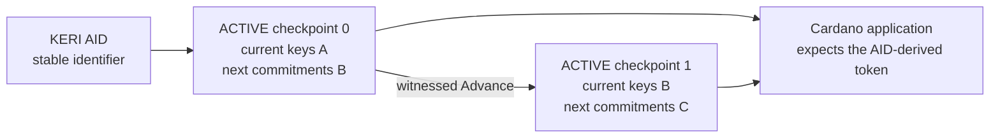
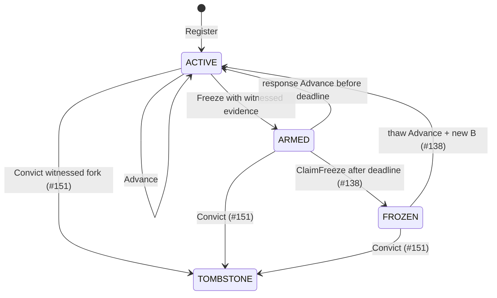

# Self-certifying identities on Cardano: from design to settled stories

*Category: Engineering & Research · updated after PR #150*

cardano-keri is trying to make one practical promise: a Cardano application
can keep referring to the same organization while that organization's keys
change safely.

The identity comes from **KERI**, the Key Event Receipt Infrastructure. KERI
calls an identity an **AID**, or Autonomic Identifier. Its **KEL**, the Key
Event Log, records signed inception and rotation events. KERI witnesses issue
receipts when they accept an event, giving other systems evidence that the
event was publicly seen.

Cardano does not store the whole KEL. It stores a checkpoint: one sovereign
UTxO carrying an AID-derived token, the current keys and thresholds, the next
key commitments, the witnesses, and an escrow.

The design is no longer only a diagram. A genuine two-key identity has
registered, closed, rotated, and completed two Freeze/response rounds on a
protocol-11 development network with production transaction limits. This
article explains what those stories proved and what remains closed.

## One stable token, rotating keys

The checkpoint token is the stable Cardano handle. Its asset name derives
from the KERI AID. A rotation spends the current checkpoint UTxO and creates
the next one with the same token and updated inline datum.


```mermaid
flowchart LR
    AID["KERI AID<br/>stable identifier"]
    C0["ACTIVE checkpoint 0<br/>current keys A<br/>next commitments B"]
    C1["ACTIVE checkpoint 1<br/>current keys B<br/>next commitments C"]
    APP["Cardano application<br/>expects the AID-derived token"]

    AID --> C0
    C0 -->|"witnessed Advance"| C1
    C0 --> APP
    C1 --> APP
```

An application integrates with the stable asset, not a public key that must
remain unchanged forever.

There is no shared key-state registry in the current design. Each identity
has its own UTxO, so Alice's rotation does not contend with Bob's. An indexer
may locate the asset, but the consuming transaction must validate the actual
ledger output. Location is not authority.

## Why registration is two transactions

Standard KERI AIDs use BLAKE3. Plutus does not have a native BLAKE3 builtin,
so the project implements the hash in Aiken. It fits, but putting that work
beside every other Register check makes the transaction unnecessarily large
and expensive.

Registration separates the work:

1. A BLAKE3 premint transaction proves that the inception bytes bind to the
   claimed AID and mints a deterministic fact token.
2. Register consumes and burns that fact token while creating the bonded
   checkpoint.

The fact token is not a key, credential, or permission. It is a one-use claim
about bytes.

Register itself uses a bare `Register` mint redeemer. The large inception
bytes, offsets, controller signatures, and witness receipts ride in an
`ObserverEnvelope` attached to a zero-lovelace withdrawal. The withdrawal
executes a reference stake script—the registration observer—without moving
reward value.

That observer verifies the KERI evidence. The thin checkpoint policy verifies
the token, ACTIVE output, datum, and escrow. Both scripts evaluate the same
transaction, so neither can be bypassed.

This transaction shape settled in
[PR #146](https://github.com/lambdasistemi/cardano-keri/pull/146). Register
used about 1.9 million memory units, roughly 11% of the 16.5 million production
limit.

## Why Advance requires witnesses

Pre-rotation is KERI's answer to current-key theft. The current checkpoint
already commits to the keys that may become current next. A thief who steals
only today's keys cannot freely choose tomorrow's keys.

Advance checks more than that commitment:

- the rotation continues from the stored KERI event;
- revealed keys match the stored next-key commitments;
- both controller thresholds pass;
- the output is exactly sequence plus one; and
- receipts from the incoming witness set satisfy the event's `toad`.

`toad` is KERI's witness threshold. When it is greater than zero, controller
signatures and elapsed time never replace the required receipts.

This closes a Cardano-first attack. Without the witness gate, a controller
could activate one key state on Cardano, use it for an irreversible action,
and only then publish a different KERI history. Punishment afterward cannot
roll back the Cardano action, so the receipt check belongs before activation.

[PR #148](https://github.com/lambdasistemi/cardano-keri/pull/148)
settled a genuine witnessed two-key Advance. It also rejected stolen-current,
below-successor-threshold, and under-witnessed attempts. The heavy Advance
observer used 4,110,025 memory units.

## Thin state machine, heavy observers

The deployed checkpoint program protects state mechanics. Operation-specific
reference scripts perform the large KERI predicates:

- a lifecycle observer for Register;
- an Advance observer for rotation and ARMED response; and
- an enforcement observer for Freeze.

The latest settled sizes are:

| Program | Applied size |
|---|---:|
| Thin checkpoint | 9,155 bytes |
| Enforcement observer | 13,548 bytes |
| Advance observer | 16,130 bytes |

The applied-script limit is 16,133 bytes. The Advance observer therefore has
only 3 bytes of headroom. It works today but is not maintainable;
[#149](https://github.com/lambdasistemi/cardano-keri/issues/149) must create
space before the seven-key rotation.

Reference delivery matters too. Copying the checkpoint and observers inline
would exceed the 16,384-byte transaction-size limit. The builder publishes
the scripts once in reference outputs and later transactions refer to them.

## Lag and dishonesty are different failures

A KERI event can move before its Cardano checkpoint. That is lag, not
necessarily dishonesty. A different problem occurs when an identity publishes
two fully witnessed histories that cannot both be true.

The escrow separates the two:

```text
checkpoint minimum ADA + D_reg + B
```

- The delay bond `B`, about 5 ADA in the reference deployment, polices
  liveness.
- The divergence bond `D_reg`, about 1000 ADA in the reference deployment,
  polices truth.

Both are deployment parameters. Their different sizes and payout conditions
are part of the security model.

## Freeze is a response window

A hunter with a witnessed conflicting rotation ahead of the ACTIVE tip may
submit Freeze. The transaction:

- preserves the whole checkpoint value;
- records the hunter and a hard deadline;
- moves the token to ARMED; and
- makes consumers fail closed immediately.

Before the deadline, the honest side answers with an ordinary Advance. It
returns to ACTIVE and keeps `B`. No special current-key signature is needed
beyond the genuine KERI event evidence.


```mermaid
stateDiagram-v2
    [*] --> ACTIVE : Register
    ACTIVE --> ACTIVE : Advance
    ACTIVE --> ARMED : Freeze with witnessed evidence
    ARMED --> ACTIVE : response Advance before deadline
    ARMED --> FROZEN : ClaimFreeze after deadline (#138)
    FROZEN --> ACTIVE : thaw Advance + new B (#138)
    ACTIVE --> TOMBSTONE : Convict witnessed fork (#151)
    ARMED --> TOMBSTONE : Convict (#151)
    FROZEN --> TOMBSTONE : Convict (#151)
```

Only the first four transitions in that diagram have settled small-identity
stories. Claim/thaw is issue
[#138](https://github.com/lambdasistemi/cardano-keri/issues/138), and
Convict/TOMBSTONE is issue
[#151](https://github.com/lambdasistemi/cardano-keri/issues/151).

## One old proof cannot freeze forever

The Freeze proof is relative to the exact checkpoint tip. A response changes
that tip, so the previous conflict is stale.

The runner for [PR #150](https://github.com/lambdasistemi/cardano-keri/pull/150)
performed a full drill:

1. register;
2. record a rotation;
3. Freeze with first-round evidence;
4. respond by advancing;
5. replay the exact first-round Freeze evidence and observe rejection;
6. produce fresh sibling rotations at the next sequence;
7. Freeze again; and
8. respond again.

Both response transactions preserved the complete bond. This demonstrates
multi-round safety at the applied transaction boundary, not just in a pure
predicate test.

## Advance-totality

A sovereign UTxO is safe only if an attacker cannot trap it in a busy state.
The target rule is **advance-totality**: a genuine next KERI event can always
make progress back toward ACTIVE.

- ACTIVE advances directly.
- ARMED advances directly before the deadline.
- After the deadline, ClaimFreeze protects the hunter's earned payment, then
  the same ordinary Advance thaws FROZEN while re-posting `B`.

The last case takes two transitions. That is intentional: liveness must not
erase a reward that became valid after a complete unanswered window.

## Close is already real

Close is the voluntary retirement path. Current controller signatures bind
the exact checkpoint input and refund address. The transaction burns the
AID-derived token and refunds the complete checkpoint value.

[PR #147](https://github.com/lambdasistemi/cardano-keri/pull/147)
settled Register followed by Close and covered unauthorized attempts in the
on-chain test suite.

## What remains honest to say

The current evidence supports a precise claim:

> A genuine two-key identity can register, close, rotate, be armed by fresh
> witnessed conflict evidence, and answer twice under production Cardano
> transaction limits on a protocol-11 development network.

It does not support these stronger claims:

- `ClaimFreeze` and thaw are not open yet.
- Conviction has not settled through the small production-story checkpoint.
- A two-key result does not prove the real three-of-seven GLEIF cost profile.
- Development-network settlement is not mainnet deployment.
- Registering an AID does not prove that it represents a legal entity; that
  requires the later ACDC credential layer.
- Freeze or conviction cannot reverse a Cardano action that already settled.
- Cardano cannot react to an off-chain KERI event until somebody reveals it in
  a transaction.

## The next ladder

The immediate order is:

1. seize and thaw the small identity in #138;
2. convict the small identity in #151;
3. register the genuine GLEIF-scale identity in #139;
4. close it in #145;
5. shrink the Advance observer in #149;
6. rotate, freeze, seize, and convict it through #144, #140, #141, and #152.

The [story ladder](../story-ladder.md) records the exact evidence and the
[roadmap](../roadmap.md) explains what follows after the identity core:
credential verification, application authorization, a KERI wallet bridge, and
real pilots.
