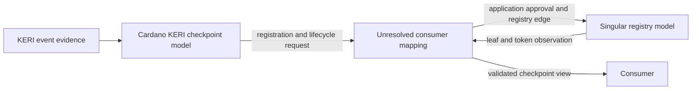

# Map the Singular registry to Cardano KERI — 23 October target

As a Cardano KERI integrator, I want to bind the registry observations our identity model consumes to the accepted Singular model, so I can implement without treating similarly named leaves or tokens as identical by guesswork. The [dated project card](https://github.com/orgs/lambdasistemi/projects/4/views/5) remains a mapping review target. **This cross-model integration is not yet playable or accepted.**

## Model revisions and source

Cardano KERI's accepted base is commit `0e638fadc987f0cd98f839edd3e3ecd5a09a1b91`: [Registry.lean](https://github.com/lambdasistemi/cardano-keri/blob/0e638fadc987f0cd98f839edd3e3ecd5a09a1b91/lean/CardanoKeri/Registry.lean), SHA-256 `bfa17a6b02ab5270e37f224af62109dfb8202c3b49e121804fa0560a0936216a`, and [Checkpoint.lean](https://github.com/lambdasistemi/cardano-keri/blob/0e638fadc987f0cd98f839edd3e3ecd5a09a1b91/lean/CardanoKeri/Checkpoint.lean), SHA-256 `f5dea750f9de2e5737d288eef73371cefd1b4217c5609468ddcdff4967ae001f`. Singular's registry model is the [first demo's](https://github.com/lambdasistemi/singular/pull/250) base commit `a6e5edbc2dafa82eb34116a1de2b6503f87c6692`, [Singular.Model](https://github.com/lambdasistemi/singular/blob/a6e5edbc2dafa82eb34116a1de2b6503f87c6692/lean/Singular/Model.lean). [KERI #446](https://github.com/lambdasistemi/cardano-keri/issues/446) proposes a pinned Lean dependency on an earlier Singular release; its stated scope does not migrate registry behavior.

The figures below are **candidate comparison rows**, not a representation choice. The [Lean correspondence register #435](https://github.com/lambdasistemi/cardano-keri/issues/435) records prior rulings and required model work. A row that needs a ruling or a changed Lean statement cannot be promoted by this document.

| User-visible operation | Cardano KERI accepted model | Singular accepted model | Mapping status |
| --- | --- | --- | --- |
| First registration | `processBody .register` requires inception and no leaf, creates `.active token`, checkpoint and bond lock. | `insertActive` books an unknown key, mints one active token after application approval. | **Unbound:** define the transaction that couples inception, checkpoint mint and application approval; test duplicate refusal and value flow. |
| Reopen after close | `processBody .revive` requires `.dormant k`, a witnessed rotation and no checkpoint, then creates a new live token and bond. | `updateActive` consumes an absent token and its custody, creates active token and pays the recorded refund. | **Conflict/open:** CK's dormant key state and Singular's absent custody have different content and effects. The recorded parking ruling in #435 also requires Lean alignment. |
| Close | A live checkpoint's `reap` creates `goDormant k`; later fold records `.dormant k` and its refund. | `deleteActive` returns the key to unknown, while `updateTerminal` ends it permanently. | **Unbound:** neither edge is automatically a CK dormant close. Key-state retention, token and bond/refund effects need an operator-bound mapping. |
| Conviction | `convictCkpt` and `goConvicted` lead to terminal `.convicted`; an already dormant leaf has a separate `convict` operation. | `updateTerminal` creates `Known Terminal`; `witnessTerminal` can mint plural terminal witnesses without changing that leaf. | **Partly ruled, still unbound:** #435 permits a terminal mapping under KERI-conformant duplicity; the predicate, proof and transaction mapping remain to be shown. |
| Refusals | CK rejects a second live registration, invalid phase or missing required evidence according to its own guards. | Singular rejects illegal leaf edges, approval mismatch and token delta mismatch. | **Unbound:** each refused CK request needs an exact Singular request and an observed matching boundary. |

`Status`, `Op` and `processBody` in Cardano KERI [Registry.lean](https://github.com/lambdasistemi/cardano-keri/blob/0e638fadc987f0cd98f839edd3e3ecd5a09a1b91/lean/CardanoKeri/Registry.lean) own the CK column. The Singular column comes from `Edge`, `step`, approval and token laws in [Singular.Model](https://github.com/lambdasistemi/singular/blob/a6e5edbc2dafa82eb34116a1de2b6503f87c6692/lean/Singular/Model.lean). Similar names alone prove no correspondence. The models use abstract numeric keys and values in their simulator fixtures; those are not Cardano AIDs, policy IDs, signatures or ledger assets.

## Presenter path: 10–15 minutes

| Time | Presenter action | Decision visible to the audience |
| --- | --- | --- |
| 0–3 min | State the integrator story and pin both revisions. | Two accepted models are being compared; no connected release run is claimed. |
| 3–6 min | Walk registration and duplicate refusal. | Inception, application approval, checkpoint mint and active token need one bound transaction. |
| 6–9 min | Walk close and reopen. | Dormant key state cannot be silently equated with absent custody. |
| 9–12 min | Walk conviction and terminal witnesses. | Terminality has a prior ruling, while duplicity proof and on-chain effects still need binding. |
| 12–15 min | Read the unresolved rows and evidence needed below. | The page is a review aid; integration acceptance remains held. |

## What is missing before this becomes a play

The [registry integration ticket #324](https://github.com/lambdasistemi/cardano-keri/issues/324) needs a versioned, executable cross-model transition mapping for registration, reopen, close and conviction, with token and custody effects, positive and negative controls, and the exact release interface. The parking conflict and duplicity obligations are tracked in [#435](https://github.com/lambdasistemi/cardano-keri/issues/435). The card additionally requires a released Singular interface and connected implementation evidence. No cast of a mapped result, transaction ID, policy ID or fresh node readback exists on this page. A model simulator can illustrate one side, but cannot close a cross-model row.
