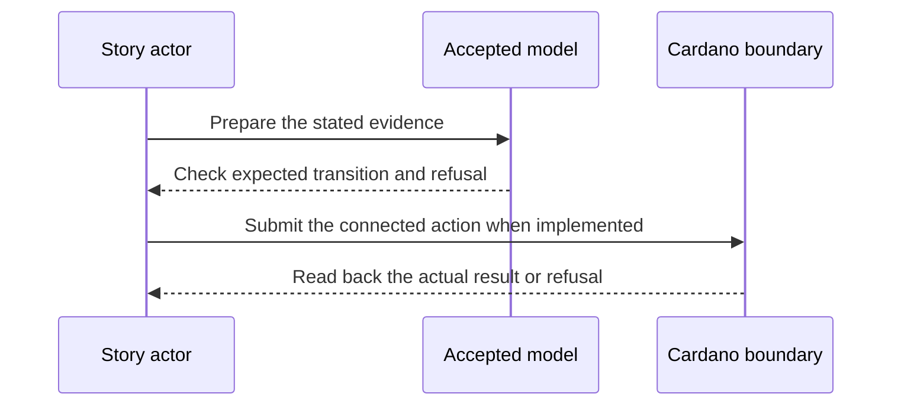

# Registry backed registration — 2026-12-07 target

**D-04 story.** As an identity controller, I want my witnessed inception to establish one on-chain checkpoint, so that another party cannot register the same identity as a second live incarnation.

This is a dated review target from the [live project card](https://github.com/orgs/lambdasistemi/projects/4/views/5). **Not yet playable as the connected target.** No confirmed ledger outcome or release acceptance is claimed by this page.

## Planned play and evidence

Given a valid KERI inception and a registry state in which the AID has no live incarnation, after the CK-to-Singular model mapping is accepted; when a registration request is folded and a second registration for the same live AID is attempted; then the connected transaction creates the checkpoint and registry effect required by the accepted model, while the duplicate attempt is refused on chain.

The intended positive observation is: A registry fold and checkpoint mint share one inception proof. The relevant refusal is: A duplicate registration refuses after the first live AID. These are acceptance criteria, not observed results.

## Play the model rehearsal

The shared D-04 to D-06 recording executes the shipped [registry simulator CLI](https://github.com/lambdasistemi/cardano-keri/blob/0e638fadc987f0cd98f839edd3e3ecd5a09a1b91/simulator/registry-simulator-cli.mjs) and [checkpoint simulator CLI](https://github.com/lambdasistemi/cardano-keri/blob/0e638fadc987f0cd98f839edd3e3ecd5a09a1b91/simulator/checkpoint-simulator-cli.mjs). Here, registry story 4 folds a first registration for fictional AID `11`, then refuses the second with `already-registered`. The script asserts the model state is unchanged on refusal. This is one Cardano KERI simulator side; the D-02 CK-to-Singular mapping and on-chain duplicate refusal remain open.

[Download the 80-column cast](assets/video/d04-d06-identity-model.cast). Run `node demo/identity-model-rehearsal.mjs --fast` to recheck the observations, or `bash demo/record-identity-model-rehearsal.sh` to rerecord and validate. Cast SHA-256: `e72e55bfa66ae599a6d829cf88aa5563b15d7a10649845b160cc35b1e106403b`.

## Presenter path: 10–15 minutes when runnable

| Time | Presenter action | Evidence to inspect |
| --- | --- | --- |
| 0–2 min | State the actor's goal and identify all synthetic inputs. | Pin the exact accepted model and release revisions. |
| 2–5 min | Establish the card's given state through its connected prior operations. | Inspect the actual starting outputs and required evidence. |
| 5–8 min | Run the planned positive action. | Compare fresh readback with the bound model transition. |
| 8–11 min | Run the planned negative control. | Attribute the refusal to the actual boundary. |
| 11–15 min | Review receipts and gaps. | Identify transactions, scripts, witnesses, values and uncovered behavior. |

## Missing interface or receipt

The #324 CK to Singular mapping, connected registration builder, inception bytes and signatures, registry proof, checkpoint mint, node readback and duplicate refusal.

The model base visible in this checkout is Cardano KERI commit `0e638fadc987f0cd98f839edd3e3ecd5a09a1b91`. It is a source identity for planning, **not a claim that the later card is already modeled or accepted**. Each claim must bind the accepted model revision for that behavior before promotion. The [Lean correspondence register](https://github.com/lambdasistemi/cardano-keri/issues/435) holds affected conflicts. A simulator or source fact cannot replace a confirmed transaction, and no cast of an accepted connected result is available here.

**Tracking:** [KERI #324](https://github.com/lambdasistemi/cardano-keri/issues/324), [Singular #154](https://github.com/lambdasistemi/singular/issues/154), [KERI #435](https://github.com/lambdasistemi/cardano-keri/issues/435) for any unresolved conflict.
