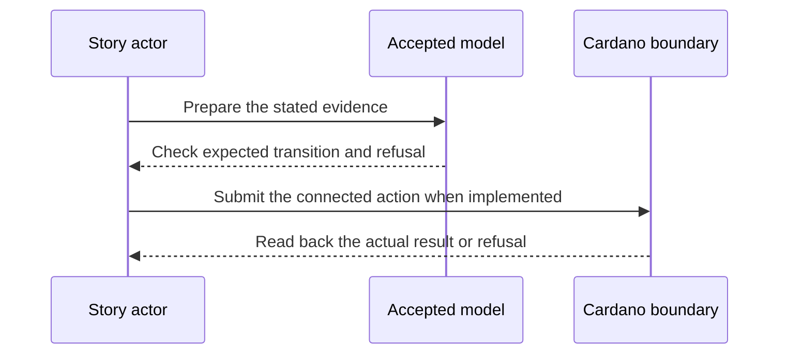

# Register then advance — 2026-12-22 target

**D-05 story.** As an identity controller, I want a witnessed KERI rotation reflected by my existing Cardano checkpoint, so that consumers can use the newly established keys without losing the identity.

This is a dated review target from the [live project card](https://github.com/orgs/lambdasistemi/projects/4/views/5). **Not yet playable as the connected target.** No confirmed ledger outcome or release acceptance is claimed by this page.

## Planned play and evidence

Given the D-04 registration was produced by the connected transaction and the controller has a valid next KERI event; when the rotation is submitted and confirmed as an advance; then the same identity’s checkpoint reflects the accepted next key state and required bond/registry effects; stale or unauthorized evidence is refused.

The intended positive observation is: A connected D-04 registration is followed by a witnessed rotation. The relevant refusal is: A stale or unauthorized advance refuses. These are acceptance criteria, not observed results.

## Preprod operator play

Start from the same AID registered through D-04's connected preprod transaction. Rotate it with keripy `kli rotate`, export the new CESR stream, submit `ckeri advance --network preprod --aid ... --kel rotation.cesr`, and read the next key state with `ckeri status`. Submit stale and unauthorized evidence as named negative controls. The [deployed V1 advance guide](../user/rotate-preprod-identity.md) shows an earlier, narrower preprod journey; that release predates the registry coupling required here. No D-05 cast is attached until the connected D-04 prerequisite and refusal receipts exist.

## Presenter path: 10–15 minutes when runnable

| Time | Presenter action | Evidence to inspect |
| --- | --- | --- |
| 0–2 min | State the actor's goal and identify all synthetic inputs. | Pin the exact accepted model and release revisions. |
| 2–5 min | Establish the card's given state through its connected prior operations. | Inspect the actual starting outputs and required evidence. |
| 5–8 min | Run the planned positive action. | Compare fresh readback with the bound model transition. |
| 8–11 min | Run the planned negative control. | Attribute the refusal to the actual boundary. |
| 11–15 min | Review receipts and gaps. | Identify transactions, scripts, witnesses, values and uncovered behavior. |

## Missing interface or receipt

The D-04 connected output and #322 owner advance builder, event bytes, threshold evidence, bond effects and before/after node readbacks.

The model base visible in this checkout is Cardano KERI commit `0e638fadc987f0cd98f839edd3e3ecd5a09a1b91`. It is a source identity for planning, **not a claim that the later card is already modeled or accepted**. Each claim must bind the accepted model revision for that behavior before promotion. The [Lean correspondence register](https://github.com/lambdasistemi/cardano-keri/issues/435) holds affected conflicts. A simulator or source fact cannot replace a confirmed transaction, and no cast of an accepted connected result is available here.

**Tracking:** [KERI owner edges #322](https://github.com/lambdasistemi/cardano-keri/issues/322), [registry integration #324](https://github.com/lambdasistemi/cardano-keri/issues/324).
