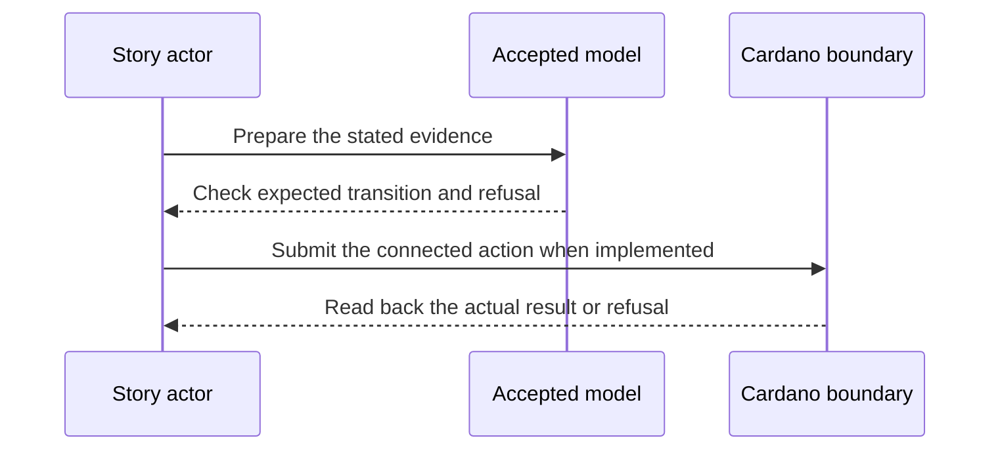

# Hunter advance and short pool — 2027-01-06 target

**D-06 story.** As a hunter, I want to land another controller’s witnessed rotation and receive the model-defined reward, so that checkpoints can stay current without an appointed operator.

This is a dated review target from the [live project card](https://github.com/orgs/lambdasistemi/projects/4/views/5). **Not yet playable as the connected target.** No confirmed ledger outcome or release acceptance is claimed by this page.

## Planned play and evidence

Given a registered checkpoint, a valid later KERI event and a pool with enough funds for the paid branch; when a hunter submits the advance; then the checkpoint advances and the hunter receives the specified premium; an invalid or stale competing advance is refused.

The intended positive observation is: A hunter lands a witnessed rotation and the paid branch shows its premium; the short pool follows the Lean unpaid or freeze branch. The relevant refusal is: A stale competing advance refuses. These are acceptance criteria, not observed results.

The card also asks, as an identity controller with a short hunter pool, to see the model's actual unpaid or freeze route with its bond effects. It does not specify blanket refusal.

## Play the model rehearsal

The shared D-04 to D-06 cast executes [checkpoint simulator stories 3 and 4](https://github.com/lambdasistemi/cardano-keri/blob/0e638fadc987f0cd98f839edd3e3ecd5a09a1b91/simulator/checkpoint-simulator-cli.mjs) against the accepted [Checkpoint `Action` and `stepFn`](https://github.com/lambdasistemi/cardano-keri/blob/0e638fadc987f0cd98f839edd3e3ecd5a09a1b91/lean/CardanoKeri/Checkpoint.lean). The asserted short-pool branch first freezes with pool `1`; a later model step advances unpaid to sequence `1` while that pool remains `1`. These pool units are synthetic model values, not a real Cardano payout. The cast does not show a ledger payout, bond transfer or stale transaction refusal.

[Download the 80-column cast](assets/video/d04-d06-identity-model.cast). Run `node demo/identity-model-rehearsal.mjs --fast` to check its observations. Cast SHA-256: `e72e55bfa66ae599a6d829cf88aa5563b15d7a10649845b160cc35b1e106403b`.

## Presenter path: 10–15 minutes when runnable

| Time | Presenter action | Evidence to inspect |
| --- | --- | --- |
| 0–2 min | State the actor's goal and identify all synthetic inputs. | Pin the exact accepted model and release revisions. |
| 2–5 min | Establish the card's given state through its connected prior operations. | Inspect the actual starting outputs and required evidence. |
| 5–8 min | Run the planned positive action. | Compare fresh readback with the bound model transition. |
| 8–11 min | Run the planned negative control. | Attribute the refusal to the actual boundary. |
| 11–15 min | Review receipts and gaps. | Identify transactions, scripts, witnesses, values and uncovered behavior. |

## Missing interface or receipt

The #323 hunter transaction, exact Lean short-pool branch, before/after pool and bonds, payout or freeze effect, and a named stale refusal. Short pool is not a blanket refusal.

The model base visible in this checkout is Cardano KERI commit `0e638fadc987f0cd98f839edd3e3ecd5a09a1b91`. It is a source identity for planning, **not a claim that the later card is already modeled or accepted**. Each claim must bind the accepted model revision for that behavior before promotion. The [Lean correspondence register](https://github.com/lambdasistemi/cardano-keri/issues/435) holds affected conflicts. A simulator or source fact cannot replace a confirmed transaction, and no cast of an accepted connected result is available here.

**Tracking:** [KERI hunter edges #323](https://github.com/lambdasistemi/cardano-keri/issues/323), [owner datum and bonds #322](https://github.com/lambdasistemi/cardano-keri/issues/322).
