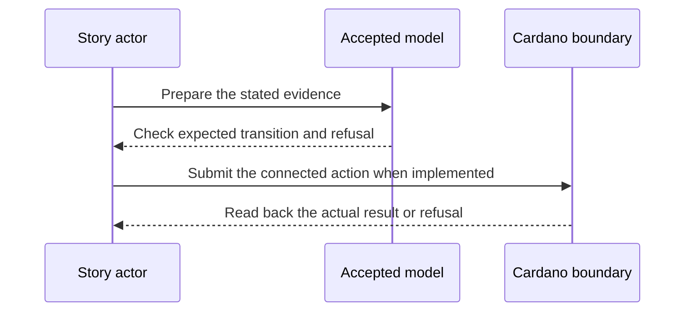

# Close and conviction — 2027-01-21 target

**D-07 story.** As an identity controller, I want a valid closing rotation to end my checkpoint and record where the registry stopped, so that a later return must prove the right continuation.

This is a dated review target from the [live project card](https://github.com/orgs/lambdasistemi/projects/4/views/5). **Not yet playable as the connected target.** No confirmed ledger outcome or release acceptance is claimed by this page.

## Playable checkpoint model rehearsal

The [accepted checkpoint Lean `Step` and `stepFn`](https://github.com/lambdasistemi/cardano-keri/blob/0e638fadc987f0cd98f839edd3e3ecd5a09a1b91/lean/CardanoKeri/Checkpoint.lean) at `0e638fadc987f0cd98f839edd3e3ecd5a09a1b91` governs this narrower play. The checked-out Lean file hashes to `f5dea750f9de2e5737d288eef73371cefd1b4217c5609468ddcdff4967ae001f`. The [checkpoint simulator CLI](https://github.com/lambdasistemi/cardano-keri/blob/0e638fadc987f0cd98f839edd3e3ecd5a09a1b91/simulator/checkpoint-simulator-cli.mjs), [Lean corpus](https://github.com/lambdasistemi/cardano-keri/blob/0e638fadc987f0cd98f839edd3e3ecd5a09a1b91/simulator/checkpoint-simulator-corpus.json) (SHA-256 `72e85bf0ed1141f092dcda4bec61dd1b69a8fcaa636d58fff5726cf999868f6e`) and fixtures [5](https://github.com/lambdasistemi/cardano-keri/blob/0e638fadc987f0cd98f839edd3e3ecd5a09a1b91/simulator/checkpoint-simulator-scenarios/05-alice-goes-away.json), [6](https://github.com/lambdasistemi/cardano-keri/blob/0e638fadc987f0cd98f839edd3e3ecd5a09a1b91/simulator/checkpoint-simulator-scenarios/06-alice-comes-back.json), [9](https://github.com/lambdasistemi/cardano-keri/blob/0e638fadc987f0cd98f839edd3e3ecd5a09a1b91/simulator/checkpoint-simulator-scenarios/09-cora-convicts.json) and [10](https://github.com/lambdasistemi/cardano-keri/blob/0e638fadc987f0cd98f839edd3e3ecd5a09a1b91/simulator/checkpoint-simulator-scenarios/10-alice-leaves-for-good.json) are the replay sources. Addresses `1`, `2`, `3` and amounts `D=1000`, `B=5`, `P=2` are synthetic model inputs.

Given story 5's registered checkpoint, witnessed rotation and signed close intent, the simulator accepts close, parks hash `(epoch=1, sn=1)`, refunds address 1 `D=1000, B=5, pool=8`, and pays address 2 premium `2`. A relayer close without authorized intent refuses `intent-not-authorized`; story 10's current-key close without witnessed next-key rotation refuses `no-witnessed-rotation`. Story 6 shows that parked is reversible through a **later** witnessed rotation to `(epoch=2, sn=2)`; replay of the closing rotation refuses `no-witnessed-rotation`.

In a **separate** story 9 trace, registration and poisoning precede conviction with abstract `duplicityAt[0,0]` evidence. The model reaches `convicted`, pays address 3 the conviction bond `D=1000`, and refunds address 1 `B=5, pool=10`. Without that atom it refuses `no-duplicity-proof`; a transition after conviction refuses `convicted-terminal`. These assertions run before any cast frame is printed:

```sh
node demo/later-model-rehearsal.mjs d07 --fast
node simulator/checkpoint-simulator-cli.mjs --story 5 --to-end --json
node simulator/checkpoint-simulator-cli.mjs --story 5 --fork relayer --to-end --json
node simulator/checkpoint-simulator-cli.mjs --story 6 --to-end --json
node simulator/checkpoint-simulator-cli.mjs --story 9 --fork noproof --to-end --json
node simulator/checkpoint-simulator-cli.mjs --story 9 --fork terminal --to-end --json
```

<div id="d07-model-cast" aria-label="D-07 checkpoint model rehearsal"></div>
<script>
window.addEventListener("load", function () {
  AsciinemaPlayer.create("../assets/video/d07-checkpoint-model.cast",
    document.getElementById("d07-model-cast"), {
      cols: 80, rows: 24, autoPlay: false, preload: true, controls: true
    });
});
</script>

[Download the 80-column cast](assets/video/d07-checkpoint-model.cast). Rerecord and validate with `bash demo/record-later-model-rehearsal.sh`.

The evidence rows above concern the checkpoint model only. The model's `duplicityAt` atom does not validate KERI proof bytes. No connected registry leaf or token readback, Cardano transaction, actual refund, or CK-to-Singular handoff has been observed.

## Presenter path for today's model cast: 10–15 minutes

| Time | Cast frame and presenter action | Observation to point out |
| --- | --- | --- |
| 0–2 min | Open **D-07 checkpoint model only** and name the synthetic addresses and amounts. | The CLI replays checkpoint fixtures; no node is used. |
| 2–5 min | Pause at **Close** and **Close refusals**. | Parked `(1,1)`, refund and premium model flows; unsigned relayer and current-key attempts refuse. |
| 5–7 min | Pause at **Return**. | Later witnessed rotation reopens `(2,2)`; closing-rotation replay refuses. Parked is not terminal. |
| 7–11 min | Pause at **Conviction** and **Conviction refusals**. | Separate poisoned trace reaches convicted and pays the model bond; missing duplicity atom and post-conviction action refuse. |
| 11–15 min | Finish at **model play complete** and open the source and replay commands above. | The predicate is abstract; connected registry, proof bytes, transaction and refund receipts remain missing. |

## Planned play and evidence

Given an identity reached through the D-04/D-05 connected path; when the controller closes with the required next-key authorization and a separate duplicity proof is presented in a second trace; then close burns and refunds as the accepted model requires and records its closed registry state; conviction records the terminal outcome and prevents a new live incarnation; malformed or insufficient evidence refuses.



The intended positive observation is: Separate connected traces close one live checkpoint and convict another on a valid duplicity proof. The relevant refusal is: A malformed proof or forbidden restart refuses. These are acceptance criteria, not observed results.

## Future connected presenter path: 10–15 minutes when runnable

| Time | Presenter action | Evidence to inspect |
| --- | --- | --- |
| 0–2 min | State the actor's goal and identify all synthetic inputs. | Pin the exact accepted model and release revisions. |
| 2–5 min | Establish the card's given state through its connected prior operations. | Inspect the actual starting outputs and required evidence. |
| 5–8 min | Run the planned positive action. | Compare fresh readback with the bound model transition. |
| 8–11 min | Run the planned negative control. | Attribute the refusal to the actual boundary. |
| 11–15 min | Review receipts and gaps. | Identify transactions, scripts, witnesses, values and uncovered behavior. |

## Missing interface or receipt

The #324 registry mapping, #358 close authority, KERI-conformant duplicity predicate, connected event and proof inputs, leaf/token readbacks and bond refunds.

The [Lean correspondence register](https://github.com/lambdasistemi/cardano-keri/issues/435) holds affected conflicts. A simulator or source fact cannot replace a confirmed transaction; this cast is a model rehearsal, not an accepted connected result.

**Tracking:** [KERI #322](https://github.com/lambdasistemi/cardano-keri/issues/322), [#323](https://github.com/lambdasistemi/cardano-keri/issues/323), [#324](https://github.com/lambdasistemi/cardano-keri/issues/324).
