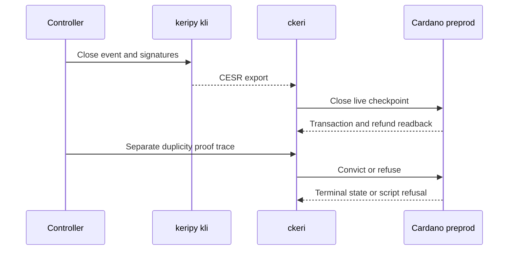

# Close and conviction — 2027-01-21 preprod target

**D-07 story.** As an identity controller, I want a valid closing rotation to end my checkpoint and record where the registry stopped, so that a later return must prove the right continuation.

This is a dated preprod review target from the [project card](https://github.com/orgs/lambdasistemi/projects/4/views/5). A keripy and `ckeri` cast must show a connected preprod journey. The existing M1 V1 release can close a checkpoint, but it has no Singular registry fold or KERI-conformant conviction path; a V1 close cannot satisfy the full D-07 story.

## Planned preprod play

Given the D-04 and D-05 connected preprod outputs, the controller uses keripy `kli` to produce the authorized closing KERI event and exports its CESR bytes. `ckeri close` submits the close against the live checkpoint and reads back the refund and registry state. In a separate trace, a party submits a genuine KERI duplicity proof through the conviction command; a missing or malformed proof refuses at the intended script. A later witnessed rotation must be required for return from the recorded closed state, while conviction remains terminal.

The [V1 close guide](../user/close.md) documents a narrower deployed preprod transaction. It supplies a useful `kli` and `ckeri` baseline, but it does not prove registry close, reopened custody or conviction. No full D-07 preprod cast is attached yet.

## Presenter path: 10–15 minutes when connected

| Time | Action | Required observation |
| --- | --- | --- |
| 0–2 min | Pin the preprod release, manifest and starting D-04/D-05 outputs. | AID, live checkpoint, registry leaf and exact script identities. |
| 2–5 min | Export authorized close evidence from keripy and submit through `ckeri`. | Confirmed close transaction, refund and closed registry readback. |
| 5–8 min | Show a later witnessed return and replay the closing event. | Return accepts only the later event; replay refuses at its real boundary. |
| 8–11 min | Run a separate KERI duplicity trace. | Confirmed conviction and terminal registry readback. |
| 11–15 min | Run missing-proof and forbidden-restart controls. | Script-attributed refusals, transaction references and remaining gaps. |

## Missing interface and evidence

The [registry integration #324](https://github.com/lambdasistemi/cardano-keri/issues/324), [close authority #358](https://github.com/lambdasistemi/cardano-keri/issues/358), KERI-conformant duplicity predicate, preprod release, connected event and proof inputs, leaf/token readbacks and bond refunds remain required. The [Lean correspondence register #435](https://github.com/lambdasistemi/cardano-keri/issues/435) holds the affected model conflicts. Model scenario playback cannot replace those preprod transactions.
