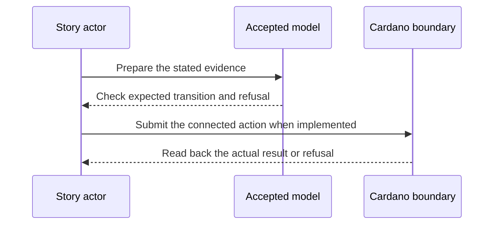

# Commands for identity roles — 2027-02-05 target

**D-08 story.** As an owner, hunter or consumer, I want commands and readbacks for the accepted identity edges, so that I can perform and inspect the demonstrated journey without constructing transaction data by hand.

This is a dated review target from the [live project card](https://github.com/orgs/lambdasistemi/projects/4/views/5). **Not yet playable as the connected target.** No confirmed ledger outcome or release acceptance is claimed by this page.

## Planned play and evidence

Given the connected registry, owner and hunter operations from earlier reviews; when a person uses the installed ckeri commands for registration, advance, poison, close, reopen, top-up, freeze, conviction and status as applicable to the role; then each named command constructs the intended transaction or refusal, reports its result honestly and a fresh status read agrees with the ledger.

The intended positive observation is: Owner, hunter and consumer use installed ckeri commands for the accepted identity edges and fresh status reads. The relevant refusal is: At least one unauthorized role command refuses at the chain boundary. These are acceptance criteria, not observed results.

## Presenter path: 10–15 minutes when runnable

| Time | Presenter action | Evidence to inspect |
| --- | --- | --- |
| 0–2 min | State the actor's goal and identify all synthetic inputs. | Pin the exact accepted model and release revisions. |
| 2–5 min | Establish the card's given state through its connected prior operations. | Inspect the actual starting outputs and required evidence. |
| 5–8 min | Run the planned positive action. | Compare fresh readback with the bound model transition. |
| 8–11 min | Run the planned negative control. | Attribute the refusal to the actual boundary. |
| 11–15 min | Review receipts and gaps. | Identify transactions, scripts, witnesses, values and uncovered behavior. |

## Missing interface or receipt

An installed ckeri release with the named role commands, connected transactions, version, transaction IDs, role checks and fresh status readbacks.

The model base visible in this checkout is Cardano KERI commit `0e638fadc987f0cd98f839edd3e3ecd5a09a1b91`. It is a source identity for planning, **not a claim that the later card is already modeled or accepted**. Each claim must bind the accepted model revision for that behavior before promotion. The [Lean correspondence register](https://github.com/lambdasistemi/cardano-keri/issues/435) holds affected conflicts. A simulator or source fact cannot replace a confirmed transaction, and no cast of an accepted connected result is available here.

**Tracking:** [KERI off-chain epic #325](https://github.com/lambdasistemi/cardano-keri/issues/325).
