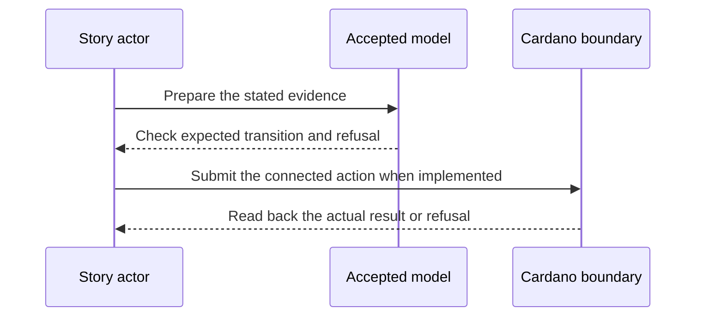

# Fifteen identity stories — 2027-02-20 target

**D-09 story.** As a new integrator, I want the fifteen identity scenarios and their forks to run as connected transactions, so that I can see both promised behavior and named refusals before a preprod cutover.

This is a dated review target from the [live project card](https://github.com/orgs/lambdasistemi/projects/4/views/5). **Not yet playable as the connected target.** No confirmed ledger outcome or release acceptance is claimed by this page.

## Playable fixture replay, with an open gate

The accepted [checkpoint Lean model](https://github.com/lambdasistemi/cardano-keri/blob/0e638fadc987f0cd98f839edd3e3ecd5a09a1b91/lean/CardanoKeri/Checkpoint.lean) is pinned to `0e638fadc987f0cd98f839edd3e3ecd5a09a1b91` (file SHA-256 `f5dea750f9de2e5737d288eef73371cefd1b4217c5609468ddcdff4967ae001f`). The [Lean corpus](https://github.com/lambdasistemi/cardano-keri/blob/0e638fadc987f0cd98f839edd3e3ecd5a09a1b91/simulator/checkpoint-simulator-corpus.json) has SHA-256 `72e85bf0ed1141f092dcda4bec61dd1b69a8fcaa636d58fff5726cf999868f6e`. The shipped [fifteen JSON scenarios](https://github.com/lambdasistemi/cardano-keri/tree/0e638fadc987f0cd98f839edd3e3ecd5a09a1b91/simulator/checkpoint-simulator-scenarios) and their forks are replayed by `checkScenario` in the [checkpoint core](https://github.com/lambdasistemi/cardano-keri/blob/0e638fadc987f0cd98f839edd3e3ecd5a09a1b91/simulator/checkpoint-simulator-core.mjs). The rehearsal asserts all 15 fixture results have no reported problem, story numbers are exactly 1–15, and 104 action steps ran. It also invokes the full scenario gate and asserts its current RED status so the cast cannot silently portray that gate as green.

```sh
node demo/later-model-rehearsal.mjs d09 --fast
node simulator/checkpoint-simulator-cli.mjs --story 1 --to-end --json
node simulator/checkpoint-simulator-cli.mjs --story 9 --fork noproof --to-end --json
node simulator/checkpoint-simulator-scenario-gate.mjs
```

<div id="d09-model-cast" aria-label="D-09 fifteen checkpoint model scenarios"></div>
<script>
window.addEventListener("load", function () {
  AsciinemaPlayer.create("../assets/video/d09-checkpoint-model.cast",
    document.getElementById("d09-model-cast"), {
      cols: 80, rows: 24, autoPlay: false, preload: true, controls: true
    });
});
</script>

[Download the 80-column cast](assets/video/d09-checkpoint-model.cast). Rerecord and validate with `bash demo/record-later-model-rehearsal.sh`.

**Gate limit:** On this source revision, the full checkpoint scenario gate replays the 15 stories but exits RED with 42 problems, including theorem-row, story-reconciliation and fabricated-violation checks. Individual fixture replay passing does not close those defects. There is no connected devnet runner, transaction receipt or chain-level refusal evidence for any of the fifteen stories.

## Presenter path for today's model cast: 10–15 minutes

| Time | Cast frame and presenter action | Observation to point out |
| --- | --- | --- |
| 0–2 min | Open **fifteen checkpoint model scenarios** and identify the accepted model and corpus revision above. | The recording runs fixture assertions, not a devnet runner. |
| 2–9 min | Pause at **Model stories 1 to 5**, **6 to 10** and **11 to 15**; select one source fixture and its fork in the linked directory. | Each printed row has passed `checkScenario` expectations; the 15 files execute 104 action steps across trunks and forks. |
| 9–12 min | Run the replay commands above, including the story 9 `noproof` fork. | The refusal is a simulator result. It is not a refused Cardano transaction. |
| 12–15 min | Finish at **limits of the model replay** and inspect the scenario gate result. | The full gate is RED on theorem-row/reconciliation controls; connected transactions, readbacks and chain-level negative controls remain missing. |

## Planned play and evidence

Given the accepted model stories, their generated corpus and a booted devnet with the installed operator commands; when the suite replays each trunk and relevant fork from legitimate prior operations; then the ledger observations match the bound model outcomes and every claimed refusal is reached by a refused transaction.



The intended positive observation is: All fifteen accepted scenarios and relevant forks run from legitimate prior transactions on devnet. The relevant refusal is: Each relevant invalid fork reaches an actual refused transaction. These are acceptance criteria, not observed results.

## Future connected presenter path: 10–15 minutes when runnable

| Time | Presenter action | Evidence to inspect |
| --- | --- | --- |
| 0–2 min | State the actor's goal and identify all synthetic inputs. | Pin the exact accepted model and release revisions. |
| 2–5 min | Establish the card's given state through its connected prior operations. | Inspect the actual starting outputs and required evidence. |
| 5–8 min | Run the planned positive action. | Compare fresh readback with the bound model transition. |
| 8–11 min | Run the planned negative control. | Attribute the refusal to the actual boundary. |
| 11–15 min | Review receipts and gaps. | Identify transactions, scripts, witnesses, values and uncovered behavior. |

## Missing interface or receipt

A complete connected devnet runner, generated corpus revision, exact scenario/fork inventory, transaction receipts, negative controls and uncovered-row report.

The [Lean correspondence register](https://github.com/lambdasistemi/cardano-keri/issues/435) holds affected conflicts. A simulator or source fact cannot replace a confirmed transaction; this cast is a model rehearsal, not an accepted connected result.

**Tracking:** [KERI story-suite epic #326](https://github.com/lambdasistemi/cardano-keri/issues/326).
