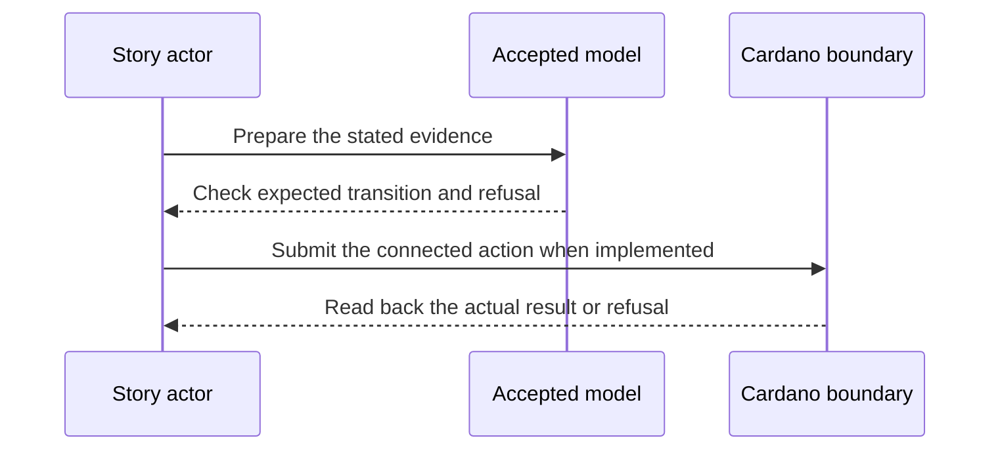

# Preprod release journey — 2027-03-22 target

**D-11 story.** As a stranger using only the public release and documentation, I want to register, maintain and end an identity on preprod, so that I can rely on the released Cardano KERI interface rather than the team’s local checkout.

**Planned release tag:** Cardano KERI `v1.0.0` (identity-core M1). This names the milestone target; intermediate plays use release candidates, and the tag waits for the D-11 release gate and its preprod evidence.

This is a dated review target from the [live project card](https://github.com/orgs/lambdasistemi/projects/4/views/5). **Not yet playable as the connected target.** No confirmed ledger outcome or release acceptance is claimed by this page.

## Planned play and evidence

Given an accepted cutover, downloaded release archive, published manifest and funded operator prerequisites; when the stranger follows the documented connected lifecycle and the fifteen story suite is replayed against deployed scripts; then confirmed preprod readbacks match the named release and model, with required refusal cases visible and any missing story reported as missing.

The intended positive observation is: A stranger installs the public release and runs a connected identity lifecycle and fifteen story suite on preprod. The relevant refusal is: Required refusals remain visible; any missing story remains missing. These are acceptance criteria, not observed results.

## Preprod recording path

The stranger uses keripy `kli` for fresh inception, rotation and signed close evidence, then the downloaded `ckeri` release for each Cardano preprod transaction and fresh status read. The [V1 baseline cast](preprod-v1-baseline.md) demonstrates a smaller register/close path. This card additionally requires the accepted registry and fifteen-story release; its own cast waits for those connected results.

## Presenter path: 10–15 minutes when runnable

| Time | Presenter action | Evidence to inspect |
| --- | --- | --- |
| 0–2 min | State the actor's goal and identify all synthetic inputs. | Pin the exact accepted model and release revisions. |
| 2–5 min | Establish the card's given state through its connected prior operations. | Inspect the actual starting outputs and required evidence. |
| 5–8 min | Run the planned positive action. | Compare fresh readback with the bound model transition. |
| 8–11 min | Run the planned negative control. | Attribute the refusal to the actual boundary. |
| 11–15 min | Review receipts and gaps. | Identify transactions, scripts, witnesses, values and uncovered behavior. |

## Missing interface or receipt

An accepted cutover, public archive hash, published manifest verified against the node, connected transaction IDs and full story-suite receipts.

The model base visible in this checkout is Cardano KERI commit `0e638fadc987f0cd98f839edd3e3ecd5a09a1b91`. It is a source identity for planning, **not a claim that the later card is already modeled or accepted**. Each claim must bind the accepted model revision for that behavior before promotion. The [Lean correspondence register](https://github.com/lambdasistemi/cardano-keri/issues/435) holds affected conflicts. A simulator or source fact cannot replace a confirmed transaction, and no cast of an accepted connected result is available here.

**Tracking:** [KERI preprod cutover and release #328](https://github.com/lambdasistemi/cardano-keri/issues/328), [story suite #326](https://github.com/lambdasistemi/cardano-keri/issues/326).
