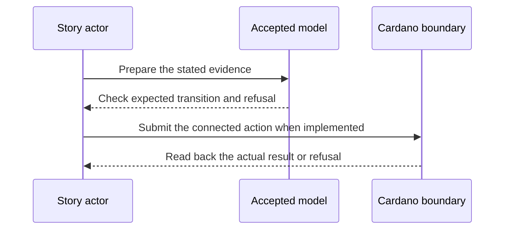

# Historical issuer keys — 2027-04-06 target

**D-12 story.** As a credential verifier, I want to check the issuer keys that were valid when a credential was issued, so that a later key rotation does not invalidate an authentic older credential.

**Planned release tag:** Cardano KERI `v2.0.0` (credential-gate M2). This names the milestone target; intermediate plays use release candidates, and the tag waits for the D-19 release gate and its preprod evidence.

This is a dated review target from the [live project card](https://github.com/orgs/lambdasistemi/projects/4/views/5). **Not yet playable as the connected target.** No confirmed ledger outcome or release acceptance is claimed by this page.

## Planned play and evidence

Given an issuer whose inception and two rotations were legitimately replayed into the accepted history interface, and a credential sealed under the first rotation’s keys; when the verifier checks the credential against the historical leaf and the covering sequence range; then the valid historical signature is accepted, while a never-accepted key state, wrong sequence or intervening successor leaf is refused.

The intended positive observation is: A verifier checks a credential under the issuer keys valid at its historical sequence after two later rotations. The relevant refusal is: A never accepted key, wrong sequence or intervening successor leaf refuses. These are acceptance criteria, not observed results.

## Preprod recording path

Rotate the issuer twice with keripy `kli` and export the genuine KEL and credential evidence. Submit or read the corresponding Cardano preprod issuer history through the released `ckeri` interface, then present the older credential and the three named bad histories to the connected verifier. The historical-key command and cast remain pending the accepted producer/consumer mapping and release.

## Presenter path: 10–15 minutes when runnable

| Time | Presenter action | Evidence to inspect |
| --- | --- | --- |
| 0–2 min | State the actor's goal and identify all synthetic inputs. | Pin the exact accepted model and release revisions. |
| 2–5 min | Establish the card's given state through its connected prior operations. | Inspect the actual starting outputs and required evidence. |
| 5–8 min | Run the planned positive action. | Compare fresh readback with the bound model transition. |
| 8–11 min | Run the planned negative control. | Attribute the refusal to the actual boundary. |
| 11–15 min | Review receipts and gaps. | Identify transactions, scripts, witnesses, values and uncovered behavior. |

## Missing interface or receipt

The #416 producer and #391 consumer binding, connected history replay, historical leaf proof, covering range, checkpoint reference input and credential bytes/signatures. The #31 current-key wording needs an explicit reconciliation with #391.

The model base visible in this checkout is Cardano KERI commit `0e638fadc987f0cd98f839edd3e3ecd5a09a1b91`. It is a source identity for planning, **not a claim that the later card is already modeled or accepted**. Each claim must bind the accepted model revision for that behavior before promotion. The [Lean correspondence register](https://github.com/lambdasistemi/cardano-keri/issues/435) holds affected conflicts. A simulator or source fact cannot replace a confirmed transaction, and no cast of an accepted connected result is available here.

**Tracking:** [KERI historical credential verification #391](https://github.com/lambdasistemi/cardano-keri/issues/391), [history producer #416](https://github.com/lambdasistemi/cardano-keri/issues/416), [chain verifier #31](https://github.com/lambdasistemi/cardano-keri/issues/31).
