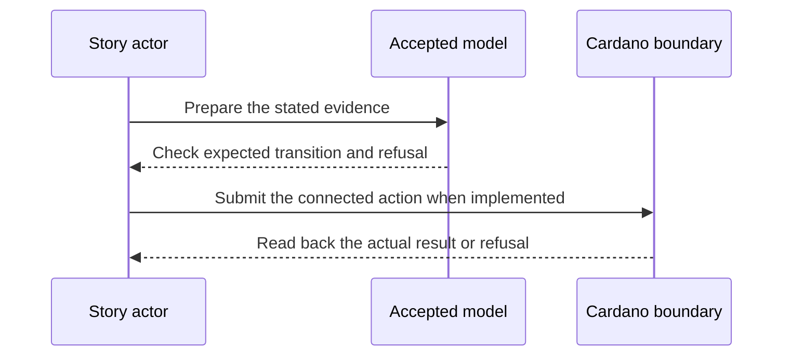

# TEL seal walk — 2027-04-21 target

**D-13 story.** As a credential verifier, I want to know that an issuance or revocation event was sealed by its actual issuer under valid keys and witness receipts, so that a forged TEL event cannot influence the on-chain gate.

This is a dated review target from the [live project card](https://github.com/orgs/lambdasistemi/projects/4/views/5). **Not yet playable as the connected target.** No confirmed ledger outcome or release acceptance is claimed by this page.

## Planned play and evidence

Given a keripy-generated TEL event, its sealing issuer event, the issuer’s accepted historical key state and witness evidence; when the seal walk checks the event digest, issuer and sequence, key-state range, controller threshold and witness quorum; then the genuine event receives the specified final or provisional verdict, while a wrong seal, wrong issuer, wrong historical state or missing quorum is refused.

The intended positive observation is: A keripy-generated issuance or revocation event is checked through its issuer seal, historical keys and witness receipts. The relevant refusal is: Wrong seal, issuer, historical state and missing quorum each refuse. These are acceptance criteria, not observed results.

## Presenter path: 10–15 minutes when runnable

| Time | Presenter action | Evidence to inspect |
| --- | --- | --- |
| 0–2 min | State the actor's goal and identify all synthetic inputs. | Pin the exact accepted model and release revisions. |
| 2–5 min | Establish the card's given state through its connected prior operations. | Inspect the actual starting outputs and required evidence. |
| 5–8 min | Run the planned positive action. | Compare fresh readback with the bound model transition. |
| 8–11 min | Run the planned negative control. | Attribute the refusal to the actual boundary. |
| 11–15 min | Review receipts and gaps. | Identify transactions, scripts, witnesses, values and uncovered behavior. |

## Missing interface or receipt

A pinned seal-walk model/interface, genuine iss/rev/vcp vectors, one-defect mutants, observed script verdicts and execution-unit measurements.

The model base visible in this checkout is Cardano KERI commit `0e638fadc987f0cd98f839edd3e3ecd5a09a1b91`. It is a source identity for planning, **not a claim that the later card is already modeled or accepted**. Each claim must bind the accepted model revision for that behavior before promotion. The [Lean correspondence register](https://github.com/lambdasistemi/cardano-keri/issues/435) holds affected conflicts. A simulator or source fact cannot replace a confirmed transaction, and no cast of an accepted connected result is available here.

**Tracking:** [KERI seal walk #393](https://github.com/lambdasistemi/cardano-keri/issues/393), [history #391](https://github.com/lambdasistemi/cardano-keri/issues/391), [cost #397](https://github.com/lambdasistemi/cardano-keri/issues/397).
