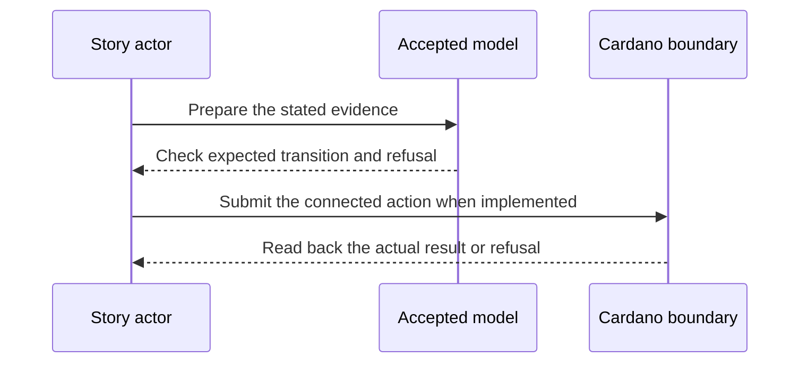

# Record a revocation — 2027-05-06 target

**D-14 story.** As a third party holding only public issuer logs, I want to open the issuer’s revocation registry and record its sealed revocation, so that the on-chain gate can see the issuer’s decision without trusting me.

**Planned release tag:** Cardano KERI `v2.0.0` (credential-gate M2). This names the milestone target; intermediate plays use release candidates, and the tag waits for the D-19 release gate and its preprod evidence.

This is a dated review target from the [live project card](https://github.com/orgs/lambdasistemi/projects/4/views/5). **Not yet playable as the connected target.** No confirmed ledger outcome or release acceptance is claimed by this page.

## Planned play and evidence

Given a legitimate issuer checkpoint, sealed registry inception and sealed revocation event, each with the historical authority evidence required by the seal walk; when anyone opens the registry and then submits the revocation; then the unique registry token binds its issuer and registry ID, the revoked set gains the credential SAID, and a duplicate or wrong-issuer event refuses.

The intended positive observation is: A third party opens an issuer registry, then records a sealed revocation for one credential SAID. The relevant refusal is: A duplicate or wrong-issuer event refuses. These are acceptance criteria, not observed results.

## Preprod recording path

Use keripy `kli` to export the issuer's public KEL and sealed revocation event. A separate operator uses the released `ckeri` path to open the registry and record the revocation on Cardano preprod, then reads its root and SAID entry from the node. A local TEL assertion is insufficient; the cast waits for both confirmed transactions and the duplicate and wrong-issuer refusals.

## Presenter path: 10–15 minutes when runnable

| Time | Presenter action | Evidence to inspect |
| --- | --- | --- |
| 0–2 min | State the actor's goal and identify all synthetic inputs. | Pin the exact accepted model and release revisions. |
| 2–5 min | Establish the card's given state through its connected prior operations. | Inspect the actual starting outputs and required evidence. |
| 5–8 min | Run the planned positive action. | Compare fresh readback with the bound model transition. |
| 8–11 min | Run the planned negative control. | Attribute the refusal to the actual boundary. |
| 11–15 min | Review receipts and gaps. | Identify transactions, scripts, witnesses, values and uncovered behavior. |

## Missing interface or receipt

A connected vcp/open and rev/push builder, historical seal authority, unique registry token, before/after roots, third-party signer and transaction readbacks. Revocation claims begin only after on-chain recording.

The model base visible in this checkout is Cardano KERI commit `0e638fadc987f0cd98f839edd3e3ecd5a09a1b91`. It is a source identity for planning, **not a claim that the later card is already modeled or accepted**. Each claim must bind the accepted model revision for that behavior before promotion. The [Lean correspondence register](https://github.com/lambdasistemi/cardano-keri/issues/435) holds affected conflicts. A simulator or source fact cannot replace a confirmed transaction, and no cast of an accepted connected result is available here.

**Tracking:** [KERI revocation mirror #392](https://github.com/lambdasistemi/cardano-keri/issues/392), [open registry #394](https://github.com/lambdasistemi/cardano-keri/issues/394), [push revocation #395](https://github.com/lambdasistemi/cardano-keri/issues/395), [seal walk #393](https://github.com/lambdasistemi/cardano-keri/issues/393).
