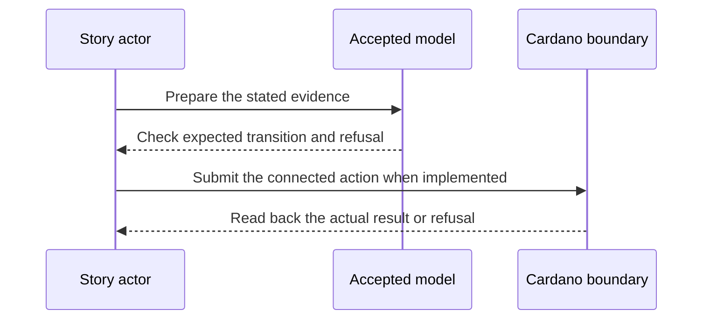

# Non-revocation at the gate — 2027-05-21 target

**D-15 story.** As a gated application, I want a non-revocation check for every credential in a four-link chain, so that a recorded QVI revocation stops every downstream action.

**Planned release tag:** Cardano KERI `v2.0.0` (credential-gate M2). This names the milestone target; intermediate plays use release candidates, and the tag waits for the D-19 release gate and its preprod evidence.

This is a dated review target from the [live project card](https://github.com/orgs/lambdasistemi/projects/4/views/5). **Not yet playable as the connected target.** No confirmed ledger outcome or release acceptance is claimed by this page.

## Planned play and evidence

Given four issuer registry reference inputs and legitimate miss proofs for a valid four-link chain; when the gate evaluates each hop, then the D-14 path records a QVI revocation and the same action is retried; then the first action passes the mirrored-revocation check and the retry fails at the QVI hop; a proof against the wrong registry or issuer is also refused.

The intended positive observation is: The gate checks a miss proof at each of four issuer registries, then sees a recorded QVI revocation. The relevant refusal is: The same action fails at the QVI hop after recording; wrong registry or issuer proofs refuse. These are acceptance criteria, not observed results.

## Preprod recording path

Build the four issuer and credential histories with keripy `kli`. Use the released `ckeri` builder and gate against Cardano preprod to show four current registry miss proofs, then record the QVI revocation through D-14 and retry the identical action. The proof command and cast wait for the connected registry roots and a chain-attributed refusal.

## Presenter path: 10–15 minutes when runnable

| Time | Presenter action | Evidence to inspect |
| --- | --- | --- |
| 0–2 min | State the actor's goal and identify all synthetic inputs. | Pin the exact accepted model and release revisions. |
| 2–5 min | Establish the card's given state through its connected prior operations. | Inspect the actual starting outputs and required evidence. |
| 5–8 min | Run the planned positive action. | Compare fresh readback with the bound model transition. |
| 8–11 min | Run the planned negative control. | Attribute the refusal to the actual boundary. |
| 11–15 min | Review receipts and gaps. | Identify transactions, scripts, witnesses, values and uncovered behavior. |

## Missing interface or receipt

Four connected registry token/root inputs, valid miss proofs, the D-14 recorded revocation transaction, original and retry gate verdicts and wrong-registry/issuer controls.

The model base visible in this checkout is Cardano KERI commit `0e638fadc987f0cd98f839edd3e3ecd5a09a1b91`. It is a source identity for planning, **not a claim that the later card is already modeled or accepted**. Each claim must bind the accepted model revision for that behavior before promotion. The [Lean correspondence register](https://github.com/lambdasistemi/cardano-keri/issues/435) holds affected conflicts. A simulator or source fact cannot replace a confirmed transaction, and no cast of an accepted connected result is available here.

**Tracking:** [KERI non-revocation #396](https://github.com/lambdasistemi/cardano-keri/issues/396), [revocation mirror #392](https://github.com/lambdasistemi/cardano-keri/issues/392), [chain verifier #31](https://github.com/lambdasistemi/cardano-keri/issues/31), [freshness design #398](https://github.com/lambdasistemi/cardano-keri/issues/398).
