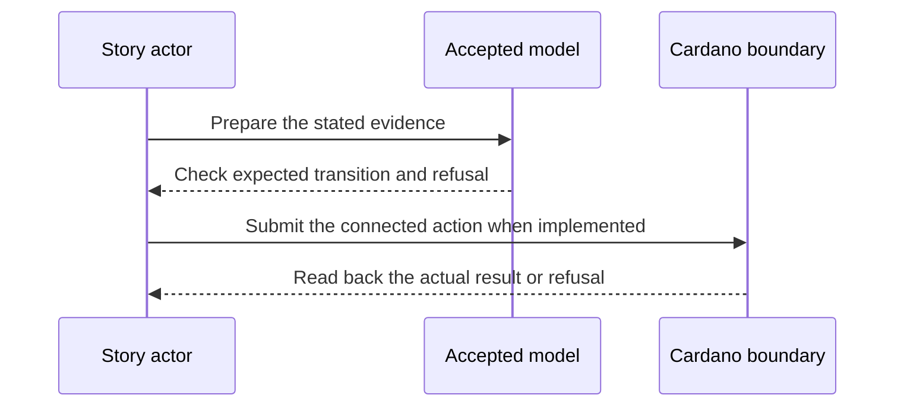

# Four-link chain and budget — 2027-06-20 target

**D-17 story.** As a verifier of an organizational role, I want the full four-link synthetic credential chain checked by Cardano scripts, so that a forged, broken or recorded-revoked link cannot authorize the final action.

This is a dated review target from the [live project card](https://github.com/orgs/lambdasistemi/projects/4/views/5). **Not yet playable as the connected target.** No confirmed ledger outcome or release acceptance is claimed by this page.

## Planned play and evidence

Given a connected identity and TEL substrate, D-16 proof package, and the chosen transaction or attestation layout from measured issuer shapes; when the full chain is checked under the historical issuer state and every hop’s non-revocation proof; then valid evidence reaches the gate verdict and each deliberate bad link refuses; every transaction in the chosen layout stays within its measured execution budget.

The intended positive observation is: The full synthetic four-link chain reaches the Cardano gate under historical issuer keys and non-revocation proofs. The relevant refusal is: A forged, broken or recorded-revoked link refuses. These are acceptance criteria, not observed results.

## Presenter path: 10–15 minutes when runnable

| Time | Presenter action | Evidence to inspect |
| --- | --- | --- |
| 0–2 min | State the actor's goal and identify all synthetic inputs. | Pin the exact accepted model and release revisions. |
| 2–5 min | Establish the card's given state through its connected prior operations. | Inspect the actual starting outputs and required evidence. |
| 5–8 min | Run the planned positive action. | Compare fresh readback with the bound model transition. |
| 8–11 min | Run the planned negative control. | Attribute the refusal to the actual boundary. |
| 11–15 min | Review receipts and gaps. | Identify transactions, scripts, witnesses, values and uncovered behavior. |

## Missing interface or receipt

A connected TEL and identity substrate, D-16 package, measured QVI-like and GLEIF-like CPU/memory, chosen split/attestation layout and accepted/refused script executions.

The model base visible in this checkout is Cardano KERI commit `0e638fadc987f0cd98f839edd3e3ecd5a09a1b91`. It is a source identity for planning, **not a claim that the later card is already modeled or accepted**. Each claim must bind the accepted model revision for that behavior before promotion. The [Lean correspondence register](https://github.com/lambdasistemi/cardano-keri/issues/435) holds affected conflicts. A simulator or source fact cannot replace a confirmed transaction, and no cast of an accepted connected result is available here.

**Tracking:** [KERI verifier #31](https://github.com/lambdasistemi/cardano-keri/issues/31), [cost measurement #397](https://github.com/lambdasistemi/cardano-keri/issues/397), [historical keys #391](https://github.com/lambdasistemi/cardano-keri/issues/391), [revocation mirror #392](https://github.com/lambdasistemi/cardano-keri/issues/392).
