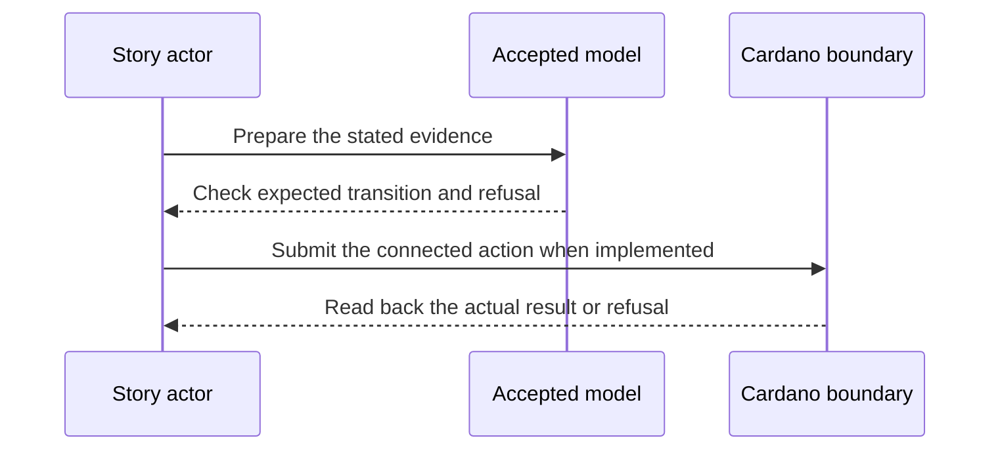

# Credential gated transaction target — 2027-07-20 target

**D-19 story.** As a relying party, I want the released demo to authorize a Cardano action only while the presented synthetic credential chain is valid under the recorded issuer and revocation state, so that a recorded upstream revocation visibly ends access.

This is a dated review target from the [live project card](https://github.com/orgs/lambdasistemi/projects/4/views/5). **Not yet playable as the connected target.** No confirmed ledger outcome or release acceptance is claimed by this page.

## Planned play and evidence

Given Cardano preprod, the documented release artifact and synthetic four-link credential fixtures; when an independent operator uses keripy and `ckeri` to run the connected setup, submits the valid action, records a QVI revocation and submits the same action again; then the first ledger action succeeds and is readable back, while the second is refused by the on-chain gate; every result is tied to the exact model, scripts, transaction IDs and evidence package.

The intended positive observation is: An independent operator uses a documented release and Cardano preprod to run the connected valid action, recorded QVI revocation and retry. The relevant refusal is: The on-chain gate refuses the retry after the revocation. These are acceptance criteria, not observed results.

## Presenter path: 10–15 minutes when runnable

| Time | Presenter action | Evidence to inspect |
| --- | --- | --- |
| 0–2 min | State the actor's goal and identify all synthetic inputs. | Pin the exact accepted model and release revisions. |
| 2–5 min | Establish the card's given state through its connected prior operations. | Inspect the actual starting outputs and required evidence. |
| 5–8 min | Run the planned positive action. | Compare fresh readback with the bound model transition. |
| 8–11 min | Run the planned negative control. | Attribute the refusal to the actual boundary. |
| 11–15 min | Review receipts and gaps. | Identify transactions, scripts, witnesses, values and uncovered behavior. |

## Missing interface or receipt

One runnable released script and independent replay, archive/model/fixture hashes, positive and revocation transaction IDs, refusal trace and execution units. This is the narrow target; the full #45 six-step cache, detached-submission, expiry and scoped-override demo remains separate.

The model base visible in this checkout is Cardano KERI commit `0e638fadc987f0cd98f839edd3e3ecd5a09a1b91`. It is a source identity for planning, **not a claim that the later card is already modeled or accepted**. Each claim must bind the accepted model revision for that behavior before promotion. The [Lean correspondence register](https://github.com/lambdasistemi/cardano-keri/issues/435) holds affected conflicts. A simulator or source fact cannot replace a confirmed transaction, and no cast of an accepted connected result is available here.

**Tracking:** First vertical of [KERI M2 demo #45](https://github.com/lambdasistemi/cardano-keri/issues/45), with [verifier #31](https://github.com/lambdasistemi/cardano-keri/issues/31), [builder #32](https://github.com/lambdasistemi/cardano-keri/issues/32), and [mirror #392](https://github.com/lambdasistemi/cardano-keri/issues/392).
