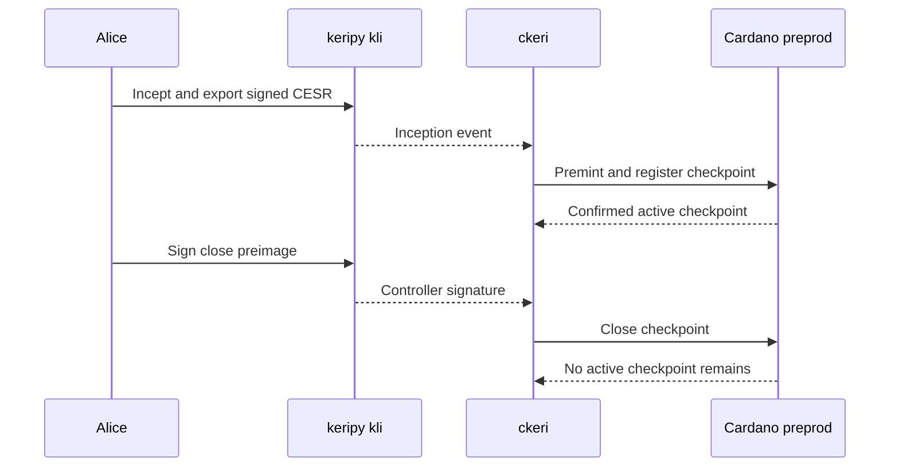

# Preprod V1 baseline: keripy and ckeri

As an identity controller, I want my keripy inception to create a Cardano checkpoint and my signed close to end it, so that I can inspect the identity event, confirmed transactions and fresh state readbacks together.

This is a **completed preprod V1 baseline recorded on 23 September 2026**. It exercises the deployed checkpoint V1. It does not include a Singular registry fold, the later checkpoint model's conviction and parking behavior, or an ACDC gate. Those are separate [dated targets](index.md).

## Play the cast

[Download the asciicast](assets/video/preprod-v1-baseline.cast). It contains actual `kli` and `ckeri` output; the AID and transaction IDs were generated by this run. The `$` lines use short display labels for the 80-column player; the linked operator script holds the exact executable paths, source checkout, arguments and environment variables. The 80 × 24 cast is SHA-256 `9276dec968305cc22b50f074c95176168b012e2e6ddbd067308b3baba1a92a74`.

## Receipts and release identity

| Evidence | Observed value |
| --- | --- |
| Network | Cardano preprod, magic `1` |
| Keripy | `kli` library 1.3.5 |
| Runtime | `ckeri` 0.4.0 built from `7984b62c947d922ee23773e4c96555d6a6382bb1` |
| Deployed manifest source | `50a582064ddfde15ebfa3649c6b6fea8d39fc697`; `ckeri manifest verify` rebuilt the scripts and checked live references |
| AID | `EJ_VgFPrdc-VOWwvwmBMV8cU18FvP_BimhGOf9euRnsg` |
| Premint | `a7a97f4487bb8d572cd83bf5ea37878babf4290267a7f97d1421a11fe43404b5`, confirmed at block 5211639 |
| Register | `3e6d1f257b1b508bc6a41b334765a3d69f3ecf2d03514d703f8e09fba3288ee6`, confirmed at block 5211640; `ckeri status` read `ACTIVE seq 0` at that output |
| Close | `e10a4dcb46e31077a284cf81e21ac9d93cb7aad9c87dd97508e2ba1a9e083c1f`, confirmed at block 5211641; a subsequent `ckeri status` read `NOT REGISTERED` |

The three block confirmations were independently queried from the preprod transaction index after recording. The cast itself shows the manifest check, real command output and before/after status. It makes an observed V1 lifecycle claim only; it does not establish correspondence for the current [accepted checkpoint model](https://github.com/lambdasistemi/cardano-keri/blob/0e638fadc987f0cd98f839edd3e3ecd5a09a1b91/lean/CardanoKeri/Checkpoint.lean) or pass the [registry integration story](d04-registration.md).

## Presenter path: 10–15 minutes

| Time | Show | Ask the audience to inspect |
| --- | --- | --- |
| 0–2 min | Manifest verification and versions. | Which deployed scripts and tool versions are in use? |
| 2–4 min | `kli incept` and CESR export. | Is the AID fresh and controlled by keripy? |
| 4–7 min | `ckeri register` and status. | Do the confirmed registration and active checkpoint name the same AID and output? |
| 7–10 min | Close package and keripy signature. | Does the signed preimage bind the checkpoint and refund? |
| 10–13 min | `ckeri close` and status. | Has the exact active checkpoint ended? |
| 13–15 min | Open the D-04 play. | Which Singular registry proof and duplicate refusal are still missing? |

## Replay prerequisites

The [operator script](https://github.com/lambdasistemi/cardano-keri/blob/docs/demo-series-2026-2027/demo/preprod-v1-journey.sh) requires a live preprod node socket, a payment signing key with a single plain UTxO sufficient for V1 registration and separate collateral, a compatible `ckeri` V1 binary, a checkout at the manifest source revision for verification, and the keripy 1.3.5 witness image. Set `CKERI_CHANGE_ADDRESS` to an address controlled by the payer and distinct from the close refund address. The script creates a fresh keripy AID, verifies the manifest, registers, signs close, and checks both readbacks. Each run submits new testnet transactions; retain its receipt directory if it stops after registration so the active checkpoint can be closed.
