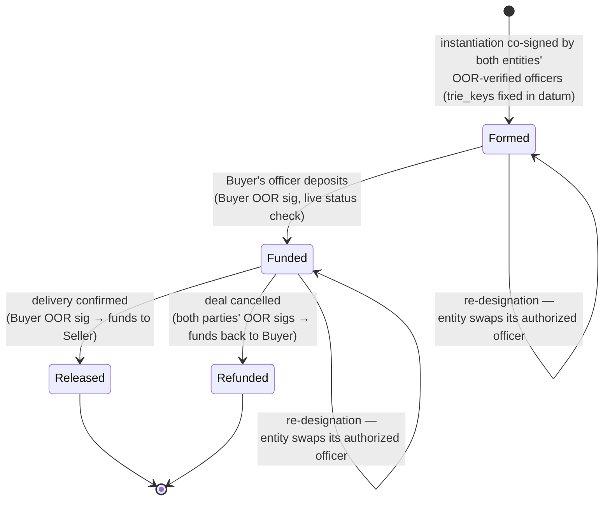

# Case D — Institutional Contracts

Bilateral or few-party on-chain contracts — escrow, DvP settlement, repo,
consortium disbursement — with counterparty identity enforced by the
validator, not an oracle.

!!! info "The contract types, in plain words"
    All four are standard arrangements between institutions; the
    [Finance Primer](../../finance-primer.md) covers each in depth.

    - **[Escrow](../../finance-primer.md#escrow)** — funds held until agreed
      conditions are met, then released (think house purchase).
    - **[DvP settlement](../../finance-primer.md#settlement-and-dvp)** —
      *delivery versus payment*: asset and payment change hands atomically,
      so neither party can end up with nothing.
    - **[Repo](../../finance-primer.md#repo)** — a pawn shop for bonds
      between banks: sell now, buy back tomorrow at a slightly higher price.
      Its lifecycle (open → roll → close) is a small state machine.
    - **[Syndication](../../finance-primer.md#syndication)** — one large loan
      split across several institutions, each holding a tradable share.
    - **Consortium disbursement** — several member organizations jointly
      approving payments from a shared treasury.

## 1. Actors & credential level

Two to five legal entities per contract, each holding a vLEI chain
(GLEIF → QVI → LE, per [vLEI Bridge](../vlei.md)). The distinguishing feature
of this case: **the LE credential alone is not enough**. A contract is binding
only if executed by someone *authorized to bind the entity* — so the signing
credential is the **OOR** (Official Organizational Role: CEO, CFO, treasurer),
issued by the QVI on behalf of the LE, or an **ECR** scoped to the specific
engagement.

!!! info "Why the officer credential is the whole point here"
    Companies act through people. When a bank signs a contract, some *person*
    signs it — and the counterparty needs proof that this person may legally
    bind the company. Traditionally that proof is a certified board
    resolution on paper. The vLEI
    [OOR credential](../../finance-primer.md#officer-and-why-oor-credentials-matter)
    is that board resolution, made cryptographic: a verifiable statement
    "this key belongs to the CFO of entity X, and X's QVI vouches for it."
    The entity's *root* key never signs day-to-day business — it is kept
    under board-level, multi-person
    [custody](../../finance-primer.md#custody) like a corporate seal.

This makes delegation-of-authority the *central* design question, not a parity
footnote. Two distinct delegation concepts must not be conflated:

- **Credential-level delegation (ACDC)**: role credentials name officers —
  OORs are issued by the QVI under an LE-signed OOR-AUTH credential; ECRs may
  be issued by the LE directly (per the
  [vLEI schemas](https://github.com/WebOfTrust/vLEI/tree/main/schema/acdc)).
  Verifying "the signer is the CFO" therefore walks **four ACDCs** for an OOR
  (QVI vLEI, LE vLEI, OOR-AUTH, OOR) — one more than the epic's linear 3-hop
  picture (GLEIF → QVI → LE → Individual) — so the verifier's hop budget is a
  case-driven parameter, not a constant.
- **KERI-level delegation (`dip`/`drt`)**: the officer's *AID itself* is
  delegated from the LE's AID, with cooperative anchoring. This binds key
  custody, not role authority.

The chain can enforce the first today (it is ACDC verification, Layer 3); the
second is the deferred KERI-parity work. For contracts, credential-level
delegation is sufficient and is the natural v1: role authority is what
contract law cares about.

## 2. Gated action & enforcement point

The enforcement point is the **contract UTxO's spend validator** at each state
transition of a bilateral/multiparty state machine:
[escrow](../../finance-primer.md#escrow) release,
[DvP](../../finance-primer.md#settlement-and-dvp) settlement legs,
[repo](../../finance-primer.md#repo) open/roll/close,
[syndicated](../../finance-primer.md#syndication)-position transfers. Each
transition names which party (or quorum) must act; the validator checks that
the acting signature verifies against the *current* key-state of the expected
counterparty's `trie_key` (via the L1 registry CIP-31 reference input) and,
where role-bound, that an unrevoked OOR links signer to entity (L2 TEL
proofs).

An escrow template, as a state machine — every arrow is a transaction whose
validator verifies the named party's OOR-backed signature against the live
registries before allowing the transition:

The self-loops are the **re-designation transition** discussed in §4: without
it, an officer leaving their company (their OOR gets revoked) would strand the
locked funds, since no remaining signer could fire the next transition.

**Formation** is off-chain but uses the same rails: entities exchange
`trie_key`s, replay each other's KELs, verify each other's credential chains
against the on-chain registries (the binding-verification protocol of
[Veridian Bridge](../../architecture/veridian-bridge.md)), then co-sign the
instantiation transaction that locks funds under the template parameterized
with both identities. No trusted introducer is needed — the registries are the
mutual due-diligence substrate.

## 3. Design sketch

On top of L1–L4:

- **Contract template library** (Aiken): escrow, 2-party DvP, n-party
  disbursement. Each template is parameterized at instantiation with the
  counterparties' identity references and a transition table (who may fire
  which transition, with what quorum).
- **Identity fixing mode per template** — the key design axis:
    - *Fixed at formation*: bake counterparty `trie_key`s into the datum.
      Stable (rotation-proof, since `trie_key` never changes), but blind to
      post-formation revocation unless paired with per-transition status
      checks.
    - *Live per transition*: re-verify AID `Active` + OOR non-revocation at
      every spend. The honest default for institutional risk: each transition
      is a fresh attestation.
    - Recommended: fixed `trie_key` + live status/role check — identity cannot
      drift, standing is re-proven.
- **Ceremony tooling**: institutional contract UX is a *ceremony
  orchestrator* that gathers OOR-backed witnesses from each entity's signers
  and assembles the transition transaction — witness collection across
  organizations, encrypted key vaults, wizard-driven build→sign→submit with
  resumable client state. This operational shape already exists in practice in
  multi-organization treasury ceremonies on Cardano mainnet and should be
  reused, not reinvented.

## 4. Pressure on the open decisions

- **Admission vs per-tx**: the one case where **full per-transaction
  verification is affordable** — 2–5 parties, transitions measured in
  days/weeks, ex-units irrelevant at that frequency. No admission cache
  needed; the contract UTxO *is* the admission. This weakens "hybrid
  everywhere" into "hybrid where throughput demands it" — the verifier library
  must expose both modes.
- **KeyState parity**: thresholds are essential (corporate keys are k-of-n).
  Supports list-shaped KeyState now. KERI-level delegation stays deferred; OOR
  covers the authority question at the credential level.
- **Revocation freshness**: the sharp scenario is *OOR revoked mid-contract*
  (officer departs). With live per-transition checks the next transition
  simply requires a fresh OOR holder — the contract must therefore define a
  **re-designation transition** (entity swaps its authorized signer) or funds
  freeze. Templates need this transition as a first-class state, not an
  afterthought.
- **Throughput**: lowest of the four cases; the single-UTxO registry ceiling
  is irrelevant here.
- **Privacy**: institutions *want* attributability of counterparties but not
  of terms. Keep terms as a hash in the datum (the full agreement stays
  bilateral, off-chain — consistent with the ACDC-notarization pattern in
  [vLEI Bridge](../vlei.md) use case 4); amounts/assets are unavoidably public
  on Cardano L1, which is itself a screening criterion for which contract
  types fit.

## 5. Demand side

Buyers: [funds and banks](../../finance-primer.md#fund-desk-treasury) doing
bilateral settlement and collateral operations (moving pledged assets that
secure a loan — posting, releasing, or substituting them as exposures change);
corporate treasuries; consortium disbursement operations. A **proto-customer
already exists in the project's orbit**: the Amaru treasury — a real
multi-organization treasury on Cardano mainnet, whose disbursements are
co-signed by the member organizations of PRAGMA (the consortium developing
the Amaru node) — is precisely a multi-entity institutional ceremony whose
signers could be OOR-verified rather than "known key hashes in a registry
file." **Smallest pilot**: re-implement one existing
multi-sig ceremony (one treasury disbursement flow) with vLEI-verified signers
— no new counterparties to recruit, real mainnet value, and it exercises L1–L3
plus one template.

## 6. Case-specific risks & limitations

- **Legal enforceability gap**: an on-chain identity proof shows *who* signed,
  not that a legally valid contract was formed (offer/acceptance, capacity,
  governing law). The template is evidence infrastructure, not a contract-law
  substitute — the regulation-vs-implementation line must be stated as in
  [The Regulated DeFi Gate](../defi-gate.md).

    !!! info "What contract law requires that no signature check can prove"
        For a contract to be legally valid, courts look for ingredients like
        **offer and acceptance** (the parties actually agreed to these terms),
        **capacity** (each party was legally able to enter the deal — not
        insolvent, not acting outside its corporate purpose), and a
        **governing law** (which jurisdiction's rules interpret the deal and
        which court hears disputes). A cryptographic signature proves none of
        these — it proves only that a particular key signed particular bytes.
        That is powerful *evidence*, and OOR verification adds "the key
        belonged to an authorized officer" — but validity of the agreement
        itself remains a legal question, settled off-chain.
- **OOR freshness**: role credentials churn faster than entity credentials;
  without the re-designation transition, every personnel change threatens
  liveness of locked funds.
- **Four-hop chains** (OOR-signed transitions) exceed the current 3-hop
  verifier bound — direct scope pressure on the chain-verifier design.
- **Venue acceptance**: institutions may not accept public mainnet for
  material positions (terms leakage, MEV-adjacent ordering, settlement
  finality); a sidechain/permissioned-ledger deployment story may be a
  prerequisite for anything beyond the treasury-shaped pilot.
