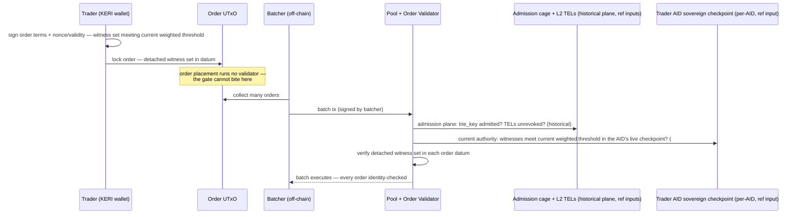

# Case A — Regulated DeFi Gate

Gate protocol entry and actions on a valid Legal Entity vLEI. This deepens
[The Regulated DeFi Gate](../defi-gate.md) primer into a design analysis — and
corrects it on one load-bearing point (the batcher model, §2).

!!! warning "Current-actor resolution is the sovereign per-AID checkpoint (#92)"
    Per `specs/92-checkpoint-contention/DECISION.md`, wherever this case resolves the acting
    trader's **current authority** — the detached-signature check "against the L1 registry
    reference input" (§2), the mermaid "AID Active?" step, and the "`cur_pubkey` from L1" of
    the per-action check (§3) — the live surface is the acting AID's **own sovereign, per-AID,
    quantity-one uniquely-tokenized checkpoint UTxO**: asset id `(checkpoint_policy_id,
    aid_asset_name)`, current weighted keys/threshold in the inline `CheckpointDatum`, read as
    a **CIP-31 reference input** and discovered by a **generic exact-asset `(policy_id,
    asset_name)` lookup** (candidate outref for liveness only, re-validated against the
    ledger). A `delta = 0` rotation (`seq + 1`) **consumes** that checkpoint UTxO, so a
    detached order signed under the prior sequence is **stale** and cannot merely be re-pointed
    at the fresh checkpoint: the trader MUST **re-sign** the order under the current weighted
    keys + current sequence (value-bearing order flow carries the explicit **Execute /
    Refresh-Re-sign / Cancel-Reclaim / Expire-Cleanup** lifecycle — a rotated-away order is
    reclaimed or re-signed, never silently re-pointed).
    **Preserved as written**: the **admission cache** (`trie_key → AdmissionLeaf
    {aid, credential_saids…}`, carrying the verified stable qualified `aid` from which the
    checkpoint asset is derived; `trie_key` stays a historical-only key), the
    **GLEIF → QVI → LE → ECR** chain, and the all-TELs cascade —
    the historical credential/admission plane, which may still gate venue *eligibility* but
    never selects the current checkpoint identity.

## 1. Actors & credential level

The gated party is a **Legal Entity**
([fund, bank desk, corporate treasury](../../finance-primer.md#fund-desk-treasury)),
but the acting party is almost never the entity's root AID. GLEIF's framework
puts LE AIDs under multi-sig group control (board-level custody); nobody signs
swap orders with a 2-of-3 board key. The realistic check target is therefore
the **role credential: an
[OOR/ECR](../../finance-primer.md#officer-and-why-oor-credentials-matter)**
held by an individual trader or an operations service, chained to the LE
(for OORs via an LE-signed authorization credential — see the
[factored core](index.md)).
This makes the full chain verification (GLEIF → QVI → LE → ECR) load-bearing —
a gate that stops at the LE credential either forces hot custody of a
governance-grade key or silently degrades to "whoever holds the entity key,"
which is the [allowlist](../../finance-primer.md#allowlist) pattern again.
Integrators: the DeFi protocol (imports the verifier), the venue operator
(deploys the admission cage), QVIs (issue), the entity's compliance office
(holds credentials in a KERI wallet).

!!! info "Why the entity's own key never trades"
    Think of the Legal Entity's root key as the company seal: it is kept
    under [board-level custody](../../finance-primer.md#custody) — locked
    away, multi-person controlled, used only for rare, weighty acts like
    appointing officers. Day-to-day trading is done by *people* the company
    has authorized, and the OOR/ECR credential is the cryptographic version
    of "this person is our trader." A gate that only recognizes the company
    seal would force the seal onto a trading desk — exactly the custody
    failure the hierarchy exists to prevent.

## 2. Gated action & enforcement point

!!! info "What is a batcher, and why it changes everything"
    On a Cardano [DEX](../../finance-primer.md#dex-amm-liquidity-provider),
    the trading pool is a single UTxO, and a UTxO can be consumed by only one
    transaction — concurrent traders would all race to spend the same pool
    UTxO, and all but one would conflict. So traders cannot hit the pool
    directly. Instead a
    trader posts an **order** ("swap X for at least Y") as a UTxO, like
    leaving a signed instruction slip in a tray. An off-chain agent — the
    **batcher** — periodically collects the slips and executes them against
    the pool in one transaction *that the batcher signs*. The trader is not
    present at execution. See
    [Batcher model](../../finance-primer.md#batcher-model).

"The entity signs the gated spend" is wrong for most Cardano DeFi. Major
DEXes use the **batcher model**: the user locks an order UTxO at an order
script; an off-chain batcher later spends orders against the pool UTxO in a
transaction **signed by the batcher, not the entity**. Two consequences:

- **Order placement cannot be the enforcement point.** Paying to a script
  address runs no validator; anyone can lock funds at the order script.
- **Required-signer checks (Option B) fail at execution time** — the entity's
  key is not among the transaction signatories of the batch. The gate must
  verify a **detached witness set carried in the order datum** (Option A) — a
  set of Ed25519 signatures **meeting the trader AID's current weighted
  threshold** over the order terms plus a nonce/validity window, checked against
  that AID's **sovereign per-AID checkpoint** (current weighted keys/threshold in
  the inline `CheckpointDatum`, read as a CIP-31 reference input; #92) when the
  batcher spends the order — not a single registered key against a shared L1
  registry root. A `delta = 0` rotation **consumes** that checkpoint UTxO, so a
  witness set signed under the prior sequence is **stale** and must be
  **re-signed** — a fresh set meeting the current weighted threshold over the
  order + current sequence — not merely re-pointed at the fresh checkpoint
  (a rotated-away order is reclaimed or re-signed, per the Execute /
  Refresh-Re-sign / Cancel-Reclaim / Expire-Cleanup lifecycle).

Enforcement points, concretely: (a) the **pool/order spend validator**
verifies the detached signature + admission proof per order; (b) for venues
with many scripts, factor the identity check into a **withdraw-zero staking
validator** (a community pattern;
[CIP-112](https://cips.cardano.org/cip/CIP-0112) proposes an `observe` script
purpose to replace it) so one script execution per
transaction covers all orders in a batch; (c) a **minting policy on
[LP/position tokens](../../finance-primer.md#dex-amm-liquidity-provider)**
gates position creation, which catches deposits even when order flow is
composed through
[aggregators](../../finance-primer.md#aggregator-and-composability).

!!! info "What is the withdraw-zero pattern?"
    A Plutus trick for running one script once per transaction, however many
    inputs the transaction has: the transaction includes a **withdrawal of 0
    lovelace** from a script-controlled staking credential, and the ledger
    must execute that script to approve the withdrawal. Spend validators then
    just check "the withdraw-zero script is present in this tx," so a batch
    of 10 orders pays for one identity check instead of 10. The trick is a
    community idiom; [CIP-112](https://cips.cardano.org/cip/CIP-0112)
    (*Observe Script Type*, status Proposed) documents it — as the workaround
    it proposes to replace with a dedicated `observe` script purpose.

## 3. Design sketch

On top of L1–L4:

- **Admission cage per venue** (an MPFS instance):
  `trie_key → AdmissionLeaf { aid, credential_saids: [qvi, le, auth?, ecr], role_level, admitted_at, not_after }`
  (three or four SAIDs, depending on the role-credential issuance path — see
  the [factored core](index.md)); the leaf carries the verified stable qualified
  `aid`, bound at admission, so the sovereign checkpoint asset
  `(checkpoint_policy_id, aid_asset_name)` is derived from it (historical
  `trie_key` alone cannot select the current checkpoint).
  The admission transaction carries the raw ACDCs + proofs; the L3 verifier
  runs the full chain on-chain; permissionless.
- **Per-action check** (in batch execution): MPF membership proof of
  `trie_key` in the admission cage (reference input; historical credential
  plane) + the acting AID's **sovereign per-AID checkpoint** as a CIP-31
  reference input — current weighted keys/threshold in the inline
  `CheckpointDatum`, discovered by a generic exact-asset `(policy_id,
  asset_name)` lookup, its live UTxO in the accepted mint/spend lineage (not a
  closed/convicted one) and the AID absent from the shared R-FRZ freeze
  registry — + verification that the order's **detached witness set meets that
  checkpoint's current weighted threshold** +
  TEL non-revocation proofs (reference input) + `tx validity range ⊂
  not_after`. A `delta = 0` rotation consumes the checkpoint, staling any order
  whose witness set was signed under a superseded sequence.
- **Expiry**: vLEI ecosystem governance handles lapse (annual LEI renewal) via
  **revocation**, not credential-internal expiry — so `not_after` is a venue
  policy knob (force re-admission every N days), while the authoritative kill
  switch is the TEL. Don't duplicate GLEIF semantics on-chain.
- **L4 addition this case forces**: a signing bridge. LE/ECR keys live in
  [KERI wallets](../../keri-primer.md) (Veridian), not CIP-30 Cardano wallets.
  The proof builder must
  gather the order-datum detached witness set (each member's signature) via the
  KERI wallet(s) — a real UX/integration component, not a library detail.

## 4. Pressure on the open decisions

- **Admission-cached vs per-tx**: hybrid is **mandatory**, not preferred. A
  batch of 10 orders × 3–4 raw ACDCs (~1–2 KB each) cannot fit 16 KB transaction
  limits; full per-transaction verification is arithmetically out. Admission
  on-chain once; per-order checks are proofs + a **detached witness set meeting
  the trader AID's current weighted threshold**.
- **KeyState parity**: **thresholds required at L1** (organizational and service
  AIDs use multisig in practice — a singleton KeyState cannot represent them).
  **KERI delegation is not in this hot path**: the trader/service AID is an
  independent AID, and the LE→ECR/OOR authority link is deliberately carried by
  the ACDC credential/TEL chain. A production QVI AID may itself be
  cooperatively delegated, but that is issuer-history/admission evidence, not
  the current trader checkpoint.
- **Cascade/freshness**: all-TELs per action (three MPF proofs — cheap).
  Freshness floor = TEL root-update cadence + settlement, i.e., minutes. Fine
  for "revoked entity loses access"; **not**
  [sanctions-screening](../../finance-primer.md#aml-and-sanctions-screening)-grade,
  and the docs must say so.
- **Throughput**: gated *reads* scale (reference inputs are unlimited
  concurrent readers); each gated action takes **one CIP-31 reference input per
  distinct checked/acting AID** (its sovereign checkpoint). Rotation is
  **sovereign and independent** — each AID rotates on its **own** per-AID
  checkpoint UTxO, so there is **no shared one-rotation-per-block registry
  ceiling** (#92). What genuinely still serializes are the **shared** write
  planes: **one admission per block per venue** (the admission cache) and any
  business/registry UTxO — those are honestly contended; order flow never writes
  them.
- **Privacy**: worst of the four cases. Real-time,
  [LEI](../../finance-primer.md#lei-and-gleif)-attributed order flow enables
  [front-running and copy-trading](../../finance-primer.md#mev) of named
  institutions; [MiFID](../../finance-primer.md#mifid-ii-basel-iii-eidas-20-mica)
  transparency regimes have deferral windows (large trades are published only
  after a delay, precisely so others cannot trade against them), the chain
  does not. Pseudonymous per-venue sub-AIDs would help traders and gut the
  audit story — a genuine open trade-off.

## 5. Demand side

!!! info "The precedent: Aave Arc"
    Aave Arc (2022) was the highest-profile attempt at gated DeFi: a copy of
    the Aave lending protocol where only addresses vetted by Fireblocks (a
    custody firm acting as the [allowlist](../../finance-primer.md#allowlist)
    operator) could participate. It worked technically and saw little uptake
    — the institutions it was built for did not come. The lesson the demand
    analysis below draws: a gate is bought when an *asset* legally needs it,
    not when a venue offers it.

The buyer is **not the DEX** (Aave Arc's lesson: venues build gates only when
a paying user demands one) — it is the
**[RWA](../../finance-primer.md#rwa-real-world-assets)/tokenized-fund issuer**
whose asset legally cannot trade unrestricted, and secondarily the institution
needing demonstrable counterparties. The institutional on-chain activity that
demonstrably exists is
[tokenized treasuries/money-market funds](../../finance-primer.md#bond-fund-money-market-fund)
on other chains, all using issuer-controlled allowlists; none on Cardano at
scale — a 2026 Cardano RWA pipeline is a gap to research, not assert. Smallest real
pilot: **one tokenized instrument + one venue on preprod**, synthetic
GLEIF/QVI chain (or real E-prefix testnet credentials — the E-native contract
consumes production-format vLEIs as-is), demonstrating admission, gated batch
execution, and revocation propagation end-to-end.

## 6. Case-specific risks & limitations

!!! info "Why MEV is worse when traders are named"
    [MEV](../../finance-primer.md#mev) is the profit whoever *orders*
    transactions can extract by sequencing, inserting, or dropping them —
    e.g. buying just before a large pending order and selling just after.
    Against anonymous wallets this is opportunistic. Against gated flow it
    becomes targeted: every order is attributable to a named institution, so
    a batcher (or anyone watching the mempool) can build a strategy around
    *that bank's* behavior specifically. The gate turns a statistical game
    into directed surveillance of identified participants.

- **The batcher becomes a compliance actor**: it selects and orders identified
  flow and can censor named entities — MEV against known institutions is
  qualitatively worse than against anonymous addresses. Is the batcher itself
  gated? Undesigned.
- **[Composability](../../finance-primer.md#aggregator-and-composability)
  breakage**: gated pools cannot be routed through ungated aggregators;
  liquidity fragments — the economic failure mode that killed the precedent.
- **Venue reclassification**: a venue enforcing per-counterparty identity
  starts resembling a regulated trading facility; the gate may *create*
  licensing questions for the protocol (regulation-vs-implementation flag:
  needs counsel-grade citation, not our inference).
- **KERI-wallet ↔ Cardano-wallet split** (§3): the signing bridge is on the
  critical path of every order; if Veridian cannot produce order-bound
  detached witness sets (each member's signature, meeting the trader AID's
  current weighted threshold) programmatically, the UX collapses to custodial
  signing services.
